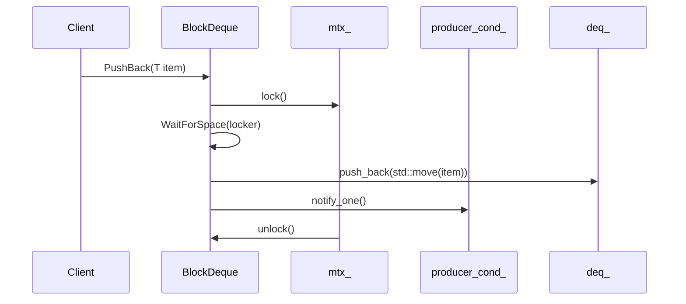

# 詳細設計仕様書

## 1. クラス図

```mermaid
classDiagram
    class BlockDeque {
        +Clock::duration Clock
        +BlockDeque(std::size_t capacity) noexcept
        +~BlockDeque(const BlockDeque&) 
        +~BlockDeque(BlockDeque&&) 
        +~BlockDeque& operator=(const BlockDeque&)
        +~BlockDeque& operator=(BlockDeque&&)
        +~BlockDeque() noexcept
        +void Clear() noexcept
        +bool Empty() const noexcept
        +bool Full() const noexcept
        +std::size_t Size() const noexcept
        +std::size_t Capacity() const noexcept
        +void PushBack(T item) noexcept
        +void PushFront(T item) noexcept
        +const T& Front() const noexcept
        +const T& Back() const noexcept
        +T& Front() noexcept
        +T& Back() noexcept
        +std::optional<T> Pop(std::optional<Clock::duration> time_out = std::nullopt) noexcept
        +void Flush() noexcept
        +void Close() noexcept
        -void WaitForSpace(std::unique_lock<std::mutex>& locker) noexcept
        -void ClearNoLock() noexcept
        -mutable std::mutex mtx_
        -std::atomic_bool closed_ {false}
        -std::size_t capacity_
        -std::deque<T> deq_
        -std::condition_variable consumer_cond_
        -std::condition_variable producer_cond_
    }
```

## 2. クラス・メソッド・インターフェース詳細

| 完全な名前 | 属性 | 引数名と型 | 戻り値型 | 可視性 | const | noexcept | static | virtual |
|------------|------|------------|----------|--------|-------|----------|--------|---------|
| ws::BlockDeque<T>::Clock | 型別名 / 種別 / 実体 | - | std::chrono::steady_clock | public | - | - | - | - |
| ws::BlockDeque<T>::BlockDeque | コンストラクタ | const std::size_t capacity | - | public | - | noexcept | - | - |
| ws::BlockDeque<T>::~BlockDeque | デストラクタ | - | - | public | - | noexcept | - | - |
| ws::BlockDeque<T>::Clear | メソッド | - | void | public | - | noexcept | - | - |
| ws::BlockDeque<T>::Empty | メソッド | - | bool | public | const | noexcept | - | - |
| ws::BlockDeque<T>::Full | メソッド | - | bool | public | const | noexcept | - | - |
| ws::BlockDeque<T>::Size | メソッド | - | std::size_t | public | const | noexcept | - | - |
| ws::BlockDeque<T>::Capacity | メソッド | - | std::size_t | public | const | noexcept | - | - |
| ws::BlockDeque<T>::PushBack | メソッド | T item | void | public | - | noexcept | - | - |
| ws::BlockDeque<T>::PushFront | メソッド | T item | void | public | - | noexcept | - | - |
| ws::BlockDeque<T>::Front | メソッド | - | const T& | public | const | noexcept | - | - |
| ws::BlockDeque<T>::Back | メソッド | - | const T& | public | const | noexcept | - | - |
| ws::BlockDeque<T>::Front | メソッド | - | T& | public | - | noexcept | - | - |
| ws::BlockDeque<T>::Back | メソッド | - | T& | public | - | noexcept | - | - |
| ws::BlockDeque<T>::Pop | メソッド | std::optional<Clock::duration> time_out = std::nullopt | std::optional<T> | public | - | noexcept | - | - |
| ws::BlockDeque<T>::Flush | メソッド | - | void | public | - | noexcept | - | - |
| ws::BlockDeque<T>::Close | メソッド | - | void | public | - | noexcept | - | - |
| ws::BlockDeque<T>::WaitForSpace | メソッド | std::unique_lock<std::mutex>& locker | void | private | - | noexcept | - | - |
| ws::BlockDeque<T>::ClearNoLock | メソッド | - | void | private | - | noexcept | - | - |

## 3. シーケンス図

### PushBackメソッドのシーケンス図


### Popメソッドのシーケンス図
```mermaid
sequenceDiagram
    participant Client
    participant BlockDeque
    participant mtx_
    participant consumer_cond_

    Client->>BlockDeque: Pop(std::optional<Clock::duration> time_out)
    BlockDeque->>mtx_: lock()
    alt time_out.has_value()
        BlockDeque->>consumer_cond_: wait_for(locker, *time_out, not_empty_or_closed)
    else
        BlockDeque->>consumer_cond_: wait(locker, not_empty_or_closed)
    end
    opt closed_
        return std::nullopt
    end
    BlockDeque->>deq_: front()
    deq_->>BlockDeque: item
    BlockDeque->>deq_: pop_front()
    BlockDeque->>producer_cond_: notify_one()
    mtx_->>BlockDeque: unlock()
    return item
```

## 4. メソッド仕様書

### PushBackメソッド
- **目的**: デキューの末尾にアイテムを追加します。
- **引数**: T item - 追加するアイテム。
- **戻り値**: void
- **動作**: アイテムをデキューの末尾に追加し、必要に応じてプロデューサー条件変数を通知します。
- **副作用**: デキューの内容が更新され、プロデューサー条件変数が通知される可能性があります。

### Popメソッド
- **目的**: デキューからアイテムを取り出します。タイムアウトオプションが指定された場合は、その時間内にアイテムが利用可能になるまで待機します。
- **引数**: std::optional<Clock::duration> time_out - タイムアウト期間（デフォルトはstd::nullopt）。
- **戻り値**: std::optional<T> - 取り出されたアイテム。タイムアウトまたはキューが閉じられている場合はstd::nulloptを返します。
- **動作**: アイテムを取り出し、必要に応じてコンシューマー条件変数を通知します。
- **副作用**: デキューの内容が更新され、プロデューサー条件変数が通知される可能性があります。

## 5. 処理フロー図

### PushBackメソッドの処理フロー
```mermaid
graph TD
    A[PushBack(T item)] --> B{WaitForSpace?}
    B -- Yes --> C[push_back(item)]
    C --> D[notify_one()]
    B -- No --> E[wait_for_space]
    E --> F[push_back(item)]
    F --> G[notify_one()]
```

### Popメソッドの処理フロー
```mermaid
graph TD
    A[Pop(time_out)] --> B{time_out.has_value?}
    B -- Yes --> C[wait_for(locker, time_out, not_empty_or_closed)]
    B -- No --> D[wait(locker, not_empty_or_closed)]
    subgraph WaitCondition
        C --> E{closed_?}
        D --> F{closed_?}
        E -- Yes --> G[return std::nullopt]
        F -- Yes --> H[return std::nullopt]
        E -- No --> I[front()]
        F -- No --> J[front()]
    end
    I --> K[pop_front()]
    J --> L[pop_front()]
    K --> M[notify_one()]
    L --> N[notify_one()]
    M --> O[return item]
    N --> P[return item]
```

## 6. 状態遷移・副作用

| 更新前状態 | 遷移条件 | 変更対象 | 更新後状態 | 更新順序 | 副作用 |
|------------|----------|----------|------------|----------|--------|
| -          | PushBack | deq_     | アイテム追加 | 1        | producer_cond_.notify_one() |
| -          | Pop      | deq_     | アイテム削除 | 1        | consumer_cond_.wait(), producer_cond_.notify_one() |
| -          | Close    | closed_  | true       | 1        | ClearNoLock(), producer_cond_.notify_all(), consumer_cond_.notify_all() |

## 7. データ変換・制約

| 入力データ | 出力データ | 変換規則 | 値域 | 境界値 |
|------------|------------|----------|------|--------|
| T item     | void       | 追加     | -    | -      |
| std::optional<Clock::duration> time_out | std::optional<T> | 取り出し | -    | -      |

## 8. 追加詳細設計情報

### ファイルヘッダ
- **include guard**: `#pragma once`
- **依存関係**: `<cassert>`, `<condition_variable>`, `<deque>`, `<mutex>`, `<optional>`, `<utility>`
- **namespace**: `ws`

### コンストラクタ・デストラクタ
- **コンストラクタ**: 容量を初期化し、assertで容量が0より大きいことを確認。
- **デストラクタ**: Closeメソッドを呼び出す。

### メンバ変数
- `mtx_`: ミューテックスオブジェクト。
- `closed_`: キューの閉鎖状態を示すbool値。
- `capacity_`: キューの最大容量。
- `deq_`: アイテムを格納するデキュー。
- `consumer_cond_`: コンシューマー条件変数。
- `producer_cond_`: プロデューサー条件変数。

### その他の詳細
- **WaitForSpace**: デキューに空きがあるまで待機します。
- **ClearNoLock**: ロックを取得せずにデキューをクリアします。