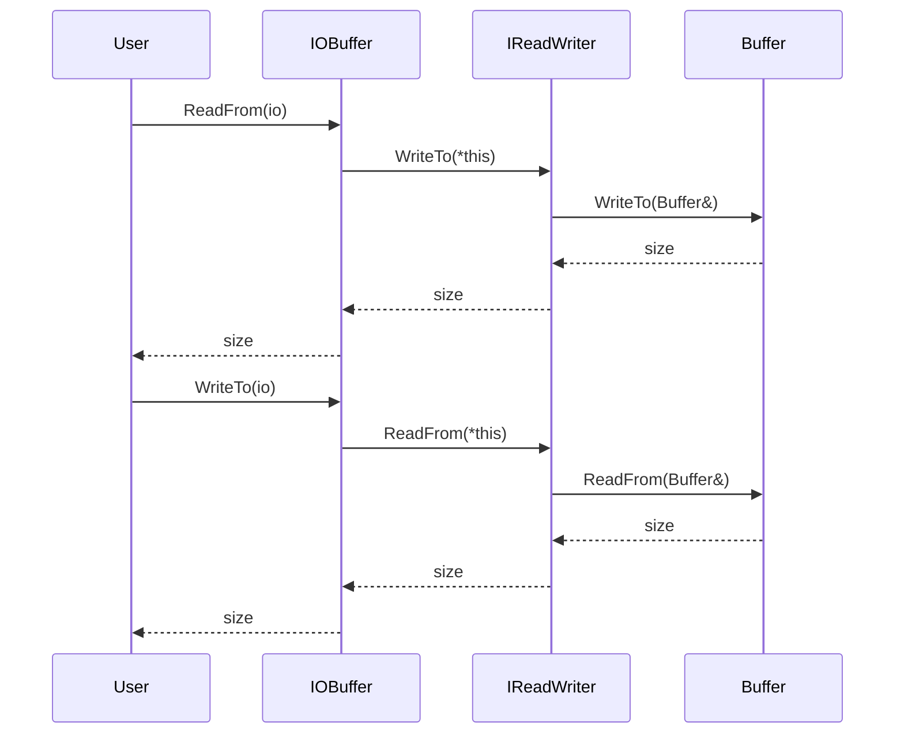

# 詳細設計仕様書

## 1. クラス図

```mermaid
classDiagram
    class Buffer {
        +Buffer(std::size_t size = 1000) noexcept
        +Buffer(std::span<const std::byte> bytes) noexcept
        +Buffer(std::initializer_list<std::byte> bytes) noexcept
        +Buffer(std::string_view str) noexcept
        +Buffer(const Buffer&) noexcept
        +Buffer(Buffer&&) noexcept
        +Buffer& operator=(const Buffer&) noexcept
        +Buffer& operator=(Buffer&&) noexcept
        +std::size_t WritableSize() const noexcept
        +std::size_t ReadableSize() const noexcept
        +std::optional<std::byte> Peek() const noexcept
        +std::span<const std::byte> ReadableBytes() const noexcept
        +std::string ReadableString() const noexcept
        +std::span<std::byte> WritableBytes() const noexcept
        +void Append(std::span<const std::byte> bytes) noexcept
        +void Append(std::initializer_list<std::byte> bytes) noexcept
        +void Append(std::string_view str, std::optional<NewLine> new_line = std::nullopt) noexcept
        +void Append(const void* data, std::size_t size) noexcept
        +void Append(const Buffer& buf) noexcept
        +void EnsureWriteableSize(std::size_t size) noexcept
        +void HasWritten(std::size_t size) noexcept
        +void Retrieve(std::size_t size) noexcept
        +std::size_t RetrieveUntil(const void* addr) noexcept
        +std::size_t RetrieveAll() noexcept
        +std::string RetrieveAllToString() noexcept
        +void Clear() noexcept
        +bool Empty() const noexcept
        -std::size_t PrependableSize() const noexcept
        -void MakeSpace(std::size_t size) noexcept
        -std::vector<std::byte>::iterator ReadIter() const noexcept
        -std::vector<std::byte>::iterator WriteIter() const noexcept
        -std::vector<std::byte> buf_
        -std::atomic<std::size_t> read_pos_ {0}
        -std::atomic<std::size_t> write_pos_ {0}
    }

    class IOBuffer {
        +IOBuffer()
        +std::size_t ReadFrom(io::IReadWriter& io)
        +std::size_t WriteTo(io::IReadWriter& io)
    }
    
    Buffer <|-- IOBuffer
```

## 2. クラス・メソッド・インターフェース詳細

| 完全な名前 | 属性 | 引数名と型 | 戻り値型 | 可視性 | const | noexcept | static | virtual |
|------------|------|------------|----------|--------|-------|----------|--------|---------|
| ws::Buffer::Buffer(std::size_t size) | コンストラクタ | size | void | public | なし | あり | なし | なし |
| ws::Buffer::Buffer(std::span<const std::byte> bytes) | コンストラクタ | bytes | void | public | なし | あり | なし | なし |
| ws::Buffer::Buffer(std::initializer_list<std::byte> bytes) | コンストラクタ | bytes | void | public | なし | あり | なし | なし |
| ws::Buffer::Buffer(std::string_view str) | コンストラクタ | str | void | public | なし | あり | なし | なし |
| ws::Buffer::Buffer(const Buffer&) | コピーコンストラクタ | o | void | public | なし | あり | なし | なし |
| ws::Buffer::Buffer(Buffer&&) | ムーブコンストラクタ | o | void | public | なし | あり | なし | なし |
| ws::Buffer::operator=(const Buffer&) | コピー代入演算子 | o | Buffer& | public | なし | あり | なし | なし |
| ws::Buffer::operator=(Buffer&&) | ムーブ代入演算子 | o | Buffer& | public | なし | あり | なし | なし |
| ws::Buffer::WritableSize() | メソッド | なし | std::size_t | public | あり | あり | なし | なし |
| ws::Buffer::ReadableSize() | メソッド | なし | std::size_t | public | あり | あり | なし | なし |
| ws::Buffer::Peek() | メソッド | なし | std::optional<std::byte> | public | あり | あり | なし | なし |
| ws::Buffer::ReadableBytes() | メソッド | なし | std::span<const std::byte> | public | あり | あり | なし | なし |
| ws::Buffer::ReadableString() | メソッド | なし | std::string | public | あり | あり | なし | なし |
| ws::Buffer::WritableBytes() | メソッド | なし | std::span<std::byte> | public | あり | あり | なし | なし |
| ws::Buffer::Append(std::span<const std::byte>) | メソッド | bytes | void | public | なし | あり | なし | なし |
| ws::Buffer::Append(std::initializer_list<std::byte>) | メソッド | bytes | void | public | なし | あり | なし | なし |
| ws::Buffer::Append(std::string_view, std::optional<NewLine>) | メソッド | str, new_line | void | public | なし | あり | なし | なし |
| ws::Buffer::Append(const void*, std::size_t) | メソッド | data, size | void | public | なし | あり | なし | なし |
| ws::Buffer::Append(const Buffer&) | メソッド | buf | void | public | なし | あり | なし | なし |
| ws::Buffer::EnsureWriteableSize(std::size_t) | メソッド | size | void | public | なし | あり | なし | なし |
| ws::Buffer::HasWritten(std::size_t) | メソッド | size | void | public | なし | あり | なし | なし |
| ws::Buffer::Retrieve(std::size_t) | メソッド | size | void | public | なし | あり | なし | なし |
| ws::Buffer::RetrieveUntil(const void*) | メソッド | addr | std::size_t | public | なし | あり | なし | なし |
| ws::Buffer::RetrieveAll() | メソッド | なし | std::size_t | public | なし | あり | なし | なし |
| ws::Buffer::RetrieveAllToString() | メソッド | なし | std::string | public | なし | あり | なし | なし |
| ws::Buffer::Clear() | メソッド | なし | void | public | なし | あり | なし | なし |
| ws::Buffer::Empty() | メソッド | なし | bool | public | あり | あり | なし | なし |
| ws::Buffer::PrependableSize() | メソッド | なし | std::size_t | protected | あり | あり | なし | なし |
| ws::Buffer::MakeSpace(std::size_t) | メソッド | size | void | protected | なし | あり | なし | なし |
| ws::Buffer::ReadIter() | メソッド | なし | std::vector<std::byte>::iterator | protected | あり | あり | なし | なし |
| ws::Buffer::WriteIter() | メソッド | なし | std::vector<std::byte>::iterator | protected | あり | あり | なし | なし |

| 完全な名前 | 属性 | 引数名と型 | 戻り値型 | 可視性 | const | noexcept | static | virtual |
|------------|------|------------|----------|--------|-------|----------|--------|---------|
| ws::IOBuffer::IOBuffer() | コンストラクタ | なし | void | public | なし | あり | なし | なし |
| ws::IOBuffer::ReadFrom(io::IReadWriter&) | メソッド | io | std::size_t | public | なし | なし | なし | なし |
| ws::IOBuffer::WriteTo(io::IReadWriter&) | メソッド | io | std::size_t | public | なし | なし | なし | なし |

## 3. シーケンス図



## 4. メソッド仕様書

### ws::Buffer::Append(std::string_view, std::optional<NewLine>)

- **目的**: 文字列をバッファに追加し、必要に応じて改行文字を追加する。
- **引数**:
  - `str`: 追加する文字列
  - `new_line`: 追加する改行文字（`NewLine::LF`, `NewLine::CRLF`）
- **戻り値**: void
- **動作**:
  1. 文字列をコピーして、必要に応じて改行文字を追加する。
  2. 追加した文字列をバッファに書き込む。
- **副作用**: バッファのサイズが変更される可能性がある。
- **エラー処理**: 無し
- **確認不能**

### ws::Buffer::RetrieveUntil(const void*)

- **目的**: 指定されたアドレスまで読み取り位置を進める。
- **引数**:
  - `addr`: 読み取り終了位置のアドレス
- **戻り値**: 読み取ったバイト数 (std::size_t)
- **動作**:
  1. 指定されたアドレスまでの読み取り位置を進める。
  2. 読み取ったバイト数を返す。
- **副作用**: バッファの読み取り位置が変更される。
- **エラー処理**: 無し
- **確認不能**

## 5. 処理フロー図

### ws::Buffer::Append(std::string_view, std::optional<NewLine>)

```mermaid
graph TD
    A[開始] --> B{new_line.has_value()?}
    B -- はい --> C[full_str += "\n"]
    B -- いいえ --> D[full_str += "\r\n"]
    C --> E[Append(full_str.data(), full_str.length())]
    D --> E
    E --> F[終了]
```

### ws::Buffer::RetrieveUntil(const void*)

```mermaid
graph TD
    A[開始] --> B[end = static_cast<const std::byte*>(addr)]
    B --> C[begin = ReadIter().base()]
    C --> D{begin <= end?}
    D -- いいえ --> E[assert(false)]
    D -- はい --> F[read_size = end - begin]
    F --> G[Retrieve(read_size)]
    G --> H[return read_size]
```

## 6. 状態遷移・副作用

| 更新前状態 | 遷移条件 | 変更対象 | 更新後状態 | 更新順序 | 副作用 |
|------------|----------|----------|------------|----------|--------|
| バッファあり | Append() | buf_ | バッファサイズ変更 | 1. EnsureWriteableSize() <br> 2. std::copy() <br> 3. HasWritten() | 無し |
| 読み取り位置あり | RetrieveUntil() | read_pos_ | 読み取り位置更新 | 1. assert() <br> 2. read_pos_ += read_size | 無し |

## 7. データ変換・制約

| 入力 | 出力 | 変換規則 | 値域 | 境界値 | 単位 | 精度 | encoding |
|------|------|----------|------|--------|------|------|----------|
| std::string_view, NewLine | void | 文字列と改行文字の追加 | 任意の文字列 | 空文字列 | 文字列 | 文字単位 | UTF-8 |
| const void*, size_t | void | バイトデータの追加 | 任意のバイトデータ | ゼロサイズ | バイト | バイト単位 | 無し |
| const void* | std::size_t | 読み取り位置の進めるバイト数 | 0以上 | バッファサイズ以下 | バイト | バイト単位 | 無し |

## 追加詳細設計情報

### クラス図
- `Buffer`クラスは内部で`std::vector<std::byte>`を使用してバッファを管理する。
- `IOBuffer`クラスは`Buffer`クラスを継承し、I/O操作を行う。

### シーケンス図
- `ReadFrom()`と`WriteTo()`メソッドは`IReadWriter`インターフェースを通じてバッファとのデータ交換を行う。
- `IReadWriter`インターフェースの実装クラス（例：`StringStream`, `FileDescriptor`）が具体的な読み書き処理を担当する。

### メソッド仕様書
- `Append()`メソッドは文字列やバイトデータを追加し、必要に応じて改行文字を付与する。
- `RetrieveUntil()`メソッドは指定されたアドレスまで読み取り位置を進める。

### 処理フロー図
- `Append(std::string_view, std::optional<NewLine>)`の処理フローは、文字列と改行文字の追加順序を示す。
- `RetrieveUntil(const void*)`の処理フローは、読み取り位置の進めるバイト数の計算と更新順序を示す。

### 状態遷移・副作用
- バッファへのデータ追加や読み取り位置の変更が状態を更新する。
- これらの操作は内部状態のみを変更し、外部リソースには影響を与えない。

### データ変換・制約
- 文字列とバイトデータの追加は直接バッファに書き込まれる。
- 読み取り位置の進めるバイト数は指定されたアドレスから計算される。