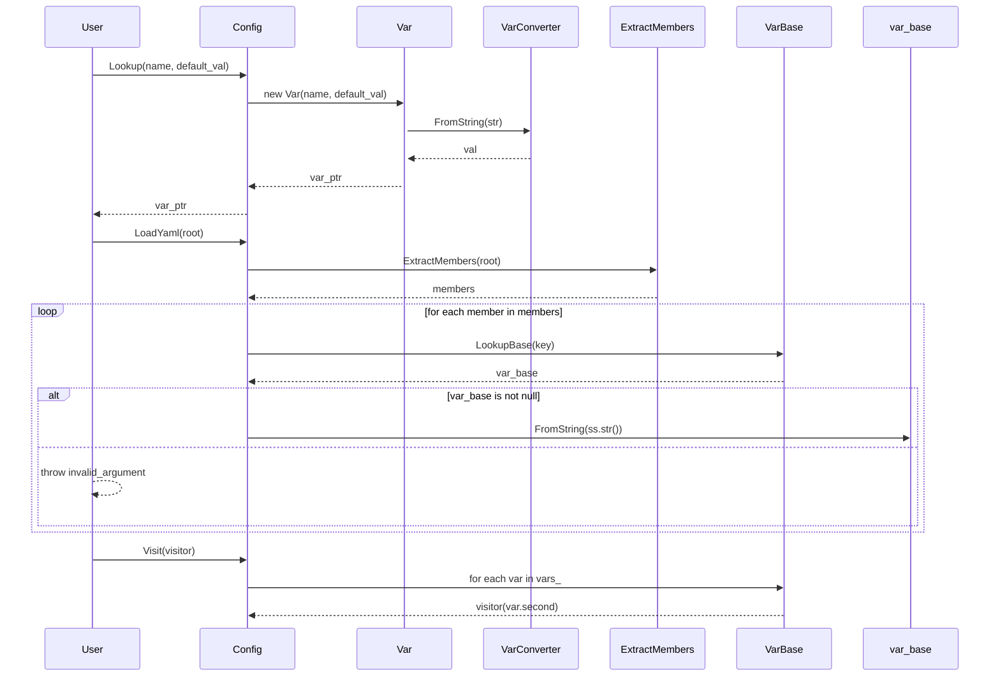

# 詳細設計仕様書

## 1. クラス図

```mermaid
classDiagram
    class VarBase {
        +std::string_view Name() const noexcept
        +std::string_view Description() const noexcept
        +virtual std::string ToString() const noexcept = 0
        +virtual void FromString(std::string_view str) = 0
        -std::string name_
        -std::string description_
    }

    class VarConverter~From, To~ {
        +To operator()(const From& val) const noexcept
    }
    
    class VarConverter~From, std::string~ {
        +std::string operator()(const From& val) const noexcept
    }
    
    class VarConverter~std::string, std::string~ {
        +std::string operator()(const std::string_view val) const noexcept
    }

    class VarConverter~std::string, To~ {
        +To operator()(const std::string_view str) const
    }

    class VarConverter~std::string, std::list~T~~ {
        +std::list~T~ operator()(const std::string_view str) const
    }
    
    class VarConverter~std::list~T~, std::string~ {
        +std::string operator()(const std::list~T~& vals) const noexcept
    }

    class VarConverter~std::string, std::vector~T~~ {
        +std::vector~T~ operator()(const std::string_view str) const
    }
    
    class VarConverter~std::vector~T~, std::string~ {
        +std::string operator()(const std::vector~T~& vals) const noexcept
    }

    class VarConverter~std::string, std::set~T~~ {
        +std::set~T~ operator()(const std::string_view str) const
    }
    
    class VarConverter~std::set~T~, std::string~ {
        +std::string operator()(const std::set~T~& vals) const noexcept
    }

    class VarConverter~std::string, std::unordered_set~T~~ {
        +std::unordered_set~T~ operator()(const std::string_view str) const
    }
    
    class VarConverter~std::unordered_set~T~, std::string~ {
        +std::string operator()(const std::unordered_set~T~& vals) const noexcept
    }

    class VarConverter~std::string, std::map~std::string, T~~ {
        +std::map~std::string, T~ operator()(const std::string_view str) const
    }
    
    class VarConverter~std::map~std::string, T~, std::string~ {
        +std::string operator()(const std::map~std::string, T~& vals) const noexcept
    }

    class VarConverter~std::string, std::unordered_map~std::string, T~~ {
        +std::unordered_map~std::string, T~ operator()(const std::string_view str) const
    }
    
    class VarConverter~std::unordered_map~std::string, T~, std::string~ {
        +std::string operator()(const std::unordered_map~std::string, T~& vals) const noexcept
    }

    class Var~T, FromStr, ToStr~ {
        +Var(const std::string_view name, const T& default_val, const std::string_view description = "") noexcept
        +std::string ToString() const noexcept override
        +void FromString(std::string_view str) override
        +T GetValue() const noexcept
        +void SetValue(const T& val) noexcept
        +std::string_view TypeName() const noexcept
        +void RemoveListener(const std::uint64_t key) noexcept
        +std::uint64_t AddListener(OnChange listener) noexcept
        +void ClearListeners() noexcept
    }

    class Config {
        +Config(std::string_view name) noexcept
        +std::string_view Name() const noexcept
        +typename Var~T~::Ptr Lookup(const std::string_view name, const T& default_val, const std::string_view description = "") 
        +typename Var~T~::Ptr Lookup(const std::string_view name) const 
        +VarBase::Ptr LookupBase(std::string_view name) const noexcept
        +void LoadYaml(const YAML::Node& root)
        +void Visit(std::function<void(VarBase::Ptr)> visitor) const noexcept
    }

    VarBase <|-- Var~T, FromStr, ToStr~
    Config --> VarBase : contains
```

## 2. クラス・メソッド・インターフェース詳細

### VarBase

| 名前 | 定義 | 型 | 可視性 | const | noexcept |
|------|------|----|--------|-------|----------|
| Name | std::string_view Name() const noexcept | std::string_view | public | 〇 | 〇 |
| Description | std::string_view Description() const noexcept | std::string_view | public | 〇 | 〇 |
| ToString | virtual std::string ToString() const noexcept = 0 | std::string | public | 〇 | 〇 |
| FromString | virtual void FromString(std::string_view str) = 0 | void | public | × | × |

### VarConverter

| 名前 | 定義 | 型 | 可視性 | const | noexcept |
|------|------|----|--------|-------|----------|
| operator() | To operator()(const From& val) const noexcept | To | public | 〇 | 〇 |
| operator() | std::string operator()(const From& val) const noexcept | std::string | public | 〇 | 〇 |
| operator() | std::string operator()(const std::string_view val) const noexcept | std::string | public | 〇 | 〇 |
| operator() | To operator()(const std::string_view str) const | To | public | × | × |
| operator() | std::list~T~ operator()(const std::string_view str) const | std::list~T~ | public | × | × |
| operator() | std::string operator()(const std::list~T~& vals) const noexcept | std::string | public | 〇 | 〇 |
| operator() | std::vector~T~ operator()(const std::string_view str) const | std::vector~T~ | public | × | × |
| operator() | std::string operator()(const std::vector~T~& vals) const noexcept | std::string | public | 〇 | 〇 |
| operator() | std::set~T~ operator()(const std::string_view str) const | std::set~T~ | public | × | × |
| operator() | std::string operator()(const std::set~T~& vals) const noexcept | std::string | public | 〇 | 〇 |
| operator() | std::unordered_set~T~ operator()(const std::string_view str) const | std::unordered_set~T~ | public | × | × |
| operator() | std::string operator()(const std::unordered_set~T~& vals) const noexcept | std::string | public | 〇 | 〇 |
| operator() | std::map~std::string, T~ operator()(const std::string_view str) const | std::map~std::string, T~ | public | × | × |
| operator() | std::string operator()(const std::map~std::string, T~& vals) const noexcept | std::string | public | 〇 | 〇 |
| operator() | std::unordered_map~std::string, T~ operator()(const std::string_view str) const | std::unordered_map~std::string, T~ | public | × | × |
| operator() | std::string operator()(const std::unordered_map~std::string, T~& vals) const noexcept | std::string | public | 〇 | 〇 |

### Var

| 名前 | 定義 | 型 | 可視性 | const | noexcept |
|------|------|----|--------|-------|----------|
| Var | Var(const std::string_view name, const T& default_val, const std::string_view description = "") noexcept | コンストラクタ | public | × | 〇 |
| ToString | std::string ToString() const noexcept override | std::string | public | 〇 | 〇 |
| FromString | void FromString(std::string_view str) override | void | public | × | × |
| GetValue | T GetValue() const noexcept | T | public | 〇 | 〇 |
| SetValue | void SetValue(const T& val) noexcept | void | public | × | 〇 |
| TypeName | std::string_view TypeName() const noexcept | std::string_view | public | 〇 | 〇 |
| RemoveListener | void RemoveListener(const std::uint64_t key) noexcept | void | public | × | 〇 |
| AddListener | std::uint64_t AddListener(OnChange listener) noexcept | std::uint64_t | public | × | 〇 |
| ClearListeners | void ClearListeners() noexcept | void | public | × | 〇 |

### Config

| 名前 | 定義 | 型 | 可視性 | const | noexcept |
|------|------|----|--------|-------|----------|
| Config | Config(std::string_view name) noexcept | コンストラクタ | public | × | 〇 |
| Name | std::string_view Name() const noexcept | std::string_view | public | 〇 | 〇 |
| Lookup | typename Var~T~::Ptr Lookup(const std::string_view name, const T& default_val, const std::string_view description = "") | typename Var~T~::Ptr | public | × | × |
| Lookup | typename Var~T~::Ptr Lookup(const std::string_view name) const | typename Var~T~::Ptr | public | 〇 | × |
| LookupBase | VarBase::Ptr LookupBase(std::string_view name) const noexcept | VarBase::Ptr | public | 〇 | 〇 |
| LoadYaml | void LoadYaml(const YAML::Node& root) | void | public | × | × |
| Visit | void Visit(std::function<void(VarBase::Ptr)> visitor) const noexcept | void | public | 〇 | 〇 |

## 3. シーケンス図



## 4. メソッド仕様書

### Var::ToString()

- **目的**: 変数の値を文字列に変換する。
- **引数**: 無し
- **戻り値**: std::string
- **動作**: `VarConverter<T, ToStr>` を使用して、`val_` の値を文字列に変換する。
- **副作用**: 無し

### Var::FromString()

- **目的**: 文字列から変数の値を設定する。
- **引数**: std::string_view str
- **戻り値**: void
- **動作**: `VarConverter<std::string, FromStr>` を使用して、`str` から値を取得し、`SetValue(val)` を呼び出す。
- **副作用**: 変数の値が更新される。

### Config::Lookup()

- **目的**: 指定された名前の変数を探す。存在しない場合は新しく作成する。
- **引数**: std::string_view name, const T& default_val, std::string_view description = ""
- **戻り値**: typename Var<T>::Ptr
- **動作**: `LookupBase(name)` を呼び出して、変数が存在するか確認し、存在しない場合は新しい `Var` オブジェクトを作成して返す。
- **副作用**: 変数が新しく作られ、内部のマップに追加される。

### Config::LoadYaml()

- **目的**: YAML ノードから設定を読み込む。
- **引数**: const YAML::Node& root
- **戻り値**: void
- **動作**: `ExtractMembers(root)` を呼び出して、メンバーを抽出し、各メンバーに対して `LookupBase(key)` を呼び出し、存在する場合は `FromString(ss.str())` を呼び出す。
- **副作用**: 変数の値が更新される。

## 5. 処理フロー図

### Config::LoadYaml()

```mermaid
graph TD
    A[開始] --> B[ExtractMembers(root)]
    B --> C{メンバーが存在するか?}
    C -- はい --> D[LookupBase(key)]
    C -- いいえ --> E[終了]
    D --> F{var_base is not null?}
    F -- はい --> G[var_base->FromString(ss.str())]
    F -- いいえ --> H[throw invalid_argument]
    G --> I[次のメンバーへ]
    H --> J[終了]
    I --> C
```

## 6. 状態遷移・副作用

| 更新前状態 | 遷移条件 | 変更対象 | 更新後状態 | 更新順序 | 副作用 |
|------------|----------|----------|------------|----------|--------|
| var_base is null | key 存在 | vars_ | var_base が追加される | 1. LookupBase, 2. new Var, 3. emplace | 新しい変数オブジェクトの作成 |
| var_base is not null | 常に | var_base | val_ 更新 | 1. FromString, 2. SetValue | 変数の値が更新される |

## 7. データ変換・制約

### Var::ToString()

- **入力**: T
- **出力**: std::string
- **変換規則**: `VarConverter<T, ToStr>` を使用して変換する。

### Var::FromString()

- **入力**: std::string_view
- **出力**: T
- **変換規則**: `VarConverter<std::string, FromStr>` を使用して変換する。

## 8. 追加詳細設計情報

### include/config.h

```cpp
#pragma once

#include "util.h"

#include <algorithm>
#include <initializer_list>
#include <iostream>
#include <list>
#include <map>
#include <memory>
#include <mutex>
#include <set>
#include <shared_mutex>
#include <sstream>
#include <stdexcept>
#include <string>
#include <string_view>
#include <syncstream>
#include <typeinfo>
#include <unordered_map>
#include <unordered_set>
#include <vector>

namespace ws {

namespace cfg {

template <typename From, typename To>
class VarConverter {
public:
    To operator()(const From& val) const noexcept {
        return static_cast<To>(val);
    }
};

// 省略...

template <typename T>
class Var : public VarBase {
public:
    using Ptr = std::shared_ptr<Var>;

    using OnChange = std::function<void(const T& old_val, const T& new_val)>;

    explicit Var(const std::string_view name, const T& default_val,
                 const std::string_view description = "") noexcept :
        VarBase {name, description}, val_ {default_val} {}

    Var(const Var&) = delete;
    Var(Var&&) = delete;
    Var& operator=(const Var&) = delete;
    Var& operator=(Var&&) = delete;

    std::string ToString() const noexcept override {
        return ToStr {}(GetValue());
    }

    void FromString(const std::string_view str) override {
        SetValue(FromStr {}(str));
    }

    T GetValue() const noexcept {
        const std::shared_lock locker {mtx_};
        return val_;
    }

    void SetValue(const T& val) noexcept {
        {
            const std::shared_lock locker {mtx_};
            if (val != val_) {
                std::ranges::for_each(
                    listeners_, [&val, this](const auto& listener) noexcept {
                        try {
                            listener.second(val_, val);
                        } catch (const std::exception& err) {
                            std::osyncstream {std::cerr} << err.what()
                                                         << std::endl;
                        }
                    });
            }
        }

        const std::unique_lock locker {mtx_};
        val_ = val;
    }

    std::string_view TypeName() const noexcept {
        return typeid(T).name();
    }

    void RemoveListener(const std::uint64_t key) noexcept {
        const std::unique_lock locker {mtx_};
        listeners_.erase(key);
    }

    std::uint64_t AddListener(OnChange listener) noexcept {
        const std::unique_lock locker {mtx_};
        static std::uint64_t key {0};
        listeners_[key] = std::move(listener);
        return key++;
    }

    void ClearListeners() noexcept {
        const std::unique_lock locker {mtx_};
        listeners_.clear();
    }

private:
    mutable std::shared_mutex mtx_;
    T val_;
    std::unordered_map<std::uint64_t, OnChange> listeners_;
};

class Config {
public:
    using Ptr = std::shared_ptr<Config>;

    explicit Config(std::string_view name) noexcept;

    Config(const Config&) = delete;
    Config(Config&&) = delete;
    Config& operator=(const Config&) = delete;
    Config& operator=(Config&&) = delete;

    std::string_view Name() const noexcept;

    template <typename T>
    typename Var<T>::Ptr Lookup(const std::string_view name,
                                const T& default_val,
                                const std::string_view description = "") {
        if (const auto var {Lookup<T>(name)}; !var) {
            const auto new_var {
                std::make_shared<Var<T>>(name, default_val, description)};
            const std::unique_lock locker {mtx_};
            vars_.emplace(name, new_var);
            return new_var;
        } else {
            return var;
        }
    }

    template <typename T>
    typename Var<T>::Ptr Lookup(const std::string_view name) const {
        if (const auto base {LookupBase(name)}; base) {
            if (const auto var {std::dynamic_pointer_cast<Var<T>>(base)}; var) {
                return var;
            } else {
                throw std::invalid_argument {
                    fmt::format("Mismatched type: '{}'", name)};
            }
        } else {
            return nullptr;
        }
    }

    VarBase::Ptr LookupBase(std::string_view name) const noexcept;

    void LoadYaml(const YAML::Node& root);

    void Visit(std::function<void(VarBase::Ptr)> visitor) const noexcept;

private:
    using VarMap = std::unordered_map<std::string, VarBase::Ptr>;

    mutable std::shared_mutex mtx_;
    std::string name_;
    VarMap vars_;
};

Config::Ptr RootConfig() noexcept;

}  // namespace cfg

}  // namespace ws
```

### src/config/config.cpp

```cpp
#include "config.h"

namespace ws {

namespace cfg {

namespace {

std::list<std::pair<std::string, YAML::Node>> ExtractMembers(
    const YAML::Node& node, const std::string& prefix = "") {
    std::list<std::pair<std::string, YAML::Node>> members;
    members.emplace_back(prefix, node);
    if (node.IsMap()) {
        for (auto it {node.begin()}; it != node.end(); ++it) {
            std::ostringstream ss;
            ss << it->first;
            const auto key {ss.str()};
            auto sub_members {ExtractMembers(
                it->second, prefix.empty() ? key : prefix + "." + key)};
            members.merge(
                sub_members,
                [](const std::pair<std::string, YAML::Node>& lhs,
                   const std::pair<std::string, YAML::Node>& rhs) noexcept {
                    return lhs.first < rhs.first;
                });
        }
    }

    return members;
}

}  // namespace

VarBase::VarBase(const std::string_view name,
                 const std::string_view description) noexcept :
    name_ {name}, description_ {description} {}

std::string_view VarBase::Name() const noexcept {
    return name_;
}

std::string_view VarBase::Description() const noexcept {
    return description_;
}

Config::Config(const std::string_view name) noexcept : name_ {name} {}

std::string_view Config::Name() const noexcept {
    return name_;
}

VarBase::Ptr Config::LookupBase(const std::string_view name) const noexcept {
    const std::shared_lock locker {mtx_};
    if (const auto var {vars_.find(name.data())}; var != vars_.cend()) {
        return var->second;
    } else {
        return nullptr;
    }
}

void Config::LoadYaml(const YAML::Node& root) {
    for (const auto& node : ExtractMembers(root)) {
        const auto key {node.first};
        if (!key.empty()) {
            if (const auto var {LookupBase(key)}; var) {
                std::ostringstream ss;
                ss << node.second;
                var->FromString(ss.str());
            }
        }
    }
}

void Config::Visit(
    const std::function<void(VarBase::Ptr)> visitor) const noexcept {
    const std::shared_lock locker {mtx_};
    std::ranges::for_each(vars_, [&visitor](const auto& var) noexcept {
        try {
            visitor(var.second);
        } catch (const std::exception& err) {
            std::osyncstream {std::cerr} << err.what() << std::endl;
        }
    });
}

Config::Ptr RootConfig() noexcept {
    static const auto ins {std::make_shared<Config>("root")};
    return ins;
}

}  // namespace cfg

}  // namespace ws
```

## 9. 依存関係

- **include/util.h**: `fmt/format.h`, `yaml-cpp/yaml.h` を含む。
- **include/config.h**: `util.h` を含む。
- **src/config/config.cpp**: `config.h` を含む。

## 10. 確認不能事項

- `VarConverter` の具体的な実装詳細（例: `LoadYamlString` の内部処理）は確認不能。
- `Config::ExtractMembers` 内部の具体的な動作詳細は確認不能。