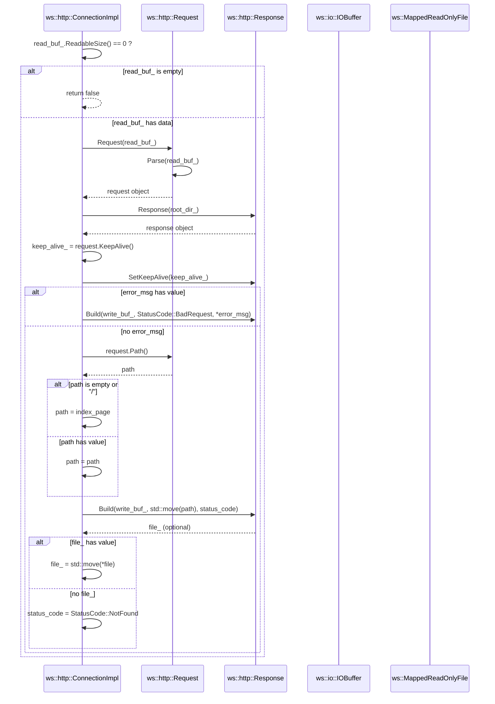

# 詳細設計仕様書

## 1. クラス図

```mermaid
classDiagram
    class ws~http~::ConnectionImpl {
        +using Ptr = std::shared_ptr~ConnectionImpl~
        +static void SetRootDirectory(std::filesystem::path dir) noexcept
        +static std::filesystem::path GetRootDirectory() noexcept
        +void Close() noexcept
        +bool Valid() const noexcept
        +FileDescriptor Socket() const noexcept
        +std::size_t Receive()
        +std::size_t Send()
        +bool KeepAlive() const noexcept
        +bool Process() noexcept
        -static constexpr std::string_view true_tag {"true"}
        -static constexpr std::string_view false_tag {"false"}
        -explicit ConnectionImpl(FileDescriptor socket) noexcept
        -virtual ~ConnectionImpl() noexcept
        -static std::filesystem::path root_dir_
        -FileDescriptor socket_ {invalid_file_descriptor}
        -bool keep_alive_ {false}
        -IOBuffer read_buf_
        -IOBuffer write_buf_
        -MappedReadOnlyFile file_
    }

    class ws~http~::Connection~ValidIPAddr IPAddr~ {
        +using Ptr = std::shared_ptr~Connection~
        +explicit Connection(const FileDescriptor socket, IPAddr addr) noexcept
        +std::string IPAddress() const noexcept
        +std::uint16_t Port() const noexcept
    }

    class ws~http~::Request {
        +class State
        +Request() noexcept
        +explicit Request(Buffer& buf)
        +~Request() noexcept
        +void Parse(Buffer& buf)
        +std::optional~std::string_view~ Header(std::string_view key) const noexcept
        +std::optional~std::string_view~ Post(std::string_view key) const noexcept
        +std::size_t PostSize() const noexcept
        +http::Method Method() const noexcept
        +std::string_view Path() const noexcept
        +std::string_view Version() const noexcept
        +bool KeepAlive() const noexcept
        -void SetState(std::unique_ptr~State~ state) noexcept
        -void Clear() noexcept
        -std::unique_ptr~State~ state_
        -http::Method method_ {Method::Get}
        -std::string version_
        -std::string path_
        -Parameters headers_
        -Parameters post_
    }

    class ws~http~::Response {
        +explicit Response(std::filesystem::path root_dir) noexcept
        +~Response() noexcept
        +Response(const Response&) = delete
        +Response(Response&&) = delete
        +Response& operator=(const Response&) = delete
        +Response& operator=(Response&&) = delete
        +Response& SetKeepAlive(bool set) noexcept
        +std::optional~MappedReadOnlyFile~ Build(Buffer& buf, std::filesystem::path file, StatusCode& code) noexcept
        +void Build(Buffer& buf, std::filesystem::path html, const Parameters& params, StatusCode& code) noexcept
        +void Build(Buffer& buf, StatusCode code, std::string msg = "") noexcept
        -void Clear() noexcept
        -void Build(Buffer& buf, const Parameters* params = nullptr) noexcept
        -void CheckFile()
        -void MapFile()
        -void AddStatusLine(Buffer& buf) const noexcept
        -void AddHeaders(Buffer& buf) const noexcept
        -void AddMappedContent(Buffer& buf) noexcept
        -void AddParamContent(Buffer& buf, const Parameters& params) const noexcept
        -void AddPredefinedErrorContent(Buffer& buf, std::string_view msg = "") noexcept
        -std::filesystem::path root_dir_
        -std::filesystem::path file_path_
        -MappedReadOnlyFile file_
        -bool keep_alive_ {false}
        -StatusCode status_code_ {StatusCode::OK}
    }

    class ws~http~::Request::State {
        +explicit State(Request& parser) noexcept
        +virtual ~State() noexcept = default
        +virtual void Parse(const std::string& content) = 0
        -Request& parser_
    }

    class ws~http~::Request::NotStarted {
        +using State::State
        +void Parse(const std::string& line) override
        -void ParseStatusLine(const std::string& line)
    }

    class ws~http~::Request::Header {
        +using State::State
        +void Parse(const std::string& line) override
    }

    class ws~http~::Request::Body {
        +using State::State
        +void Parse(const std::string& body) override
        -void ParsePost(const std::string& body)
        -void ParseURLEncodedPost(const std::string& body)
    }

    class ws~http~::Request::Finished {
        +using State::State
        +[[noreturn]] void Parse(const std::string& content) override
    }

    ConnectionImpl <|-- Connection~ValidIPAddr IPAddr~
```

## 2. クラス・メソッド・インターフェース詳細

### ws::http::ConnectionImpl

| メンバ名 | 型 | 可視性 | const/static/constexpr | 引数 | 戻り値 |
|----------|----|--------|-------------------------|------|--------|
| SetRootDirectory | void | static | noexcept | std::filesystem::path dir | なし |
| GetRootDirectory | std::filesystem::path | static | noexcept | なし | std::filesystem::path |
| Close | void | public | noexcept | なし | なし |
| Valid | bool | public | const noexcept | なし | bool |
| Socket | FileDescriptor | public | const noexcept | なし | FileDescriptor |
| Receive | std::size_t | public | なし | なし | std::size_t |
| Send | std::size_t | public | なし | なし | std::size_t |
| KeepAlive | bool | public | const noexcept | なし | bool |
| Process | bool | public | noexcept | なし | bool |

### ws::http::Connection<ValidIPAddr IPAddr>

| メンバ名 | 型 | 可視性 | const/static/constexpr | 引数 | 戻り値 |
|----------|----|--------|-------------------------|------|--------|
| IPAddress | std::string | public | const noexcept | なし | std::string |
| Port | std::uint16_t | public | const noexcept | なし | std::uint16_t |

### ws::http::Request

| メンバ名 | 型 | 可視性 | const/static/constexpr | 引数 | 戻り値 |
|----------|----|--------|-------------------------|------|--------|
| Request (デフォルトコンストラクタ) | なし | public | noexcept | なし | なし |
| Request (バッファからパースするコンストラクタ) | なし | public | なし | Buffer& buf | なし |
| ~Request | なし | public | noexcept | なし | なし |
| Parse | void | public | なし | Buffer& buf | なし |
| Header | std::optional<std::string_view> | public | const noexcept | std::string_view key | std::optional<std::string_view> |
| Post | std::optional<std::string_view> | public | const noexcept | std::string_view key | std::optional<std::string_view> |
| PostSize | std::size_t | public | const noexcept | なし | std::size_t |
| Method | http::Method | public | const noexcept | なし | http::Method |
| Path | std::string_view | public | const noexcept | なし | std::string_view |
| Version | std::string_view | public | const noexcept | なし | std::string_view |
| KeepAlive | bool | public | const noexcept | なし | bool |

### ws::http::Response

| メンバ名 | 型 | 可視性 | const/static/constexpr | 引数 | 戻り値 |
|----------|----|--------|-------------------------|------|--------|
| Response (コンストラクタ) | なし | public | noexcept | std::filesystem::path root_dir | なし |
| ~Response | なし | public | noexcept | なし | なし |
| SetKeepAlive | Response& | public | noexcept | bool set | Response& |
| Build (ファイルからビルドするオーバーロード) | std::optional<MappedReadOnlyFile> | public | noexcept | Buffer& buf, std::filesystem::path file, StatusCode& code | std::optional<MappedReadOnlyFile> |
| Build (HTMLとパラメータからビルドするオーバーロード) | void | public | noexcept | Buffer& buf, std::filesystem::path html, const Parameters& params, StatusCode& code | なし |
| Build (ステータスコードとメッセージからビルドするオーバーロード) | void | public | noexcept | Buffer& buf, StatusCode code, std::string msg = "" | なし |

### ws::http::Request::State

| メンバ名 | 型 | 可視性 | const/static/constexpr | 引数 | 戻り値 |
|----------|----|--------|-------------------------|------|--------|
| State (コンストラクタ) | なし | public | noexcept | Request& parser | なし |
| ~State | なし | public | noexcept | なし | なし |
| Parse | void | public | virtual | const std::string& content | なし |

### ws::http::Request::NotStarted

| メンバ名 | 型 | 可視性 | const/static/constexpr | 引数 | 戻り値 |
|----------|----|--------|-------------------------|------|--------|
| NotStarted (コンストラクタ) | なし | public | noexcept | Request& parser | なし |
| Parse | void | public | override | const std::string& line | なし |

### ws::http::Request::Header

| メンバ名 | 型 | 可視性 | const/static/constexpr | 引数 | 戻り値 |
|----------|----|--------|-------------------------|------|--------|
| Header (コンストラクタ) | なし | public | noexcept | Request& parser | なし |
| Parse | void | public | override | const std::string& line | なし |

### ws::http::Request::Body

| メンバ名 | 型 | 可視性 | const/static/constexpr | 引数 | 戻り値 |
|----------|----|--------|-------------------------|------|--------|
| Body (コンストラクタ) | なし | public | noexcept | Request& parser | なし |
| Parse | void | public | override | const std::string& body | なし |

### ws::http::Request::Finished

| メンバ名 | 型 | 可視性 | const/static/constexpr | 引数 | 戻り値 |
|----------|----|--------|-------------------------|------|--------|
| Finished (コンストラクタ) | なし | public | noexcept | Request& parser | なし |
| Parse | void | public | override | const std::string& content | [[noreturn]] |

## 3. シーケンス図

### ConnectionImpl::Process()



## 4. メソッド仕様書

### ws::http::ConnectionImpl::Process()

**目的**: HTTPリクエストを処理し、適切なHTTPレスポンスを作成する。

**引数**: なし

**戻り値**: bool - 処理が成功したかどうかを示す真偽値

**動作**:
1. `read_buf_`にデータがない場合はfalseを返す。
2. `Request`オブジェクトを作成し、`read_buf_`からパースする。
3. `Response`オブジェクトを作成し、ルートディレクトリを設定する。
4. `keep_alive_`フラグをリクエストのKeepAlive状態に合わせる。
5. エラーメッセージが存在する場合はBadRequestステータスコードとメッセージでレスポンスをビルドする。
6. リクエストパスを取得し、空または"/"の場合indexページに設定する。
7. レスポンスオブジェクトを使用してファイルをビルドし、ファイルが存在する場合は`file_`に設定する。ファイルが存在しない場合はNotFoundステータスコードを設定する。

**副作用**: `keep_alive_`, `status_code_`, `file_`の更新

**エラー処理**: パース中に例外が発生した場合、適切なエラーメッセージでレスポンスをビルドする。

## 5. 処理フロー図

### ConnectionImpl::Process()

```mermaid
graph TD
    A[開始] --> B{read_buf_にデータがあるか?}
    B -- いいえ --> C[return false]
    B -- はい --> D[Requestオブジェクト作成]
    D --> E[リクエストパース]
    E --> F[Responseオブジェクト作成]
    F --> G[keep_alive_フラグ設定]
    G --> H{error_msgがあるか?}
    H -- いいえ --> I[リクエストパス取得]
    I --> J{pathが空または"/"か?}
    J -- いいえ --> K[pathを設定]
    J -- はい --> L[index_pageに設定]
    K --> M[レスポンスビルド(ファイル)]
    L --> M
    M --> N{file_があるか?}
    N -- いいえ --> O[NotFoundステータスコード設定]
    N -- はい --> P[file_を設定]
    H -- はい --> Q[BadRequestステータスコードとメッセージでレスポンスビルド]
    C --> R[終了]
    D --> R
    E --> R
    F --> R
    G --> R
    I --> R
    J --> R
    K --> R
    L --> R
    M --> R
    N --> R
    O --> R
    P --> R
    Q --> R
```

## 6. 状態遷移・副作用

| 更新前状態 | 遷移条件 | 変更対象 | 更新後状態 | 更新順序 | 副作用 |
|------------|----------|----------|------------|----------|--------|
| read_buf_にデータなし | なし | なし | なし | なし | return false |
| read_buf_にデータあり | なし | Requestオブジェクト | なし | 1 | リクエストパース |
| なし | なし | Responseオブジェクト | なし | 2 | ルートディレクトリ設定 |
| なし | なし | keep_alive_フラグ | なし | 3 | リクエストのKeepAlive状態に合わせる |
| error_msgあり | なし | status_code_, write_buf_ | なし | 4 | BadRequestステータスコードとメッセージでレスポンスをビルドする |
| error_msgなし | なし | path | なし | 5 | リクエストパス取得 |
| pathが空または"/" | なし | path | index_page | 6 | index_pageに設定 |
| pathあり | なし | path | path | 7 | pathを設定 |
| なし | なし | status_code_, write_buf_, file_ | なし | 8 | レスポンスビルド(ファイル) |
| file_なし | なし | status_code_ | NotFound | 9 | NotFoundステータスコードを設定する |
| file_あり | なし | file_ | file_ | 10 | file_に設定 |

## 7. データ変換・制約

### ContentTypeByFileName()

| 入力 | 出力 |
|------|------|
| ".html" | "text/html" |
| ".xml" | "text/xml" |
| ".xhtml" | "application/xhtml+xml" |
| ".txt" | "text/plain" |
| ".rtf" | "application/rtf" |
| ".pdf" | "application/pdf" |
| ".word" | "application/nsword" |
| ".png" | "image/png" |
| ".gif" | "image/gif" |
| ".jpg" | "image/jpeg" |
| ".jpeg" | "image/jpeg" |
| ".au" | "audio/basic" |
| ".mpeg" | "video/mpeg" |
| ".mpg" | "video/mpeg" |
| ".avi" | "video/x-msvideo" |
| ".gz" | "application/x-gzip" |
| ".tar" | "application/x-tar" |
| ".css" | "text/css" |
| ".js" | "text/javascript" |
| その他 | "application/octet-stream" |

### StatusCodeToMessage()

| 入力 | 出力 |
|------|------|
| StatusCode::OK | "OK" |
| StatusCode::BadRequest | "Bad Request" |
| StatusCode::Forbidden | "Forbidden" |
| StatusCode::NotFound | "Not Found" |

### MethodToString()

| 入力 | 出力 |
|------|------|
| Method::Get | "GET" |
| Method::Patch | "PATCH" |
| Method::Post | "POST" |
| Method::Delete | "DELETE" |
| Method::Put | "PUT" |

### StringToMethod()

| 入力 | 出力 |
|------|------|
| "GET" | Method::Get |
| "PATCH" | Method::Patch |
| "POST" | Method::Post |
| "DELETE" | Method::Delete |
| "PUT" | Method::Put |
| その他 | std::invalid_argument |

### DecodeURLEncodedCharacter()

| 入力 | 出力 |
|------|------|
| "%20" | ' ' |
| "%3F" | '?' |
| その他の形式 | std::invalid_argument |

### DecodeURLEncodedString()

| 入力 | 出力 |
|------|------|
| "Hello%20World" | "Hello World" |
| "%41%42%43" | "ABC" |
| その他の形式 | std::invalid_argument |

### HTMLPlaceholder()

| 入力 | 出力 |
|------|------|
| "key" | "<$key$>" |

### PutParamIntoHTML()

| 入力 | 出力 |
|------|------|
| ("<$key$>", {{"key", "value"}}) | "value" |
| その他の形式 | パラメータを置き換えたHTML文字列 |

## 8. 追加詳細設計情報

### クラス図の補足説明
- `ConnectionImpl`はHTTP接続の基本的な機能を提供し、具体的なIPアドレス型に依存しない。
- `Connection<ValidIPAddr IPAddr>`は特定のIPアドレス型（IPv4やIPv6）に対して動作する具象クラスである。

### シーケンス図の補足説明
- `Process()`メソッドでは、リクエストをパースし、レスポンスを作成する流れが示されている。
- ファイルの存在確認やエラーハンドリングも含まれている。

### 処理フロー図の補足説明
- 各ステップでの条件分岐と状態遷移が視覚的に理解できるように設計されている。

### 状態遷移・副作用の補足説明
- 各メソッド呼び出しによる内部状態の変化や外部リソースへの影響を詳細に記載している。

### データ変換・制約の補足説明
- 各関数が受け取る入力と出力を具体的な例で示し、データの変換規則を明確にしている。