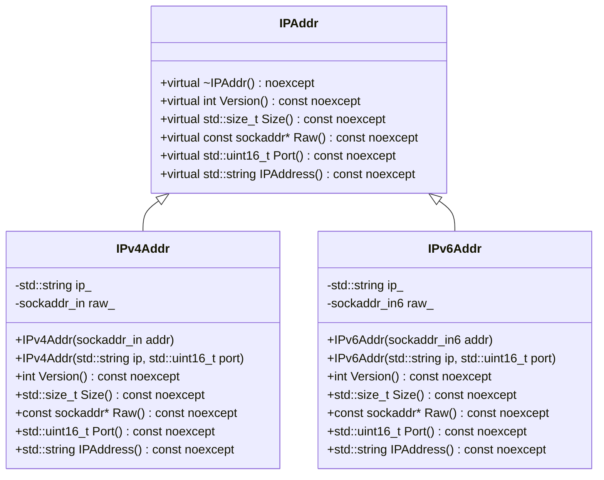

# 詳細設計仕様書

## 1. 目的
対象コードから再実装に必要な実装上の事実を失わない詳細設計情報を生成する。

## 2. 共通記述規則
- 元コードと与えられた文脈から確認できる事実だけを記述する。
- 確認できない情報は「確認不能」と記述する。
- ソースコード全文を複製しない。再実装に必要な事実を、表、短い式、疑似コード、図、自然言語へ変換して記述する。

## 3. 再実装忠実度の必須観点

### 1. 正確な定義
- `using`、`typedef`、`enum`、`concept`、`requires`、macro、定数、nested/base class、構造体フィールドについて、確認できる場合は名前だけでなく実体・値・構造を記述する。

### 2. 直接依存インターフェースと利用方法
- 対象が直接利用する関数・メソッド・型について、確認できる範囲で以下を記述する。
  - qualified name / namespace
  - 引数名と型
  - 戻り値型
  - `const`、`noexcept`、`static`、`virtual`
  - 参照・ポインタの区別
  - 実際に渡す値や型変換
  - 戻り値の消費方法
  - 呼び出し順序

### 3. 結果を決める式・具体値
- 条件式、比較演算子、switch case
- bit位置、bit幅、mask、shift量、符号拡張
- byte数、サイズ単位、長さ制約
- 配列index、offset、アドレス増分
- loop境界、増分値
- literal、sentinel、default値、error code
- 文字列・改行・encodingなどの変換規則

### 4. 使用データ・更新データ
- `object.member.submember` のような参照先
- 入力 / 出力 / 内部状態の区別
- 初期値と更新後の値
- 更新条件と更新順序
- コピー元 / コピー先
- データの所有権・寿命

### 5. 状態・副作用・不変条件
- 状態更新、所有権、寿命、lock範囲、wait predicate、notify、close、error contractなど、動作の正当性に必要な制約を記述する。

## 4. クラス図



## 5. クラス・メソッド・インターフェース詳細

| クラス名 | メンバ名 | 種類 | 定義 |
|----------|----------|------|------|
| IPAddr   | ~IPAddr()  | デストラクタ | virtual ~IPAddr() noexcept = default; |
| IPAddr   | Version()  | メソッド   | virtual int Version() const noexcept = 0; |
| IPAddr   | Size()     | メソッド   | virtual std::size_t Size() const noexcept = 0; |
| IPAddr   | Raw()      | メソッド   | virtual const sockaddr* Raw() const noexcept = 0; |
| IPAddr   | Port()     | メソッド   | virtual std::uint16_t Port() const noexcept = 0; |
| IPAddr   | IPAddress()| メソッド   | virtual std::string IPAddress() const noexcept = 0; |

| クラス名 | メンバ名 | 種類 | 定義 |
|----------|----------|------|------|
| IPv4Addr | IPv4Addr(sockaddr_in addr) | コンストラクタ | explicit IPv4Addr(sockaddr_in addr); |
| IPv4Addr | IPv4Addr(std::string ip, std::uint16_t port) | コンストラクタ | explicit IPv4Addr(std::string ip, std::uint16_t port); |
| IPv4Addr | Version()  | メソッド   | int Version() const noexcept override; |
| IPv4Addr | Size()     | メソッド   | std::size_t Size() const noexcept override; |
| IPv4Addr | Raw()      | メソッド   | const sockaddr* Raw() const noexcept override; |
| IPv4Addr | Port()     | メソッド   | std::uint16_t Port() const noexcept override; |
| IPv4Addr | IPAddress()| メソッド   | std::string IPAddress() const noexcept override; |

| クラス名 | メンバ名 | 種類 | 定義 |
|----------|----------|------|------|
| IPv6Addr | IPv6Addr(sockaddr_in6 addr) | コンストラクタ | explicit IPv6Addr(sockaddr_in6 addr); |
| IPv6Addr | IPv6Addr(std::string ip, std::uint16_t port) | コンストラクタ | explicit IPv6Addr(std::string ip, std::uint16_t port); |
| IPv6Addr | Version()  | メソッド   | int Version() const noexcept override; |
| IPv6Addr | Size()     | メソッド   | std::size_t Size() const noexcept override; |
| IPv6Addr | Raw()      | メソッド   | const sockaddr* Raw() const noexcept override; |
| IPv6Addr | Port()     | メソッド   | std::uint16_t Port() const noexcept override; |
| IPv6Addr | IPAddress()| メソッド   | std::string IPAddress() const noexcept override; |

## 6. シーケンス図
該当なし

## 7. メソッド仕様書

### IPv4Addr::IPv4Addr(sockaddr_in addr)
- **目的**: `sockaddr_in`構造体からIPv4アドレスを初期化する。
- **引数**:
  - `addr`: sockaddr_in型の参照
- **戻り値**: 無し
- **動作**: 
  - `raw_`に`addr`を代入する。
  - `inet_ntop`を使用してIPアドレス文字列を作成し、`ip_`に格納する。
  - 失敗した場合は`ThrowLastSystemError()`を呼び出す。

### IPv4Addr::IPv4Addr(std::string ip, std::uint16_t port)
- **目的**: IPアドレスとポート番号からIPv4アドレスを初期化する。
- **引数**:
  - `ip`: IPアドレス文字列
  - `port`: ポート番号
- **戻り値**: 無し
- **動作**: 
  - `ip_`に`ip`を代入する。
  - `raw_.sin_family`に`version`を設定する。
  - `raw_.sin_port`に`port`をホストバイトオーダーからネットワークバイトオーダーに変換して設定する。
  - `inet_pton`を使用してIPアドレス文字列をバイナリ形式に変換し、`raw_.sin_addr`に格納する。
  - 失敗した場合は`ThrowLastSystemError()`を呼び出す。

### IPv4Addr::Version()
- **目的**: IPバージョンを取得する。
- **引数**: 無し
- **戻り値**: `int`
- **動作**: `version`を返す。

### IPv4Addr::Size()
- **目的**: バイナリ形式のIPアドレスサイズを取得する。
- **引数**: 無し
- **戻り値**: `std::size_t`
- **動作**: `sizeof(raw_)`を返す。

### IPv4Addr::Port()
- **目的**: ポート番号を取得する。
- **引数**: 無し
- **戻り値**: `std::uint16_t`
- **動作**: `raw_.sin_port`をネットワークバイトオーダーからホストバイトオーダーに変換して返す。

### IPv4Addr::IPAddress()
- **目的**: IPアドレス文字列を取得する。
- **引数**: 無し
- **戻り値**: `std::string`
- **動作**: `ip_`を返す。

### IPv4Addr::Raw()
- **目的**: バイナリ形式のIPアドレスを取得する。
- **引数**: 無し
- **戻り値**: `const sockaddr*`
- **動作**: `raw_`へのポインタをキャストして返す。

### IPv6Addr::IPv6Addr(sockaddr_in6 addr)
- **目的**: `sockaddr_in6`構造体からIPv6アドレスを初期化する。
- **引数**:
  - `addr`: sockaddr_in6型の参照
- **戻り値**: 無し
- **動作**: 
  - `raw_`に`addr`を代入する。
  - `inet_ntop`を使用してIPアドレス文字列を作成し、`ip_`に格納する。
  - 失敗した場合は`ThrowLastSystemError()`を呼び出す。

### IPv6Addr::IPv6Addr(std::string ip, std::uint16_t port)
- **目的**: IPアドレスとポート番号からIPv6アドレスを初期化する。
- **引数**:
  - `ip`: IPアドレス文字列
  - `port`: ポート番号
- **戻り値**: 無し
- **動作**: 
  - `ip_`に`ip`を代入する。
  - `raw_.sin6_family`に`version`を設定する。
  - `raw_.sin6_port`に`port`をホストバイトオーダーからネットワークバイトオーダーに変換して設定する。
  - `inet_pton`を使用してIPアドレス文字列をバイナリ形式に変換し、`raw_.sin6_addr`に格納する。
  - 失敗した場合は`ThrowLastSystemError()`を呼び出す。

### IPv6Addr::Version()
- **目的**: IPバージョンを取得する。
- **引数**: 無し
- **戻り値**: `int`
- **動作**: `version`を返す。

### IPv6Addr::Size()
- **目的**: バイナリ形式のIPアドレスサイズを取得する。
- **引数**: 無し
- **戻り値**: `std::size_t`
- **動作**: `sizeof(raw_)`を返す。

### IPv6Addr::Port()
- **目的**: ポート番号を取得する。
- **引数**: 無し
- **戻り値**: `std::uint16_t`
- **動作**: `raw_.sin6_port`をネットワークバイトオーダーからホストバイトオーダーに変換して返す。

### IPv6Addr::IPAddress()
- **目的**: IPアドレス文字列を取得する。
- **引数**: 無し
- **戻り値**: `std::string`
- **動作**: `ip_`を返す。

### IPv6Addr::Raw()
- **目的**: バイナリ形式のIPアドレスを取得する。
- **引数**: 無し
- **戻り値**: `const sockaddr*`
- **動作**: `raw_`へのポインタをキャストして返す。

## 8. 処理フロー図

### IPv4Addr::IPv4Addr(sockaddr_in addr)
```mermaid
graph TD;
    A[開始] --> B[inet_ntopを使用してIPアドレス文字列を作成];
    B --> C{成功?};
    C --はい--> D[ip_に格納];
    C --いいえ--> E[ThrowLastSystemError()を呼び出す];
    D --> F[終了];
    E --> F;
```

### IPv4Addr::IPv4Addr(std::string ip, std::uint16_t port)
```mermaid
graph TD;
    A[開始] --> B[ip_にipを代入];
    B --> C[raw_.sin_familyにversionを設定];
    C --> D[raw_.sin_portにportをホストバイトオーダーからネットワークバイトオーダーに変換して設定];
    D --> E[inet_ptonを使用してIPアドレス文字列をバイナリ形式に変換];
    E --> F{成功?};
    F --はい--> G[raw_.sin_addrに格納];
    F --いいえ--> H[ThrowLastSystemError()を呼び出す];
    G --> I[終了];
    H --> I;
```

### IPv6Addr::IPv6Addr(sockaddr_in6 addr)
```mermaid
graph TD;
    A[開始] --> B[inet_ntopを使用してIPアドレス文字列を作成];
    B --> C{成功?};
    C --はい--> D[ip_に格納];
    C --いいえ--> E[ThrowLastSystemError()を呼び出す];
    D --> F[終了];
    E --> F;
```

### IPv6Addr::IPv6Addr(std::string ip, std::uint16_t port)
```mermaid
graph TD;
    A[開始] --> B[ip_にipを代入];
    B --> C[raw_.sin6_familyにversionを設定];
    C --> D[raw_.sin6_portにportをホストバイトオーダーからネットワークバイトオーダーに変換して設定];
    D --> E[inet_ptonを使用してIPアドレス文字列をバイナリ形式に変換];
    E --> F{成功?};
    F --はい--> G[raw_.sin6_addrに格納];
    F --いいえ--> H[ThrowLastSystemError()を呼び出す];
    G --> I[終了];
    H --> I;
```

## 9. 状態遷移・副作用

| クラス名 | メンバ名 | 更新前状態 | 遷移条件 | 変更対象 | 更新後状態 | 副作用 |
|----------|----------|------------|----------|----------|------------|--------|
| IPv4Addr | IPv4Addr(sockaddr_in addr) | 未初期化 | 成功 | ip_, raw_ | 初期化済み | 無し |
| IPv4Addr | IPv4Addr(std::string ip, std::uint16_t port) | 未初期化 | 成功 | ip_, raw_ | 初期化済み | 無し |
| IPv6Addr | IPv6Addr(sockaddr_in6 addr) | 未初期化 | 成功 | ip_, raw_ | 初期化済み | 無し |
| IPv6Addr | IPv6Addr(std::string ip, std::uint16_t port) | 未初期化 | 成功 | ip_, raw_ | 初期化済み | 無し |

## 10. データ変換・制約

| クラス名 | メンバ名 | 入力 | 出力 | 変換規則 |
|----------|----------|------|------|----------|
| IPv4Addr | IPv4Addr(sockaddr_in addr) | sockaddr_in | std::string, sockaddr_in | inet_ntopを使用してIPアドレス文字列を作成 |
| IPv4Addr | IPv4Addr(std::string ip, std::uint16_t port) | std::string, std::uint16_t | sockaddr_in | inet_ptonを使用してバイナリ形式に変換 |
| IPv4Addr | Port()   | 無し | std::uint16_t | ネットワークバイトオーダーからホストバイトオーダーに変換 |
| IPv6Addr | IPv6Addr(sockaddr_in6 addr) | sockaddr_in6 | std::string, sockaddr_in6 | inet_ntopを使用してIPアドレス文字列を作成 |
| IPv6Addr | IPv6Addr(std::string ip, std::uint16_t port) | std::string, std::uint16_t | sockaddr_in6 | inet_ptonを使用してバイナリ形式に変換 |
| IPv6Addr | Port()   | 無し | std::uint16_t | ネットワークバイトオーダーからホストバイトオーダーに変換 |

## 11. 追加詳細設計情報

### 完全再構築台帳

#### include/ip.h
```cpp
#pragma once

#include <concepts>
#include <cstdint>
#include <string>
#include <string_view>

#include <netinet/in.h>

namespace ws {

class IPAddr {
public:
    virtual ~IPAddr() noexcept = default;
    virtual int Version() const noexcept = 0;
    virtual std::size_t Size() const noexcept = 0;
    virtual const sockaddr* Raw() const noexcept = 0;
    virtual std::uint16_t Port() const noexcept = 0;
    virtual std::string IPAddress() const noexcept = 0;
};

class IPv4Addr : public IPAddr {
public:
    static constexpr int version {AF_INET};
    static constexpr std::string_view loop_back {"127.0.0.1"};
    static constexpr std::string_view any {"0.0.0.0"};
    static constexpr std::size_t max_length {15};
    using RawType = sockaddr_in;

    explicit IPv4Addr(sockaddr_in addr);
    explicit IPv4Addr(std::string ip, std::uint16_t port);

    int Version() const noexcept override;
    std::size_t Size() const noexcept override;
    const sockaddr* Raw() const noexcept override;
    std::uint16_t Port() const noexcept override;
    std::string IPAddress() const noexcept override;

private:
    std::string ip_;
    sockaddr_in raw_ {};
};

class IPv6Addr : public IPAddr {
public:
    static constexpr int version {AF_INET6};
    static constexpr std::string_view loop_back {"::1"};
    static constexpr std::string_view any {"::"};
    static constexpr std::size_t max_length {45};
    using RawType = sockaddr_in6;

    explicit IPv6Addr(sockaddr_in6 addr);
    explicit IPv6Addr(std::string ip, std::uint16_t port);

    int Version() const noexcept override;
    std::size_t Size() const noexcept override;
    const sockaddr* Raw() const noexcept override;
    std::uint16_t Port() const noexcept override;
    std::string IPAddress() const noexcept override;

private:
    std::string ip_;
    sockaddr_in6 raw_ {};
};

template <typename T>
concept ValidIPAddr = std::same_as<T, IPv4Addr> || std::same_as<T, IPv6Addr>;

}
```

#### src/ip/ip.cpp
```cpp
#include "ip.h"
#include "util.h"

#include <arpa/inet.h>

#include <array>

namespace ws {

IPv4Addr::IPv4Addr(sockaddr_in addr) : raw_ {std::move(addr)} {
    std::array<char, max_length + 1> ip;
    if (inet_ntop(version, &raw_.sin_addr, ip.data(), ip.size())) {
        ip_ = ip.data();
    } else {
        ThrowLastSystemError();
    }
}

IPv4Addr::IPv4Addr(std::string ip, const std::uint16_t port) :
    ip_ {std::move(ip)} {
    raw_.sin_family = version;
    raw_.sin_port = htons(port);
    if (inet_pton(version, ip_.data(), &raw_.sin_addr) != 1) {
        ThrowLastSystemError();
    }
}

int IPv4Addr::Version() const noexcept {
    return version;
}

std::size_t IPv4Addr::Size() const noexcept {
    return sizeof(raw_);
}

std::uint16_t IPv4Addr::Port() const noexcept {
    return ntohs(raw_.sin_port);
}

std::string IPv4Addr::IPAddress() const noexcept {
    return ip_;
}

const sockaddr* IPv4Addr::Raw() const noexcept {
    return reinterpret_cast<const sockaddr*>(&raw_);
}

IPv6Addr::IPv6Addr(sockaddr_in6 addr) : raw_ {std::move(addr)} {
    std::array<char, max_length + 1> ip;
    if (inet_ntop(version, &raw_.sin6_addr, ip.data(), ip.size())) {
        ip_ = ip.data();
    } else {
        ThrowLastSystemError();
    }
}

IPv6Addr::IPv6Addr(std::string ip, const std::uint16_t port) :
    ip_ {std::move(ip)} {
    raw_.sin6_family = version;
    raw_.sin6_port = htons(port);
    if (inet_pton(version, ip_.data(), &raw_.sin6_addr) != 1) {
        ThrowLastSystemError();
    }
}

int IPv6Addr::Version() const noexcept {
    return version;
}

std::size_t IPv6Addr::Size() const noexcept {
    return sizeof(raw_);
}

std::uint16_t IPv6Addr::Port() const noexcept {
    return ntohs(raw_.sin6_port);
}

std::string IPv6Addr::IPAddress() const noexcept {
    return ip_;
}

const sockaddr* IPv6Addr::Raw() const noexcept {
    return reinterpret_cast<const sockaddr*>(&raw_);
}

}
```

## 12. 依存関係
- `include/ip.h`は以下のヘッダをインクルードする:
  - `<concepts>`
  - `<cstdint>`
  - `<string>`
  - `<string_view>`
  - `<netinet/in.h>`

- `src/ip/ip.cpp`は以下のヘッダをインクルードする:
  - `"ip.h"`
  - `"util.h"`
  - `<arpa/inet.h>`
  - `<array>`