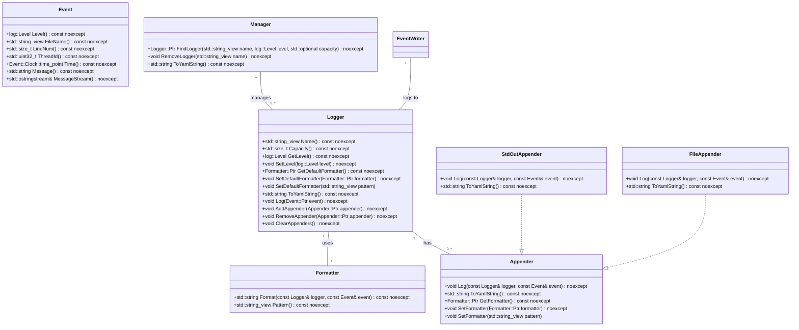
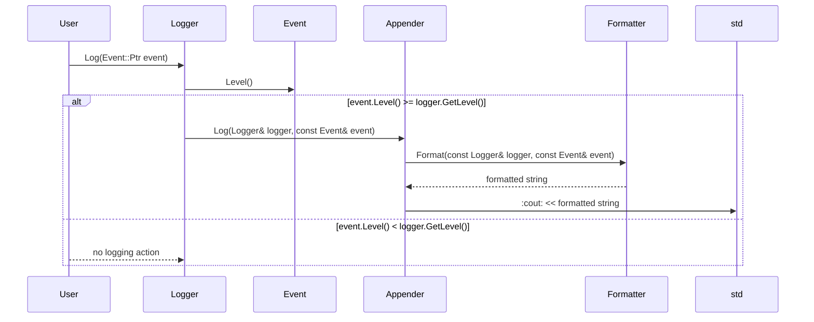

# 詳細設計仕様書

## 1. クラス図



## 2. クラス・メソッド・インターフェース詳細

### Logger

| メンバ名 | 型 | 可視性 | const/static/constexpr | 引数 | 戻り値 |
|----------|----|--------|-------------------------|------|--------|
| Name     | std::string_view | public | const | -    | std::string_view |
| Capacity | std::size_t      | public | const | -    | std::size_t |
| GetLevel | log::Level       | public | const | -    | log::Level |
| SetLevel | void             | public | -     | log::Level level | void |
| GetDefaultFormatter | Formatter::Ptr | public | const | -    | Formatter::Ptr |
| SetDefaultFormatter | void | public | -     | Formatter::Ptr formatter | void |
| SetDefaultFormatter | void | public | -     | std::string_view pattern | void |
| ToYamlString        | std::string      | public | const | -    | std::string |
| Log                 | void             | public | -     | Event::Ptr event | void |
| AddAppender         | void             | public | -     | Appender::Ptr appender | void |
| RemoveAppender      | void             | public | -     | Appender::Ptr appender | void |
| ClearAppenders      | void             | public | -     | -    | void |

### Event

| メンバ名        | 型                     | 可視性 | const/static/constexpr | 引数 | 戻り値               |
|-----------------|------------------------|--------|-------------------------|------|----------------------|
| Level           | log::Level             | public | const                 | -    | log::Level           |
| FileName        | std::string_view       | public | const                 | -    | std::string_view     |
| LineNum         | std::size_t            | public | const                 | -    | std::size_t          |
| ThreadId        | std::uint32_t          | public | const                 | -    | std::uint32_t        |
| Time            | Event::Clock::time_point | public | const                 | -    | Event::Clock::time_point |
| Message         | std::string            | public | const                 | -    | std::string          |
| MessageStream   | std::ostringstream&    | public | -                     | -    | std::ostringstream&  |

### Formatter

| メンバ名        | 型                     | 可視性 | const/static/constexpr | 引数 | 戻り値               |
|-----------------|------------------------|--------|-------------------------|------|----------------------|
| Format          | std::string            | public | const                 | const Logger& logger, const Event& event | std::string |
| Pattern         | std::string_view       | public | const                 | -    | std::string_view     |

### Appender

| メンバ名        | 型                     | 可視性 | const/static/constexpr | 引数 | 戻り値               |
|-----------------|------------------------|--------|-------------------------|------|----------------------|
| Log             | void                   | public | -                     | const Logger& logger, const Event& event | void |
| ToYamlString    | std::string            | public | const                 | -    | std::string          |
| GetFormatter    | Formatter::Ptr         | public | const                 | -    | Formatter::Ptr     |
| SetFormatter    | void                   | public | -                     | Formatter::Ptr formatter | void |
| SetFormatter    | void                   | public | -                     | std::string_view pattern | void |

### StdOutAppender

| メンバ名        | 型                     | 可視性 | const/static/constexpr | 引数 | 戻り値               |
|-----------------|------------------------|--------|-------------------------|------|----------------------|
| Log             | void                   | public | -                     | const Logger& logger, const Event& event | void |
| ToYamlString    | std::string            | public | const                 | -    | std::string          |

### FileAppender

| メンバ名        | 型                     | 可視性 | const/static/constexpr | 引数 | 戻り値               |
|-----------------|------------------------|--------|-------------------------|------|----------------------|
| Log             | void                   | public | -                     | const Logger& logger, const Event& event | void |
| ToYamlString    | std::string            | public | const                 | -    | std::string          |

### Manager

| メンバ名        | 型                     | 可視性 | const/static/constexpr | 引数 | 戻り値               |
|-----------------|------------------------|--------|-------------------------|------|----------------------|
| FindLogger      | Logger::Ptr            | public | -                     | std::string_view name, log::Level level, std::optional<std::size_t> capacity | Logger::Ptr |
| RemoveLogger    | void                   | public | -                     | std::string_view name | void |
| ToYamlString    | std::string            | public | const                 | -    | std::string          |

## 3. シーケンス図



## 4. メソッド仕様書

### Logger::Log(Event::Ptr event)

- **目的**: イベントをログに記録する。
- **引数**:
  - `event`: ログとして記録されるイベント。
- **戻り値**: 無し
- **動作**:
  1. イベントのレベルがロガーのレベル以上であるか確認する。
  2. イベントのレベルが適切な場合、各アペンダーにイベントをログとして記録させる。
- **副作用**: アペンダーを通じて外部リソース（標準出力やファイル）への書き込み。

### Event::Create(log::Level level, std::experimental::source_location location, std::uint32_t thread_id, Clock::time_point time)

- **目的**: イベントオブジェクトを作成する。
- **引数**:
  - `level`: ログレベル。
  - `location`: ソースコードの位置情報。
  - `thread_id`: スレッドID。
  - `time`: タイムスタンプ。
- **戻り値**: `Event::Ptr`
- **動作**:
  1. 指定されたパラメータを使用して新しいイベントオブジェクトを作成する。
  2. 作成したイベントオブジェクトを共有ポインタとして返す。

### Formatter::Format(const Logger& logger, const Event& event)

- **目的**: イベント情報を指定のフォーマットに変換する。
- **引数**:
  - `logger`: ロガーインスタンス。
  - `event`: ログイベント。
- **戻り値**: `std::string`
- **動作**:
  1. イベント情報を指定のフォーマットに変換する。
  2. 変換した文字列を返す。

## 5. 処理フロー図

```mermaid
graph TD
    A[Logger::Log] --> B{event.Level() >= logger.GetLevel()?}
    B -- Yes --> C[foreach Appender]
    C --> D[Appender::Log]
    D --> E[Formatter::Format]
    E --> F[formatted string]
    F --> G[std::cout << formatted string]
    B -- No --> H[no logging action]
```

## 6. 状態遷移・副作用

| 状態 | 遷移条件 | 変更対象 | 更新後状態 | 更新順序 | 副作用 |
|------|----------|----------|------------|----------|--------|
| 初期状態 | Log()呼び出し | Logger::appenders_ | - | 1. ログレベルチェック, 2. アペンダーへのログ記録 | 外部リソースへの書き込み |
| 初期状態 | Create()呼び出し | Eventオブジェクト | 作成済みイベント | 1. イベントオブジェクトの初期化 | 無し |

## 7. データ変換・制約

| 入力データ | 変換規則 | 出力データ |
|------------|----------|------------|
| log::Level | 文字列に変換 | std::string_view |
| AppenderType | 文字列に変換 | std::string_view |
| Event情報 | フォーマット文字列に基づく変換 | std::string |

## 8. 追加詳細設計情報

### クラス図の補足説明
- `Logger`は複数の`Appender`を持つことができ、それぞれが異なる出力先にログを記録する。
- `Formatter`はログイベントを指定されたフォーマットに変換する役割を持つ。

### シーケンス図の補足説明
- ユーザーが`Logger::Log()`メソッドを呼び出すと、イベントのレベルがロガーのレベル以上であるか確認される。
- 適切なレベルであれば、各アペンダーにログを記録させる。

### 処理フロー図の補足説明
- ログレベルチェック後、適切なレベルであれば各アペンダーに対してログを記録する処理が行われる。
- 不適切なレベルであれば何もせずに終了する。

### 状態遷移・副作用の補足説明
- `Logger::Log()`メソッドはイベントのレベルに基づいて状態を変化させず、外部リソースへの書き込みのみを行う。

### データ変換・制約の補足説明
- `log::Level`と`AppenderType`は内部表現から文字列に変換され、フォーマット文字列に基づいてログイベントが最終的な出力形式に変換される。