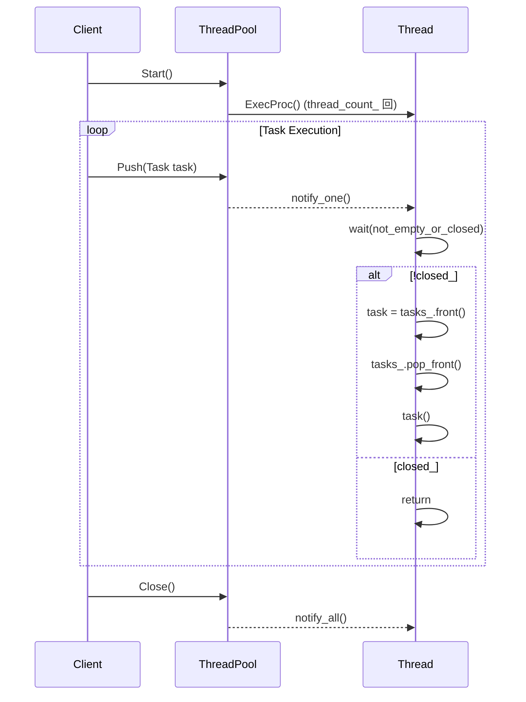

# 詳細設計仕様書

## 1. 目的
この文書は、`ThreadPool`クラスの実装と宣言を再現するために必要な詳細情報を提供します。元コードから確認できる事実のみを使用し、推測や仮定を行いません。

## 2. クラス図
```mermaid
classDiagram
    class ThreadPool {
        +using Task = std::function<void()>
        +ThreadPool(std::optional<std::size_t> thread_count, log::Logger::Ptr logger) noexcept
        +~ThreadPool(const ThreadPool&) 
        +~ThreadPool(ThreadPool&&) 
        +~ThreadPool& operator=(const ThreadPool&)
        +~ThreadPool& operator=(ThreadPool&&)
        +void Start() noexcept
        +void Push(Task task) noexcept
        +void Close() noexcept
        -void ExecProc() noexcept
        -log::Logger::Ptr logger_
        -mutable std::mutex mtx_
        -std::atomic_bool closed_ {true}
        -std::size_t thread_count_
        -std::condition_variable cond_
        -std::list<Task> tasks_
        -std::list<std::thread> threads_
    }
```

## 3. クラス・メソッド・インターフェース詳細

| クラス名 | メンバ名 | 種類 | 完全なシグネチャ | 説明 |
|----------|----------|------|------------------|------|
| ThreadPool | Task     | 型エイリアス | using Task = std::function<void()>; | タスクの型定義 |
| ThreadPool | ThreadPool | コンストラクタ | explicit ThreadPool(std::optional<std::size_t> thread_count = std::nullopt, log::Logger::Ptr logger = log::RootLogger()) noexcept; | スレッドプールを初期化します。 |
| ThreadPool | ~ThreadPool | デストラクタ | ~ThreadPool() noexcept; | スレッドプールを破棄し、すべてのスレッドを終了させます。 |
| ThreadPool | operator= | 演算子 | ThreadPool& operator=(const ThreadPool&) = delete; | 代入演算子は削除されています。 |
| ThreadPool | Start      | メソッド   | void Start() noexcept; | スレッドプールを開始します。 |
| ThreadPool | Push       | メソッド   | void Push(Task task) noexcept; | タスクキューにタスクを追加します。 |
| ThreadPool | Close      | メソッド   | void Close() noexcept; | スレッドプールを終了させます。 |
| ThreadPool | ExecProc   | メソッド   | void ExecProc() noexcept; | スレッドが実行するプロシージャです。 |

## 4. シーケンス図


## 5. メソッド仕様書

### Start()
- **目的**: スレッドプールを開始します。
- **引数**: 無し
- **戻り値**: 無し
- **動作**: `closed_`フラグをfalseに設定し、指定されたスレッド数のスレッドを作成してタスク処理プロシージャ(`ExecProc`)を開始します。
- **副作用**: スレッドプールが稼働状態になります。

### Push(Task task)
- **目的**: タスクキューにタスクを追加します。
- **引数**: `task` / Task / 追加するタスク
- **戻り値**: 無し
- **動作**: タスクキュー(`tasks_`)にタスクを追加し、待機中のスレッドに通知します。
- **副作用**: タスクキューが更新され、スレッドプールの状態が変化する可能性があります。

### Close()
- **目的**: スレッドプールを終了させます。
- **引数**: 無し
- **戻り値**: 無し
- **動作**: `closed_`フラグをtrueに設定し、すべてのスレッドに通知してタスク処理を停止します。その後、各スレッドが終了するまで待機します。
- **副作用**: スレッドプールが非稼働状態になります。

### ExecProc()
- **目的**: スレッドが実行するプロシージャです。
- **引数**: 無し
- **戻り値**: 無し
- **動作**: タスクキューからタスクを取得して実行します。タスクキューが空でかつ`closed_`フラグがtrueの場合、スレッドは終了します。
- **副作用**: タスクの実行により外部リソースや状態が変化する可能性があります。

## 6. 処理フロー図
```mermaid
graph TD
    A[Start()] --> B{closed_?}
    B -- true --> C[return]
    B -- false --> D[for i in range(thread_count_)]
    D --> E[threads_.emplace_back(ExecProc, this)]
    E --> F[Push(Task task)]

    G[Close()] --> H[closed_ = true]
    H --> I[cond_.notify_all()]
    I --> J[for each thread in threads_]
    J --> K{thread.joinable()?}
    K -- true --> L[thread.join()]
    K -- false --> M[return]

    F --> N{closed_?}
    N -- true --> O[return]
    N -- false --> P[lock mtx_]
    P --> Q[tasks_.push_back(task)]
    Q --> R[cond_.notify_one()]
    R --> S[unlock mtx_]

    E --> T[ExecProc()]
    T --> U{not_empty_or_closed()?}
    U -- true --> V{closed_?}
    V -- true --> W[return]
    V -- false --> X[tasks_.front() -> task]
    X --> Y[tasks_.pop_front()]
    Y --> Z[task()]
    Z --> AA[catch(std::exception& err)]
    AA --> AB[logger_->Log(err.what())]
    AB --> AC[goto U]
```

## 7. 状態遷移・副作用

| 状態 | 遷移条件 | 変更対象 | 更新後状態 | 副作用 |
|------|----------|----------|------------|--------|
| 初期状態 | Start()呼び出し | closed_ | false | スレッドが生成され、タスク処理開始 |
| 実行中   | Push(Task task)呼び出し | tasks_ | タスク追加 | 待機中のスレッドに通知 |
| 実行中   | Close()呼び出し | closed_ | true | すべてのスレッドに終了通知 |
| 実行中   | ExecProc()内のタスク実行 | task | 実行 | タスクによって外部リソースが変化する可能性あり |

## 8. データ変換・制約

| 入力データ | 出力データ | 変換規則 | 値域 | 境界値 |
|------------|------------|----------|------|--------|
| thread_count | thread_count_ | value_or(0) | 0以上の整数 | 硬ウェアコア数 |
| task       | tasks_     | push_back(task) | Task型のリスト | 制限なし |
| logger     | logger_    | std::move(logger) | log::Logger::Ptr | デフォルトロガー |

## 9. 追加詳細設計情報

### 完全再構築台帳
#### include/containers/thread_pool.h
```cpp
#pragma once

#include "log.h"

#include <condition_variable>
#include <functional>
#include <list>
#include <mutex>
#include <optional>
#include <thread>

namespace ws {

class ThreadPool {
public:
    using Task = std::function<void()>;

    explicit ThreadPool(std::optional<std::size_t> thread_count = std::nullopt,
                        log::Logger::Ptr logger = log::RootLogger()) noexcept;

    ~ThreadPool() noexcept;

    ThreadPool(const ThreadPool&) = delete;
    ThreadPool(ThreadPool&&) = delete;
    ThreadPool& operator=(const ThreadPool&) = delete;
    ThreadPool& operator=(ThreadPool&&) = delete;

    void Start() noexcept;
    void Push(Task task) noexcept;
    void Close() noexcept;

private:
    void ExecProc() noexcept;

    log::Logger::Ptr logger_;
    mutable std::mutex mtx_;
    std::atomic_bool closed_ {true};
    std::size_t thread_count_;
    std::condition_variable cond_;

    std::list<Task> tasks_;
    std::list<std::thread> threads_;
};

}
```

#### src/containers/thread_pool/thread_pool.cpp
```cpp
#include "thread_pool.h"
#include "util.h"

#include <cassert>

namespace ws {

ThreadPool::ThreadPool(const std::optional<std::size_t> thread_count,
                       log::Logger::Ptr logger) noexcept :
    logger_ {std::move(logger)} {
    if (!logger_) {
        logger_ = log::RootLogger();
    }

    thread_count_ = thread_count.value_or(0);
    if (thread_count_ == 0) {
        thread_count_ = std::thread::hardware_concurrency();
    }
}

ThreadPool::~ThreadPool() noexcept {
    Close();
    for (auto& thread : threads_) {
        assert(thread.joinable());
        thread.join();
    }
}

void ThreadPool::Start() noexcept {
    assert(closed_);
    closed_ = false;
    for (auto i {0}; i != thread_count_; ++i) {
        threads_.emplace_back(&ThreadPool::ExecProc, this);
    }
}

void ThreadPool::Push(Task task) noexcept {
    assert(!closed_);
    const std::lock_guard locker {mtx_};
    tasks_.push_back(std::move(task));
    cond_.notify_one();
}

void ThreadPool::ExecProc() noexcept {
    const auto not_empty_or_closed {[this]() noexcept {
        return !tasks_.empty() || closed_;
    }};

    while (true) {
        Task task;
        {
            std::unique_lock locker {mtx_};
            cond_.wait(locker, not_empty_or_closed);
            if (!closed_) {
                task = std::move(tasks_.front());
                tasks_.pop_front();
            } else {
                return;
            }
        }

        try {
            assert(task);
            task();
        } catch (const std::exception& err) {
            logger_->Log(
                log::Event::Create(log::Level::Error) << fmt::format(
                    "Exception raised in thread pool's task: {}", err.what()));
        }
    }
}

void ThreadPool::Close() noexcept {
    const std::lock_guard locker {mtx_};
    closed_ = true;
    cond_.notify_all();
}

}
```

この設計仕様書は、`ThreadPool`クラスの再実装に必要な詳細情報を提供します。元コードから確認できる事実のみを使用し、推測や仮定を行いません。