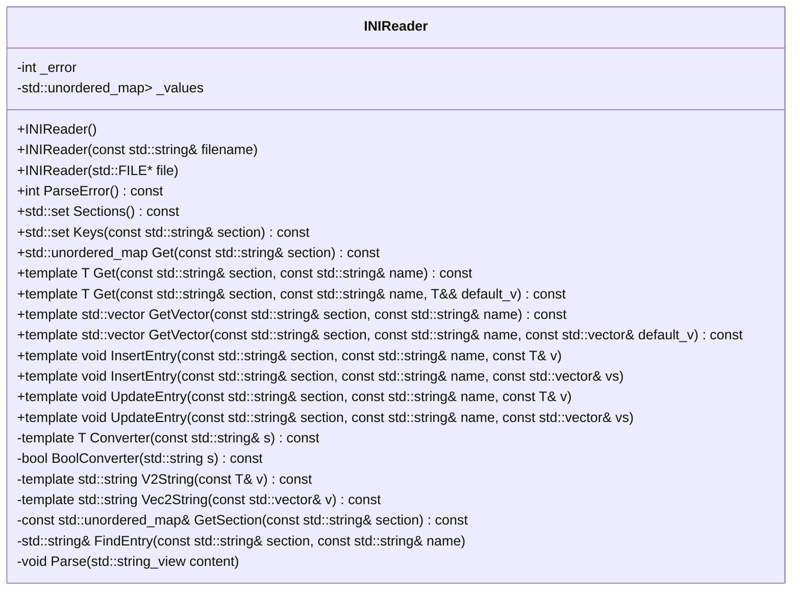
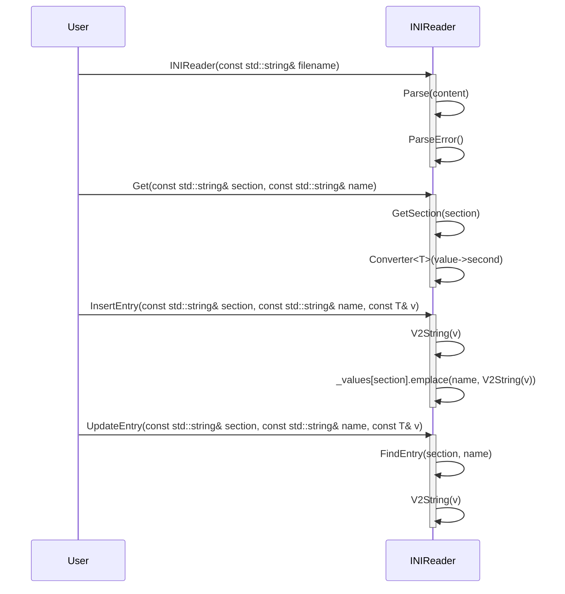
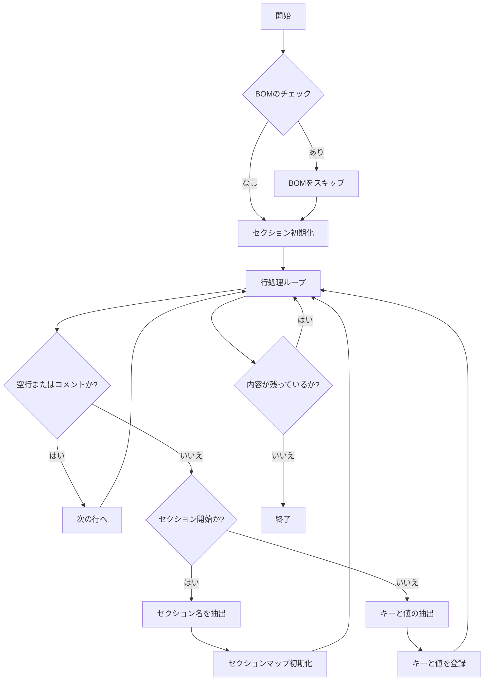

# 詳細設計仕様書: INIReader クラス

## 目的
INIファイルを読み取り、セクションとキーの値を管理する `INIReader` クラスの詳細設計情報を提供します。再実装に必要な正確性を優先し、元コードから確認できる事実のみを使用します。

## クラス図

## クラス・メソッド・インターフェース詳細

| 完全な名前 | 属性 | 引数名と型 | 戻り値型 | 可視性 | const | リファレンス/ポインタ | static | virtual | noexcept |
|------------|------|------------|----------|--------|-------|---------------------|--------|---------|----------|
| INIReader::INIReader() | コンストラクタ | - | void | public | false | - | false | false | false |
| INIReader::INIReader(const std::string& filename) | コンストラクタ | const std::string& filename | void | public | false | 参照 | false | false | false |
| INIReader::INIReader(std::FILE* file) | コンストラクタ | std::FILE* file | void | public | false | ポインタ | false | false | false |
| INIReader::ParseError() const | メソッド | - | int | public | true | - | false | false | false |
| INIReader::Sections() const | メソッド | - | std::set<std::string> | public | true | - | false | false | false |
| INIReader::Keys(const std::string& section) const | メソッド | const std::string& section | std::set<std::string> | public | true | 参照 | false | false | false |
| INIReader::Get(const std::string& section) const | メソッド | const std::string& section | std::unordered_map<std::string, std::string> | public | true | 参照 | false | false | false |
| INIReader::Get(const std::string& section, const std::string& name) const | テンプレートメソッド | const std::string& section, const std::string& name | T | public | true | 参照 | false | false | false |
| INIReader::Get(const std::string& section, const std::string& name, T&& default_v) const | テンプレートメソッド | const std::string& section, const std::string& name, T&& default_v | T | public | true | 参照, rvalue参照 | false | false | false |
| INIReader::GetVector(const std::string& section, const std::string& name) const | テンプレートメソッド | const std::string& section, const std::string& name | std::vector<T> | public | true | 参照 | false | false | false |
| INIReader::GetVector(const std::string& section, const std::string& name, const std::vector<T>& default_v) const | テンプレートメソッド | const std::string& section, const std::string& name, const std::vector<T>& default_v | std::vector<T> | public | true | 参照 | false | false | false |
| INIReader::InsertEntry(const std::string& section, const std::string& name, const T& v) | テンプレートメソッド | const std::string& section, const std::string& name, const T& v | void | public | false | 参照 | false | false | false |
| INIReader::InsertEntry(const std::string& section, const std::string& name, const std::vector<T>& vs) | テンプレートメソッド | const std::string& section, const std::string& name, const std::vector<T>& vs | void | public | false | 参照 | false | false | false |
| INIReader::UpdateEntry(const std::string& section, const std::string& name, const T& v) | テンプレートメソッド | const std::string& section, const std::string& name, const T& v | void | public | false | 参照 | false | false | false |
| INIReader::UpdateEntry(const std::string& section, const std::string& name, const std::vector<T>& vs) | テンプレートメソッド | const std::string& section, const std::string& name, const std::vector<T>& vs | void | public | false | 参照 | false | false | false |
| INIReader::_error | メンバ変数 | - | int | private | false | - | false | false | false |
| INIReader::_values | メンバ変数 | - | std::unordered_map<std::string, std::unordered_map<std::string, std::string>> | private | false | - | false | false | false |

## シーケンス図

## メソッド仕様書

### `int ParseError() const`
- **目的**: エラーコードに基づいて例外をスローする。
- **引数**: なし
- **戻り値**: int (常に0を返す)
- **動作**: `_error` の値に応じて適切な `std::runtime_error` をスローする。
- **副作用**: なし
- **エラー処理**: `_error` が -1, -2, またはその他の値の場合、例外をスローする。

### `std::set<std::string> Sections() const`
- **目的**: 登録されているセクションのリストを返す。
- **引数**: なし
- **戻り値**: std::set<std::string>
- **動作**: `_values` のキーからセクション名を抽出し、集合として返す。
- **副作用**: なし

### `std::set<std::string> Keys(const std::string& section) const`
- **目的**: 指定されたセクション内のキーのリストを返す。
- **引数**: const std::string& section
- **戻り値**: std::set<std::string>
- **動作**: `_values` から指定されたセクションのキーを抽出し、集合として返す。
- **副作用**: なし

### `template <typename T = std::string> T Get(const std::string& section, const std::string& name) const`
- **目的**: 指定されたセクションとキーに対応する値を取得し、指定した型に変換して返す。
- **引数**: const std::string& section, const std::string& name
- **戻り値**: T
- **動作**: `_values` から指定されたセクションとキーの値を抽出し、`Converter<T>` を使用して型変換する。
- **副作用**: なし

### `template <typename T> std::vector<T> GetVector(const std::string& section, const std::string& name) const`
- **目的**: 指定されたセクションとキーに対応する値を取得し、スペース区切りの文字列からベクトルに変換して返す。
- **引数**: const std::string& section, const std::string& name
- **戻り値**: std::vector<T>
- **動作**: `_values` から指定されたセクションとキーの値を抽出し、スペース区切りの文字列からベクトルに変換する。
- **副作用**: なし

### `template <typename T = std::string> void InsertEntry(const std::string& section, const std::string& name, const T& v)`
- **目的**: 指定されたセクションとキーに対応する値を挿入する。
- **引数**: const std::string& section, const std::string& name, const T& v
- **戻り値**: void
- **動作**: `_values` に指定されたセクションとキーの値を挿入する。既存のキーが存在する場合は例外をスローする。
- **副作用**: `_values` を更新する

### `template <typename T = std::string> void UpdateEntry(const std::string& section, const std::string& name, const T& v)`
- **目的**: 指定されたセクションとキーに対応する値を更新する。
- **引数**: const std::string& section, const std::string& name, const T& v
- **戻り値**: void
- **動作**: `_values` に指定されたセクションとキーの値を更新する。存在しないキーの場合、例外をスローする。
- **副作用**: `_values` を更新する

## 処理フロー図

### `INIReader::Parse(std::string_view content)`

## 状態遷移・副作用

| 更新前状態 | 遷移条件 | 変更対象 | 更新後状態 | 更新順序 | 副作用 |
|------------|----------|----------|------------|----------|--------|
| なし       | コンストラクタ呼び出し | _error, _values | 初期化済み | -        | ファイル読み込み、パース |
| 初期化済み | Get() 呼び出し | _values    | 不変     | -        | なし   |
| 初期化済み | InsertEntry() 呼び出し | _values    | 更新     | -        | なし   |
| 初期化済み | UpdateEntry() 呼び出し | _values    | 更新     | -        | なし   |

## データ変換・制約

| 入力データ | 出力データ | 変換規則 | 値域 | 境界値 | 単位 | 精度 | encoding |
|------------|------------|----------|------|--------|------|------|----------|
| std::string | std::set<std::string> | セクション名の抽出 | 文字列集合 | - | - | - | UTF-8 |
| std::string | std::unordered_map<std::string, std::string> | キーと値のマッピング | 文字列マップ | - | - | - | UTF-8 |
| std::string | T (テンプレート型) | 型変換 | 任意の型 | - | - | - | UTF-8 |
| std::string | std::vector<T> | スペース区切り文字列からベクトルへの変換 | ベクトル | - | - | - | UTF-8 |

## 追加詳細設計情報

### コンストラクタ
- **INIReader()**: 何もしないデフォルトコンストラクタ。
- **INIReader(const std::string& filename)**: 指定されたファイルから内容を読み取り、パースする。
- **INIReader(std::FILE* file)**: 指定されたファイルポインタから内容を読み取り、パースする。

### メソッド
- **ParseError()**: エラーコードに基づいて例外をスローする。
- **Sections()**: 登録されているセクションのリストを返す。
- **Keys(const std::string& section)**: 指定されたセクション内のキーのリストを返す。
- **Get(const std::string& section, const std::string& name)**: 指定されたセクションとキーに対応する値を取得し、指定した型に変換して返す。
- **GetVector(const std::string& section, const std::string& name)**: 指定されたセクションとキーに対応する値を取得し、スペース区切りの文字列からベクトルに変換して返す。
- **InsertEntry(const std::string& section, const std::string& name, const T& v)**: 指定されたセクションとキーに対応する値を挿入する。既存のキーが存在する場合は例外をスローする。
- **UpdateEntry(const std::string& section, const std::string& name, const T& v)**: 指定されたセクションとキーに対応する値を更新する。存在しないキーの場合、例外をスローする。

### 内部メソッド
- **Converter(const std::string& s)**: 文字列から指定した型に変換する。
- **BoolConverter(std::string s)**: 文字列からブール値に変換する。
- **V2String(const T& v)**: 指定した型の値を文字列に変換する。
- **Vec2String(const std::vector<T>& v)**: ベクトルをスペース区切りの文字列に変換する。
- **GetSection(const std::string& section)**: 指定されたセクションのマップを返す。存在しないセクションの場合、例外をスローする。
- **FindEntry(const std::string& section, const std::string& name)**: 指定されたセクションとキーに対応する値への参照を返す。存在しないキーの場合、例外をスローする。
- **Parse(std::string_view content)**: INIファイルの内容をパースし、内部データ構造に格納する。

### 依存関係
- `std::ifstream`, `std::ios`, `std::string`, `std::set`, `std::unordered_map`, `std::vector`, `std::ostringstream`, `std::runtime_error` など標準ライブラリの機能を使用します。
- `detail::is_space`, `detail::find_char_or_comment`, `detail::trim`, `detail::rtrim`, `detail::parse_value` などの詳細な処理は外部に依存しています。これらの関数の実装は確認不能です。

### 制約
- ファイル読み込みエラー、メモリ確保エラー、パースエラーが発生した場合、適切な例外をスローします。
- セクションやキーの重複登録は許可されず、例外をスローします。