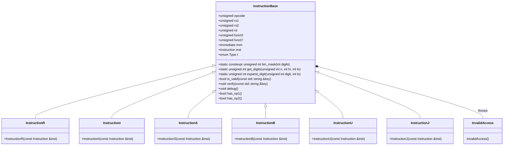

# 詳細設計仕様書

## 1. 概要

この文書は、`src/Common/Instruction.hpp` ファイルの再実装に必要な詳細な設計情報を提供します。ファイル内のクラス構造、メソッド仕様、データ変換ルールなどを具体的に記述し、別のLLMがソースコードを正確に再現できるようにすることを目指しています。

## 2. クラス図



## 3. クラス・メソッド・インターフェース詳細

### InstructionBase

| 名前 | 型 | 可視性 | const/static/constexpr | 引数名と型 | 戻り値型 |
|------|----|--------|--------------------------|------------|----------|
| opcode | unsigned | public | - | - | - |
| rs1 | unsigned | public | - | - | - |
| rs2 | unsigned | public | - | - | - |
| rd | unsigned | public | - | - | - |
| funct3 | unsigned | public | - | - | - |
| funct7 | unsigned | public | - | - | - |
| imm | Immediate | public | - | - | - |
| inst | Instruction | public | - | - | - |
| t | enum Type | public | - | - | - |
| bin_mask | unsigned int | static constexpr | - | digits: int | unsigned int |
| get_digits | unsigned int | static | - | n: unsigned int, hi: int, lo: int | unsigned int |
| expand_digit | unsigned int | static | - | digit: unsigned int, lo: int | unsigned int |
| is_valid | bool | public | - | key: const std::string & | bool |
| verify | void | public | - | key: const std::string & | void |
| debug | void | public | - | - | void |
| has_op1 | bool | public | - | - | bool |
| has_op2 | bool | public | - | - | bool |

### InstructionR

| 名前 | 型 | 可視性 | const/static/constexpr | 引数名と型 | 戻り値型 |
|------|----|--------|--------------------------|------------|----------|
| InstructionR | コンストラクタ | public | - | inst: const Instruction & | - |

### InstructionI

| 名前 | 型 | 可視性 | const/static/constexpr | 引数名と型 | 戻り値型 |
|------|----|--------|--------------------------|------------|----------|
| InstructionI | コンストラクタ | public | - | inst: const Instruction & | - |

### InstructionS

| 名前 | 型 | 可視性 | const/static/constexpr | 引数名と型 | 戻り値型 |
|------|----|--------|--------------------------|------------|----------|
| InstructionS | コンストラクタ | public | - | inst: const Instruction & | - |

### InstructionB

| 名前 | 型 | 可視性 | const/static/constexpr | 引数名と型 | 戻り値型 |
|------|----|--------|--------------------------|------------|----------|
| InstructionB | コンストラクタ | public | - | inst: const Instruction & | - |

### InstructionU

| 名前 | 型 | 可視性 | const/static/constexpr | 引数名と型 | 戻り値型 |
|------|----|--------|--------------------------|------------|----------|
| InstructionU | コンストラクタ | public | - | inst: const Instruction & | - |

### InstructionJ

| 名前 | 型 | 可視性 | const/static/constexpr | 引数名と型 | 戻り値型 |
|------|----|--------|--------------------------|------------|----------|
| InstructionJ | コンストラクタ | public | - | inst: const Instruction & | - |

### InvalidAccess

| 名前 | 型 | 可視性 | const/static/constexpr | 引数名と型 | 戻り値型 |
|------|----|--------|--------------------------|------------|----------|
| InvalidAccess | コンストラクタ | private | - | - | - |

## 4. シーケンス図

該当なし

## 5. メソッド仕様書

### InstructionBase::InstructionBase()

- **目的**: `InstructionBase` のデフォルトコンストラクタ
- **引数**: 無し
- **戻り値型**: void
- **動作**: 各フィールドを初期化する。
- **副作用**: フィールドの値が変更される。

### InstructionBase::InstructionBase(unsigned)

- **目的**: `InstructionBase` のコンストラクタ（特定のオペコードで初期化）
- **引数**: 無し
- **戻り値型**: void
- **動作**: 特定のオペコードとフィールドを初期化する。
- **副作用**: フィールドの値が変更される。

### InstructionBase::nop()

- **目的**: NOP命令を作成する静的メソッド
- **引数**: 無し
- **戻り値型**: `InstructionBase`
- **動作**: NOP命令を表す `InstructionBase` オブジェクトを返す。
- **副作用**: 無し

### InstructionBase::is_nop()

- **目的**: 命令がNOPかどうか判定する
- **引数**: 無し
- **戻り値型**: bool
- **動作**: `inst` フィールドの値が -1 であるかを返す。
- **副作用**: 無し

### InstructionBase::bin_mask(int digits)

- **目的**: 指定されたビット数に対応するマスクを作成する静的メソッド
- **引数**: `digits`: int
- **戻り値型**: unsigned int
- **動作**: ビット数に対応するマスクを返す。
- **副作用**: 無し

### InstructionBase::get_digits(unsigned int n, int hi, int lo)

- **目的**: 指定された範囲のビットを取り出す静的メソッド
- **引数**: `n`: unsigned int, `hi`: int, `lo`: int
- **戻り値型**: unsigned int
- **動作**: ビット列から指定された範囲のビットを取り出して返す。
- **副作用**: 無し

### InstructionBase::expand_digit(unsigned int digit, int lo)

- **目的**: 指定されたビットを符号拡張する静的メソッド
- **引数**: `digit`: unsigned int, `lo`: int
- **戻り値型**: unsigned int
- **動作**: ビット列の指定位置から符号拡張した値を返す。
- **副作用**: 無し

### InstructionBase::is_valid(const std::string &key)

- **目的**: 指定されたキーが有効かどうか判定する
- **引数**: `key`: const std::string &
- **戻り値型**: bool
- **動作**: キーが現在の命令タイプに対して有効であるかを返す。
- **副作用**: 無し

### InstructionBase::verify(const std::string &key)

- **目的**: 指定されたキーが有効かどうか検証する
- **引数**: `key`: const std::string &
- **戻り値型**: void
- **動作**: キーが無効な場合は `InvalidAccess` 例外を投げる。
- **副作用**: 例外が発生する可能性がある。

### InstructionBase::debug()

- **目的**: 命令のデバッグ情報を出力する
- **引数**: 無し
- **戻り値型**: void
- **動作**: 命令の詳細を標準出力に出力する。
- **副作用**: 標準出力への書き込み

### InstructionBase::has_op1()

- **目的**: 命令がオペランド1を持っているかどうか判定する
- **引数**: 無し
- **戻り値型**: bool
- **動作**: タイプが U または J でない場合に true を返す。
- **副作用**: 無し

### InstructionBase::has_op2()

- **目的**: 命令がオペランド2を持っているかどうか判定する
- **引数**: 無し
- **戻り値型**: bool
- **動作**: タイプが R, S, B のいずれかである場合に true を返す。
- **副作用**: 無し

### InstructionR::InstructionR(const Instruction &inst)

- **目的**: `InstructionR` 型の命令を作成するコンストラクタ
- **引数**: `inst`: const Instruction &
- **戻り値型**: void
- **動作**: R型命令からフィールドを初期化する。
- **副作用**: フィールドの値が変更される。

### InstructionI::InstructionI(const Instruction &inst)

- **目的**: `InstructionI` 型の命令を作成するコンストラクタ
- **引数**: `inst`: const Instruction &
- **戻り値型**: void
- **動作**: I型命令からフィールドを初期化する。
- **副作用**: フィールドの値が変更される。

### InstructionS::InstructionS(const Instruction &inst)

- **目的**: `InstructionS` 型の命令を作成するコンストラクタ
- **引数**: `inst`: const Instruction &
- **戻り値型**: void
- **動作**: S型命令からフィールドを初期化する。
- **副作用**: フィールドの値が変更される。

### InstructionB::InstructionB(const Instruction &inst)

- **目的**: `InstructionB` 型の命令を作成するコンストラクタ
- **引数**: `inst`: const Instruction &
- **戻り値型**: void
- **動作**: B型命令からフィールドを初期化する。
- **副作用**: フィールドの値が変更される。

### InstructionU::InstructionU(const Instruction &inst)

- **目的**: `InstructionU` 型の命令を作成するコンストラクタ
- **引数**: `inst`: const Instruction &
- **戻り値型**: void
- **動作**: U型命令からフィールドを初期化する。
- **副作用**: フィールドの値が変更される。

### InstructionJ::InstructionJ(const Instruction &inst)

- **目的**: `InstructionJ` 型の命令を作成するコンストラクタ
- **引数**: `inst`: const Instruction &
- **戻り値型**: void
- **動作**: J型命令からフィールドを初期化する。
- **副作用**: フィールドの値が変更される。

## 6. 処理フロー図

該当なし

## 7. 状態遷移・副作用

| 更新前状態 | 遷移条件 | 変更対象 | 更新後状態 | 更新順序 | 副作用 |
|------------|----------|----------|------------|----------|--------|
| -          | コンストラクタ呼び出し | 各フィールド | 初期化された状態 | 任意 | 無し |
| -          | verify() 呼び出し, キーが無効 | -        | -        | -        | InvalidAccess例外 |

## 8. データ変換・制約

### ビットマスクとビット取り出し

- **bin_mask(digits)**: 指定されたビット数に対応するマスクを作成する。
- **get_digits(n, hi, lo)**: ビット列から指定された範囲のビットを取り出す。

### 符号拡張

- **expand_digit(digit, lo)**: 指定されたビットを符号拡張する。

### 命令タイプ別のフィールド制約

| タイプ | 有効なフィールド |
|--------|------------------|
| R      | opcode, rs1, rs2, rd, funct3, funct7 |
| I      | opcode, rs1, rd, funct3, imm |
| S      | opcode, rs1, rs2, funct3, imm |
| B      | opcode, rs1, rs2, funct3, imm |
| U      | opcode, rd, imm |
| J      | opcode, rd, imm |

## 9. 完全再構築台帳

### ファイルヘッダ

```cpp
#ifndef RISCV_SIMULATOR_INSTRUCTION_HPP
#define RISCV_SIMULATOR_INSTRUCTION_HPP

#include <utility>
#include "Common.h"
#include <string>
#include <iostream>

using Instruction = unsigned int;
```

### クラス定義

#### InstructionBase

```cpp
struct InstructionBase {
    class InvalidAccess {
    };

    InstructionBase() {
        rs1 = rs2 = rd = 0;
        opcode = 0;
        imm = 0;
        funct3 = funct7 = 0;
        this->inst = 0;
    }

    InstructionBase(unsigned) {
        rs1 = rs2 = rd = 0;
        opcode = 0b0010011;
        t = I;
        imm = 0;
        funct3 = funct7 = 0;
        this->inst = -1;
    }

    static InstructionBase nop() { return InstructionBase(0); }

    bool is_nop() { return this->inst == -1; }

    unsigned opcode, rs1, rs2, rd, funct3, funct7;
    Immediate imm;
    Instruction inst;
    enum Type {
        R, I, S, B, U, J
    } t;

    static constexpr unsigned int bin_mask(int digits) {
        return (1 << digits) - 1;
    }

    static unsigned int get_digits(unsigned int n, int hi, int lo) {
        return (n >> lo) & bin_mask(hi - lo + 1);
    }

    static unsigned int expand_digit(unsigned int digit, int lo) {
        return digit ? (0xffffffff << lo) : 0;
    }

    bool is_valid(const std::string &key) {
        if (t == R) { if (key == "imm") return false; }
        if (t == I) { if (key == "rs2" || key == "funct7") return false; }
        if (t == S) { if (key == "rd" || key == "funct7") return false; }
        if (t == B) { if (key == "rd" || key == "funct7") return false; }
        if (t == U || t == J) { if (key == "rs1" || key == "rs2" || key == "funct3" || key == "funct7") return false; }
        return true;
    }

    void verify(const std::string &key) {
        if (!is_valid(key)) throw InvalidAccess();
    };

    void debug() {
        std::cout << std::hex << inst << " ";
        if (inst == 0x00000013) std::cout << "nop";
        else if (opcode == 0b0110111) std::cout << "lui ";
        else if (opcode == 0b0010111) std::cout << "auipc ";
        else if (opcode == 0b1101111) std::cout << "jal ";
        else if (opcode == 0b1100111) std::cout << "jalr ";
        else if (opcode == 0b1100011) std::cout << "branch";
        else if (opcode == 0b0000011) std::cout << "load";
        else if (opcode == 0b0100011) std::cout << "store";
        else if (opcode == 0b0010011) {
            static std::string opi[] = {
                    "addi", "slli", "slti", "sltiu", "xori", "srli / srai",
                    "ori", "andi"
            };
            std::cout << opi[funct3];
        }
        else if (opcode == 0b0110011) std::cout << "op";
        else std::cout << "unknown";
        std::cout << std::endl;
    }

    bool has_op1() {
        return t != InstructionBase::U && t != InstructionBase::J;
    }

    bool has_op2() {
        return t == InstructionBase::R || t == InstructionBase::S
               || t == InstructionBase::B;
    }
};
```

#### InstructionR

```cpp
struct InstructionR : InstructionBase {
    InstructionR(const Instruction &inst) {
        opcode = get_digits(inst, 6, 0);
        rd = get_digits(inst, 11, 7);
        funct3 = get_digits(inst, 14, 12);
        rs1 = get_digits(inst, 19, 15);
        rs2 = get_digits(inst, 24, 20);
        funct7 = get_digits(inst, 31, 25);
        t = R;
        this->inst = inst;
    }
};
```

#### InstructionI

```cpp
struct InstructionI : InstructionBase {
    InstructionI(const Instruction &inst) {
        opcode = get_digits(inst, 6, 0);
        rd = get_digits(inst, 11, 7);
        funct3 = get_digits(inst, 14, 12);
        rs1 = get_digits(inst, 19, 15);
        imm = get_digits(inst, 30, 20) | expand_digit(get_digits(inst, 31, 31), 11);
        t = I;
        this->inst = inst;
    }
};
```

#### InstructionS

```cpp
struct InstructionS : InstructionBase {
    InstructionS(const Instruction &inst) {
        opcode = get_digits(inst, 6, 0);
        funct3 = get_digits(inst, 14, 12);
        rs1 = get_digits(inst, 19, 15);
        rs2 = get_digits(inst, 24, 20);
        imm = get_digits(inst, 11, 7) |
              (get_digits(inst, 30, 25) << 5) |
              expand_digit(get_digits(inst, 31, 31), 11);
        t = S;
        this->inst = inst;
    }
};
```

#### InstructionB

```cpp
struct InstructionB : InstructionBase {
    InstructionB(const Instruction &inst) {
        opcode = get_digits(inst, 6, 0);
        funct3 = get_digits(inst, 14, 12);
        rs1 = get_digits(inst, 19, 15);
        rs2 = get_digits(inst, 24, 20);
        imm = (get_digits(inst, 11, 8) << 1) |
              (get_digits(inst, 30, 25) << 5) |
              (get_digits(inst, 7, 7) << 11) |
              expand_digit(get_digits(inst, 31, 31), 12);
        t = B;
        this->inst = inst;
    }
};
```

#### InstructionU

```cpp
struct InstructionU : InstructionBase {
    InstructionU(const Instruction &inst) {
        opcode = get_digits(inst, 6, 0);
        rd = get_digits(inst, 11, 7);
        imm = (get_digits(inst, 19, 12) << 12) |
              (get_digits(inst, 30, 20) << 20) |
              (get_digits(inst, 31, 31) << 31);
        t = U;
        this->inst = inst;
    }
};
```

#### InstructionJ

```cpp
struct InstructionJ : InstructionBase {
    InstructionJ(const Instruction &inst) {
        opcode = get_digits(inst, 6, 0);
        rd = get_digits(inst, 11, 7);
        imm = (get_digits(inst, 30, 21) << 1) |
              (get_digits(inst, 20, 20) << 11) |
              (get_digits(inst, 19, 12) << 12) |
              expand_digit(get_digits(inst, 31, 31), 20);
        t = J;
        this->inst = inst;
    }
};
```

### ファイルフッタ

```cpp
#endif
```

## 10. 追加詳細設計情報

- **依存関係**: `Common.h` から `Immediate` 型を使用している。
- **初期値**: 各コンストラクタでフィールドが適切に初期化されている。
- **例外処理**: `verify()` メソッドで `InvalidAccess` 例外を投げる。

この設計仕様書は、別のLLMが `src/Common/Instruction.hpp` ファイルを正確に再実装するための詳細な情報を提供します。