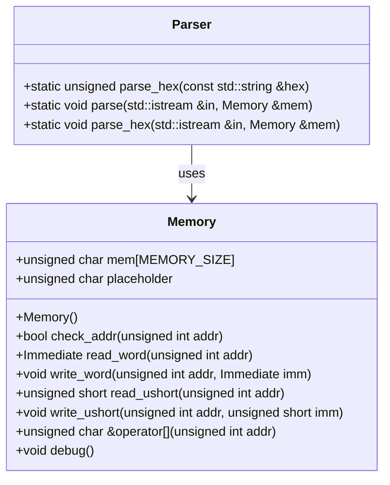
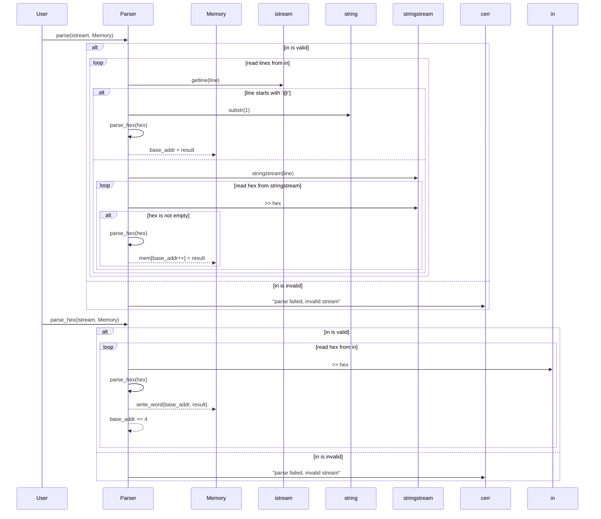

# 詳細設計仕様書

## 1. 目的
この文書は、`Parser`クラスの再実装に必要な詳細な設計情報を提供します。元コードから確認できる事実のみを基に、再実装に必要な具体的な情報を取り上げます。

## 2. クラス図



## 3. クラス・メソッド・インターフェース詳細

### Parserクラス

| 完全な名前 | 属性     | 引数名と型                | 戻り値型 | 可視性 | const | static | virtual | noexcept |
|------------|----------|---------------------------|----------|--------|-------|--------|---------|----------|
| parse_hex  |          | const std::string &hex    | unsigned | public |       | x      |         |          |
| parse      |          | std::istream &in, Memory &mem | void     | public |       | x      |         |          |
| parse_hex  |          | std::istream &in, Memory &mem | void     | public |       | x      |         |          |

### Memoryクラス

| 完全な名前   | 属性     | 引数名と型                | 戻り値型    | 可視性 | const | static | virtual | noexcept |
|--------------|----------|---------------------------|-------------|--------|-------|--------|---------|----------|
| Memory       |          |                           |             | public |       |        |         | x        |
| check_addr   |          | unsigned int addr         | bool        | public | x     |        |         |          |
| read_word    |          | unsigned int addr         | Immediate   | public | x     |        |         |          |
| write_word   |          | unsigned int addr, Immediate imm | void      | public |       |        |         |          |
| read_ushort  |          | unsigned int addr         | unsigned short | public | x     |        |         |          |
| write_ushort |          | unsigned int addr, unsigned short imm | void    | public |       |        |         |          |
| operator[]   |          | unsigned int addr         | unsigned char & | public |       |        |         |          |
| debug        |          |                           | void        | public |       |        |         |          |

## 4. シーケンス図



## 5. メソッド仕様書

### parse_hex

- **目的**: 16進数文字列を符号なし整数に変換する。
- **引数**:
  - `const std::string &hex`: 変換したい16進数文字列。
- **戻り値**: 変換された符号なし整数。
- **動作**: `strtol`関数を使用して16進数文字列を変換する。
- **副作用**: なし
- **エラー処理**: 無効な入力に対して未定義動作（`strtol`の仕様に基づく）。

### parse

- **目的**: 入力ストリームからデータを読み取り、メモリに書き込む。
- **引数**:
  - `std::istream &in`: データを読み取る入力ストリーム。
  - `Memory &mem`: データを書き込むメモリオブジェクト。
- **戻り値**: なし
- **動作**:
  - 入力ストリームが無効な場合、エラーメッセージを出力する。
  - 各行に対して処理を行う。`@`で始まる行はベースアドレスを設定し、それ以外の行はデータをメモリに書き込む。
- **副作用**: 標準エラー出力へのメッセージ出力
- **エラー処理**: 入力ストリームが無効な場合、エラーメッセージを出力する。

### parse_hex

- **目的**: 入力ストリームから16進数データを読み取り、メモリに書き込む。
- **引数**:
  - `std::istream &in`: データを読み取る入力ストリーム。
  - `Memory &mem`: データを書き込むメモリオブジェクト。
- **戻り値**: なし
- **動作**:
  - 入力ストリームが無効な場合、エラーメッセージを出力する。
  - 各16進数データに対して処理を行う。読み取ったデータはメモリに4バイト単位で書き込む。
- **副作用**: 標準エラー出力へのメッセージ出力
- **エラー処理**: 入力ストリームが無効な場合、エラーメッセージを出力する。

## 6. 処理フロー図

### parseメソッドの処理フロー

```mermaid
graph TD
    A[開始] --> B{in is valid?}
    B -- No --> C["cerr << \"parse failed, invalid stream\""]
    B -- Yes --> D[base_addr = 0]
    D --> E[while (in)]
    E --> F[getline(in, line)]
    F --> G{line[0] == '@'?}
    G -- Yes --> H["base_addr = parse_hex(line.substr(1))"]
    G -- No --> I[stringstream ss(line)]
    I --> J[while (ss >> hex)]
    J --> K{hex.length() == 0?}
    K -- Yes --> L[end loop]
    K -- No --> M["data = parse_hex(hex)"]
    M --> N["mem[base_addr++] = data"]
    N --> J
    H --> E
    L --> O[終了]
```

### parse_hexメソッドの処理フロー

```mermaid
graph TD
    A[開始] --> B{in is valid?}
    B -- No --> C["cerr << \"parse failed, invalid stream\""]
    B -- Yes --> D[base_addr = 0]
    D --> E[while (in >> hex)]
    E --> F["mem.write_word(base_addr, parse_hex(hex))"]
    F --> G["base_addr += 4"]
    G --> E
    H[終了]
```

## 7. 状態遷移・副作用

### parseメソッドの状態遷移

| 更新前状態 | 遷移条件         | 変更対象     | 更新後状態 |
|------------|------------------|--------------|------------|
| in is valid | line[0] == '@'   | base_addr    | 新しいベースアドレス |
| in is valid | line[0] != '@'   | mem          | メモリにデータ書き込み |

### parse_hexメソッドの状態遷移

| 更新前状態 | 遷移条件         | 変更対象     | 更新後状態 |
|------------|------------------|--------------|------------|
| in is valid | 常に             | mem          | メモリにデータ書き込み |

## 8. データ変換・制約

### parse_hexメソッドのデータ変換

| 入力型     | 出力型   | 変換規則                           |
|------------|----------|------------------------------------|
| std::string | unsigned | `strtol(hex.c_str(), NULL, 16)` |

### parseメソッドのデータ変換

| 入力型     | 出力型   | 変換規則                           |
|------------|----------|------------------------------------|
| std::string | char     | `parse_hex(hex)`                   |

## 9. 追加詳細設計情報

- **依存関係**: `Parser`クラスは`Memory`クラスに依存しています。`Memory`クラスのヘッダファイル`src/Common/Memory.hpp`をincludeする必要があります。
- **制約**:
  - 入力ストリームが無効な場合、エラーメッセージを出力します。
  - メモリアドレスは範囲チェックを行います（`Memory::check_addr`）。

## 10. 完全再構築台帳

### Parser.hpp

```cpp
#ifndef SRC_COMMON_PARSER_HPP
#define SRC_COMMON_PARSER_HPP

#include <string>
#include <iostream>
#include <sstream>
#include "Common/Memory.hpp"

class Parser {
public:
    static unsigned parse_hex(const std::string &hex) {
        return strtol(hex.c_str(), NULL, 16);
    }

    static void parse(std::istream &in, Memory &mem) {
        if (!in) std::cerr << "parse failed, invalid stream" << std::endl;
        unsigned base_addr = 0;
        while (in) {
            std::string line;
            std::getline(in, line);
            if (line[0] == '@') {
                base_addr = strtol(line.c_str() + 1, NULL, 16);
            } else {
                std::stringstream ss(line);
                std::string hex;
                while (ss >> hex) {
                    if (hex.length() == 0) break;
                    char data = parse_hex(hex);
                    mem[base_addr++] = data;
                }
            }
        }
    }

    static void parse_hex(std::istream &in, Memory &mem) {
        if (!in) std::cerr << "parse failed, invalid stream" << std::endl;
        unsigned base_addr = 0;
        std::string hex;
        while(in >> hex) {
            mem.write_word(base_addr, parse_hex(hex));
            base_addr += 4;
        }
    }
};

#endif // SRC_COMMON_PARSER_HPP
```

### Memory.hpp

```cpp
#ifndef RISCV_SIMULATOR_MEMORY_HPP
#define RISCV_SIMULATOR_MEMORY_HPP

#include "Common.h"
#include <cstring>
#include <iostream>
#include <cassert>

const int MEMORY_SIZE = 0x400000;

class Memory {
public:
    unsigned char mem[MEMORY_SIZE];
    unsigned char placeholder;

    Memory() { memset(mem, 0, sizeof(mem)); }

    bool check_addr(unsigned int addr) {
        if (0 <= addr && addr < MEMORY_SIZE) return true;
        return false;
    }

    Immediate read_word(unsigned int addr) {
        if (!check_addr(addr)) return 0;
        return *(Immediate *) (mem + addr);
    }

    void write_word(unsigned int addr, Immediate imm) {
        if (!check_addr(addr)) return;
        *(Immediate *) (mem + addr) = imm;
    }

    unsigned short read_ushort(unsigned int addr) {
        if (!check_addr(addr)) return 0;
        return *(short *) (mem + addr);
    }

    void write_ushort(unsigned int addr, unsigned short imm) {
        if (!check_addr(addr)) return;
        *(short *) (mem + addr) = imm;
    }

    unsigned char &operator[](unsigned int addr) {
        if (!check_addr(addr)) return placeholder;
        return mem[addr];
    }

    void debug() {
        for (int i = 0x20000 - 0x10; i <= 0x20000; i++) {
            std::cout << std::hex << (unsigned) mem[i] << " ";
        }
        std::cout << std::endl;
    }
};

#endif // RISCV_SIMULATOR_MEMORY_HPP
```

この設計仕様書は、`Parser`クラスの再実装に必要な詳細な情報を提供します。各メソッドの動作やデータ変換規則、依存関係などを具体的に記述しています。