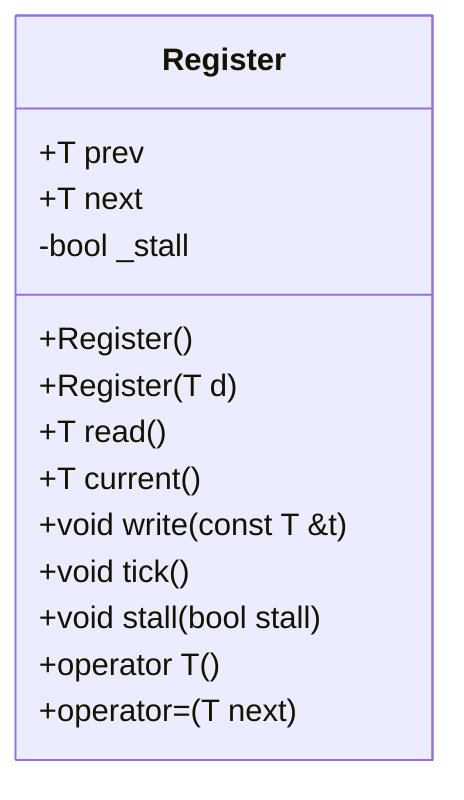

# 詳細設計仕様書

## 1. クラス図

## 2. クラス・メソッド・インターフェース詳細

| 完全な名前 | 属性     | 引数名と型       | 戻り値型 | 可視性 | const | 参照/ポインタ | static | virtual | noexcept |
|------------|----------|------------------|----------|--------|-------|---------------|--------|---------|----------|
| Register::Register() | コンストラクタ | なし       | void     | public | false | なし          | false  | false   | false    |
| Register::Register(T d) | コンストラクタ | T d      | void     | public | false | なし          | false  | false   | false    |
| Register::read()       | メソッド       | なし       | T        | public | true  | なし          | false  | false   | false    |
| Register::current()    | メソッド       | なし       | T        | public | true  | なし          | false  | false   | false    |
| Register::write(const T &t) | メソッド | const T &t | void     | public | false | 参照          | false  | false   | false    |
| Register::tick()       | メソッド       | なし       | void     | public | false | なし          | false  | false   | false    |
| Register::stall(bool stall) | メソッド | bool stall | void     | public | false | なし          | false  | false   | false    |
| Register::operator T() | オペレータ   | なし       | T        | public | true  | なし          | false  | false   | false    |
| Register::operator=(T next) | オペレータ | T next     | void     | public | false | なし          | false  | false   | false    |

## 3. シーケンス図

シーケンス図は、複数の関数やメソッド間の相互作用を示すためのものですが、このクラスでは単一オブジェクトに対する操作のみが含まれているため、シーケンス図は該当なしとなります。

## 4. メソッド仕様書

### Register::Register()

- **目的**: `Register` オブジェクトを初期化する。
- **引数**: なし
- **戻り値**: void
- **動作**: `prev`, `next` を 0 に、`_stall` を false に初期化する。

### Register::Register(T d)

- **目的**: 初期値を指定して `Register` オブジェクトを初期化する。
- **引数**: T d
- **戻り値**: void
- **動作**: `prev`, `next` を d に、`_stall` を false に初期化する。

### Register::read()

- **目的**: 前回の値を読み取る。
- **引数**: なし
- **戻り値**: T (前回の値)
- **動作**: `prev` の値を返す。

### Register::current()

- **目的**: 現在の値を読み取る。
- **引数**: なし
- **戻り値**: T (現在の値)
- **動作**: `next` の値を返す。

### Register::write(const T &t)

- **目的**: 新しい値を書き込む。
- **引数**: const T &t (新しい値)
- **戻り値**: void
- **動作**: `next` に t を代入する。

### Register::tick()

- **目的**: レジスタの状態を更新する。
- **引数**: なし
- **戻り値**: void
- **動作**: `_stall` が false の場合、`prev` に `next` の値を代入する。

### Register::stall(bool stall)

- **目的**: ストール状態を設定する。
- **引数**: bool stall (ストール状態)
- **戻り値**: void
- **動作**: `_stall` に stall を代入する。

### Register::operator T()

- **目的**: オブジェクトを T 型に変換する。
- **引数**: なし
- **戻り値**: T (前回の値)
- **動作**: `read()` メソッドを呼び出してその結果を返す。

### Register::operator=(T next)

- **目的**: 新しい値を代入する。
- **引数**: T next (新しい値)
- **戻り値**: void
- **動作**: `write(next)` メソッドを呼び出す。

## 5. 処理フロー図

処理フロー図は、複雑な分岐や反復がある場合に有用ですが、このクラスでは単純なメソッド呼び出しと代入のみが含まれているため、処理フロー図は該当なしとなります。

## 6. 状態遷移・副作用

| 更新前状態 | 遷移条件       | 変更対象 | 更新後状態 | 更新順序 | 副作用 |
|------------|----------------|----------|------------|----------|--------|
| 任意       | Register()     | prev, next, _stall | prev=0, next=0, _stall=false | なし | なし   |
| 任意       | Register(T d)  | prev, next, _stall | prev=d, next=d, _stall=false | なし | なし   |
| 任意       | write(const T &t) | next     | next=t     | なし | なし   |
| 任意       | tick()         | prev     | prev=next (if !_stall) | なし | なし   |
| 任意       | stall(bool stall) | _stall   | _stall=stall | なし | なし   |

## 7. データ変換・制約

| 入力データ | 出力データ | 変換規則 | 値域 | 境界値 | 単位 | 精度 | encoding |
|------------|------------|----------|------|--------|------|------|----------|
| なし       | T          | read()   | 確認不能 | 確認不能 | 確認不能 | 確認不能 | 確認不能 |
| T d        | void       | Register(T d) | 確認不能 | 確認不能 | 確認不能 | 確認不能 | 確認不能 |
| const T &t | void       | write(const T &t) | 確認不能 | 確認不能 | 確認不能 | 確認不能 | 確認不能 |
| なし       | void       | tick()   | 確認不能 | 確認不能 | 確認不能 | 確認不能 | 確認不能 |
| bool stall | void       | stall(bool stall) | 確認不能 | 確認不能 | 確認不能 | 確認不能 | 確認不能 |

## 8. 追加詳細設計情報

- **ファイルパス**: `src/Common/Register.hpp`
- **役割**: `Register` クラスの完全な定義を提供する。
- **置換必要性**: true
- **参照のみ入力**: none

この仕様書は、別のLLMが `Register` クラスを再実装するために必要な詳細情報を提供します。各メソッドの動作や状態遷移、データ変換について具体的に記述しています。