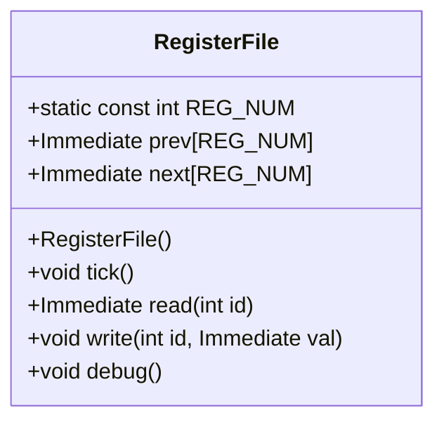
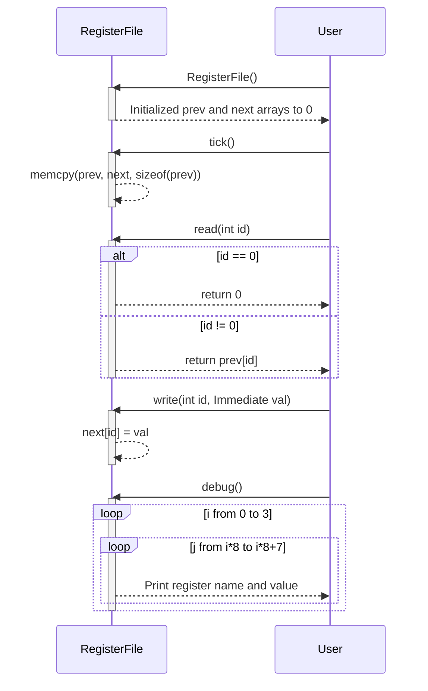
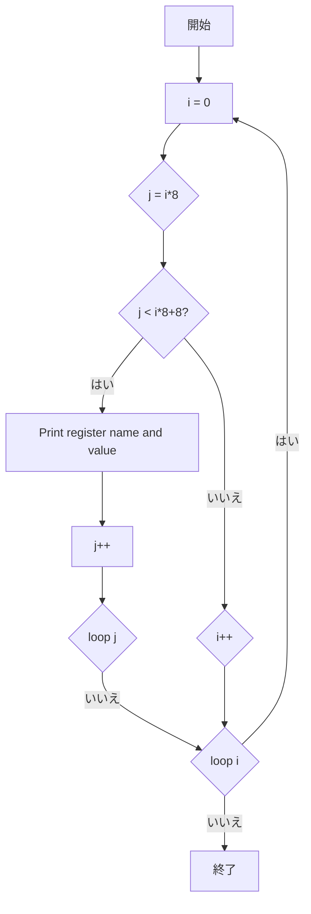

# 詳細設計仕様書

## 目的
`RegisterFile` クラスの定義を再実装するために必要な詳細設計情報を提供します。元コードから確認できる事実のみを使用し、推測や創作を行いません。

## 基本情報
- **ファイルパス**: `src/Common/RegisterFile.hpp`
- **クラス名**: `RegisterFile`
- **役割**: レジスタファイルの定義と操作

## クラス図


## クラス・メソッド・インターフェース詳細

| 完全な名前 | 属性     | 引数名と型       | 戻り値型  | 可視性 | const | static | virtual | noexcept |
|------------|----------|------------------|-----------|--------|-------|--------|---------|----------|
| RegisterFile::REG_NUM | 定数   | -                | int       | public | 〇    | 〇     | ×       | ×        |
| RegisterFile::prev     | メンバ変数 | -                | Immediate[REG_NUM] | private | ×     | ×      | ×       | ×        |
| RegisterFile::next     | メンバ変数 | -                | Immediate[REG_NUM] | private | ×     | ×      | ×       | ×        |
| RegisterFile::RegisterFile() | コンストラクタ | -                | void      | public | ×     | ×      | ×       | ×        |
| RegisterFile::tick     | メソッド   | -                | void      | public | ×     | ×      | ×       | ×        |
| RegisterFile::read     | メソッド   | int id           | Immediate | public | ×     | ×      | ×       | ×        |
| RegisterFile::write    | メソッド   | int id, Immediate val | void      | public | ×     | ×      | ×       | ×        |
| RegisterFile::debug    | メソッド   | -                | void      | public | ×     | ×      | ×       | ×        |

## シーケンス図


## メソッド仕様書

### RegisterFile::RegisterFile()
- **目的**: `RegisterFile` オブジェクトを初期化する。
- **引数**: なし
- **戻り値**: なし
- **動作**: `prev` と `next` 配列のすべての要素を0に設定する。

### RegisterFile::tick()
- **目的**: レジスタファイルの状態を更新する。
- **引数**: なし
- **戻り値**: なし
- **動作**: `prev` 配列を `next` 配列の内容で上書きする。

### RegisterFile::read(int id)
- **目的**: 指定されたIDのレジスタの値を読み取る。
- **引数**: int id - レジスタのID
- **戻り値**: Immediate - レジスタの値
- **動作**: `id` が0の場合、0を返す。それ以外の場合、`prev[id]` を返す。

### RegisterFile::write(int id, Immediate val)
- **目的**: 指定されたIDのレジスタに値を書き込む。
- **引数**: int id - レジスタのID, Immediate val - 書き込む値
- **戻り値**: なし
- **動作**: `next[id]` に `val` を設定する。

### RegisterFile::debug()
- **目的**: レジスタファイルの内容をデバッグ出力する。
- **引数**: なし
- **戻り値**: なし
- **動作**: 各レジスタの名前と現在の値をフォーマットして表示する。

## 処理フロー図

### tick()
```mermaid
graph TD
    A[開始] --> B[memcpy(prev, next, sizeof(prev))]
    B --> C[終了]
```

### read(int id)
```mermaid
graph TD
    A[開始] --> B{id == 0?}
    B --はい--> C[return 0]
    B --いいえ--> D[return prev[id]]
    C --> E[終了]
    D --> E
```

### write(int id, Immediate val)
```mermaid
graph TD
    A[開始] --> B[next[id] = val]
    B --> C[終了]
```

### debug()


## 状態遷移・副作用

| 更新前状態 | 遷移条件  | 変更対象   | 更新後状態 | 更新順序 | 副作用 |
|------------|-----------|------------|------------|----------|--------|
| prev, next | tick()    | prev       | prev = next| -        | なし   |
| next       | write(id,val) | next[id] | val      | -        | なし   |

## データ変換・制約

| 入力データ | 出力データ | 変換規則 | 値域          | 境界値 | 単位 |
|------------|------------|----------|---------------|--------|------|
| id         | Immediate  | read(id) | 0 <= id < REG_NUM | 0, REG_NUM-1 | -    |
| val        | next[id]   | write(id,val) | -           | -      | -    |

## 追加詳細設計情報

### 定義
- **Immediate**: `unsigned int` 型のエイリアス (src/Common/Common.h)
- **SImmediate**: `int` 型のエイリアス (src/Common/Common.h)

### 依存関係ヘッダ
- **Common.h**: `Immediate`, `SImmediate` の定義を含む。
- **utils.h**: `debug_immediate` 関数の宣言を含む。

### 使用データ・更新データ
- **使用データ**:
  - `prev`: レジスタの前の値
  - `next`: レジスタの次の値

- **更新データ**:
  - `prev`: `tick()` で `next` の値に更新される。
  - `next`: `write(id, val)` で指定された値に更新される。

### 状態・副作用
- **状態**: レジスタの現在値と次の値を保持する。
- **副作用**: `debug()` では標準出力への書き込みが行われる。

### データ変換・制約
- **レジスタID**: 0から31までの範囲で指定される。
- **Immediate 値**: `unsigned int` の範囲内で指定される。