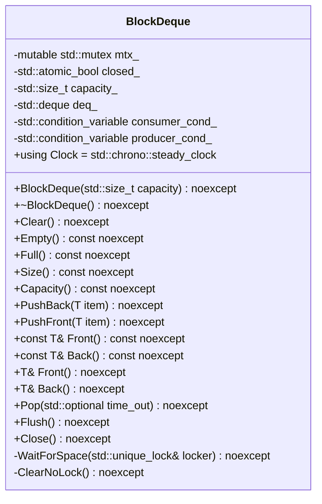
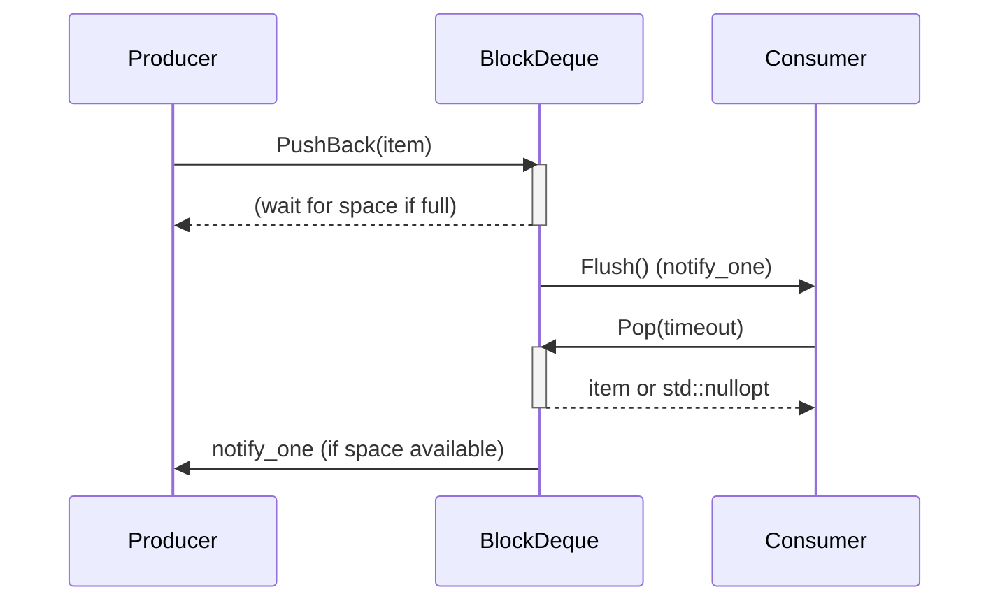
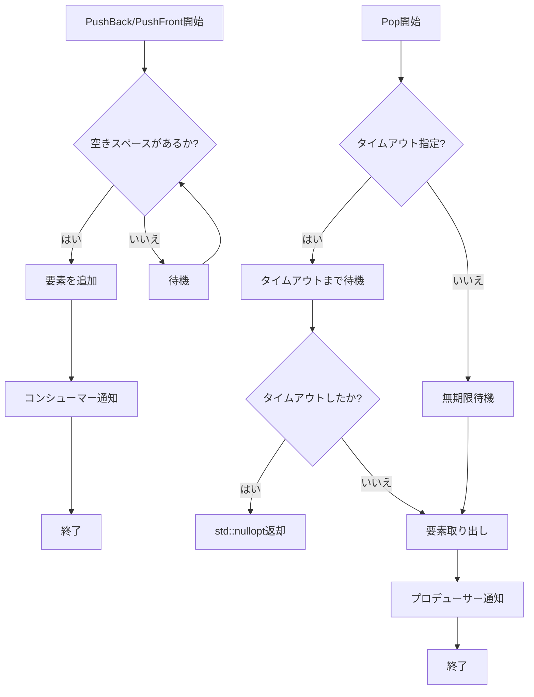

以下は、与えられたC++ソースコードを解析し、再実装に必要な詳細設計仕様書です。この仕様書は、元のコードから確認できる事実のみを基に作成されています。

## 完全再構築台帳

### ファイル情報
- **ファイルパス**: `include/containers/block_deque.h`
- **インクルードガード**: `#pragma once`
- **インクルード**:
  ```cpp
  #include <cassert>
  #include <condition_variable>
  #include <deque>
  #include <mutex>
  #include <optional>
  #include <utility>
  ```

### 名前空間
- `ws`

### クラス: `BlockDeque<T>`
#### テンプレートパラメータ
- `typename T`

#### 公開メンバー (public)
1. **型エイリアス**:
   - `using Clock = std::chrono::steady_clock;`
2. **コンストラクタ**:
   ```cpp
   explicit BlockDeque(std::size_t capacity = 1000) noexcept;
   ```
3. **特殊メンバ関数**:
   - コピー/ムーブ禁止:
     ```cpp
     BlockDeque(const BlockDeque&) = delete;
     BlockDeque(BlockDeque&&) = delete;
     BlockDeque& operator=(const BlockDeque&) = delete;
     BlockDeque& operator=(BlockDeque&&) = delete;
     ```
   - デストラクタ:
     ```cpp
     ~BlockDeque() noexcept;
     ```
4. **公開メソッド**:
   - `void Clear() noexcept;`
   - `bool Empty() const noexcept;`
   - `bool Full() const noexcept;`
   - `std::size_t Size() const noexcept;`
   - `std::size_t Capacity() const noexcept;`
   - `void PushBack(T item) noexcept;`
   - `void PushFront(T item) noexcept;`
   - `const T& Front() const noexcept;`
   - `const T& Back() const noexcept;`
   - `T& Front() noexcept;`
   - `T& Back() noexcept;`
   - `std::optional<T> Pop(std::optional<Clock::duration> time_out = std::nullopt) noexcept;`
   - `void Flush() noexcept;`
   - `void Close() noexcept;`

#### 非公開メンバー (private)
1. **メソッド**:
   ```cpp
   void WaitForSpace(std::unique_lock<std::mutex>& locker) noexcept;
   void ClearNoLock() noexcept;
   ```
2. **メンバ変数**:
   ```cpp
   mutable std::mutex mtx_;
   std::atomic_bool closed_ {false};
   std::size_t capacity_;
   std::deque<T> deq_;
   std::condition_variable consumer_cond_;
   std::condition_variable producer_cond_;
   ```

### メソッド実装

#### コンストラクタ
```cpp
template <typename T>
BlockDeque<T>::BlockDeque(const std::size_t capacity) noexcept :
    capacity_ {capacity} {
    assert(capacity > 0);
}
```

#### デストラクタ
```cpp
template <typename T>
BlockDeque<T>::~BlockDeque() noexcept {
    Close();
}
```

#### `Empty`
```cpp
template <typename T>
bool BlockDeque<T>::Empty() const noexcept {
    const std::lock_guard locker {mtx_};
    return deq_.empty();
}
```

#### `Full`
```cpp
template <typename T>
bool BlockDeque<T>::Full() const noexcept {
    const auto size {this->Size()};
    assert(size <= capacity_);
    return size == capacity_;
}
```

#### `Size`
```cpp
template <typename T>
std::size_t BlockDeque<T>::Size() const noexcept {
    const std::lock_guard locker {mtx_};
    return deq_.size();
}
```

#### `Capacity`
```cpp
template <typename T>
std::size_t BlockDeque<T>::Capacity() const noexcept {
    return capacity_;
}
```

#### `Close`
```cpp
template <typename T>
void BlockDeque<T>::Close() noexcept {
    const std::lock_guard locker {mtx_};
    ClearNoLock();
    closed_ = true;
    producer_cond_.notify_all();
    consumer_cond_.notify_all();
}
```

#### `ClearNoLock`
```cpp
template <typename T>
void BlockDeque<T>::ClearNoLock() noexcept {
    deq_.clear();
}
```

#### `Clear`
```cpp
template <typename T>
void BlockDeque<T>::Clear() noexcept {
    const std::lock_guard locker {mtx_};
    ClearNoLock();
}
```

#### `Flush`
```cpp
template <typename T>
void BlockDeque<T>::Flush() noexcept {
    consumer_cond_.notify_one();
}
```

#### `PushBack`
```cpp
template <typename T>
void BlockDeque<T>::PushBack(T item) noexcept {
    std::unique_lock locker {mtx_};
    WaitForSpace(locker);
    deq_.push_back(std::move(item));
    Flush();
}
```

#### `PushFront`
```cpp
template <typename T>
void BlockDeque<T>::PushFront(T item) noexcept {
    std::unique_lock locker {mtx_};
    WaitForSpace(locker);
    deq_.push_front(std::move(item));
    Flush();
}
```

#### `Front` (const)
```cpp
template <typename T>
const T& BlockDeque<T>::Front() const noexcept {
    const std::lock_guard locker {mtx_};
    assert(!deq_.empty());
    return deq_.front();
}
```

#### `Back` (const)
```cpp
template <typename T>
const T& BlockDeque<T>::Back() const noexcept {
    const std::lock_guard locker {mtx_};
    assert(!deq_.empty());
    return deq_.back();
}
```

#### `Front` (non-const)
```cpp
template <typename T>
T& BlockDeque<T>::Front() noexcept {
    return const_cast<T&>(std::as_const(*this).Front());
}
```

#### `Back` (non-const)
```cpp
template <typename T>
T& BlockDeque<T>::Back() noexcept {
    return const_cast<T&>(std::as_const(*this).Back());
}
```

#### `Pop`
```cpp
template <typename T>
std::optional<T> BlockDeque<T>::Pop(
    const std::optional<Clock::duration> time_out) noexcept {
    const auto not_empty_or_closed {[this]() noexcept {
        return !deq_.empty() || closed_;
    }};

    std::unique_lock locker {mtx_};
    if (time_out.has_value()) {
        if (!consumer_cond_.wait_for(locker, *time_out, not_empty_or_closed)) {
            return std::nullopt;
        }
    } else {
        consumer_cond_.wait(locker, not_empty_or_closed);
    }

    if (closed_) {
        return std::nullopt;
    } else {
        const auto item {deq_.front()};
        deq_.pop_front();
        producer_cond_.notify_one();
        return item;
    }
}
```

#### `WaitForSpace`
```cpp
template <typename T>
void BlockDeque<T>::WaitForSpace(
    std::unique_lock<std::mutex>& locker) noexcept {
    producer_cond_.wait(locker, [this]() { return deq_.size() < capacity_; });
}
```

## クラス図



## クラス・メソッド・インターフェース詳細

| メソッド名 | 戻り値型 | 引数 | const | noexcept | 説明 |
|-------------|----------|-------|-------|----------|------|
| `BlockDeque` | - | `std::size_t capacity = 1000` | - | ✓ | コンストラクタ。容量を指定する。 |
| `~BlockDeque` | - | - | - | ✓ | デストラクタ。`Close()`を呼び出す。 |
| `Clear` | `void` | - | - | ✓ | キューをクリアする。 |
| `Empty` | `bool` | - | ✓ | ✓ | キューが空かどうかを返す。 |
| `Full` | `bool` | - | ✓ | ✓ | キューが満杯かどうかを返す。 |
| `Size` | `std::size_t` | - | ✓ | ✓ | キューのサイズを返す。 |
| `Capacity` | `std::size_t` | - | ✓ | ✓ | キューの容量を返す。 |
| `PushBack` | `void` | `T item` | - | ✓ | 要素を末尾に追加する。 |
| `PushFront` | `void` | `T item` | - | ✓ | 要素を先頭に追加する。 |
| `Front` (const) | `const T&` | - | ✓ | ✓ | 先頭の要素を参照を返す。 |
| `Back` (const) | `const T&` | - | ✓ | ✓ | 末尾の要素を参照を返す。 |
| `Front` (non-const) | `T&` | - | - | ✓ | 先頭の要素への参照を返す。 |
| `Back` (non-const) | `T&` | - | - | ✓ | 末尾の要素への参照を返す。 |
| `Pop` | `std::optional<T>` | `std::optional<Clock::duration> time_out = std::nullopt` | - | ✓ | 先頭の要素を取り出し、タイムアウトまで待機する。 |
| `Flush` | `void` | - | - | ✓ | コンシューマーを通知する。 |
| `Close` | `void` | - | - | ✓ | キューを閉じる。 |

## シーケンス図



## メソッド仕様書

### `PushBack`
- **目的**: 要素を末尾に追加する。
- **引数**:
  - `item`: 追加する要素。
- **戻り値**: なし。
- **動作**:
  1. ミューテックスをロックする。
  2. 空きスペースがなければ待機する。
  3. 要素をデックの末尾に移動して追加する。
  4. コンシューマーを通知する。
- **副作用**: デックのサイズが増加する。

### `Pop`
- **目的**: 先頭の要素を取り出す。
- **引数**:
  - `time_out`: タイムアウト時間。デフォルトは無期限待機。
- **戻り値**: `std::optional<T>`。要素があればその値、なければ`std::nullopt`。
- **動作**:
  1. ミューテックスをロックする。
  2. タイムアウト時間が指定されている場合は、その時間まで待機する。
  3. キューが閉じられているか、要素がある場合は先頭の要素を取り出す。
  4. プロデューサーを通知する。
- **副作用**: デックのサイズが減少する。

## 処理フロー図



## 状態遷移・副作用

| 状態 | 遷移条件 | 副作用 |
|------|----------|--------|
| 初期化 | コンストラクタ呼び出し | `capacity_`が設定される。 |
| 空きスペース待機 | デックが満杯 | プロデューサーが通知されるまで待機。 |
| 要素追加 | 空きスペースがある | デックのサイズが増加する。 |
| 要素取り出し | デックに要素がある | デックのサイズが減少する。 |
| クローズ | `Close()`呼び出し | デックがクリアされ、`closed_`がtrueになる。 |

## データ変換・制約

- **容量**: `capacity_`はコンストラクタで設定される。デフォルト値は1000。
- **サイズ**: `Size()`は常に`deq_.size()`と等しい。
- **フル状態**: `Full()`は`Size() == capacity_`と等価。
- **タイムアウト**: `Pop()`のタイムアウト時間は`Clock::duration`型で指定される。

## 追加詳細設計情報

### クラス・メソッド・インターフェース詳細
- **ミューテックス**: `mtx_`はすべての共有状態へのアクセスを制御する。
- **コンディション変数**:
  - `consumer_cond_`: コンシューマーが要素を取り出せるように通知する。
  - `producer_cond_`: プロデューサーが空きスペースを確保できるように通知する。
- **原子変数**: `closed_`はクローズ状態を示す。

### シーケンス図
- **プロデューサー**:
  - `PushBack`/`PushFront`で要素を追加する。
  - 空きスペースがなければ待機する。
- **コンシューマー**:
  - `Pop`で要素を取り出す。
  - タイムアウトまで待機する。

### メソッド仕様書
- **`WaitForSpace`**:
  - **目的**: 空きスペースができるまで待機する。
  - **引数**: `std::unique_lock<std::mutex>& locker`。
  - **動作**: `producer_cond_.wait()`で待機する。

### 処理フロー図
- **プロデューサー**:
  - 空きスペースがなければ待機する。
  - 要素を追加し、コンシューマーを通知する。
- **コンシューマー**:
  - タイムアウトまで待機する。
  - 要素を取り出し、プロデューサーを通知する。

### 状態遷移・副作用
- **クローズ状態**: `closed_`がtrueになると、`Pop()`は`std::nullopt`を返す。
- **クリア**: `Clear()`でデックがクリアされる。

### データ変換・制約
- **容量**: `capacity_`はコンストラクタで設定される。デフォルト値は1000。
- **サイズ**: `Size()`は常に`deq_.size()`と等しい。
- **フル状態**: `Full()`は`Size() == capacity_`と等価。

この仕様書を基に、別のLLMが元のコードを忠実に再実装できるようになっています。