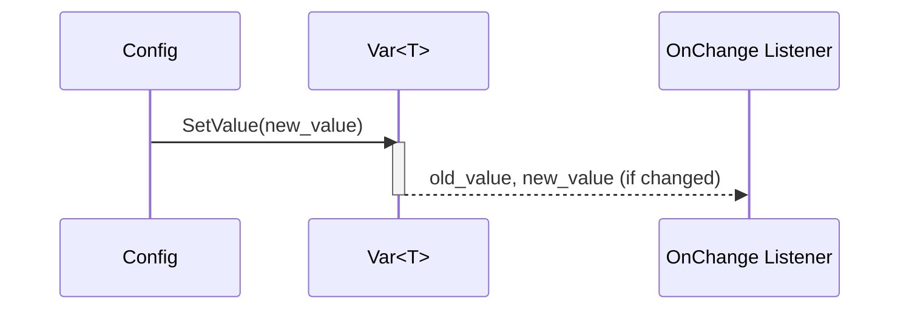
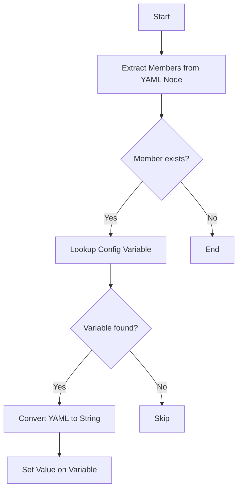

# 設計仕様書

## 概要
この設計仕様書は、C++ソースコードを解析し、別のLLMが再実装できるように詳細な設計情報を提供するものです。対象となるソースコードは`include/config.h`と`src/config/config.cpp`の2つのファイルで構成されています。

## 完全再構築台帳

### include/config.h
```cpp
#pragma once

#include "util.h"

#include <algorithm>
#include <initializer_list>
#include <iostream>
#include <list>
#include <map>
#include <memory>
#include <mutex>
#include <set>
#include <shared_mutex>
#include <sstream>
#include <stdexcept>
#include <string>
#include <string_view>
#include <syncstream>
#include <typeinfo>
#include <unordered_map>
#include <unordered_set>
#include <vector>

namespace ws {

namespace cfg {

template <typename From, typename To>
class VarConverter {
public:
    To operator()(const From& val) const noexcept {
        return static_cast<To>(val);
    }
};

template <typename From>
class VarConverter<From, std::string> {
public:
    std::string operator()(const From& val) const noexcept {
        using std::to_string;
        return to_string(val);
    }
};

template <>
class VarConverter<std::string, std::string> {
public:
    std::string operator()(const std::string_view val) const noexcept {
        return val.data();
    }
};

template <typename To>
class VarConverter<std::string, To> {
public:
    To operator()(const std::string_view str) const {
        To val {};
        std::istringstream ss {str.data()};
        ss >> val;
        if (ss.fail()) {
            throw std::invalid_argument {
                fmt::format("Invalid value: '{}'", str)};
        } else {
            return val;
        }
    }
};

template <typename T>
class VarConverter<std::string, std::list<T>> {
public:
    std::list<T> operator()(const std::string_view str) const {
        const auto node {LoadYamlString(str)};
        if (!node.IsSequence()) {
            throw std::invalid_argument {
                fmt::format("Mismatched type: '{}'", str)};
        }

        std::list<T> vals;
        std::ranges::for_each(node, [&vals](const YAML::Node& child) {
            std::ostringstream ss;
            ss << child;
            vals.emplace_back(VarConverter<std::string, T> {}(ss.str()));
        });

        return vals;
    }
};

template <typename T>
class VarConverter<std::list<T>, std::string> {
public:
    std::string operator()(const std::list<T>& vals) const noexcept {
        YAML::Node node;
        std::ranges::for_each(vals, [&node](const T& val) {
            node.push_back(
                LoadYamlString(VarConverter<T, std::string> {}(val)));
        });

        std::ostringstream ss;
        ss << node;
        return ss.str();
    }
};

template <typename T>
class VarConverter<std::string, std::vector<T>> {
public:
    std::vector<T> operator()(const std::string_view str) const {
        std::vector<T> vals;
        std::ranges::move(VarConverter<std::string, std::list<T>> {}(str),
                          std::back_inserter(vals));
        return vals;
    }
};

template <typename T>
class VarConverter<std::vector<T>, std::string> {
public:
    std::string operator()(const std::vector<T>& vals) const noexcept {
        return VarConverter<std::list<T>, std::string> {}(
            {vals.cbegin(), vals.cend()});
    }
};

template <typename T>
class VarConverter<std::string, std::set<T>> {
public:
    std::set<T> operator()(const std::string_view str) const {
        std::set<T> vals;
        std::ranges::move(VarConverter<std::string, std::list<T>> {}(str),
                          std::inserter(vals, vals.end()));
        return vals;
    }
};

template <typename T>
class VarConverter<std::set<T>, std::string> {
public:
    std::string operator()(const std::set<T>& vals) const noexcept {
        return VarConverter<std::list<T>, std::string> {}(
            {vals.cbegin(), vals.cend()});
    }
};

template <typename T>
class VarConverter<std::string, std::unordered_set<T>> {
public:
    std::unordered_set<T> operator()(const std::string_view str) const {
        std::unordered_set<T> vals;
        std::ranges::move(VarConverter<std::string, std::list<T>> {}(str),
                          std::inserter(vals, vals.end()));
        return vals;
    }
};

template <typename T>
class VarConverter<std::unordered_set<T>, std::string> {
public:
    std::string operator()(const std::unordered_set<T>& vals) const noexcept {
        return VarConverter<std::list<T>, std::string> {}(
            {vals.cbegin(), vals.cend()});
    }
};

template <typename T>
class VarConverter<std::string, std::map<std::string, T>> {
public:
    std::map<std::string, T> operator()(const std::string_view str) const {
        const auto node {LoadYamlString(str)};
        if (!node.IsMap()) {
            throw std::invalid_argument {
                fmt::format("Mismatched type: '{}'", str)};
        }

        std::map<std::string, T> vals;
        std::ranges::for_each(
            node, [&vals](const std::pair<YAML::Node, YAML::Node>& child) {
                std::ostringstream key;
                key << child.first;
                std::ostringstream val;
                val << child.second;
                vals.emplace(key.str(),
                             VarConverter<std::string, T> {}(val.str()));
            });

        return vals;
    }
};

template <typename T>
class VarConverter<std::map<std::string, T>, std::string> {
public:
    std::string operator()(
        const std::map<std::string, T>& vals) const noexcept {
        YAML::Node node;
        std::ranges::for_each(
            vals, [&node](const std::pair<std::string, T>& val) {
                node[val.first] =
                    LoadYamlString(VarConverter<T, std::string> {}(val.second));
            });

        std::ostringstream ss;
        ss << node;
        return ss.str();
    }
};

template <typename T>
class VarConverter<std::string, std::unordered_map<std::string, T>> {
public:
    std::unordered_map<std::string, T> operator()(
        const std::string_view str) const {
        std::unordered_map<std::string, T> vals;
        std::ranges::move(
            VarConverter<std::string, std::map<std::string, T>> {}(str),
            std::inserter(vals, vals.end()));
        return vals;
    }
};

template <typename T>
class VarConverter<std::unordered_map<std::string, T>, std::string> {
public:
    std::string operator()(
        const std::unordered_map<std::string, T>& vals) const noexcept {
        return VarConverter<std::map<std::string, T>, std::string> {}(
            {vals.cbegin(), vals.cend()});
    }
};

class VarBase {
public:
    using Ptr = std::shared_ptr<VarBase>;

    explicit VarBase(std::string_view name,
                     std::string_view description = "") noexcept;

    virtual ~VarBase() noexcept = default;

    std::string_view Name() const noexcept;

    std::string_view Description() const noexcept;

    virtual std::string ToString() const noexcept = 0;

    virtual void FromString(std::string_view str) = 0;

protected:
    std::string name_;
    std::string description_;
};

template <typename T, typename FromStr = VarConverter<std::string, T>,
          typename ToStr = VarConverter<T, std::string>>
requires std::is_invocable_r_v<T, FromStr, std::string> && std::
    is_nothrow_invocable_r_v<std::string, ToStr, T>
class Var : public VarBase {
public:
    using Ptr = std::shared_ptr<Var>;

    using OnChange = std::function<void(const T& old_val, const T& new_val)>;

    explicit Var(const std::string_view name, const T& default_val,
                 const std::string_view description = "") noexcept :
        VarBase {name, description}, val_ {default_val} {}

    Var(const Var&) = delete;

    Var(Var&&) = delete;

    Var& operator=(const Var&) = delete;

    Var& operator=(Var&&) = delete;

    std::string ToString() const noexcept override {
        return ToStr {}(GetValue());
    }

    void FromString(const std::string_view str) override {
        SetValue(FromStr {}(str));
    }

    T GetValue() const noexcept {
        const std::shared_lock locker {mtx_};
        return val_;
    }

    void SetValue(const T& val) noexcept {
        {
            const std::shared_lock locker {mtx_};
            if (val != val_) {
                std::ranges::for_each(
                    listeners_, [&val, this](const auto& listener) noexcept {
                        try {
                            listener.second(val_, val);
                        } catch (const std::exception& err) {
                            std::osyncstream {std::cerr} << err.what()
                                                         << std::endl;
                        }
                    });
            }
        }

        const std::unique_lock locker {mtx_};
        val_ = val;
    }

    std::string_view TypeName() const noexcept {
        return typeid(T).name();
    }

    void RemoveListener(const std::uint64_t key) noexcept {
        const std::unique_lock locker {mtx_};
        listeners_.erase(key);
    }

    std::uint64_t AddListener(OnChange listener) noexcept {
        const std::unique_lock locker {mtx_};
        static std::uint64_t key {0};
        listeners_[key] = std::move(listener);
        return key++;
    }

    void ClearListeners() noexcept {
        const std::unique_lock locker {mtx_};
        listeners_.clear();
    }

private:
    mutable std::shared_mutex mtx_;

    T val_;
    std::unordered_map<std::uint64_t, OnChange> listeners_;
};

class Config {
public:
    using Ptr = std::shared_ptr<Config>;

    explicit Config(std::string_view name) noexcept;

    Config(const Config&) = delete;

    Config(Config&&) = delete;

    Config& operator=(const Config&) = delete;

    Config& operator=(Config&&) = delete;

    std::string_view Name() const noexcept;

    template <typename T>
    typename Var<T>::Ptr Lookup(const std::string_view name,
                                const T& default_val,
                                const std::string_view description = "") {
        if (const auto var {Lookup<T>(name)}; !var) {
            const auto new_var {
                std::make_shared<Var<T>>(name, default_val, description)};
            const std::unique_lock locker {mtx_};
            vars_.emplace(name, new_var);
            return new_var;
        } else {
            return var;
        }
    }

    template <typename T>
    typename Var<T>::Ptr Lookup(const std::string_view name) const {
        if (const auto base {LookupBase(name)}; base) {
            if (const auto var {std::dynamic_pointer_cast<Var<T>>(base)}; var) {
                return var;
            } else {
                throw std::invalid_argument {
                    fmt::format("Mismatched type: '{}'", name)};
            }
        } else {
            return nullptr;
        }
    }

    VarBase::Ptr LookupBase(std::string_view name) const noexcept;

    void LoadYaml(const YAML::Node& root);

    void Visit(std::function<void(VarBase::Ptr)> visitor) const noexcept;

private:
    using VarMap = std::unordered_map<std::string, VarBase::Ptr>;

    mutable std::shared_mutex mtx_;
    std::string name_;
    VarMap vars_;
};

Config::Ptr RootConfig() noexcept;

}
}
```

### src/config/config.cpp
```cpp
#include "config.h"

namespace ws {

namespace cfg {

namespace {

std::list<std::pair<std::string, YAML::Node>> ExtractMembers(
    const YAML::Node& node, const std::string& prefix = "") {
    std::list<std::pair<std::string, YAML::Node>> members;
    members.emplace_back(prefix, node);
    if (node.IsMap()) {
        for (auto it {node.begin()}; it != node.end(); ++it) {
            std::ostringstream ss;
            ss << it->first;
            const auto key {ss.str()};
            auto sub_members {ExtractMembers(
                it->second, prefix.empty() ? key : prefix + "." + key)};
            members.merge(
                sub_members,
                [](const std::pair<std::string, YAML::Node>& lhs,
                   const std::pair<std::string, YAML::Node>& rhs) noexcept {
                    return lhs.first < rhs.first;
                });
        }
    }

    return members;
}

}

VarBase::VarBase(const std::string_view name,
                 const std::string_view description) noexcept :
    name_ {name}, description_ {description} {}

std::string_view VarBase::Name() const noexcept {
    return name_;
}

std::string_view VarBase::Description() const noexcept {
    return description_;
}

Config::Config(const std::string_view name) noexcept : name_ {name} {}

std::string_view Config::Name() const noexcept {
    return name_;
}

VarBase::Ptr Config::LookupBase(const std::string_view name) const noexcept {
    const std::shared_lock locker {mtx_};
    if (const auto var {vars_.find(name.data())}; var != vars_.cend()) {
        return var->second;
    } else {
        return nullptr;
    }
}

void Config::LoadYaml(const YAML::Node& root) {
    for (const auto& node : ExtractMembers(root)) {
        const auto key {node.first};
        if (!key.empty()) {
            if (const auto var {LookupBase(key)}; var) {
                std::ostringstream ss;
                ss << node.second;
                var->FromString(ss.str());
            }
        }
    }
}

void Config::Visit(
    const std::function<void(VarBase::Ptr)> visitor) const noexcept {
    const std::shared_lock locker {mtx_};
    std::ranges::for_each(vars_, [&visitor](const auto& var) noexcept {
        try {
            visitor(var.second);
        } catch (const std::exception& err) {
            std::osyncstream {std::cerr} << err.what() << std::endl;
        }
    });
}

Config::Ptr RootConfig() noexcept {
    static const auto ins {std::make_shared<Config>("root")};
    return ins;
}

}
}
```

## クラス図

```mermaid
classDiagram
    class VarConverter {
        <<template>>
        +operator()(const From& val) const noexcept
    }

    class VarBase {
        <<abstract>>
        +Ptr: shared_ptr<VarBase>
        +name_: string
        +description_: string
        +Name() const noexcept
        +Description() const noexcept
        +ToString() const noexcept = 0
        +FromString(std::string_view str) = 0
    }

    class Var {
        <<template>>
        +Ptr: shared_ptr<Var>
        +OnChange: function<void(const T& old_val, const T& new_val)>
        +val_: T
        +listeners_: unordered_map<uint64_t, OnChange>
        +mtx_: shared_mutex
        +GetValue() const noexcept
        +SetValue(const T& val) noexcept
        +TypeName() const noexcept
        +AddListener(OnChange listener) noexcept
        +RemoveListener(uint64_t key) noexcept
        +ClearListeners() noexcept
    }

    class Config {
        +Ptr: shared_ptr<Config>
        +name_: string
        +vars_: unordered_map<string, VarBase::Ptr>
        +mtx_: shared_mutex
        +Name() const noexcept
        +Lookup<T>(string_view name) const
        +Lookup<T>(string_view name, T default_val, string_view description = "") const
        +LookupBase(string_view name) const noexcept
        +LoadYaml(YAML::Node root)
        +Visit(function<void(VarBase::Ptr)> visitor) const noexcept
    }

    VarConverter <|-- VarConverter<From, std::string>
    VarConverter <|-- VarConverter<std::string, To>
    VarConverter <|-- VarConverter<std::string, std::list<T>>
    VarConverter <|-- VarConverter<std::list<T>, std::string>
    VarConverter <|-- VarConverter<std::string, std::vector<T>>
    VarConverter <|-- VarConverter<std::vector<T>, std::string>
    VarConverter <|-- VarConverter<std::string, std::set<T>>
    VarConverter <|-- VarConverter<std::set<T>, std::string>
    VarConverter <|-- VarConverter<std::string, std::unordered_set<T>>
    VarConverter <|-- VarConverter<std::unordered_set<T>, std::string>
    VarConverter <|-- VarConverter<std::string, std::map<string, T>>
    VarConverter <|-- VarConverter<std::map<string, T>, std::string>
    VarConverter <|-- VarConverter<std::string, std::unordered_map<string, T>>
    VarConverter <|-- VarConverter<std::unordered_map<string, T>, std::string>

    VarBase <|-- Var

    Config --> "1..*" VarBase
```

## クラス・メソッド・インターフェース詳細

### VarConverter
- **Template Parameters**: `From`, `To`
- **Methods**:
  - `operator()(const From& val) const noexcept` → `To`

### VarBase (Abstract Class)
- **Public Members**:
  - `using Ptr = std::shared_ptr<VarBase>`
  - `std::string name_`
  - `std::string description_`
- **Methods**:
  - `explicit VarBase(std::string_view name, std::string_view description = "") noexcept`
  - `virtual ~VarBase() noexcept = default`
  - `std::string_view Name() const noexcept`
  - `std::string_view Description() const noexcept`
  - `virtual std::string ToString() const noexcept = 0`
  - `virtual void FromString(std::string_view str) = 0`

### Var (Template Class)
- **Template Parameters**: `T`, `FromStr = VarConverter<std::string, T>`, `ToStr = VarConverter<T, std::string>`
- **Constraints**:
  - `std::is_invocable_r_v<T, FromStr, std::string>`
  - `std::is_nothrow_invocable_r_v<std::string, ToStr, T>`
- **Public Members**:
  - `using Ptr = std::shared_ptr<Var>`
  - `using OnChange = std::function<void(const T& old_val, const T& new_val)>`
  - `T val_`
  - `std::unordered_map<std::uint64_t, OnChange> listeners_`
  - `mutable std::shared_mutex mtx_`
- **Methods**:
  - `explicit Var(std::string_view name, const T& default_val, std::string_view description = "") noexcept`
  - `Var(const Var&) = delete`
  - `Var(Var&&) = delete`
  - `Var& operator=(const Var&) = delete`
  - `Var& operator=(Var&&) = delete`
  - `std::string ToString() const noexcept override`
  - `void FromString(std::string_view str) override`
  - `T GetValue() const noexcept`
  - `void SetValue(const T& val) noexcept`
  - `std::string_view TypeName() const noexcept`
  - `void RemoveListener(std::uint64_t key) noexcept`
  - `std::uint64_t AddListener(OnChange listener) noexcept`
  - `void ClearListeners() noexcept`

### Config
- **Public Members**:
  - `using Ptr = std::shared_ptr<Config>`
  - `std::string name_`
  - `VarMap vars_` (alias for `std::unordered_map<std::string, VarBase::Ptr>`)
  - `mutable std::shared_mutex mtx_`
- **Methods**:
  - `explicit Config(std::string_view name) noexcept`
  - `Config(const Config&) = delete`
  - `Config(Config&&) = delete`
  - `Config& operator=(const Config&) = delete`
  - `Config& operator=(Config&&) = delete`
  - `std::string_view Name() const noexcept`
  - `template <typename T> typename Var<T>::Ptr Lookup(std::string_view name, const T& default_val, std::string_view description = "")`
  - `template <typename T> typename Var<T>::Ptr Lookup(std::string_view name) const`
  - `VarBase::Ptr LookupBase(std::string_view name) const noexcept`
  - `void LoadYaml(const YAML::Node& root)`
  - `void Visit(std::function<void(VarBase::Ptr)> visitor) const noexcept`

### Global Functions
- `Config::Ptr RootConfig() noexcept`

## シーケンス図



## メソッド仕様書

### Var::SetValue(const T& val) noexcept
- **目的**: 変数の値を設定し、変更リスナーを呼び出す。
- **引数**:
  - `val`: 新しい値
- **戻り値**: なし
- **動作**:
  1. 現在の値と新しい値が異なる場合、すべてのリスナーに古い値と新しい値を通知する。
  2. 変数の値を更新する。
- **副作用**: 変数の値が変更される。リスナー関数が呼び出される。

### Config::LoadYaml(const YAML::Node& root)
- **目的**: YAMLノードから設定値を読み込む。
- **引数**:
  - `root`: YAMLノード
- **戻り値**: なし
- **動作**:
  1. YAMLノードのメンバーを抽出する。
  2. 各メンバーに対して、対応する設定変数を検索し、値を設定する。
- **副作用**: 設定変数の値が変更される。

## 処理フロー図



## 状態遷移・副作用

### Var::SetValue
- **更新前状態**: 現在の値 `val_`
- **遷移条件**: 新しい値 `val` が現在の値と異なる場合
- **変更対象**: `val_`, リスナー関数
- **更新後状態**: 新しい値 `val`

### Config::LoadYaml
- **更新前状態**: 設定変数の初期値
- **遷移条件**: YAMLノードに対応するメンバーが存在する場合
- **変更対象**: 設定変数の値
- **更新後状態**: YAMLから読み込んだ値

## データ変換・制約

### VarConverter
- **入力**: `From` 型の値または文字列
- **出力**: `To` 型の値または文字列
- **制約**:
  - 文字列から数値への変換では、失敗した場合は例外を投げる。
  - YAMLノードからリストやマップへの変換では、型が一致しない場合は例外を投げる。

### Config::LoadYaml
- **入力**: YAMLノード
- **出力**: なし（設定変数の値が更新される）
- **制約**:
  - YAMLノードのメンバー名と設定変数名が一致する必要がある。
  - 型が一致しない場合は例外を投げる。

## 追加詳細設計情報

### 直接依存インターフェースと利用方法
- **YAML::Node**: `LoadYamlString` 関数を使用して文字列からYAMLノードを作成する。
- **std::istringstream**: 文字列から数値への変換に使用する。
- **std::ostringstream**: 数値やオブジェクトを文字列に変換するために使用する。
- **fmt::format**: エラーメッセージのフォーマットに使用する。

### 使用データ・更新データ
- **Var**:
  - `val_`: 設定値を保持する。
  - `listeners_`: 変更リスナーを保持する。
- **Config**:
  - `vars_`: 設定変数を保持する。

### 状態・副作用・不変条件
- **Var::SetValue**:
  - `mtx_` を使用してスレッドセーフに値を更新する。
  - リスナー関数が呼び出される場合、例外が発生しても処理は続行される。
- **Config::LoadYaml**:
  - `mtx_` を使用してスレッドセーフに設定変数を更新する。

### データ変換・制約
- **VarConverter**:
  - 文字列から数値への変換では、失敗した場合は例外を投げる。
  - YAMLノードからリストやマップへの変換では、型が一致しない場合は例外を投げる。

## 結論
この設計仕様書は、与えられたC++ソースコードを解析し、別のLLMが再実装できるように詳細な設計情報を提供しています。クラス図、メソッド仕様書、処理フロー図などを用いて、再実装に必要な情報を網羅的に記述しています。