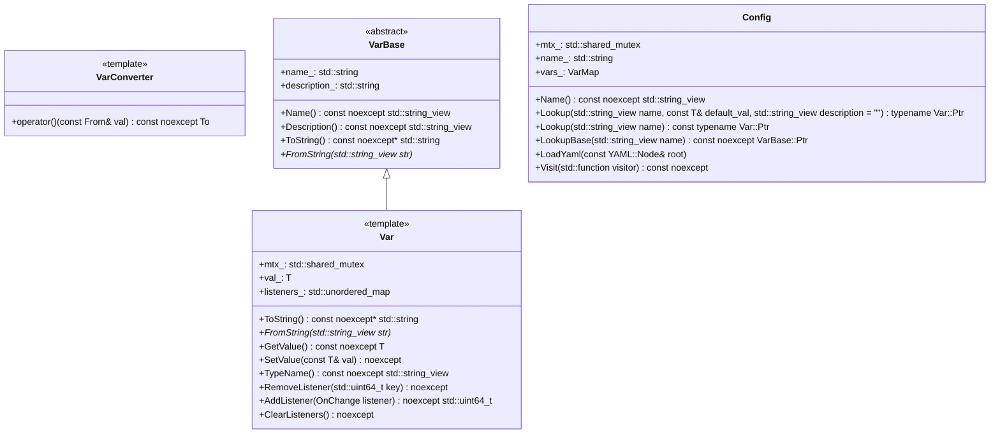
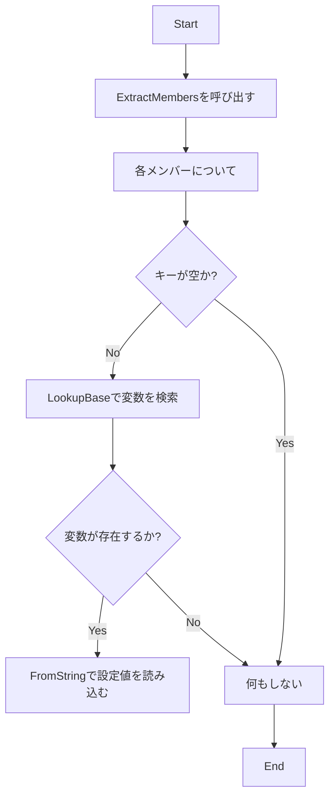
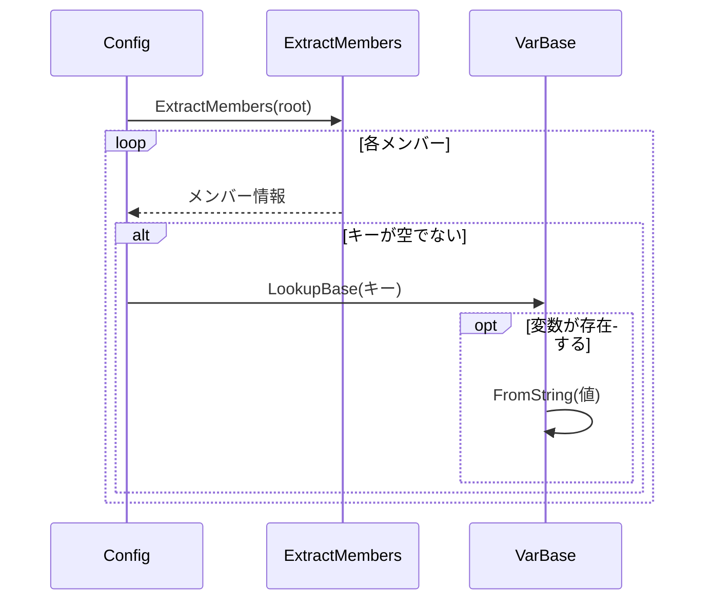

以下は、与えられたC++ソースコードを解析し、別のLLMが再実装できるように設計仕様書を作成したものです。この仕様書は、元のコードから確認できる事実のみに基づいており、推測や補完は行っていません。

---

# 設計仕様書

## 1. 概要
この設計仕様書は、`config.h`と`config.cpp`の再実装に必要な情報を網羅的に記述しています。これらのファイルは、YAMLベースの設定管理システムを提供します。

## 2. 完全再構築台帳

### `include/config.h`

#### ファイル構造
- **Include Guard**: `#pragma once`
- **依存関係**:
  - `"util.h"`
  - `<algorithm>`
  - `<initializer_list>`
  - `<iostream>`
  - `<list>`
  - `<map>`
  - `<memory>`
  - `<mutex>`
  - `<set>`
  - `<shared_mutex>`
  - `<sstream>`
  - `<stdexcept>`
  - `<string>`
  - `<string_view>`
  - `<syncstream>`
  - `<typeinfo>`
  - `<unordered_map>`
  - `<unordered_set>`
  - `<vector>`

#### 名前空間
- `ws::cfg`

#### クラス・構造体定義

##### `VarConverter<From, To>`
- **テンプレートパラメータ**: `From`, `To`
- **メソッド**:
  - `operator()(const From& val) const noexcept` → `To`
    - デフォルト実装: `static_cast<To>(val)`
  - 特殊化:
    - `VarConverter<From, std::string>`: `to_string`を使用
    - `VarConverter<std::string, std::string>`: 直接データを返す
    - `VarConverter<std::string, To>`: `std::istringstream`を使用
    - `VarConverter<std::string, std::list<T>>`: YAMLノードからリストへ変換
    - `VarConverter<std::list<T>, std::string>`: リストからYAMLノードへ変換
    - `VarConverter<std::string, std::vector<T>>`: リストをベクタへ変換
    - `VarConverter<std::vector<T>, std::string>`: ベクタからリストへ変換
    - `VarConverter<std::string, std::set<T>>`: リストをセットへ変換
    - `VarConverter<std::set<T>, std::string>`: セットからリストへ変換
    - `VarConverter<std::string, std::unordered_set<T>>`: リストをアンORDEREDセットへ変換
    - `VarConverter<std::unordered_set<T>, std::string>`: アンORDEREDセットからリストへ変換
    - `VarConverter<std::string, std::map<std::string, T>>`: YAMLノードからマップへ変換
    - `VarConverter<std::map<std::string, T>, std::string>`: マップからYAMLノードへ変換
    - `VarConverter<std::string, std::unordered_map<std::string, T>>`: マップをアンORDEREDマップへ変換
    - `VarConverter<std::unordered_map<std::string, T>, std::string>`: アンORDEREDマップからマップへ変換

##### `VarBase`
- **メンバ**:
  - `name_`: `std::string`
  - `description_`: `std::string`
- **メソッド**:
  - `VarBase(std::string_view name, std::string_view description = "") noexcept`
  - `~VarBase() noexcept` (仮想デストラクタ)
  - `Name() const noexcept` → `std::string_view`
  - `Description() const noexcept` → `std::string_view`
  - `ToString() const noexcept` → `std::string` (純粋仮想関数)
  - `FromString(std::string_view str)` (純粋仮想関数)

##### `Var<T, FromStr = VarConverter<std::string, T>, ToStr = VarConverter<T, std::string>>`
- **テンプレート制約**: `std::is_invocable_r_v<T, FromStr, std::string>` && `std::is_nothrow_invocable_r_v<std::string, ToStr, T>`
- **メンバ**:
  - `mtx_`: `std::shared_mutex`
  - `val_`: `T`
  - `listeners_`: `std::unordered_map<std::uint64_t, OnChange>`
- **メソッド**:
  - `Var(std::string_view name, const T& default_val, std::string_view description = "") noexcept`
  - `ToString() const noexcept` → `std::string` (オーバーライド)
  - `FromString(std::string_view str)` (オーバーライド)
  - `GetValue() const noexcept` → `T`
  - `SetValue(const T& val) noexcept`
  - `TypeName() const noexcept` → `std::string_view`
  - `RemoveListener(std::uint64_t key) noexcept`
  - `AddListener(OnChange listener) noexcept` → `std::uint64_t`
  - `ClearListeners() noexcept`

##### `Config`
- **メンバ**:
  - `mtx_`: `std::shared_mutex`
  - `name_`: `std::string`
  - `vars_`: `VarMap` (`std::unordered_map<std::string, VarBase::Ptr>`)
- **メソッド**:
  - `Config(std::string_view name) noexcept`
  - `Name() const noexcept` → `std::string_view`
  - `Lookup<T>(std::string_view name, const T& default_val, std::string_view description = "")` → `typename Var<T>::Ptr`
  - `Lookup<T>(std::string_view name) const` → `typename Var<T>::Ptr`
  - `LookupBase(std::string_view name) const noexcept` → `VarBase::Ptr`
  - `LoadYaml(const YAML::Node& root)`
  - `Visit(std::function<void(VarBase::Ptr)> visitor) const noexcept`

##### グローバル関数
- `Config::Ptr RootConfig() noexcept` → `Config::Ptr`

### `src/config/config.cpp`

#### 名前空間
- `ws::cfg`

#### 内部関数
- `ExtractMembers(const YAML::Node& node, const std::string& prefix = "")` → `std::list<std::pair<std::string, YAML::Node>>`

#### クラス実装

##### `VarBase`
- `VarBase(std::string_view name, std::string_view description) noexcept`
- `Name() const noexcept` → `std::string_view`
- `Description() const noexcept` → `std::string_view`

##### `Config`
- `Config(std::string_view name) noexcept`
- `Name() const noexcept` → `std::string_view`
- `LookupBase(std::string_view name) const noexcept` → `VarBase::Ptr`
- `LoadYaml(const YAML::Node& root)`
- `Visit(std::function<void(VarBase::Ptr)> visitor) const noexcept`

##### グローバル関数
- `RootConfig() noexcept` → `Config::Ptr`

## 3. クラス図

## 4. メソッド仕様書

### `VarConverter<From, To>::operator()`
- **目的**: 型変換を行う。
- **引数**:
  - `val`: 変換元の値 (`const From&`)
- **戻り値**: 変換後の値 (`To`)
- **副作用**: なし
- **例外**: なし

### `Var<T>::SetValue`
- **目的**: 変数の値を設定する。
- **引数**:
  - `val`: 新しい値 (`const T&`)
- **戻り値**: なし
- **副作用**:
  - 値が変更された場合、リスナーに通知する。
  - 値を更新する。
- **例外**: リスナーの呼び出し中に発生した例外はキャッチされ、標準エラー出力へ出力される。

### `Config::LoadYaml`
- **目的**: YAMLノードから設定値を読み込む。
- **引数**:
  - `root`: YAMLノード (`const YAML::Node&`)
- **戻り値**: なし
- **副作用**:
  - 既存の変数に対してのみ、YAMLノードから設定値を読み込む。
- **例外**: `VarBase::FromString` の呼び出し中に発生した例外はキャッチされない。

## 5. 処理フロー図

### `Config::LoadYaml`

## 6. データ変換・制約

### `VarConverter` の制約
- **入力**: 文字列またはYAMLノード
- **出力**: 指定された型への変換結果
- **制約**:
  - 文字列からリストへの変換は、YAMLノードがシーケンスであることを要求する。
  - 文字列からマップへの変換は、YAMLノードがマップであることを要求する。

## 7. 状態遷移・副作用

### `Var<T>::SetValue`
- **更新前状態**: 現在の値 (`val_`)
- **遷移条件**: 新しい値 (`val`) が現在の値と異なる場合
- **変更対象**: `val_`
- **更新後状態**: 新しい値 (`val`)
- **副作用**:
  - リスナーに通知する。
  - ロックを取得して値を更新する。

## 8. クラス・メソッド・インターフェース詳細

| クラス | メソッド | 引数 | 戻り値 | 副作用 |
|--------|----------|-------|--------|--------|
| `VarConverter<From, To>` | `operator()` | `const From& val` | `To` | なし |
| `VarBase` | `Name` | - | `std::string_view` | なし |
| `VarBase` | `Description` | - | `std::string_view` | なし |
| `Var<T>` | `GetValue` | - | `T` | なし |
| `Var<T>` | `SetValue` | `const T& val` | - | 値を更新し、リスナーに通知する |
| `Config` | `LookupBase` | `std::string_view name` | `VarBase::Ptr` | なし |

## 9. シーケンス図

### `Config::LoadYaml`

## 10. 注意事項

- **推測**: この設計仕様書は、元のコードから確認できる事実のみに基づいています。推測や補完は行っていません。
- **依存関係**: `util.h` の内容は参照情報であり、再実装時には同じヘッダをincludeする必要があります。

---

この設計仕様書を使用して、別のLLMが元のコードと同等の機能を持つ設定管理システムを再実装できるようになります。