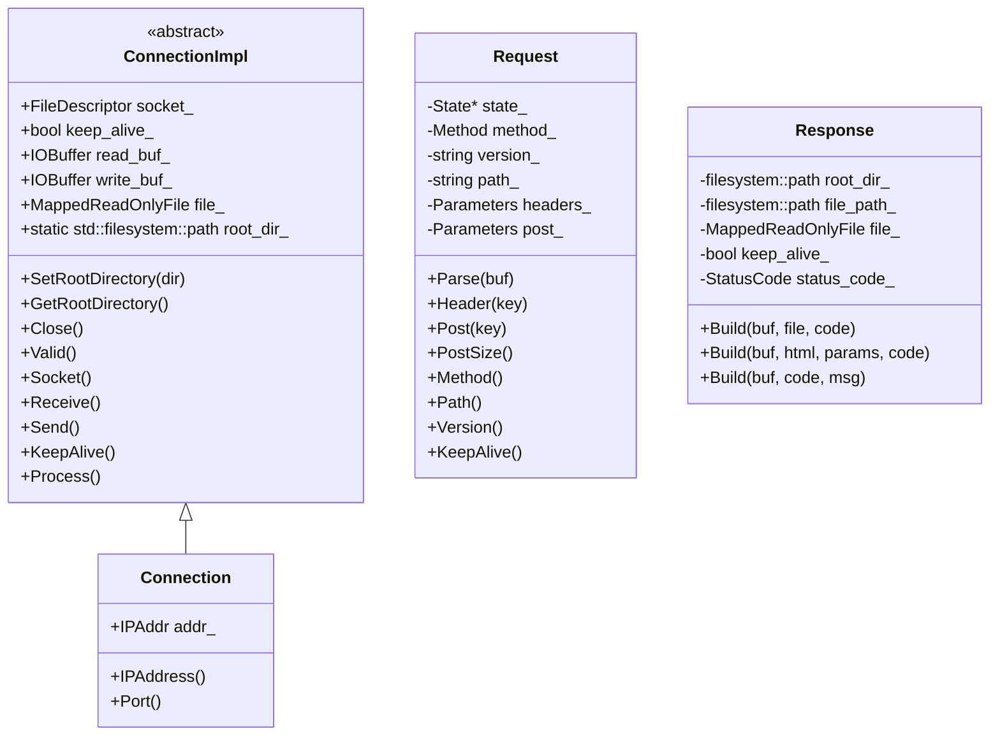
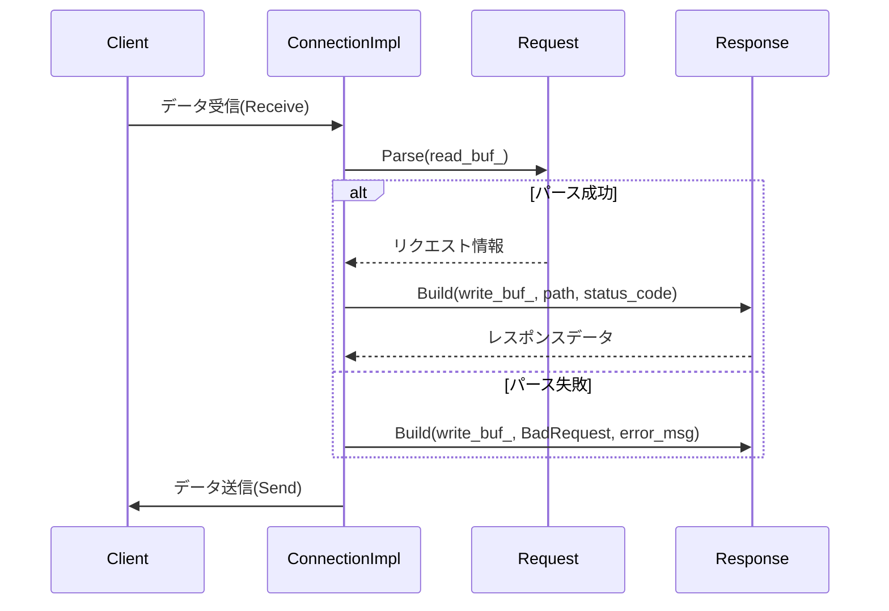
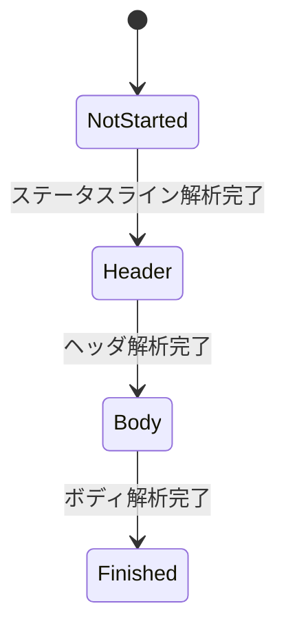

# HTTPプロトコル処理モジュールの設計仕様書

## 1. 概要

この設計仕様書は、HTTPリクエスト/レスポンス処理を担当するC++モジュールの詳細な仕様を記述します。本モジュールは、HTTPプロトコルのパース、応答生成、ファイルマッピングなどの機能を提供します。

## 2. アーキテクチャ概要

### 2.1 モジュール構造

```
ws::http
├── http.h (F01/U01)
│   ├── StatusCode, Method列挙型定義
│   ├── HTTP関連ユーティリティ関数
│   └── ConnectionImpl/Connectionクラス定義
├── request.h (F03/U03)
│   └── Requestクラス定義（状態パターン実装）
├── request.cpp (F04/U04)
│   └── Requestの状態クラス実装
├── response.h (F05/U05)
│   └── Responseクラス定義
└── response.cpp (F06/U06)
    └── Responseの実装
```

### 2.2 主要クラス関係



## 3. 型定義と列挙型

### 3.1 HTTPバージョン

```cpp
inline constexpr std::string_view version {"1.1"};
```

### 3.2 ステータスコード

```table
| 名前 | 値 | 説明 |
|------|----|------|
| OK | 200 | 成功 |
| BadRequest | 400 | 不正なリクエスト |
| Forbidden | 403 | アクセス禁止 |
| NotFound | 404 | リソースが見つからない |
```

### 3.3 HTTPメソッド

```table
| 名前 | 値 | 説明 |
|------|----|------|
| Get | 0 | GETリクエスト |
| Post | 1 | POSTリクエスト |
| Put | 2 | PUTリクエスト |
| Patch | 3 | PATCHリクエスト |
| Delete | 4 | DELETEリクエスト |
```

### 3.4 パラメータ型

```cpp
using Parameters = std::unordered_map<std::string, std::string>;
```

## 4. 主要クラスのインターフェース仕様

### 4.1 ConnectionImpl

| メソッド | シグネチャ | 説明 |
|----------|------------|------|
| SetRootDirectory | static void(std::filesystem::path dir) | ルートディレクトリ設定 |
| GetRootDirectory | static std::filesystem::path() | ルートディレクトリ取得 |
| Close | void() | ソケットクローズ |
| Valid | bool() const | 有効な接続か判定 |
| Socket | FileDescriptor() const | ソケットデスクリプタ取得 |
| Receive | std::size_t() | データ受信 |
| Send | std::size_t() | データ送信 |
| KeepAlive | bool() const | キープアライブ状態取得 |
| Process | bool() | リクエスト処理 |

### 4.2 Request

| メソッド | シグネチャ | 説明 |
|----------|------------|------|
| Parse | void(Buffer& buf) | リクエストパース |
| Header | std::optional<std::string_view>(std::string_view key) const | ヘッダ取得 |
| Post | std::optional<std::string_view>(std::string_view key) const | POSTパラメータ取得 |
| PostSize | std::size_t() const | POSTパラメータ数取得 |
| Method | http::Method() const | HTTPメソッド取得 |
| Path | std::string_view() const | パス取得 |
| Version | std::string_view() const | バージョン取得 |
| KeepAlive | bool() const | キープアライブ判定 |

### 4.3 Response

| メソッド | シグネチャ | 説明 |
|----------|------------|------|
| SetKeepAlive | Response&(bool set) | キープアライブ設定 |
| Build | std::optional<MappedReadOnlyFile>(Buffer& buf, filesystem::path file, StatusCode& code) | ファイル応答生成 |
| Build | void(Buffer& buf, filesystem::path html, const Parameters& params, StatusCode& code) | HTMLテンプレート応答生成 |
| Build | void(Buffer& buf, StatusCode code, std::string msg = "") | エラーレスポンス生成 |

## 5. 処理フロー

### 5.1 リクエスト処理フロー



### 5.2 リクエストパース状態遷移



## 6. データ変換と制約

### 6.1 URLデコード

- `%`で始まる3文字のシーケンスをASCII文字に変換
- `+`をスペースに置き換え
- `&`で区切られたキーバリューペアをパラメータマップに変換

### 6.2 コンテンツタイプ判定

```table
| 拡張子 | コンテンツタイプ |
|--------|------------------|
| .html | text/html |
| .xml | text/xml |
| .txt | text/plain |
| .png | image/png |
| .jpg/.jpeg | image/jpeg |
| .css | text/css |
| .js | text/javascript |
```

### 6.3 HTMLプレースホルダー

- `<${key}$>`形式のプレースホルダーをパラメータ値で置換
- パラメータが存在しない場合はプレースホルダーのまま

## 7. エラー処理

### 7.1 ステータスコードとメッセージ

```table
| ステータスコード | メッセージ |
|------------------|------------|
| OK (200) | "OK" |
| BadRequest (400) | "Bad Request" |
| Forbidden (403) | "Forbidden" |
| NotFound (404) | "Not Found" |
```

### 7.2 エラーレスポンス形式

```html
<html>
<title>ERROR</title>
<body>
<p>{status_code} : {status_message}</p>
<p>{error_message}</p>
</body>
</html>
```

## 8. 実装上の注意事項

1. **メモリ管理**:
   - `MappedReadOnlyFile`は明示的に`Unmap()`する必要がある
   - `ConnectionImpl`のデストラクタでソケットをクローズする

2. **スレッドセーフ**:
   - `root_dir_`へのアクセスは静的メンバー変数のため、外部から適切に同期する必要あり

3. **バッファ管理**:
   - `read_buf_`と`write_buf_`は`IOBuffer`を継承したクラスで操作される
   - バッファの読み書き位置は原子変数で管理されている

4. **エンコーディング**:
   - 文字列処理はUTF-8を前提とする
   - URLデコードはASCIIに限定される

## 9. 再実装時の注意点

1. **完全再構築台帳**:
   - すべての`enum class`、型エイリアス、`constexpr`変数を正確に保持する
   - メソッドシグネチャ（特に`noexcept`や`const`指定）を変更しない
   - 状態パターンの実装クラス（NotStarted, Header, Body, Finished）を完全に再現する

2. **依存関係**:
   - `Buffer`, `IOBuffer`, `MappedReadOnlyFile`などの外部型はヘッダからインクルードする
   - 直接利用されるユーティリティ関数（`StringToLower`, `ReplaceAllSubstring`等）を正確に再現する

3. **具体値**:
   - HTTPバージョン"1.1"、改行"\r\n"などの文字列リテラルを変更しない
   - ステータスコードやメソッドの数値値を変更しない

4. **例外処理**:
   - 期待される例外（`std::invalid_argument`, `std::system_error`）を正確にスローする
   - エラーメッセージフォーマットを変更しない

## 10. 完了チェックリスト

- [ ] すべての列挙型定義が再現されている
- [ ] すべてのクラスとそのメソッドシグネチャが正確に記録されている
- [ ] 状態パターンの実装クラスが完全に再現できる
- [ ] ユーティリティ関数（URLデコード、コンテンツタイプ判定等）が正確に再現できる
- [ ] エラーハンドリングとステータスコードが正確に記録されている
- [ ] バッファ管理とI/O処理のフローが明確に記述されている

この設計仕様書を基に、別のLLMが本モジュールを完全に再実装できるようになっています。