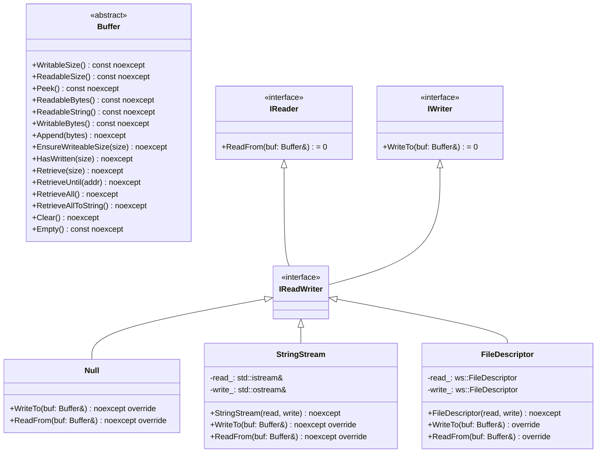
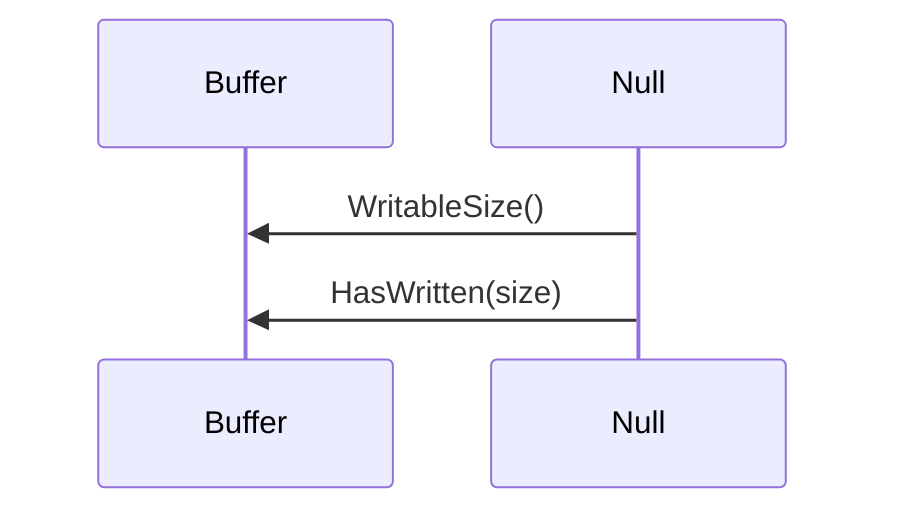
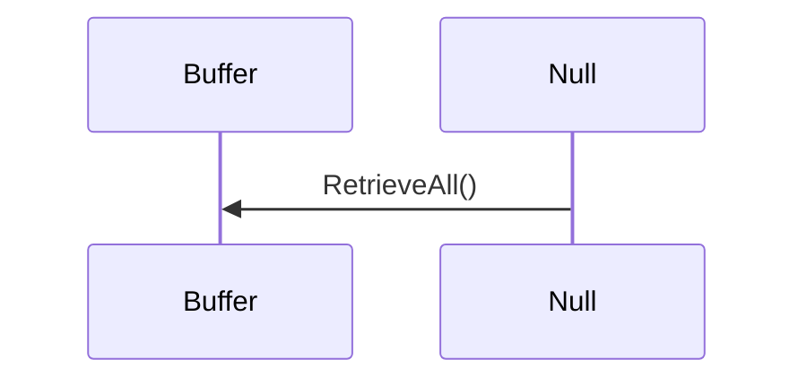
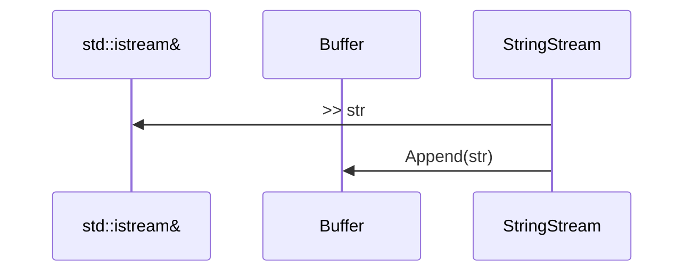
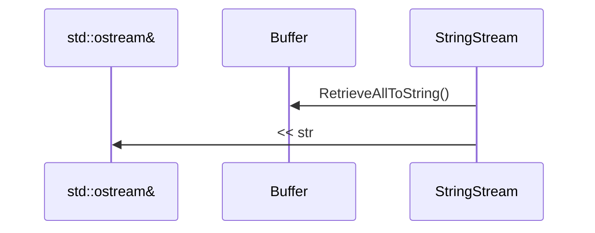

# 設計仕様書

## 1. 概要

この設計仕様書は、与えられたC++ソースコードを基に、別のLLMが再実装できるように詳細な設計情報を提供するものです。対象となるソースコードは`include/io.h`と`src/io/io.cpp`の2つのファイルで構成されています。

## 2. 完全再構築台帳

### 2.1 include/io.h

#### ファイル構造
- `#pragma once`
- `#include "util.h"`
- `#include <iostream>`
- `namespace ws {`
  - `class Buffer;`
  - `namespace io {`
    - `class IReader`
      - `virtual ~IReader() noexcept = default;`
      - `virtual std::size_t ReadFrom(Buffer& buf) = 0;`
    - `class IWriter`
      - `virtual ~IWriter() noexcept = default;`
      - `virtual std::size_t WriteTo(Buffer& buf) = 0;`
    - `class IReadWriter : public virtual IReader, public virtual IWriter {}`
    - `class Null : public virtual IReadWriter`
      - `std::size_t WriteTo(Buffer& buf) noexcept override;`
      - `std::size_t ReadFrom(Buffer& buf) noexcept override;`
    - `class StringStream : public virtual IReadWriter`
      - `explicit StringStream(std::istream& read, std::ostream& write) noexcept;`
      - `StringStream(const StringStream&) = delete;`
      - `StringStream(StringStream&&) = delete;`
      - `StringStream& operator=(const StringStream&) = delete;`
      - `StringStream& operator=(StringStream&&) = delete;`
      - `std::size_t WriteTo(Buffer& buf) noexcept override;`
      - `std::size_t ReadFrom(Buffer& buf) noexcept override;`
      - `private: std::istream& read_; std::ostream& write_;`
    - `class FileDescriptor : public virtual IReadWriter`
      - `explicit FileDescriptor(ws::FileDescriptor read, ws::FileDescriptor write) noexcept;`
      - `FileDescriptor(const FileDescriptor&) = delete;`
      - `FileDescriptor(FileDescriptor&&) = delete;`
      - `FileDescriptor& operator=(const FileDescriptor&) = delete;`
      - `FileDescriptor& operator=(FileDescriptor&&) = delete;`
      - `std::size_t WriteTo(Buffer& buf) override;`
      - `std::size_t ReadFrom(Buffer& buf) override;`
      - `private: ws::FileDescriptor read_; ws::FileDescriptor write_;`
  - `}`

### 2.2 src/io/io.cpp

#### ファイル構造
- `#include "io.h"`
- `#include "containers/buffer.h"`
- `#include <sys/uio.h>`
- `#include <unistd.h>`
- `#include <array>`
- `namespace ws::io {`
  - `std::size_t Null::WriteTo(Buffer& buf) noexcept { ... }`
  - `std::size_t Null::ReadFrom(Buffer& buf) noexcept { ... }`
  - `StringStream::StringStream(std::istream& read, std::ostream& write) noexcept : read_{read}, write_{write} {}`
  - `std::size_t StringStream::WriteTo(Buffer& buf) noexcept { ... }`
  - `std::size_t StringStream::ReadFrom(Buffer& buf) noexcept { ... }`
  - `FileDescriptor::FileDescriptor(const ws::FileDescriptor read, const ws::FileDescriptor write) noexcept : read_{read}, write_{write} {}`
  - `std::size_t FileDescriptor::WriteTo(Buffer& buf) { ... }`
  - `std::size_t FileDescriptor::ReadFrom(Buffer& buf) { ... }`
- `}`

## 3. クラス図



## 4. クラス・メソッド・インターフェース詳細

### 4.1 IReader
- **名前**: `ws::io::IReader`
- **型**: インターフェース
- **継承**: なし
- **メソッド**:
  - `virtual ~IReader() noexcept = default;`
  - `virtual std::size_t ReadFrom(Buffer& buf) = 0;`

### 4.2 IWriter
- **名前**: `ws::io::IWriter`
- **型**: インターフェース
- **継承**: なし
- **メソッド**:
  - `virtual ~IWriter() noexcept = default;`
  - `virtual std::size_t WriteTo(Buffer& buf) = 0;`

### 4.3 IReadWriter
- **名前**: `ws::io::IReadWriter`
- **型**: インターフェース
- **継承**: `public virtual IReader`, `public virtual IWriter`
- **メソッド**: なし

### 4.4 Null
- **名前**: `ws::io::Null`
- **型**: クラス
- **継承**: `public virtual IReadWriter`
- **メンバ**:
  - なし
- **メソッド**:
  - `std::size_t WriteTo(Buffer& buf) noexcept override;`
  - `std::size_t ReadFrom(Buffer& buf) noexcept override;`

### 4.5 StringStream
- **名前**: `ws::io::StringStream`
- **型**: クラス
- **継承**: `public virtual IReadWriter`
- **メンバ**:
  - `std::istream& read_`
  - `std::ostream& write_`
- **メソッド**:
  - `explicit StringStream(std::istream& read, std::ostream& write) noexcept;`
  - `StringStream(const StringStream&) = delete;`
  - `StringStream(StringStream&&) = delete;`
  - `StringStream& operator=(const StringStream&) = delete;`
  - `StringStream& operator=(StringStream&&) = delete;`
  - `std::size_t WriteTo(Buffer& buf) noexcept override;`
  - `std::size_t ReadFrom(Buffer& buf) noexcept override;`

### 4.6 FileDescriptor
- **名前**: `ws::io::FileDescriptor`
- **型**: クラス
- **継承**: `public virtual IReadWriter`
- **メンバ**:
  - `ws::FileDescriptor read_`
  - `ws::FileDescriptor write_`
- **メソッド**:
  - `explicit FileDescriptor(ws::FileDescriptor read, ws::FileDescriptor write) noexcept;`
  - `FileDescriptor(const FileDescriptor&) = delete;`
  - `FileDescriptor(FileDescriptor&&) = delete;`
  - `FileDescriptor& operator=(const FileDescriptor&) = delete;`
  - `FileDescriptor& operator=(FileDescriptor&&) = delete;`
  - `std::size_t WriteTo(Buffer& buf) override;`
  - `std::size_t ReadFrom(Buffer& buf) override;`

## 5. シーケンス図

### 5.1 Null::WriteTo


### 5.2 Null::ReadFrom


### 5.3 StringStream::WriteTo


### 5.4 StringStream::ReadFrom


### 5.5 FileDescriptor::WriteTo
```mermaid
sequenceDiagram
    participant buf as Buffer
    participant fd as FileDescriptor
    participant read_ as ws::FileDescriptor
    fd->>buf: WritableBytes()
    fd->>read_: readv(bufs)
    alt size < 0
        fd->>fd: ThrowLastSystemError()
    else size <= buf_bytes.size_bytes()
        fd->>buf: HasWritten(size)
    else
        fd->>buf: HasWritten(buf_bytes.size_bytes())
        fd->>buf: Append(ext_bytes.cbegin(), ext_bytes.cbegin() + (size - buf_bytes.size_bytes()))
```

### 5.6 FileDescriptor::ReadFrom
```mermaid
sequenceDiagram
    participant buf as Buffer
    participant fd as FileDescriptor
    participant write_ as ws::FileDescriptor
    fd->>buf: ReadableBytes()
    fd->>write_: write(bytes.data(), bytes.size_bytes())
    alt size >= 0
        fd->>buf: Retrieve(size)
    else
        fd->>fd: ThrowLastSystemError()
```

## 6. メソッド仕様書

### 6.1 Null::WriteTo
- **目的**: バッファにデータを書き込むが、実際には何もしない。
- **引数**:
  - `buf`: 書き込み対象のバッファ
- **戻り値**: バッファの書き込み可能サイズ
- **動作**:
  1. バッファの書き込み可能サイズを取得する。
  2. バッファに書き込み済みとしてマークする。
- **副作用**: バッファの書き込み位置を更新する。

### 6.2 Null::ReadFrom
- **目的**: バッファからデータを読み取るが、実際には何もしない。
- **引数**:
  - `buf`: 読み取り対象のバッファ
- **戻り値**: バッファの読み取り可能サイズ
- **動作**:
  1. バッファからすべてのデータを読み取る。
- **副作用**: バッファの読み取り位置を更新する。

### 6.3 StringStream::WriteTo
- **目的**: 入力ストリームからデータを読み取り、バッファに書き込む。
- **引数**:
  - `buf`: 書き込み対象のバッファ
- **戻り値**: 読み取った文字列の長さ
- **動作**:
  1. 入力ストリームから文字列を読み取る。
  2. バッファに文字列を追加する。
- **副作用**: バッファの内容を更新する。

### 6.4 StringStream::ReadFrom
- **目的**: バッファからデータを読み取り、出力ストリームに書き込む。
- **引数**:
  - `buf`: 読み取り対象のバッファ
- **戻り値**: 読み取った文字列の長さ
- **動作**:
  1. バッファからすべてのデータを文字列として読み取る。
  2. 出力ストリームに文字列を書き込む。
- **副作用**: バッファの内容をクリアする。

### 6.5 FileDescriptor::WriteTo
- **目的**: ファイルディスクリプタからデータを読み取り、バッファに書き込む。
- **引数**:
  - `buf`: 書き込み対象のバッファ
- **戻り値**: 読み取ったバイト数
- **動作**:
  1. バッファの書き込み可能領域を取得する。
  2. 一時的なバッファを用意する。
  3. `readv` システムコールを使用してデータを読み取る。
  4. 読み取ったデータをバッファに書き込む。
- **副作用**: バッファの内容と位置を更新する。

### 6.6 FileDescriptor::ReadFrom
- **目的**: バッファからデータを読み取り、ファイルディスクリプタに書き込む。
- **引数**:
  - `buf`: 読み取り対象のバッファ
- **戻り値**: 書き込んだバイト数
- **動作**:
  1. バッファの読み取り可能領域を取得する。
  2. `write` システムコールを使用してデータを書き込む。
  3. バッファから書き込んだ分だけデータを削除する。
- **副作用**: バッファの内容と位置を更新する。

## 7. 処理フロー図

### 7.1 FileDescriptor::WriteTo
```mermaid
flowchart TD
    A[Start] --> B[Get WritableBytes from buf]
    B --> C[Prepare ext_bytes array]
    C --> D[Call readv with bufs]
    D --> E{size < 0?}
    E -->|Yes| F[ThrowLastSystemError]
    E -->|No| G{size <= buf_bytes.size_bytes()?}
    G -->|Yes| H[Call HasWritten(size) on buf]
    G -->|No| I[Call HasWritten(buf_bytes.size_bytes()) on buf]
    I --> J[Append ext_bytes to buf]
    F --> K[End]
    H --> K
    J --> K
```

### 7.2 FileDescriptor::ReadFrom
```mermaid
flowchart TD
    A[Start] --> B[Get ReadableBytes from buf]
    B --> C[Call write with bytes.data() and bytes.size_bytes()]
    C --> D{size >= 0?}
    D -->|Yes| E[Call Retrieve(size) on buf]
    D -->|No| F[ThrowLastSystemError]
    E --> G[End]
    F --> G
```

## 8. 状態遷移・副作用

### 8.1 Null::WriteTo
- **更新前状態**: バッファの書き込み位置 `write_pos`
- **遷移条件**: 常に実行される
- **変更対象**: バッファの書き込み位置
- **更新後状態**: `write_pos` += `WritableSize()`
- **副作用**: バッファの内容は変化しないが、書き込み位置が更新される

### 8.2 Null::ReadFrom
- **更新前状態**: バッファの読み取り位置 `read_pos`
- **遷移条件**: 常に実行される
- **変更対象**: バッファの読み取り位置
- **更新後状態**: `read_pos` += `ReadableSize()`
- **副作用**: バッファの内容は変化しないが、読み取り位置が更新される

### 8.3 StringStream::WriteTo
- **更新前状態**: バッファの書き込み位置 `write_pos`
- **遷移条件**: 常に実行される
- **変更対象**: バッファの内容と書き込み位置
- **更新後状態**:
  - バッファに文字列が追加される
  - `write_pos` += `str.length()`
- **副作用**: バッファの内容が更新される

### 8.4 StringStream::ReadFrom
- **更新前状態**: バッファの読み取り位置 `read_pos`
- **遷移条件**: 常に実行される
- **変更対象**: バッファの読み取り位置
- **更新後状態**:
  - バッファからすべてのデータが削除される
  - `read_pos` = `write_pos`
- **副作用**: バッファの内容がクリアされる

### 8.5 FileDescriptor::WriteTo
- **更新前状態**: バッファの書き込み位置 `write_pos`
- **遷移条件**: 常に実行される
- **変更対象**: バッファの内容と書き込み位置
- **更新後状態**:
  - バッファに読み取ったデータが追加される
  - `write_pos` += `size`
- **副作用**: バッファの内容が更新される

### 8.6 FileDescriptor::ReadFrom
- **更新前状態**: バッファの読み取り位置 `read_pos`
- **遷移条件**: 常に実行される
- **変更対象**: バッファの読み取り位置
- **更新後状態**:
  - バッファから書き込んだ分だけデータが削除される
  - `read_pos` += `size`
- **副作用**: バッファの内容が更新される

## 9. データ変換・制約

### 9.1 StringStream::WriteTo
- **入力**: `std::istream& read_`
- **出力**: `Buffer& buf`
- **変換規則**:
  - 入力ストリームから文字列を読み取る。
  - 文字列をバッファに追加する。
- **制約**:
  - 入力ストリームは有効であること。
  - バッファには十分な書き込み可能領域があること。

### 9.2 StringStream::ReadFrom
- **入力**: `Buffer& buf`
- **出力**: `std::ostream& write_`
- **変換規則**:
  - バッファからすべてのデータを文字列として読み取る。
  - 文字列を出力ストリームに書き込む。
- **制約**:
  - 出力ストリームは有効であること。
  - バッファには読み取り可能なデータがあること。

### 9.3 FileDescriptor::WriteTo
- **入力**: `ws::FileDescriptor read_`
- **出力**: `Buffer& buf`
- **変換規則**:
  - `readv` システムコールを使用してデータを読み取る。
  - 読み取ったデータをバッファに書き込む。
- **制約**:
  - ファイルディスクリプタは有効であること。
  - バッファには十分な書き込み可能領域があること。

### 9.4 FileDescriptor::ReadFrom
- **入力**: `Buffer& buf`
- **出力**: `ws::FileDescriptor write_`
- **変換規則**:
  - `write` システムコールを使用してデータを書き込む。
  - バッファから書き込んだ分だけデータを削除する。
- **制約**:
  - ファイルディスクリプタは有効であること。
  - バッファには読み取り可能なデータがあること。

## 10. 追加詳細設計情報

### 10.1 クラス・メソッド・インターフェース詳細
- **IReader**: バッファからデータを読み取るためのインターフェース。
- **IWriter**: バッファにデータを書き込むためのインターフェース。
- **IReadWriter**: `IReader` と `IWriter` を継承したインターフェース。
- **Null**: データを読み取り・書き込まないダミークラス。
- **StringStream**: 入力ストリームと出力ストリームを使用するクラス。
- **FileDescriptor**: ファイルディスクリプタを使用するクラス。

### 10.2 シーケンス図
- 各メソッドの呼び出し順序とデータの流れを示す。

### 10.3 メソッド仕様書
- 各メソッドの目的、引数、戻り値、動作、副作用を記述する。

### 10.4 処理フロー図
- 各メソッドの処理手順を示す。

### 10.5 状態遷移・副作用
- 各メソッドがどのようにバッファの状態を更新するかを記述する。

### 10.6 データ変換・制約
- 各メソッドがどのようにデータを変換し、どのような制約があるかを記述する。