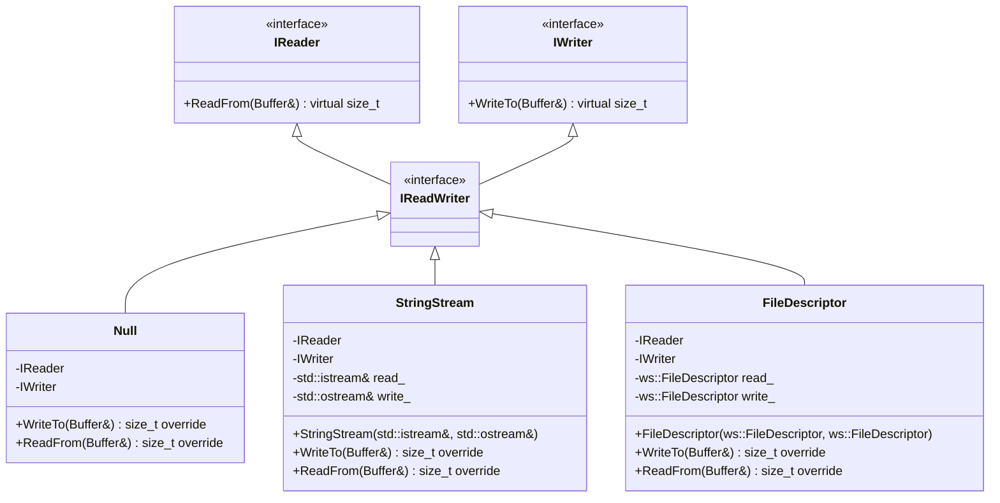
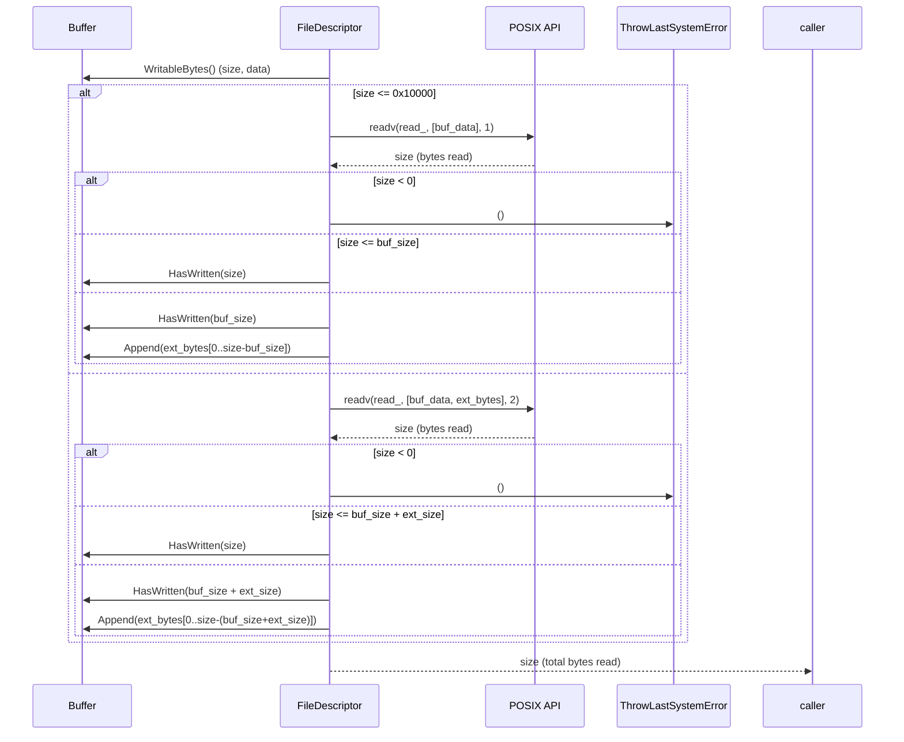
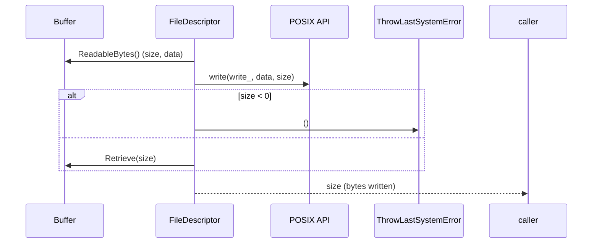

以下は、与えられたC++ソースコードを解析し、再実装に必要な詳細設計仕様書です。この仕様書は、他のLLMが元のコードと同等の機能を持つコードを再実装できるように設計されています。

---

# 詳細設計仕様書

## 1. 概要
この仕様書は、`ws::io`名前空間内のI/O関連クラス（`IReader`、`IWriter`、`IReadWriter`、`Null`、`StringStream`、`FileDescriptor`）およびその実装について、再実装に必要な情報を網羅的に記述します。

## 2. 完全再構築台帳

### 2.1 `include/io.h`

#### ファイル構造
```cpp
#pragma once

#include "util.h"
#include <iostream>

namespace ws {

class Buffer;

namespace io {
    // クラス定義（後述）
}

}  // namespace ws
```

#### 依存関係
- `ws::Buffer`（前方宣言）
- `ws::FileDescriptor`（`include/util.h`から）

### 2.2 `src/io/io.cpp`

#### ファイル構造
```cpp
#include "io.h"
#include "containers/buffer.h"
#include <sys/uio.h>
#include <unistd.h>
#include <array>

namespace ws::io {
    // メソッド実装（後述）
}
```

#### 依存関係
- `ws::Buffer`（`include/containers/buffer.h`から）
- `readv`、`write`（POSIX API）

---

## 3. クラス図



---

## 4. クラス・メソッド・インターフェース詳細

### 4.1 `IReader`
| メンバ | 型 | 説明 |
|--------|----|-------|
| `~IReader()` | `virtual` | デストラクタ（noexcept） |

| メソッド | シグネチャ | 説明 |
|----------|-------------|-------|
| `ReadFrom` | `virtual std::size_t ReadFrom(Buffer& buf) = 0` | バッファから読み込む。戻り値は読み込んだバイト数。 |

### 4.2 `IWriter`
| メンバ | 型 | 説明 |
|--------|----|-------|
| `~IWriter()` | `virtual` | デストラクタ（noexcept） |

| メソッド | シグネチャ | 説明 |
|----------|-------------|-------|
| `WriteTo` | `virtual std::size_t WriteTo(Buffer& buf) = 0` | バッファに書き込む。戻り値は書き込んだバイト数。 |

### 4.3 `IReadWriter`
継承のみ（実装なし）。

### 4.4 `Null`
| メンバ | 型 | 説明 |
|--------|----|-------|
| `~Null()` | `virtual` | デストラクタ（noexcept） |

| メソッド | シグネチャ | 説明 |
|----------|-------------|-------|
| `WriteTo` | `std::size_t WriteTo(Buffer& buf) noexcept override` | バッファの書き込み可能領域を消費する。戻り値は`buf.WritableSize()`。 |
| `ReadFrom` | `std::size_t ReadFrom(Buffer& buf) noexcept override` | バッファの読み取り可能領域を消費する。戻り値は`buf.RetrieveAll()`。 |

### 4.5 `StringStream`
| メンバ | 型 | 説明 |
|--------|----|-------|
| `read_` | `std::istream&` | 読み込み用ストリーム（外部参照） |
| `write_` | `std::ostream&` | 書き込み用ストリーム（外部参照） |

| メソッド | シグネチャ | 説明 |
|----------|-------------|-------|
| コンストラクタ | `explicit StringStream(std::istream& read, std::ostream& write) noexcept` | ストリームを初期化する。 |
| `WriteTo` | `std::size_t WriteTo(Buffer& buf) noexcept override` | `read_`から1行読み込み、`buf`に追加する。戻り値は読み込んだバイト数。 |
| `ReadFrom` | `std::size_t ReadFrom(Buffer& buf) noexcept override` | `buf`の全内容を文字列として取得し、`write_`に書き込む。戻り値は書き込んだバイト数。 |

### 4.6 `FileDescriptor`
| メンバ | 型 | 説明 |
|--------|----|-------|
| `read_` | `ws::FileDescriptor` | 読み込み用ファイルディスクリプタ |
| `write_` | `ws::FileDescriptor` | 書き込み用ファイルディスクリプタ |

| メソッド | シグネチャ | 説明 |
|----------|-------------|-------|
| コンストラクタ | `explicit FileDescriptor(ws::FileDescriptor read, ws::FileDescriptor write) noexcept` | ファイルディスクリプタを初期化する。 |
| `WriteTo` | `std::size_t WriteTo(Buffer& buf)` | `read_`からデータ読み込み、`buf`に書き込む。最大64KB（0x10000バイト）まで一時バッファを使用する。戻り値は読み込んだ総バイト数。 |
| `ReadFrom` | `std::size_t ReadFrom(Buffer& buf)` | `buf`の読み取り可能領域を`write_`に書き込む。戻り値は書き込んだバイト数。 |

---

## 5. シーケンス図

### 5.1 `FileDescriptor::WriteTo`


### 5.2 `FileDescriptor::ReadFrom`


---

## 6. メソッド仕様書

### 6.1 `Null::WriteTo`
- **目的**: バッファの書き込み可能領域を消費する（実際には何もしない）。
- **引数**:
  - `buf`: 対象バッファ。
- **戻り値**: `buf.WritableSize()`。
- **副作用**: `buf`の書き込みオフセットが進む。

### 6.2 `Null::ReadFrom`
- **目的**: バッファの読み取り可能領域を消費する（実際には何もしない）。
- **引数**:
  - `buf`: 対象バッファ。
- **戻り値**: `buf.RetrieveAll()`。
- **副作用**: `buf`の読み取りオフセットが進む。

### 6.3 `StringStream::WriteTo`
- **目的**: ストリームから1行読み込み、バッファに追加する。
- **引数**:
  - `buf`: 対象バッファ。
- **戻り値**: 読み込んだバイト数（0 if EOF）。
- **副作用**: `buf`の書き込みオフセットが進む。

### 6.4 `StringStream::ReadFrom`
- **目的**: バッファの全内容をストリームに書き込む。
- **引数**:
  - `buf`: 対象バッファ。
- **戻り値**: 書き込んだバイト数（`buf.RetrieveAllToString().length()`）。
- **副作用**: `buf`の読み取りオフセットが進む。

### 6.5 `FileDescriptor::WriteTo`
- **目的**: ファイルディスクリプタからデータ読み込み、バッファに書き込む。
- **引数**:
  - `buf`: 対象バッファ。
- **戻り値**: 読み込んだ総バイト数（エラー時は例外）。
- **副作用**:
  - `buf`の書き込みオフセットが進む。
  - 一時バッファ (`ext_bytes`) を使用する場合、追加で`buf.Append()`を呼び出す。

### 6.6 `FileDescriptor::ReadFrom`
- **目的**: バッファの読み取り可能領域をファイルディスクリプタに書き込む。
- **引数**:
  - `buf`: 対象バッファ。
- **戻り値**: 書き込んだバイト数（エラー時は例外）。
- **副作用**: `buf`の読み取りオフセットが進む。

---

## 7. 処理フロー図

### 7.1 `FileDescriptor::WriteTo`
```mermaid
graph TD
    A[Start] --> B[Get writable bytes from buf]
    B --> C{size <= 0x10000?}
    C -->|Yes| D[readv with single buffer]
    C -->|No| E[readv with two buffers]
    D --> F[Check readv result]
    E --> F
    F --> G{size < 0?}
    G -->|Yes| H[ThrowLastSystemError]
    G -->|No| I{size <= buf_size?}
    I -->|Yes| J[buf.HasWritten(size)]
    I -->|No| K[buf.HasWritten(buf_size)]
    K --> L[Append remaining bytes to buf]
    J --> M[Return size]
    H --> M
```

### 7.2 `FileDescriptor::ReadFrom`
```mermaid
graph TD
    A[Start] --> B[Get readable bytes from buf]
    B --> C[write to file descriptor]
    C --> D{size < 0?}
    D -->|Yes| E[ThrowLastSystemError]
    D -->|No| F[buf.Retrieve(size)]
    F --> G[Return size]
```

---

## 8. 状態遷移・副作用

### 8.1 `Null`
- **状態**: 変更なし（`read_`/`write_`メンバなし）。
- **副作用**:
  - `WriteTo`: `buf.write_pos_`が進む。
  - `ReadFrom`: `buf.read_pos_`が進む。

### 8.2 `StringStream`
- **状態**: `read_`/`write_`は外部参照（変更なし）。
- **副作用**:
  - `WriteTo`: `buf.write_pos_`が進む。
  - `ReadFrom`: `buf.read_pos_`が進む。

### 8.3 `FileDescriptor`
- **状態**: `read_`/`write_`は不変（コンストラクタで初期化）。
- **副作用**:
  - `WriteTo`: `buf.write_pos_`が進む、一時バッファを使用する場合`buf.buf_`が拡張される。
  - `ReadFrom`: `buf.read_pos_`が進む。

---

## 9. データ変換・制約

### 9.1 `FileDescriptor::WriteTo`
- **入力**: `read_`からのデータ（最大64KB + 一時バッファ）。
- **出力**:
  - `buf.buf_`に直接書き込む場合: `size <= buf.WritableBytes().size()`。
  - 一時バッファを使用する場合: `buf.Append(ext_bytes[0..remaining])`。
- **制約**:
  - `readv`の戻り値が負の場合、`ThrowLastSystemError()`を呼び出す。

### 9.2 `FileDescriptor::ReadFrom`
- **入力**: `buf.ReadableBytes()`。
- **出力**: `write_`に書き込まれるデータ。
- **制約**:
  - `write`の戻り値が負の場合、`ThrowLastSystemError()`を呼び出す。

---

## 10. 注意事項
- `StringStream`はストリームの寿命管理を外部に委ねる（コピー/ムーブ禁止）。
- `FileDescriptor`は読み書き用のディスクリプタが異なる場合もある（例: 標準入出力）。
- `Null`クラスはダミー実装であり、実際のI/Oを行わない。

---

この仕様書を基に、他のLLMは元のコードと同等の機能を持つコードを再実装できます。