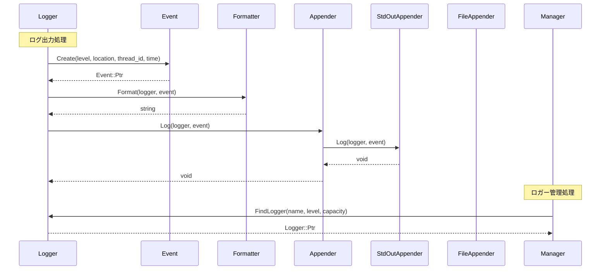
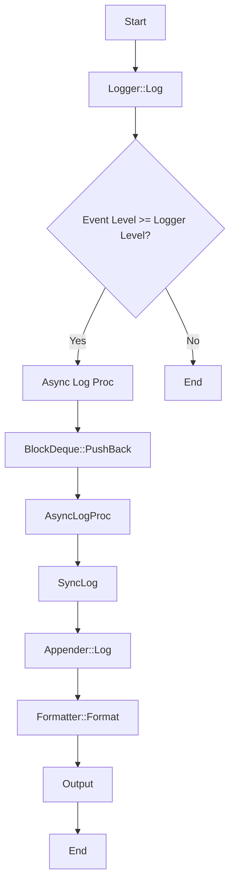

以下は、与えられたC++ソースコードを解析し、別のLLMが再実装できるように詳細な設計仕様書を作成したものです。

## 完全再構築台帳

### F01/U01: include/log.h
- **Include Guard**: `#pragma once`
- **Includes**:
  - `"config.h"`
  - `"containers/block_deque.h"`
  - `"util.h"`
  - `<chrono>`
  - `<experimental/source_location>`
  - `<fstream>`
  - `<iostream>`
  - `<list>`
  - `<memory>`
  - `<mutex>`
  - `<optional>`
  - `<sstream>`
  - `<string>`
  - `<string_view>`
  - `<thread>`
  - `<unordered_map>`

- **Namespace**: `ws::log`
- **Classes**:
  - `Logger`: ログ管理クラス
  - `Event`: ログイベントクラス
  - `Formatter`: フォーマッタクラス
  - `Appender`: アペンダークラス（基底）
    - `StdOutAppender`: 標準出力アペンダー
    - `FileAppender`: ファイルアペンダー
  - `EventWriter`: イベントライタークラス
  - `Manager`: マネージャークラス

- **Enums**:
  - `Level`: ログレベル（Debug, Info, Warn, Error, Fatal）
  - `AppenderType`: アペンダータイプ（StdOut, File）

- **Functions**:
  - `LevelToString`, `to_string`, `operator<<` (for Level)
  - `StringToLevel`
  - `AppenderTypeToString`, `to_string`, `operator<<` (for AppenderType)
  - `StringToAppenderType`

### F02/U02: src/log/log.cpp
- **Includes**:
  - `"log.h"`
  - `"config_init.h"`
  - `"field.h"`
  - `<algorithm>`
  - `<cassert>`
  - `<stdexcept>`

- **Namespace**: `ws::log`
- **Functions**:
  - `LevelToString`, `to_string`, `operator<<` (for Level)
  - `StringToLevel`
  - `Event::Create`, `Event::Event`, `Event::Level`, `Event::FileName`, `Event::LineNum`, `Event::ThreadId`, `Event::Time`, `Event::Message`, `Event::MessageStream`
  - `operator<<` (for Event)
  - `EventWriter::EventWriter`, `EventWriter::~EventWriter`, `EventWriter::MessageStream`
  - `Formatter::Default`, `Formatter::Field::Field`, `Formatter::Formatter`, `Formatter::Format`, `Formatter::Pattern`
  - `Logger::Logger`, `Logger::~Logger`, `Logger::AsyncLogProc`, `Logger::SyncLog`, `Logger::Log`, `Logger::AddAppender`, `Logger::RemoveAppender`, `Logger::ClearAppenders`, `Logger::GetLevel`, `Logger::SetLevel`, `Logger::GetDefaultFormatter`, `Logger::SetDefaultFormatter`, `Logger::Name`, `Logger::Capacity`, `Logger::ToYamlString`
  - `Log`, `operator<<` (for Logger)
  - `Manager::InitConfig`, `Manager::Manager`, `Manager::Name`, `Manager::FindLogger`, `Manager::RemoveLogger`, `Manager::ToYamlString`
  - `RootManager`, `RootLogger`, `FindLogger`

### F03/U03: src/log/appender.cpp
- **Includes**:
  - `"log.h"`
  - `<stdexcept>`
  - `<syncstream>`

- **Namespace**: `ws::log`
- **Functions**:
  - `AppenderTypeToString`, `to_string`, `operator<<` (for AppenderType)
  - `StringToAppenderType`
  - `Appender::Appender`, `Appender::GetFormatter`, `Appender::SetFormatter`
  - `StdOutAppender::Log`, `StdOutAppender::ToYamlString`
  - `FileAppender::FileAppender`, `FileAppender::Log`, `FileAppender::ToYamlString`

### F04/U04: src/log/field.h
- **Include Guard**: `#pragma once`
- **Includes**:
  - `"log.h"`
  - `<list>`
  - `<string>`
  - `<string_view>`

- **Namespace**: `ws::log::field`
- **Classes**:
  - `Message`, `Level`, `ThreadId`, `DateTime`, `FileName`, `LineNum`, `NewLine`, `Tab`, `RawString`, `LoggerName`: フォーマッタフィールドクラス
  - `RawField`: 生のフィールド構造体

- **Functions**:
  - `operator==`, `operator!=` (for RawField)
  - `ParsePattern`
  - `RawFieldsToFormatFields`

### F05/U05: src/log/field.cpp
- **Includes**:
  - `"field.h"`
  - `<ctime>`
  - `<functional>`
  - `<stdexcept>`
  - `<unordered_map>`

- **Namespace**: `ws::log::field`
- **Functions**:
  - `Message::Format`, `Message::Tag`
  - `Level::Format`, `Level::Tag`
  - `ThreadId::Format`, `ThreadId::Tag`
  - `DateTime::DateTime`, `DateTime::Format`, `DateTime::Tag`
  - `FileName::Format`, `FileName::Tag`
  - `LineNum::Format`, `LineNum::Tag`
  - `NewLine::Format`, `NewLine::Tag`
  - `Tab::Format`, `Tab::Tag`
  - `RawString::RawString`, `RawString::Format`, `RawString::Tag`
  - `LoggerName::Format`, `LoggerName::Tag`
  - `operator==`, `operator!=` (for RawField)
  - `ParsePattern`
  - `RawFieldsToFormatFields`

### F06/U06: src/log/config_init.h
- **Include Guard**: `#pragma once`
- **Includes**:
  - `"log.h"`

- **Namespace**: `ws::log`
- **Structs**:
  - `AppenderConfig`: アペンダー設定構造体
  - `LoggerConfig`: ロガー設定構造体

- **Functions**:
  - `operator==`, `operator!=` (for AppenderConfig, LoggerConfig)
  - `SetListener`

### F07/U07: src/log/config_init.cpp
- **Includes**:
  - `"config_init.h"`
  - `<cassert>`

- **Namespace**: `ws::log`
- **Functions**:
  - `operator==`, `operator!=` (for AppenderConfig, LoggerConfig)
  - `SetListener`

## クラス図

```mermaid
classDiagram
    class Logger {
        +Ptr: shared_ptr<Logger>
        +name_: string
        +capacity_: size_t
        +level_: Level
        +appenders_: list<Appender::Ptr>
        +event_deque_: unique_ptr<BlockDeque<Event::Ptr>>
        +formatter_: Formatter::Ptr
        +mtx_: mutex
        +async_: bool
        +writer_thread_: unique_ptr<thread>
        +Logger(name, level, capacity)
        +~Logger()
        +Log(event)
        +AddAppender(appender)
        +RemoveAppender(appender)
        +ClearAppenders()
        +GetLevel() const
        +SetLevel(level)
        +GetDefaultFormatter() const
        +SetDefaultFormatter(formatter)
        +SetDefaultFormatter(pattern)
        +Name() const
        +Capacity() const
        +ToYamlString() const
        +AsyncLogProc() noexcept
        +SyncLog(event) noexcept
    }

    class Event {
        +Ptr: shared_ptr<Event>
        +Clock: chrono::system_clock
        +level_: Level
        +file_name_: string_view
        +line_num_: size_t
        +thread_id_: uint32_t
        +time_: Clock::time_point
        +msg_: ostringstream
        +Create(level, location, thread_id, time)
        +Event(level, location, thread_id, time)
        +Level() const
        +FileName() const
        +LineNum() const
        +ThreadId() const
        +Time() const
        +Message() const
        +MessageStream() noexcept
    }

    class Formatter {
        +Ptr: shared_ptr<Formatter>
        +pattern_: string
        +fields_: list<Field::Ptr>
        +Default()
        +Formatter(pattern)
        +Format(logger, event) const
        +Pattern() const
        +class Field {
            +Ptr: shared_ptr<Field>
            +format_: string
            +Field(format)
            +~Field()
            +Format(out, logger, event) = 0
            +Tag() const = 0
        }
    }

    class Appender {
        +Ptr: shared_ptr<Appender>
        +formatter_: Formatter::Ptr
        +mtx_: mutex
        +Appender(pattern)
        +Appender(formatter)
        +~Appender()
        +Log(logger, event) = 0
        +ToYamlString() const = 0
        +GetFormatter() const
        +SetFormatter(formatter)
        +SetFormatter(pattern)
    }

    class StdOutAppender {
        +Ptr: shared_ptr<StdOutAppender>
        +Log(logger, event) override
        +ToYamlString() const override
    }

    class FileAppender {
        +Ptr: shared_ptr<FileAppender>
        +file_name_: string
        +file_: ofstream
        +FileAppender(file_name, formatter)
        +Log(logger, event) override
        +ToYamlString() const override
    }

    class EventWriter {
        +logger_: Logger&
        +event_: Event::Ptr
        +EventWriter(logger, event)
        +~EventWriter()
        +MessageStream() noexcept
    }

    class Manager {
        +Ptr: shared_ptr<Manager>
        +name_: string
        +loggers_: unordered_map<string, Logger::Ptr>
        +mtx_: mutex
        +InitConfig()
        +Manager(name)
        +Name() const
        +FindLogger(name, level, capacity) const
        +RemoveLogger(name)
        +ToYamlString() const
    }

    Logger "1" *-- "0..*" Appender
    Formatter "1" *-- "0..*" Formatter::Field
    EventWriter --> Logger
    Manager "1" *-- "0..*" Logger
```

## クラス・メソッド・インターフェース詳細

### Logger
- **Constructor**:
  - `Logger(name, level = Level::Info, capacity = nullopt)`
- **Destructor**: `~Logger()`
- **Methods**:
  - `Log(event)`: ログを出力する。
  - `AddAppender(appender)`: アペンダーを追加する。
  - `RemoveAppender(appender)`: アペンダーを削除する。
  - `ClearAppenders()`: 全てのアペンダーをクリアする。
  - `GetLevel() const`: ログレベルを取得する。
  - `SetLevel(level)`: ログレベルを設定する。
  - `GetDefaultFormatter() const`: デフォルトのフォーマッタを取得する。
  - `SetDefaultFormatter(formatter)`: デフォルトのフォーマッタを設定する。
  - `SetDefaultFormatter(pattern)`: パターンからデフォルトのフォーマッタを設定する。
  - `Name() const`: ロガー名を取得する。
  - `Capacity() const`: キャパシティを取得する。
  - `ToYamlString() const`: YAML形式の文字列を取得する。
  - `AsyncLogProc() noexcept`: 非同期ログ処理を行う。
  - `SyncLog(event) noexcept`: 同期ログ処理を行う。

### Event
- **Static Method**:
  - `Create(level, location = current(), thread_id = CurrentThreadId(), time = now())`
- **Constructor**: `Event(level, location, thread_id, time)`
- **Methods**:
  - `Level() const`: ログレベルを取得する。
  - `FileName() const`: ファイル名を取得する。
  - `LineNum() const`: 行番号を取得する。
  - `ThreadId() const`: スレッドIDを取得する。
  - `Time() const`: 時間を取得する。
  - `Message() const`: メッセージを取得する。
  - `MessageStream() noexcept`: メッセージストリームを取得する。

### Formatter
- **Static Method**:
  - `Default()`
- **Constructor**: `Formatter(pattern)`
- **Methods**:
  - `Format(logger, event) const`: フォーマットされた文字列を取得する。
  - `Pattern() const`: パターンを取得する。

### Appender
- **Constructors**:
  - `Appender(pattern)`
  - `Appender(formatter = Default())`
- **Destructor**: `~Appender()`
- **Methods**:
  - `Log(logger, event) = 0`: ログを出力する。
  - `ToYamlString() const = 0`: YAML形式の文字列を取得する。
  - `GetFormatter() const`: フォーマッタを取得する。
  - `SetFormatter(formatter)`: フォーマッタを設定する。
  - `SetFormatter(pattern)`: パターンからフォーマッタを設定する。

### StdOutAppender
- **Methods**:
  - `Log(logger, event) override`: 標準出力にログを出力する。
  - `ToYamlString() const override`: YAML形式の文字列を取得する。

### FileAppender
- **Constructor**: `FileAppender(file_name, formatter = Default())`
- **Methods**:
  - `Log(logger, event) override`: ファイルにログを出力する。
  - `ToYamlString() const override`: YAML形式の文字列を取得する。

### EventWriter
- **Constructor**: `EventWriter(logger, event)`
- **Destructor**: `~EventWriter()`
- **Methods**:
  - `MessageStream() noexcept`: メッセージストリームを取得する。

### Manager
- **Static Method**:
  - `InitConfig()`
- **Constructor**: `Manager(name)`
- **Methods**:
  - `Name() const`: マネージャー名を取得する。
  - `FindLogger(name, level = Level::Info, capacity = nullopt) const`: ロガーを検索または作成する。
  - `RemoveLogger(name)`: ロガーを削除する。
  - `ToYamlString() const`: YAML形式の文字列を取得する。

## シーケンス図



## メソッド仕様書

### Logger::Log(Event::Ptr event) noexcept
- **目的**: ログを出力する。
- **引数**:
  - `event`: 出力するイベント。
- **戻り値**: なし。
- **動作**:
  - イベントのレベルがロガーのレベル以上である場合、非同期または同期でログを出力する。
- **副作用**:
  - アペンダーに対してログを出力する。

### Event::Create(Level level, std::experimental::source_location location = current(), uint32_t thread_id = CurrentThreadId(), Clock::time_point time = now()) noexcept
- **目的**: イベントを作成する。
- **引数**:
  - `level`: ログレベル。
  - `location`: ソースロケーション。
  - `thread_id`: スレッドID。
  - `time`: 時間。
- **戻り値**: 作成されたイベントのポインタ。
- **動作**:
  - イベントを作成し、返す。

### Formatter::Format(const Logger& logger, const Event& event) const noexcept
- **目的**: フォーマットされた文字列を取得する。
- **引数**:
  - `logger`: ロガー。
  - `event`: イベント。
- **戻り値**: フォーマットされた文字列。
- **動作**:
  - フィールドを順にフォーマットし、結合した文字列を返す。

### Appender::Log(const Logger& logger, const Event& event) noexcept
- **目的**: ログを出力する。
- **引数**:
  - `logger`: ロガー。
  - `event`: イベント。
- **戻り値**: なし。
- **動作**:
  - フォーマッタを使用してイベントをフォーマットし、出力先に書き込む。

## 処理フロー図



## 状態遷移・副作用

### Logger
- **状態**:
  - `async_`: 非同期モードかどうか。
  - `writer_thread_`: ライタースレッド。
  - `event_deque_`: イベントキュー。
- **副作用**:
  - アペンダーに対してログを出力する。

### Event
- **状態**:
  - `level_`: ログレベル。
  - `file_name_`: ファイル名。
  - `line_num_`: 行番号。
  - `thread_id_`: スレッドID。
  - `time_`: 時間。
  - `msg_`: メッセージストリーム。
- **副作用**: なし。

### Formatter
- **状態**:
  - `pattern_`: パターン。
  - `fields_`: フィールドリスト。
- **副作用**: なし。

### Appender
- **状態**:
  - `formatter_`: フォーマッタ。
  - `mtx_`: ミューテックス。
- **副作用**:
  - 出力先にログを書き込む。

## データ変換・制約

### ログレベル
- **入力**: `Level`列挙型。
- **出力**: `string_view`または`std::string`。
- **変換**:
  - `LevelToString(level)`: レベルを文字列に変換する。
  - `StringToLevel(str)`: 文字列をレベルに変換する。

### フォーマットパターン
- **入力**: `string_view`。
- **出力**: `Formatter::Ptr`。
- **変換**:
  - `Formatter(pattern)`: パターンからフォーマッタを作成する。

### YAML形式の文字列
- **入力**: ロガーまたはアペンダー。
- **出力**: `std::string`。
- **変換**:
  - `ToYamlString()`: YAML形式の文字列に変換する。

## 追加詳細設計情報

### クラス図
上記のクラス図を参照してください。

### クラス・メソッド・インターフェース詳細
上記のクラス・メソッド・インターフェース詳細を参照してください。

### シーケンス図
上記のシーケンス図を参照してください。

### メソッド仕様書
上記のメソッド仕様書を参照してください。

### 処理フロー図
上記の処理フロー図を参照してください。

### 状態遷移・副作用
上記の状態遷移・副作用を参照してください。

### データ変換・制約
上記のデータ変換・制約を参照してください。