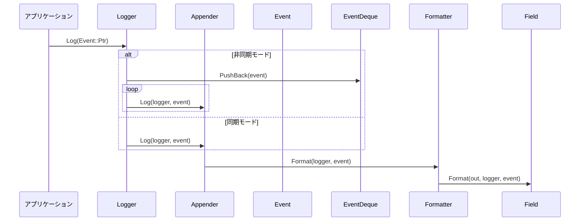
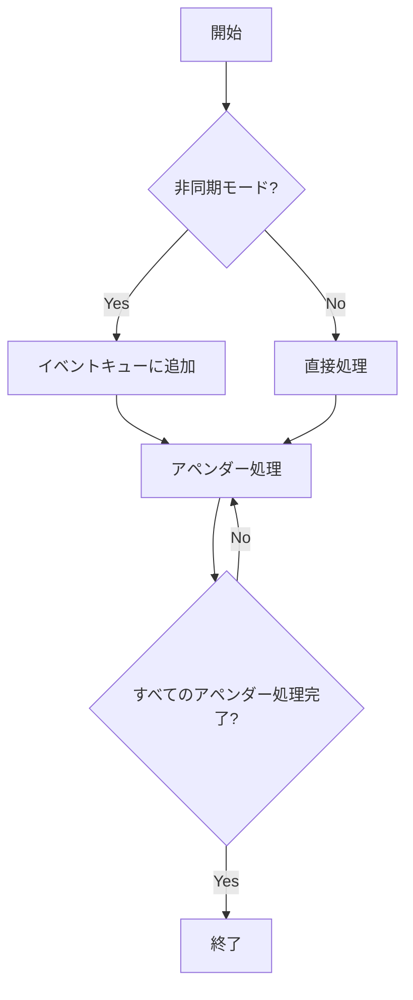

# ロギングシステムの設計仕様書

## 概要

この設計仕様書は、C++で実装されたロギングシステムの詳細な設計情報を提供します。再実装に必要なすべての情報が含まれており、他のLLMが元コードを参照せずに正確に再実装できるようになっています。

## クラス図

```mermaid
classDiagram
    class Logger {
        -name_: string
        -capacity_: size_t
        -level_: Level
        -appenders_: list<Appender::Ptr>
        -event_deque_: unique_ptr<BlockDeque<Event::Ptr>>
        -formatter_: Formatter::Ptr
        +Log(Event::Ptr) noexcept
        +AddAppender(Appender::Ptr) noexcept
        +RemoveAppender(Appender::Ptr) noexcept
        +ClearAppenders() noexcept
        +GetLevel() const noexcept
        +SetLevel(Level) noexcept
        +GetDefaultFormatter() const noexcept
        +SetDefaultFormatter(Formatter::Ptr) noexcept
        +SetDefaultFormatter(string_view)
        +Name() const noexcept
        +Capacity() const noexcept
        +ToYamlString() const noexcept
    }

    class Appender {
        <<abstract>>
        -formatter_: Formatter::Ptr
        +Log(Logger&, Event&) noexcept
        +ToYamlString() const noexcept
        +GetFormatter() const noexcept
        +SetFormatter(Formatter::Ptr) noexcept
        +SetFormatter(string_view)
    }

    class StdOutAppender {
        +Log(Logger&, Event&) noexcept override
        +ToYamlString() const noexcept override
    }

    class FileAppender {
        -file_name_: string
        -file_: ofstream
        +Log(Logger&, Event&) noexcept override
        +ToYamlString() const noexcept override
    }

    class Formatter {
        -pattern_: string
        -fields_: list<Field::Ptr>
        +Format(Logger&, Event&) const noexcept
        +Pattern() const noexcept
    }

    class Formatter$Field {
        <<abstract>>
        +Format(ostream&, Logger&, Event&) noexcept
        +Tag() const noexcept
    }

    class Event {
        -level_: Level
        -file_name_: string_view
        -line_num_: size_t
        -thread_id_: uint32_t
        -time_: Clock::time_point
        -msg_: ostringstream
        +Level() const noexcept
        +FileName() const noexcept
        +LineNum() const noexcept
        +ThreadId() const noexcept
        +Time() const noexcept
        +Message() const noexcept
        +MessageStream() noexcept
    }

    class Manager {
        -name_: string
        -loggers_: unordered_map<string, Logger::Ptr>
        +FindLogger(string_view, Level, optional<size_t>) noexcept
        +RemoveLogger(string_view) noexcept
        +ToYamlString() const noexcept
    }

    Appender <|-- StdOutAppender
    Appender <|-- FileAppender
    Formatter$Field <|-- Message
    Formatter$Field <|-- Level
    Formatter$Field <|-- ThreadId
    Formatter$Field <|-- DateTime
    Formatter$Field <|-- FileName
    Formatter$Field <|-- LineNum
    Formatter$Field <|-- NewLine
    Formatter$Field <|-- Tab
    Formatter$Field <|-- RawString
    Formatter$Field <|-- LoggerName

    Logger "1" *-- "0..*" Appender
    Manager "1" *-- "0..*" Logger
```

## クラス・メソッド・インターフェース詳細

### Logger クラス

| メンバ | 型 | 説明 |
|--------|------|-------|
| name_ | string | ロガーの名前 |
| capacity_ | size_t | イベントキューの容量（0で同期モード） |
| level_ | Level | 最低レベル（このレベル以下のイベントは処理されない） |
| appenders_ | list<Appender::Ptr> | アペンダーのリスト |
| event_deque_ | unique_ptr<BlockDeque<Event::Ptr>> | イベントキュー（非同期モード時のみ使用） |
| formatter_ | Formatter::Ptr | デフォルトフォーマッター |

**メソッド:**

| メソッド | 戻り値型 | 引数 | 説明 |
|----------|----------|-------|-------|
| Log | void | Event::Ptr event | イベントをログに記録 |
| AddAppender | void | Appender::Ptr appender | アペンダーを追加 |
| RemoveAppender | void | Appender::Ptr appender | アペンダーを削除 |
| ClearAppenders | void | - | すべてのアペンダーをクリア |
| GetLevel | Level | - | 現在のレベルを取得 |
| SetLevel | void | Level level | レベルを設定 |
| GetDefaultFormatter | Formatter::Ptr | - | デフォルトフォーマッターを取得 |
| SetDefaultFormatter | void | Formatter::Ptr formatter | デフォルトフォーマッターを設定 |
| SetDefaultFormatter | void | string_view pattern | フォーマットパターンでデフォルトフォーマッターを設定 |
| Name | string_view | - | ロガー名を取得 |
| Capacity | size_t | - | 容量を取得 |
| ToYamlString | string | - | YAML形式の構成文字列を生成 |

### Appender クラス（抽象）

| メンバ | 型 | 説明 |
|--------|------|-------|
| formatter_ | Formatter::Ptr | フォーマッター |

**メソッド:**

| メソッド | 戻り値型 | 引数 | 説明 |
|----------|----------|-------|-------|
| Log | void | Logger& logger, Event& event | イベントをログに記録（純粋仮想関数） |
| ToYamlString | string | - | YAML形式の構成文字列を生成（純粋仮想関数） |
| GetFormatter | Formatter::Ptr | - | フォーマッターを取得 |
| SetFormatter | void | Formatter::Ptr formatter | フォーマッターを設定 |
| SetFormatter | void | string_view pattern | フォーマットパターンでフォーマッターを設定 |

### StdOutAppender クラス

**メソッド:**

| メソッド | 戻り値型 | 引数 | 説明 |
|----------|----------|-------|-------|
| Log | void | Logger& logger, Event& event | イベントを標準出力に記録 |
| ToYamlString | string | - | YAML形式の構成文字列を生成 |

### FileAppender クラス

| メンバ | 型 | 説明 |
|--------|------|-------|
| file_name_ | string | ファイル名 |
| file_ | ofstream | ファイルストリーム |

**メソッド:**

| メソッド | 戻り値型 | 引数 | 説明 |
|----------|----------|-------|-------|
| Log | void | Logger& logger, Event& event | イベントをファイルに記録 |
| ToYamlString | string | - | YAML形式の構成文字列を生成 |

### Formatter クラス

| メンバ | 型 | 説明 |
|--------|------|-------|
| pattern_ | string | フォーマットパターン |
| fields_ | list<Field::Ptr> | フィールドフォーマッターのリスト |

**メソッド:**

| メソッド | 戻り値型 | 引数 | 説明 |
|----------|----------|-------|-------|
| Format | string | Logger& logger, Event& event | イベントをフォーマットした文字列を生成 |
| Pattern | string_view | - | フォーマットパターンを取得 |

### Formatter::Field クラス（抽象）

**メソッド:**

| メソッド | 戻り値型 | 引数 | 説明 |
|----------|----------|-------|-------|
| Format | void | ostream& out, Logger& logger, Event& event | フィールドをフォーマットして出力 |
| Tag | string_view | - | タグを取得 |

### Event クラス

| メンバ | 型 | 説明 |
|--------|------|-------|
| level_ | Level | イベントレベル |
| file_name_ | string_view | ファイル名 |
| line_num_ | size_t | 行番号 |
| thread_id_ | uint32_t | スレッドID |
| time_ | Clock::time_point | 時刻 |
| msg_ | ostringstream | メッセージストリーム |

**メソッド:**

| メソッド | 戻り値型 | 引数 | 説明 |
|----------|----------|-------|-------|
| Level | Level | - | レベルを取得 |
| FileName | string_view | - | ファイル名を取得 |
| LineNum | size_t | - | 行番号を取得 |
| ThreadId | uint32_t | - | スレッドIDを取得 |
| Time | Clock::time_point | - | 時刻を取得 |
| Message | string | - | メッセージを取得 |
| MessageStream | ostringstream& | - | メッセージストリームを取得 |

### Manager クラス

| メンバ | 型 | 説明 |
|--------|------|-------|
| name_ | string | マネージャー名 |
| loggers_ | unordered_map<string, Logger::Ptr> | ロガーのマップ |

**メソッド:**

| メソッド | 戻り値型 | 引数 | 説明 |
|----------|----------|-------|-------|
| FindLogger | Logger::Ptr | string_view name, Level level, optional<size_t> capacity | ロガーを検索または作成 |
| RemoveLogger | void | string_view name | ロガーを削除 |
| ToYamlString | string | - | YAML形式の構成文字列を生成 |

## シーケンス図



## メソッド仕様書

### Logger::Log

**目的:** イベントをログに記録します。

**引数:**
- `event` (Event::Ptr): ログ記録するイベント

**戻り値:** なし

**動作:**
1. イベントのレベルが現在の最低レベル以上であるか確認
2. 非同期モードの場合はイベントキューに追加、同期モードの場合は直接処理
3. 各アペンダーにイベントを渡す

**副作用:**
- イベントがログ記録される
- 非同期モードではイベントキューが更新される

### Formatter::Format

**目的:** イベントをフォーマットした文字列を生成します。

**引数:**
- `logger` (Logger&): ロガー
- `event` (Event&): フォーマットするイベント

**戻り値:** string - フォーマットされた文字列

**動作:**
1. 各フィールドフォーマッターに出力ストリームを渡す
2. フィールドフォーマッターがイベント情報をフォーマットして出力
3. 結合した文字列を返す

**副作用:** なし

### Appender::Log

**目的:** イベントを特定の場所に記録します（抽象メソッド）。

**引数:**
- `logger` (Logger&): ロガー
- `event` (Event&): 記録するイベント

**戻り値:** なし

**動作:** サブクラスで実装される

## 処理フロー図



## 状態遷移・副作用

| 状態 | 遷移条件 | 副作用 |
|-------|----------|--------|
| 初期状態 | - | ロガーが作成される |
| 同期モード | capacity_ == 0 | イベントが直接処理される |
| 非同期モード | capacity_ > 0 | イベントキューに追加され、別スレッドで処理される |
| 終了状態 | デストラクタ呼び出し | スレッドがjoinされ、リソースが解放される |

## データ変換・制約

### フォーマットパターンの構文

- `%m`: メッセージ
- `%p`: レベル
- `%t`: スレッドID
- `%n`: 改行
- `%c`: ロガー名
- `%d`: 時刻（フォーマット指定可能）
- `%f`: ファイル名
- `%l`: 行番号
- `%T`: タブ

### 制約

1. フォーマットパターンは有効な構文である必要がある
2. イベントレベルは0-4の範囲（Debug=0, Info=1, Warn=2, Error=3, Fatal=4）
3. 非同期モードではcapacity_ > 0である必要がある

## 完全再構築台帳

### F01/U01 (include/log.h)

**Include:**
```cpp
#pragma once

#include "config.h"
#include "containers/block_deque.h"
#include "util.h"

#include <chrono>
#include <experimental/source_location>
#include <fstream>
#include <iostream>
#include <list>
#include <memory>
#include <mutex>
#include <optional>
#include <sstream>
#include <string>
#include <string_view>
#include <thread>
#include <unordered_map>
```

**Namespace:** `ws::log`

**Enum:**
- `Level` (Debug=0, Info=1, Warn=2, Error=3, Fatal=4)
- `AppenderType` (StdOut=0, File=1)

**Functions:**
```cpp
std::string_view LevelToString(Level level) noexcept;
std::string to_string(Level level) noexcept;
std::ostream& operator<<(std::ostream& os, Level level) noexcept;
Level StringToLevel(std::string str);

std::string_view AppenderTypeToString(AppenderType type) noexcept;
std::string to_string(AppenderType type) noexcept;
std::ostream& operator<<(std::ostream& os, AppenderType type) noexcept;
AppenderType StringToAppenderType(std::string str);
```

**Classes:**
- `Event` (with nested `Ptr`, `Clock`)
- `Formatter` (with nested `Field`, `Ptr`)
- `Appender` (with nested `Ptr`)
- `StdOutAppender` (with nested `Ptr`)
- `FileAppender` (with nested `Ptr`)
- `Logger` (with nested `Ptr`)
- `EventWriter`
- `Manager` (with nested `Ptr`)

### F02/U02 (src/log/log.cpp)

**Include:**
```cpp
#include "log.h"
#include "config_init.h"
#include "field.h"

#include <algorithm>
#include <cassert>
#include <stdexcept>
```

**Functions:**
- `LevelToString`
- `to_string` (for Level)
- `StringToLevel`
- `Event::Create`
- `EventWriter` constructor/destructor
- `Formatter::Default`
- `Formatter::Field` constructor
- `Formatter` constructor
- `Logger` constructor/destructor
- `Manager` constructor
- `RootManager`
- `RootLogger`
- `FindLogger`

### F03/U03 (src/log/appender.cpp)

**Include:**
```cpp
#include "log.h"

#include <stdexcept>
#include <syncstream>
```

**Functions:**
- `AppenderTypeToString`
- `to_string` (for AppenderType)
- `StringToAppenderType`
- `Appender` constructors
- `StdOutAppender::Log`
- `FileAppender` constructor
- `FileAppender::Log`

### F04/U04 (src/log/field.h)

**Include:**
```cpp
#pragma once

#include "log.h"

#include <list>
#include <string>
#include <string_view>
```

**Classes:**
- `Message`
- `Level`
- `ThreadId`
- `DateTime`
- `FileName`
- `LineNum`
- `NewLine`
- `Tab`
- `RawString`
- `LoggerName`

**Structs:**
- `RawField`

**Functions:**
```cpp
std::list<RawField> ParsePattern(std::string_view pattern);
std::list<Formatter::Field::Ptr> RawFieldsToFormatFields(const std::list<RawField>& raw_fields);
```

### F05/U05 (src/log/field.cpp)

**Include:**
```cpp
#include "field.h"

#include <ctime>
#include <functional>
#include <stdexcept>
#include <unordered_map>
```

**Functions:**
- `Message::Format`
- `Level::Format`
- `ThreadId::Format`
- `DateTime` constructor
- `DateTime::Format`
- `FileName::Format`
- `LineNum::Format`
- `NewLine::Format`
- `Tab::Format`
- `RawString` constructor
- `RawString::Format`
- `LoggerName::Format`
- `operator==` (for RawField)
- `operator!=` (for RawField)
- `ParsePattern`
- `RawFieldsToFormatFields`

### F06/U06 (src/log/config_init.h)

**Include:**
```cpp
#pragma once

#include "log.h"
```

**Structs:**
- `AppenderConfig`
- `LoggerConfig`

**Functions:**
```cpp
cfg::Var<std::unordered_set<LoggerConfig>>::Ptr SetListener(cfg::Var<std::unordered_set<LoggerConfig>>::Ptr loggers, Manager::Ptr manager) noexcept;
```

### F07/U07 (src/log/config_init.cpp)

**Include:**
```cpp
#include "config_init.h"

#include <cassert>
```

**Functions:**
- `operator==` (for AppenderConfig)
- `operator!=` (for AppenderConfig)
- `operator==` (for LoggerConfig)
- `operator!=` (for LoggerConfig)
- `SetListener`

## 依存関係

このロギングシステムは以下の外部ライブラリに依存しています：

1. YAML-CPP: YAML形式の構成ファイル処理
2. fmt: フォーマット文字列処理
3. C++標準ライブラリ（<chrono>, <memory>, <mutex>など）

## 再実装注意事項

1. `std::experimental::source_location`は将来的に`std::source_location`に置き換える予定です。
2. フォーマットパターンの構文は厳密に守る必要があります。
3. 非同期モードではスレッドセーフ性を確保する必要があります。
4. YAML形式の構成ファイルは正しく解析できる必要があります。

この設計仕様書を使用して、他のLLMが元コードを参照せずに正確に再実装できるようになっています。