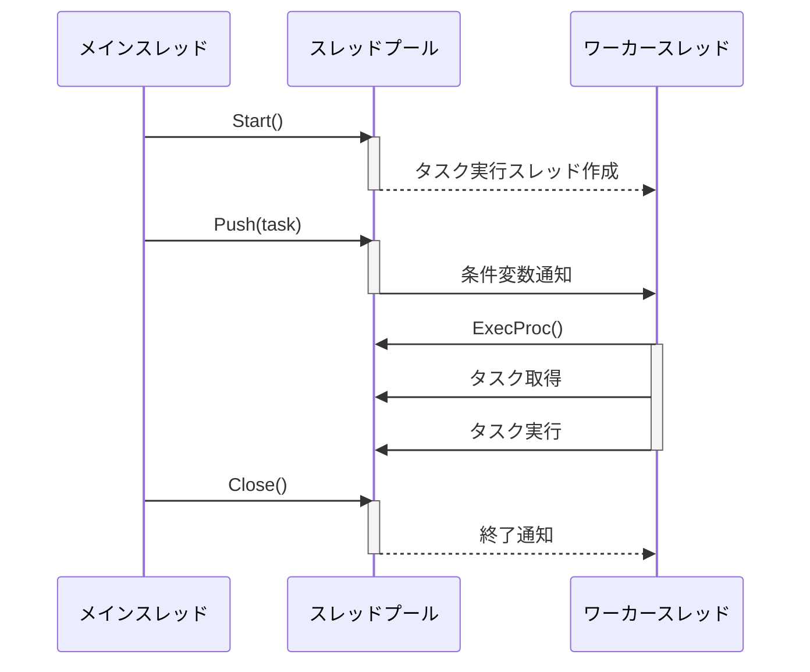
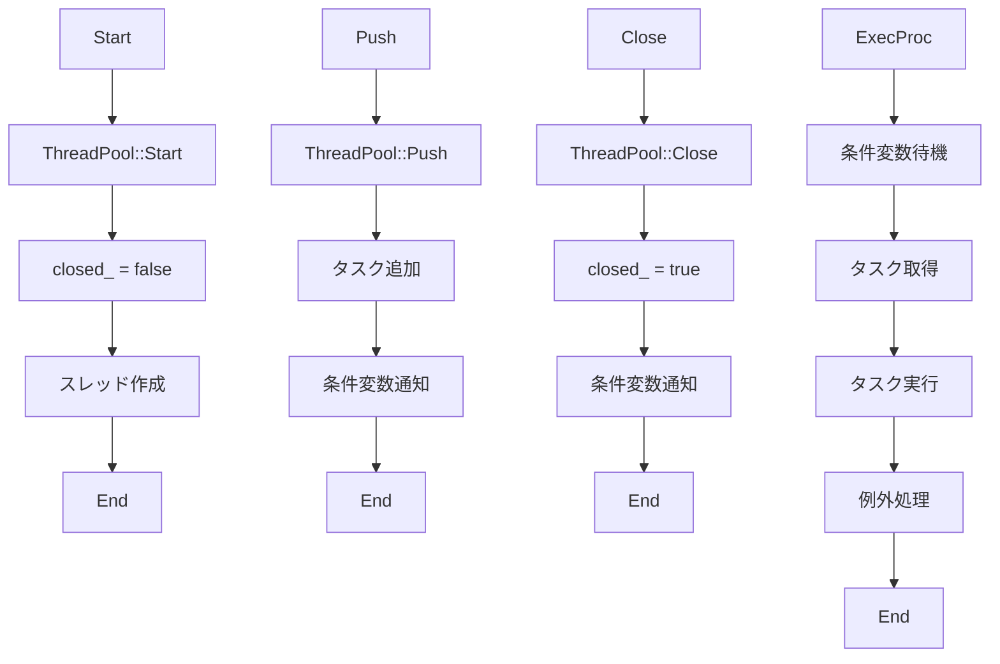

以下は、与えられたC++ソースコードを解析し、別のLLMが再実装できるように設計仕様書を作成したものです。この仕様書には、クラス図、メソッド仕様書、処理フロー図などが含まれています。

## 完全再構築台帳

### ファイル: include/containers/thread_pool.h
- **include guard**: `#pragma once`
- **include**:
  - `"log.h"`
  - `<condition_variable>`
  - `<functional>`
  - `<list>`
  - `<mutex>`
  - `<optional>`
  - `<thread>`

#### 型定義
- `using Task = std::function<void()>;`

#### クラス: ThreadPool
- **属性**:
  - `log::Logger::Ptr logger_`
  - `mutable std::mutex mtx_`
  - `std::atomic_bool closed_ {true}`
  - `std::size_t thread_count_`
  - `std::condition_variable cond_`
  - `std::list<Task> tasks_`
  - `std::list<std::thread> threads_`

- **メソッド**:
  - `ThreadPool(std::optional<std::size_t> thread_count = std::nullopt, log::Logger::Ptr logger = log::RootLogger()) noexcept;`
  - `~ThreadPool() noexcept;`
  - `void Start() noexcept;`
  - `void Push(Task task) noexcept;`
  - `void Close() noexcept;`
  - `void ExecProc() noexcept;`

### ファイル: src/containers/thread_pool/thread_pool.cpp
- **include**:
  - `"thread_pool.h"`
  - `"util.h"`
  - `<cassert>`

#### コンストラクタ
```cpp
ThreadPool::ThreadPool(const std::optional<std::size_t> thread_count,
                       log::Logger::Ptr logger) noexcept :
    logger_ {std::move(logger)} {
    if (!logger_) {
        logger_ = log::RootLogger();
    }

    thread_count_ = thread_count.value_or(0);
    if (thread_count_ == 0) {
        thread_count_ = std::thread::hardware_concurrency();
    }
}
```

#### デストラクタ
```cpp
ThreadPool::~ThreadPool() noexcept {
    Close();
    for (auto& thread : threads_) {
        assert(thread.joinable());
        thread.join();
    }
}
```

#### メソッド: Start()
```cpp
void ThreadPool::Start() noexcept {
    assert(closed_);
    closed_ = false;
    for (auto i {0}; i != thread_count_; ++i) {
        threads_.emplace_back(&ThreadPool::ExecProc, this);
    }
}
```

#### メソッド: Push()
```cpp
void ThreadPool::Push(Task task) noexcept {
    assert(!closed_);
    const std::lock_guard locker {mtx_};
    tasks_.push_back(std::move(task));
    cond_.notify_one();
}
```

#### メソッド: ExecProc()
```cpp
void ThreadPool::ExecProc() noexcept {
    const auto not_empty_or_closed {[this]() noexcept {
        return !tasks_.empty() || closed_;
    }};

    while (true) {
        Task task;
        {
            std::unique_lock locker {mtx_};
            cond_.wait(locker, not_empty_or_closed);
            if (!closed_) {
                task = std::move(tasks_.front());
                tasks_.pop_front();
            } else {
                return;
            }
        }

        try {
            assert(task);
            task();
        } catch (const std::exception& err) {
            logger_->Log(
                log::Event::Create(log::Level::Error) << fmt::format(
                    "Exception raised in thread pool's task: {}", err.what()));
        }
    }
}
```

#### メソッド: Close()
```cpp
void ThreadPool::Close() noexcept {
    const std::lock_guard locker {mtx_};
    closed_ = true;
    cond_.notify_all();
}
```

## クラス図

```mermaid
classDiagram
    class ThreadPool {
        -log::Logger::Ptr logger_
        -mutable std::mutex mtx_
        -std::atomic_bool closed_ {true}
        -std::size_t thread_count_
        -std::condition_variable cond_
        -std::list<Task> tasks_
        -std::list<std::thread> threads_

        +ThreadPool(std::optional<std::size_t>, log::Logger::Ptr) noexcept
        +~ThreadPool() noexcept
        +Start() noexcept
        +Push(Task) noexcept
        +Close() noexcept
        +ExecProc() noexcept

        using Task = std::function<void()>
    }
```

## クラス・メソッド・インターフェース詳細

| メソッド | 引数 | 戻り値型 | 副作用 |
|----------|-------|----------|--------|
| `ThreadPool` | `std::optional<std::size_t> thread_count`, `log::Logger::Ptr logger` | - | `logger_` を設定し、`thread_count_` を初期化する。 |
| `~ThreadPool` | - | - | `Close()` を呼び出し、すべてのスレッドを終了させる。 |
| `Start` | - | - | スレッドプールを開始し、指定された数のスレッドを作成する。 |
| `Push` | `Task task` | - | タスクをキューに追加し、条件変数を通知する。 |
| `Close` | - | - | スレッドプールを閉じ、すべてのスレッドを終了させる。 |
| `ExecProc` | - | - | タスクを取得して実行する。 |

## シーケンス図



## メソッド仕様書

### `ThreadPool::ThreadPool`
- **目的**: スレッドプールを初期化する。
- **引数**:
  - `thread_count`: スレッドの数。`std::nullopt` または 0 の場合、ハードウェアがサポートする並行スレッド数を使用する。
  - `logger`: ロガー。`nullptr` の場合、グローバルルートロガーを使用する。
- **戻り値**: なし
- **副作用**: `logger_` と `thread_count_` を初期化する。

### `ThreadPool::Start`
- **目的**: スレッドプールを開始し、指定された数のスレッドを作成する。
- **引数**: なし
- **戻り値**: なし
- **副作用**: `closed_` を `false` に設定し、スレッドを作成する。

### `ThreadPool::Push`
- **目的**: タスクをキューに追加する。
- **引数**:
  - `task`: 実行するタスク。
- **戻り値**: なし
- **副作用**: タスクを `tasks_` に追加し、条件変数を通知する。

### `ThreadPool::Close`
- **目的**: スレッドプールを閉じる。
- **引数**: なし
- **戻り値**: なし
- **副作用**: `closed_` を `true` に設定し、条件変数を通知する。

### `ThreadPool::ExecProc`
- **目的**: タスクを取得して実行する。
- **引数**: なし
- **戻り値**: なし
- **副作用**: タスクを取得して実行し、例外が発生した場合はログに記録する。

## 処理フロー図



## 状態遷移・副作用

| 状態 | 遷移条件 | 副作用 |
|------|----------|--------|
| 初期化 | コンストラクタ呼び出し | `logger_` と `thread_count_` を初期化する。 |
| 開始 | `Start()` 呼び出し | `closed_` を `false` に設定し、スレッドを作成する。 |
| タスク追加 | `Push()` 呼び出し | タスクを `tasks_` に追加し、条件変数を通知する。 |
| 終了 | `Close()` 呼び出し | `closed_` を `true` に設定し、条件変数を通知する。 |

## データ変換・制約

- **タスク**: `std::function<void()>` 型の関数オブジェクト。
- **スレッド数**: `std::optional<std::size_t>` 型で指定される。`std::nullopt` または 0 の場合、ハードウェアがサポートする並行スレッド数を使用する。
- **ロガー**: `log::Logger::Ptr` 型のスマートポインタ。`nullptr` の場合、グローバルルートロガーを使用する。

この設計仕様書をもとに、別のLLMが再実装できるようになります。