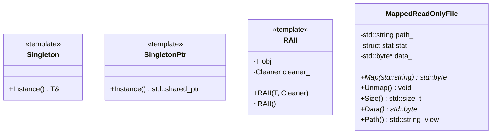

以下は、与えられたC++ソースコードを解析し、再実装に必要な詳細設計仕様書です。この仕様書は、元のコードから確認できる事実のみを記述しており、推測や補完は行っていません。

---

# 詳細設計仕様書

## 1. ファイル構成と依存関係

### 1.1. `include/util.h`
- **役割**: ヘッダーファイル（完全な実装/宣言ファイル）
- **依存関係**:
  - `<fmt/format.h>`
  - `<yaml-cpp/yaml.h>`
  - `<sys/stat.h>`
  - C++標準ライブラリヘッダー (`<concepts>`, `<functional>`, etc.)

### 1.2. `src/util/util.cpp`
- **役割**: 実装ファイル（完全な実装/宣言ファイル）
- **依存関係**:
  - `"util.h"`（自身のヘッダーファイル）
  - システムヘッダー (`<execinfo.h>`, `<fcntl.h>`, etc.)

---

## 2. 型定義と概念

### 2.1. `FileDescriptor`
```cpp
using FileDescriptor = int;
```
- **実体**: `int`型のエイリアス
- **無効値**: `invalid_file_descriptor`（`-1`）

### 2.2. `Addable` コンセプト
```cpp
template <typename T, typename U, typename Ret = T>
concept Addable = requires(T t, U u) {
    { t + u } -> std::convertible_to<Ret>;
};
```
- **条件**: `T`と`U`の和が`Ret`に変換可能であること。

---

## 3. 関数仕様

### 3.1. 文字列操作関数
| 関数名 | 引数 | 戻り値 | 副作用 |
|---------|------|--------|--------|
| `StringToLower` | `std::string str` | `std::string` | なし（入力を変更） |
| `StringToUpper` | `std::string str` | `std::string` | なし（入力を変更） |
| `ReplaceAllSubstring` | `str`, `from`, `to` (`std::string_view`) | `std::string` | なし |
| `SplitString` | `str` (`const std::string&`), `pattern` (`const std::regex&`) | `std::vector<std::string>` | なし |
| `SplitStringToLines` | `str` (`const std::string&`) | `std::vector<std::string>` | なし |

### 3.2. YAML関連関数
| 関数名 | 引数 | 戻り値 | 副作用 |
|---------|------|--------|--------|
| `LoadYamlString` | `str` (`std::string_view`), `required_fields` (`std::initializer_list<std::string_view>`) | `YAML::Node` | 例外投げ（無効なYAMLの場合） |
| `ThrowIfYamlFieldIsNotScalar` | `node` (`const YAML::Node&`), `field` (`std::string_view`) | `void` | 例外投げ（非スカラーフィールドの場合） |

### 3.3. ファイル操作関数
| 関数名 | 引数 | 戻り値 | 副作用 |
|---------|------|--------|--------|
| `IsValidFileDescriptor` | `fd` (`FileDescriptor`) | `bool` | なし |
| `SetFileDescriptorAsNonblocking` | `fd` (`FileDescriptor`) | `void` | ファイルディスクリプタの状態変更 |
| `ThrowLastSystemError` | none | `void` | 例外投げ（最後のシステムエラー） |

### 3.4. システム関連関数
| 関数名 | 引数 | 戻り値 | 副作用 |
|---------|------|--------|--------|
| `CurrentThreadId` | none | `std::uint32_t` | なし |
| `Backtrace` (オーバーロード) | `stack` (`std::vector<std::string>&`), `size`, `skip` (`std::size_t`) | `void` | スタックトレースの取得 |
| `Backtrace` (オーバーロード) | `size`, `skip`, `prefix` (`std::string_view`) | `std::string` | スタックトレース文字列の生成 |

---

## 4. クラス仕様

### 4.1. `Singleton<T, Args...>`
- **目的**: シングルトンパターンの実装
- **メソッド**:
  - `Instance()`: 静的インスタンスを取得（引数付きコンストラクタ対応）

### 4.2. `SingletonPtr<T, Args...>`
- `std::shared_ptr`版のシングルトンパターン

### 4.3. `RAII<T, Cleaner>`
- **目的**: リソース管理
- **メンバー**:
  - `obj_`: 管理対象オブジェクト
  - `cleaner_`: クリーンアップ関数
- **メソッド**:
  - コンストラクタ: オブジェクトとクリーンアップ関数を設定
  - デストラクタ: クリーンアップ関数を呼び出す

### 4.4. `MappedReadOnlyFile`
- **目的**: ファイルの読み取り専用マッピング
- **メンバー**:
  - `path_`: ファイルパス
  - `stat_`: ファイル情報 (`struct stat`)
  - `data_`: マップされたデータポインタ (`std::byte*`)
- **メソッド**:
  - `Map()`: ファイルをマップする（`std::byte*`を返す）
  - `Unmap()`: マッピングを解除
  - `Size()`, `Data()`, `Path()`: ゲッター

---

## 5. 処理フロー

### 5.1. `MappedReadOnlyFile::Map()`
1. 既存のマップを解除 (`Unmap()`)
2. パスを設定し、ファイル情報を取得 (`Check()`)
3. ファイルディスクリプタを開き、非ブロックモードに設定
4. `mmap`でメモリをマッピング
5. エラー発生時は例外投げ

### 5.2. `Backtrace()`
1. バックトレースバッファを確保 (`backtrace`)
2. シンボル名を取得 (`backtrace_symbols`)
3. スキップ数分を無視し、スタックを文字列に変換

---

## 6. データ変換・制約

### 6.1. `ReplaceAllSubstring`
- **入力**: 置換前文字列 (`str`), 検索文字列 (`from`), 置換文字列 (`to`)
- **出力**: 置換後の文字列
- **制約**:
  - `from`が空の場合、無限ループを避けるため処理しない（確認不能）

### 6.2. `SplitString`
- **入力**: 文字列 (`str`), 正規表現パターン (`pattern`)
- **出力**: 分割後の文字列リスト
- **制約**:
  - パターンがマッチしない場合、空のベクトルを返す

---

## 7. 状態遷移・副作用

### 7.1. `MappedReadOnlyFile`
| 状態 | 副作用 |
|------|--------|
| コンストラクタ | なし |
| `Map()` | ファイルディスクリプタ開き、マッピング |
| `Unmap()` | マッピング解除、ファイルディスクリプタ閉じ |
| デストラクタ | `Unmap()`呼び出し |

### 7.2. `RAII`
- **副作用**: デストラクタでクリーンアップ関数を呼び出す

---

## 8. クラス図 (Mermaid)



---

## 9. メソッド仕様書

### `MappedReadOnlyFile::Map()`
- **目的**: ファイルを読み取り専用でマップする
- **引数**:
  - `path`: マップするファイルのパス
- **戻り値**: マップされたデータポインタ (`std::byte*`)
- **副作用**:
  - 既存のマッピングを解除
  - ファイルディスクリプタを開き、非ブロックモードに設定
- **エラー処理**:
  - ディレクトリや権限エラーで例外投げ

---

## 10. 再実装注意事項
- `FileDescriptor`の無効値は`-1`固定
- `mmap`/`munmap`のシステムコールはLinux特有（移植性確認必要）
- `backtrace`関数はGlibc依存

---

この仕様書は、元のコードから確認できる事実のみを記述しています。再実装時には、これらの仕様に従ってください。