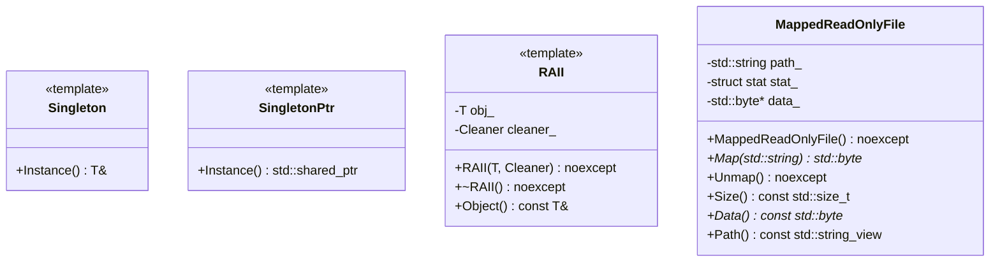
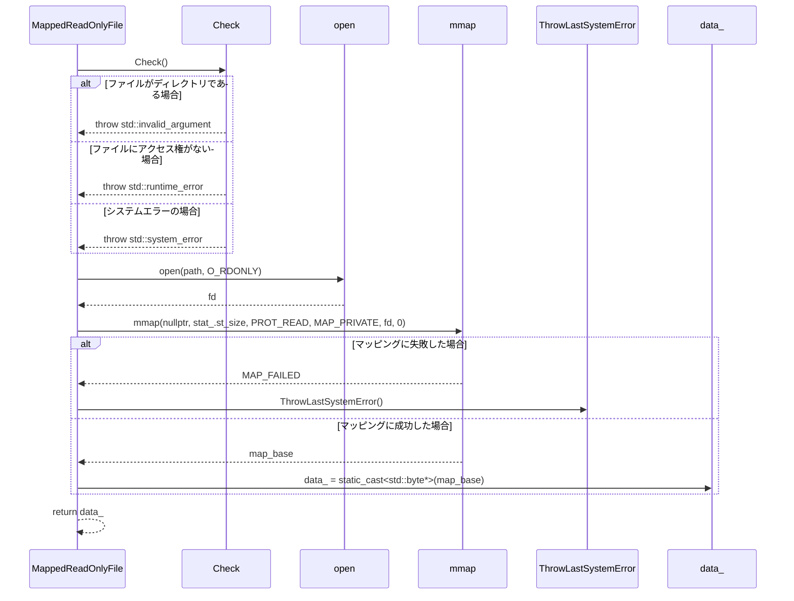

以下は、与えられたC++ソースコードを解析し、別のLLMが再実装できるように設計した詳細な仕様書です。この仕様書は、元のコードから確認できる事実のみを基に作成されています。

---

# 設計仕様書

## 1. ファイル構造

### `include/util.h`
- **役割**: ユーティリティ関数とクラスの宣言を含むヘッダーファイル
- **依存関係**:
  - `<fmt/format.h>`
  - `<yaml-cpp/yaml.h>`
  - `<sys/stat.h>`
  - C++標準ライブラリ (`<concepts>`, `<functional>`, etc.)

### `src/util/util.cpp`
- **役割**: ユーティリティ関数とクラスの実装を含むソースファイル
- **依存関係**:
  - `<execinfo.h>`
  - `<fcntl.h>`
  - `<sys/mman.h>`
  - `<unistd.h>`
  - C++標準ライブラリ (`<algorithm>`, `<cassert>`, etc.)

## 2. 型定義

### `FileDescriptor`
- **型名**: `int`
- **説明**: ファイルディスクリプタの基本型
- **無効値**: `-1`

### `Addable` コンセプト
```cpp
template <typename T, typename U, typename Ret = T>
concept Addable = requires(T t, U u) {
    { t + u } -> std::convertible_to<Ret>;
};
```
- **説明**: 二つの型が加算可能であることを示すコンセプト

## 3. 関数仕様書

### `StringToLower`
```cpp
std::string StringToLower(std::string str) noexcept;
```
- **目的**: 文字列を小文字に変換する
- **引数**:
  - `str`: 入力文字列（移動される）
- **戻り値**: 小文字に変換された文字列
- **副作用**: なし

### `StringToUpper`
```cpp
std::string StringToUpper(std::string str) noexcept;
```
- **目的**: 文字列を大文字に変換する
- **引数**:
  - `str`: 入力文字列（移動される）
- **戻り値**: 大文字に変換された文字列
- **副作用**: なし

### `ReplaceAllSubstring`
```cpp
std::string ReplaceAllSubstring(std::string_view str, std::string_view from,
                                std::string_view to) noexcept;
```
- **目的**: 文字列内の特定の部分文字列を置換する
- **引数**:
  - `str`: 入力文字列（変更されない）
  - `from`: 置換対象の部分文字列
  - `to`: 置換後の部分文字列
- **戻り値**: 置換後の文字列
- **副作用**: なし

### `SplitString`
```cpp
std::vector<std::string> SplitString(const std::string& str,
                                     const std::regex& pattern) noexcept;
```
- **目的**: 正規表現パターンで文字列を分割する
- **引数**:
  - `str`: 入力文字列（変更されない）
  - `pattern`: 分割に使用する正規表現パターン
- **戻り値**: 分割後の文字列のベクタ
- **副作用**: なし

### `SplitStringToLines`
```cpp
std::vector<std::string> SplitStringToLines(const std::string& str) noexcept;
```
- **目的**: 文字列を改行で分割する
- **引数**:
  - `str`: 入力文字列（変更されない）
- **戻り値**: 分割後の文字列のベクタ
- **副作用**: なし

### `LoadYamlString`
```cpp
YAML::Node LoadYamlString(
    std::string_view str,
    std::initializer_list<std::string_view> required_fields = {});
```
- **目的**: YAML文字列を読み込み、必要なフィールドが存在するか確認する
- **引数**:
  - `str`: YAML文字列（変更されない）
  - `required_fields`: 必須のフィールド名のリスト
- **戻り値**: YAMLノード
- **例外**:
  - `std::invalid_argument`: 必須フィールドが存在しない場合

### `ThrowIfYamlFieldIsNotScalar`
```cpp
void ThrowIfYamlFieldIsNotScalar(const YAML::Node& node,
                                 std::string_view field);
```
- **目的**: YAMLノードのフィールドがスカラーであるか確認する
- **引数**:
  - `node`: YAMLノード（変更されない）
  - `field`: 確認対象のフィールド名
- **例外**:
  - `std::invalid_argument`: フィールドが存在しないまたはスカラーではない場合

### `IsValidFileDescriptor`
```cpp
constexpr bool IsValidFileDescriptor(FileDescriptor fd) noexcept;
```
- **目的**: ファイルディスクリプタが有効であるか確認する
- **引数**:
  - `fd`: 確認対象のファイルディスクリプタ
- **戻り値**: 有効な場合は`true`
- **副作用**: なし

### `SetFileDescriptorAsNonblocking`
```cpp
void SetFileDescriptorAsNonblocking(FileDescriptor fd);
```
- **目的**: ファイルディスクリプタを非ブロッキングモードに設定する
- **引数**:
  - `fd`: 設定対象のファイルディスクリプタ
- **例外**:
  - `std::system_error`: 設定に失敗した場合

### `ThrowLastSystemError`
```cpp
[[noreturn]] void ThrowLastSystemError();
```
- **目的**: 最後のシステムエラーを`std::system_error`として投げる
- **副作用**: 常に例外を投げる

### `CurrentThreadId`
```cpp
std::uint32_t CurrentThreadId() noexcept;
```
- **目的**: 現在のスレッドIDを取得する
- **戻り値**: スレッドID（`std::uint32_t`）
- **副作用**: なし

### `Backtrace`
```cpp
void Backtrace(std::vector<std::string>& stack, std::size_t size,
               std::size_t skip = 0) noexcept;
```
- **目的**: バックトレースを取得し、文字列としてベクタに格納する
- **引数**:
  - `stack`: バックトレースの結果を格納するベクタ（変更される）
  - `size`: 最大取得サイズ
  - `skip`: スキップするフレーム数
- **副作用**: `stack`にバックトレースが追加される

### `Backtrace`
```cpp
std::string Backtrace(std::size_t size, std::size_t skip = 0,
                      std::string_view prefix = "") noexcept;
```
- **目的**: バックトレースを取得し、文字列として返す
- **引数**:
  - `size`: 最大取得サイズ
  - `skip`: スキップするフレーム数
  - `prefix`: 各行のプレフィックス（変更されない）
- **戻り値**: バックトレース文字列
- **副作用**: なし

## 4. クラス仕様書

### `Singleton`
```cpp
template <typename T, typename... Args>
class Singleton {
public:
    template <Args... args>
    static T& Instance() noexcept;
};
```
- **目的**: シングルトンパターンの実装
- **メソッド**:
  - `Instance()`: シングルトンインスタンスを取得する

### `SingletonPtr`
```cpp
template <typename T, typename... Args>
class SingletonPtr {
public:
    template <Args... args>
    static std::shared_ptr<T> Instance() noexcept;
};
```
- **目的**: シングルトンパターンのスマートポインタ版実装
- **メソッド**:
  - `Instance()`: シングルトンインスタンスを`std::shared_ptr`として取得する

### `RAII`
```cpp
template <typename T, typename Cleaner = std::function<void(T)>>
requires std::is_invocable_v<Cleaner, T>
class RAII {
public:
    explicit RAII(T obj, Cleaner cleaner) noexcept;
    ~RAII() noexcept;
    const T& Object() const noexcept;
private:
    T obj_;
    Cleaner cleaner_;
};
```
- **目的**: リソース管理のためのRAIIクラス
- **メソッド**:
  - `RAII()`: オブジェクトとクリーンアップ関数を初期化する
  - `~RAII()`: クリーンアップ関数を呼び出す
  - `Object()`: 管理対象のオブジェクトを取得する

### `MappedReadOnlyFile`
```cpp
class MappedReadOnlyFile {
public:
    MappedReadOnlyFile() noexcept;
    MappedReadOnlyFile(MappedReadOnlyFile&&) noexcept;
    ~MappedReadOnlyFile() noexcept;
    std::byte* Map(std::string path);
    void Unmap() noexcept;
    std::size_t Size() const noexcept;
    std::byte* Data() const noexcept;
    std::string_view Path() const noexcept;
private:
    void Check();
    std::string path_;
    struct stat stat_ {};
    std::byte* data_ {nullptr};
};
```
- **目的**: ファイルをメモリにマップするためのRAIIクラス
- **メソッド**:
  - `Map()`: ファイルをメモリにマップする
  - `Unmap()`: マッピングを解除する
  - `Size()`: ファイルサイズを取得する
  - `Data()`: マップされたデータを取得する
  - `Path()`: ファイルパスを取得する
- **例外**:
  - `std::invalid_argument`: パスがディレクトリである場合
  - `std::runtime_error`: ファイルにアクセス権がない場合
  - `std::system_error`: マッピングに失敗した場合

## 5. クラス図



## 6. シーケンス図

### `MappedReadOnlyFile::Map` のシーケンス


## 7. メソッド仕様書

### `MappedReadOnlyFile::Map`
- **目的**: ファイルをメモリにマップする
- **引数**:
  - `path`: マップするファイルのパス（移動される）
- **戻り値**: マップされたデータへのポインタ
- **副作用**:
  - 既存のマッピングが解除される
  - `data_`と`stat_`が更新される
- **例外**:
  - `std::invalid_argument`: パスがディレクトリである場合
  - `std::runtime_error`: ファイルにアクセス権がない場合
  - `std::system_error`: マッピングに失敗した場合

### `MappedReadOnlyFile::Unmap`
- **目的**: マッピングを解除する
- **副作用**:
  - `data_`が`nullptr`に設定される
  - `stat_`と`path_`がクリアされる
- **例外**: 投げない

## 8. 処理フロー図

### `ReplaceAllSubstring`
```mermaid
graph TD
    A[開始] --> B[空でない間]
    B --> C[fromをstr内で検索]
    C --> D{見つかったか?}
    D -->|はい| E[strの先頭からbeginまでの部分をssに追加]
    E --> F[toをssに追加]
    F --> G[str = str.substr(begin + from.length())]
    G --> B
    D -->|いいえ| H[終了]
```

## 9. 状態遷移・副作用

### `MappedReadOnlyFile`
- **初期状態**:
  - `data_`: `nullptr`
  - `stat_`: `{}`（ゼロ初期化）
  - `path_`: 空文字列
- **マッピング後**:
  - `data_`: マップされたデータへのポインタ
  - `stat_`: ファイルの統計情報
  - `path_`: ファイルパス
- **アンマップ後**:
  - `data_`: `nullptr`
  - `stat_`: `{}`（ゼロ初期化）
  - `path_`: 空文字列

## 10. データ変換・制約

### `StringToLower`/`StringToUpper`
- **入力**: UTF-8エンコーディングの文字列
- **出力**: 全てのアルファベットが小文字/大文字に変換されたUTF-8文字列
- **制約**:
  - 非ASCII文字は変更されない

### `ReplaceAllSubstring`
- **入力**: UTF-8エンコーディングの文字列
- **出力**: 全ての`from`が`to`に置換されたUTF-8文字列
- **制約**:
  - `from`と`to`は同じ長さである必要はない

### `MappedReadOnlyFile::Map`
- **入力**: ファイルパス（UTF-8エンコーディング）
- **出力**: マップされたデータへのポインタ
- **制約**:
  - パスがディレクトリではないこと
  - ファイルに読み取り権限があること

---

この仕様書は、元のコードから確認できる事実のみを基に作成されています。再実装時には、この仕様書に従ってください。