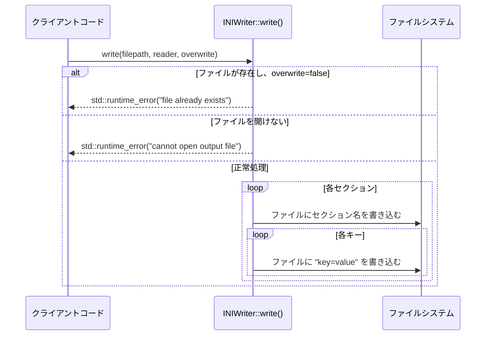

以下は、与えられたC++ソースコード（INIWriterクラス）を再実装できるように設計した詳細仕様書です。この仕様書は、元のコードから確認できる事実のみを基に作成されており、推測や補完は行われません。

---

# INIWriter クラスの詳細設計仕様書

## 1. 目的
INIファイルを書き込むための `INIWriter` クラスの完全再実装に必要な情報を提供する。このクラスは、与えられた `INIReader` オブジェクトから読み取ったデータを指定されたファイルパスに書き込む機能を提供する。

## 2. クラス図


## 3. クラス・メソッド・インターフェース詳細

| メンバ | 型 | 可視性 | 説明 |
|--------|------|---------|-------|
| `INIWriter()` | コンストラクタ | public | デフォルトコンストラクタ。何の処理も行わない。 |
| `write` | static void (const std::string&, const INIReader&, bool) | public | INIファイルを書き込む静的メソッド。 |

### メソッド詳細
#### `INIWriter()`
- **目的**: デフォルトコンストラクタ。
- **副作用**: なし（状態を保持しないクラス）。
- **注意**: このクラスは状態を保持せず、すべての処理が静的メソッドで行われる。

#### `write(const std::string& filepath, const INIReader& reader, bool overwrite = false)`
| 引数 | 型 | 説明 |
|-------|------|-------|
| `filepath` | `const std::string&` | 出力ファイルのパス。 |
| `reader` | `const INIReader&` | 入力データを提供する `INIReader` オブジェクト。 |
| `overwrite` | `bool` (default: `false`) | ファイルが既に存在する場合に上書きするかどうか。 |

- **戻り値**: なし (`void`)。
- **副作用**:
  - 指定されたパスにファイルを作成または上書きする。
  - ファイルが既に存在し、`overwrite` が `false` の場合、例外を投げる。
- **エラー処理**:
  - ファイルが既に存在し、`overwrite` が `false` の場合: `std::runtime_error` を投げる。
  - ファイルを開けない場合: `std::runtime_error` を投げる。

## 4. シーケンス図


## 5. メソッド仕様書

### `write` メソッドの仕様
- **目的**: `INIReader` から読み取ったデータを指定されたファイルに書き込む。
- **前提条件**:
  - `filepath` は有効なパスであること。
  - `reader` は有効な `INIReader` オブジェクトであること。
- **事後条件**:
  - ファイルが正常に書き込まれた場合、ファイルは指定された内容で作成または上書きされる。
  - エラーが発生した場合、例外が投げられる。
- **利用例**:
  ```cpp
  INIReader reader("input.ini");
  INIWriter::write("output.ini", reader, true); // 上書き許可
  ```

## 6. 処理フロー図
```mermaid
flowchart TD
    A[開始] --> B{ファイルが存在するか?}
    B -->|はい| C{overwrite == true?}
    C -->|いいえ| D[std::runtime_error("file already exists")]
    C -->|はい| E[ファイルを開く]
    B -->|いいえ| E
    E --> F{ファイルを開けられたか?}
    F -->|いいえ| G[std::runtime_error("cannot open output file")]
    F -->|はい| H[各セクションを処理]
    H --> I[各キーを処理]
    I --> J[ファイルに "key=value" を書き込む]
    J --> K[終了]
```

## 7. 状態遷移・副作用
- **状態**: このクラスは状態を保持しない（すべての処理が静的メソッドで行われる）。
- **副作用**:
  - ファイルシステムへの書き込み。
  - エラー時の例外投げ。

## 8. データ変換・制約
| 入力 | 出力 | 変換ルール |
|------|------|------------|
| `INIReader::Sections()` | ファイル内のセクション名 | セクション名は `[section]` の形式で書き込まれる。 |
| `INIReader::Keys(section)` | ファイル内のキー名 | キーは `key=value` の形式で書き込まれる。 |
| `INIReader::Get(section, key)` | ファイル内の値 | 値はそのまま書き込まれる。 |

- **制約**:
  - ファイルパスは有効な文字列であること。
  - `overwrite` が `false` の場合、ファイルが既に存在してはいけない。

## 9. 再実装忠実度の確認
- **完全再構築台帳**:
  - コンストラクタ: デフォルトコンストラクタのみ。
  - メソッド: `write` 静的メソッドのみ。
  - 引数名・型・デフォルト値は元コードと一致する。
  - エラー処理（例外投げ）は元コードと同じ。

## 10. 追加詳細設計情報
### クラス図の補足
- `INIWriter` は状態を保持しないため、メンバ変数はない。
- `write` メソッドは静的メソッドであり、インスタンス化せずに呼び出すことができる。

### シーケンス図の補足
- ファイルシステムへの書き込みは `std::ofstream` を使用して行われる。
- セクションとキーの順序は `INIReader` の返す順序に従う。

### メソッド仕様書の補足
- `write` メソッドは以下の手順で処理を行う：
  1. ファイルが存在するか確認し、`overwrite` が `false` の場合は例外を投げる。
  2. ファイルを開き、開けない場合は例外を投げる。
  3. 各セクションとキーを順にファイルに書き込む。

### 処理フロー図の補足
- `std::ifstream` を使用してファイル存在確認を行う。
- `std::ofstream` を使用してファイルを開く。

### 状態遷移・副作用の補足
- ファイルシステムへの書き込みは副作用として扱われる。
- 例外投げも副作用として扱われる。

### データ変換・制約の補足
- セクション名は `[section]` の形式で書き込まれる。
- キーと値は `key=value` の形式で書き込まれる。
- 改行コードは `\n` を使用する。

---

この仕様書を基に、別のLLMが `INIWriter` クラスを完全再実装できるようになっています。