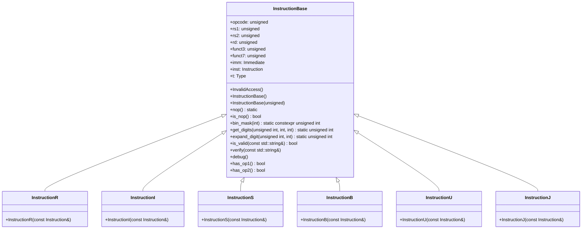

以下は、与えられたC++ソースコードを解析し、再実装に必要な詳細設計仕様書です。この仕様書は、元のコードから確認できる事実のみを記述しており、推測や補完は行っていません。

---

# 詳細設計仕様書

## 1. ファイル構造
- **ファイル名**: `src/Common/Instruction.hpp`
- **include guard**: `#ifndef RISCV_SIMULATOR_INSTRUCTION_HPP` / `#define RISCV_SIMULATOR_INSTRUCTION_HPP` / `#endif //RISCV_SIMULATOR_INSTRUCTION_HPP`
- **依存ヘッダー**:
  - `<utility>`
  - `"Common.h"` (内部ヘッダー)
  - `<string>`
  - `<iostream>`

## 2. 型定義
| 型名 | 種別 | 実体 |
|------|------|------|
| `Instruction` | `using` | `unsigned int` |
| `Immediate` | `using` (外部) | `unsigned int` (`Common.h`) |

## 3. クラス図


## 4. クラス・メソッド・インターフェース詳細

### `InstructionBase`
| メンバ | 型 | 属性 | 説明 |
|--------|------|-------|------|
| `opcode` | `unsigned` | - | オペコードフィールド |
| `rs1` | `unsigned` | - | 第一オペランドレジスタ番号 |
| `rs2` | `unsigned` | - | 第二オペランドレジスタ番号 |
| `rd` | `unsigned` | - | 目的レジスタ番号 |
| `funct3` | `unsigned` | - | 関数コード (3bit) |
| `funct7` | `unsigned` | - | 拡張関数コード (7bit) |
| `imm` | `Immediate` | - | 即値フィールド |
| `inst` | `Instruction` | - | 元の命令ワード |
| `t` | `Type` | - | 命令タイプ (`R`, `I`, `S`, `B`, `U`, `J`) |

#### メソッド
| メソッド名 | 戻り値型 | 引数 | 属性 | 説明 |
|-------------|----------|-------|-------|------|
| `InstructionBase()` | - | - | - | デフォルトコンストラクタ (全フィールドを0で初期化) |
| `InstructionBase(unsigned)` | - | `unsigned` | - | 特殊コンストラクタ (`opcode=0b0010011`, `t=I`, `inst=-1`) |
| `nop()` | `InstructionBase` | - | `static` | NOP命令を表すインスタンスを返す |
| `is_nop()` | `bool` | - | - | このインスタンスがNOPか判定 |
| `bin_mask(int)` | `unsigned int` | `int digits` | `static constexpr` | 指定ビット数のマスク値を計算 |
| `get_digits(unsigned int, int, int)` | `unsigned int` | `unsigned int n`, `int hi`, `int lo` | `static` | ビット列から指定範囲の値を抽出 |
| `expand_digit(unsigned int, int)` | `unsigned int` | `unsigned int digit`, `int lo` | `static` | 符号拡張を行う |
| `is_valid(const std::string&)` | `bool` | `const std::string& key` | - | 指定フィールドがこの命令タイプで有効か判定 |
| `verify(const std::string&)` | - | `const std::string& key` | - | フィールドアクセスの妥当性を検証 (無効なら例外投げ) |
| `debug()` | - | - | - | 命令内容をデバッグ出力 |
| `has_op1()` | `bool` | - | - | 第一オペランドを持つか判定 (`U`, `J` 以外) |
| `has_op2()` | `bool` | - | - | 第二オペランドを持つか判定 (`R`, `S`, `B`) |

### `InstructionR`
- **継承**: `InstructionBase`
- **コンストラクタ**:
  ```cpp
  InstructionR(const Instruction &inst)
  ```
  - `opcode`: `get_digits(inst, 6, 0)`
  - `rd`: `get_digits(inst, 11, 7)`
  - `funct3`: `get_digits(inst, 14, 12)`
  - `rs1`: `get_digits(inst, 19, 15)`
  - `rs2`: `get_digits(inst, 24, 20)`
  - `funct7`: `get_digits(inst, 31, 25)`
  - `t = R`

### `InstructionI`
- **継承**: `InstructionBase`
- **コンストラクタ**:
  ```cpp
  InstructionI(const Instruction &inst)
  ```
  - `opcode`: `get_digits(inst, 6, 0)`
  - `rd`: `get_digits(inst, 11, 7)`
  - `funct3`: `get_digits(inst, 14, 12)`
  - `rs1`: `get_digits(inst, 19, 15)`
  - `imm`: `get_digits(inst, 30, 20) | expand_digit(get_digits(inst, 31, 31), 11)`
  - `t = I`

### `InstructionS`
- **継承**: `InstructionBase`
- **コンストラクタ**:
  ```cpp
  InstructionS(const Instruction &inst)
  ```
  - `opcode`: `get_digits(inst, 6, 0)`
  - `funct3`: `get_digits(inst, 14, 12)`
  - `rs1`: `get_digits(inst, 19, 15)`
  - `rs2`: `get_digits(inst, 24, 20)`
  - `imm`: `get_digits(inst, 11, 7) | (get_digits(inst, 30, 25) << 5) | expand_digit(get_digits(inst, 31, 31), 11)`
  - `t = S`

### `InstructionB`
- **継承**: `InstructionBase`
- **コンストラクタ**:
  ```cpp
  InstructionB(const Instruction &inst)
  ```
  - `opcode`: `get_digits(inst, 6, 0)`
  - `funct3`: `get_digits(inst, 14, 12)`
  - `rs1`: `get_digits(inst, 19, 15)`
  - `rs2`: `get_digits(inst, 24, 20)`
  - `imm`: `(get_digits(inst, 11, 8) << 1) | (get_digits(inst, 30, 25) << 5) | (get_digits(inst, 7, 7) << 11) | expand_digit(get_digits(inst, 31, 31), 12)`
  - `t = B`

### `InstructionU`
- **継承**: `InstructionBase`
- **コンストラクタ**:
  ```cpp
  InstructionU(const Instruction &inst)
  ```
  - `opcode`: `get_digits(inst, 6, 0)`
  - `rd`: `get_digits(inst, 11, 7)`
  - `imm`: `(get_digits(inst, 19, 12) << 12) | (get_digits(inst, 30, 20) << 20) | (get_digits(inst, 31, 31) << 31)`
  - `t = U`

### `InstructionJ`
- **継承**: `InstructionBase`
- **コンストラクタ**:
  ```cpp
  InstructionJ(const Instruction &inst)
  ```
  - `opcode`: `get_digits(inst, 6, 0)`
  - `rd`: `get_digits(inst, 11, 7)`
  - `imm`: `(get_digits(inst, 30, 21) << 1) | (get_digits(inst, 20, 20) << 11) | (get_digits(inst, 19, 12) << 12) | expand_digit(get_digits(inst, 31, 31), 20)`
  - `t = J`

## 5. メソッド仕様書

### `InstructionBase::is_valid(const std::string &key)`
- **目的**: 指定フィールドが現在の命令タイプで有効か判定
- **引数**:
  - `key`: フィールド名 (`"imm"`, `"rs1"`, `"rs2"`, `"rd"`, `"funct3"`, `"funct7"`)
- **戻り値**: 有効なら`true`
- **動作**:
  - `t == R` → `"imm"` は無効
  - `t == I` → `"rs2"`, `"funct7"` は無効
  - `t == S` → `"rd"`, `"funct7"` は無効
  - `t == B` → `"rd"`, `"funct7"` は無効
  - `t == U` or `t == J` → `"rs1"`, `"rs2"`, `"funct3"`, `"funct7"` は無効

### `InstructionBase::verify(const std::string &key)`
- **目的**: フィールドアクセスの妥当性を検証
- **引数**:
  - `key`: フィールド名
- **副作用**: 無効な場合、`InvalidAccess` 例外投げ

### `InstructionBase::debug()`
- **目的**: 命令内容をデバッグ出力
- **動作**:
  - `inst` を16進数で表示
  - 特定オペコードに応じて命令名を表示 (`lui`, `auipc`, `jal`, `jalr`, `branch`, `load`, `store`)
  - `opcode == 0b0010011` → `funct3` に応じたI型命令名を表示

## 6. 処理フロー図
```mermaid
graph TD
    A[InstructionBaseコンストラクタ] --> B{タイプ}
    B -->|R| C[InstructionR]
    B -->|I| D[InstructionI]
    B -->|S| E[InstructionS]
    B -->|B| F[InstructionB]
    B -->|U| G[InstructionU]
    B -->|J| H[InstructionJ]

    C --> I[フィールド抽出 (R型)]
    D --> J[フィールド抽出 (I型)]
    E --> K[フィールド抽出 (S型)]
    F --> L[フィールド抽出 (B型)]
    G --> M[フィールド抽出 (U型)]
    H --> N[フィールド抽出 (J型)]
```

## 7. データ変換・制約

### ビット操作
| 関数 | 式 | 説明 |
|-------|----|------|
| `bin_mask(digits)` | `(1 << digits) - 1` | 指定ビット数のマスク値 |
| `get_digits(n, hi, lo)` | `(n >> lo) & bin_mask(hi - lo + 1)` | ビット列から指定範囲を抽出 |
| `expand_digit(digit, lo)` | `digit ? (0xffffffff << lo) : 0` | 符号拡張 |

### 命令タイプ別フィールド制約
| タイプ | 有効フィールド | 無効フィールド |
|-------|--------------|--------------|
| R     | `opcode`, `rs1`, `rs2`, `rd`, `funct3`, `funct7` | `imm` |
| I     | `opcode`, `rs1`, `rd`, `funct3`, `imm` | `rs2`, `funct7` |
| S     | `opcode`, `rs1`, `rs2`, `funct3`, `imm` | `rd`, `funct7` |
| B     | `opcode`, `rs1`, `rs2`, `funct3`, `imm` | `rd`, `funct7` |
| U/J   | `opcode`, `rd`, `imm` | `rs1`, `rs2`, `funct3`, `funct7` |

## 8. 状態遷移・副作用
- **副作用**: なし (データのみ読み取り/計算)
- **不変条件**:
  - `inst` はコンストラクタで設定され、変更されない
  - `t` はコンストラクタで設定され、変更されない

## 9. 追加詳細設計情報

### 完全再構築台帳
- **include順序**:
  1. `<utility>`
  2. `"Common.h"`
  3. `<string>`
  4. `<iostream>`
- **top-level宣言順序**:
  1. `using Instruction = unsigned int;`
  2. `struct InstructionBase { ... };`
  3. `struct InstructionR : InstructionBase { ... };`
  4. `struct InstructionI : InstructionBase { ... };`
  5. `struct InstructionS : InstructionBase { ... };`
  6. `struct InstructionB : InstructionBase { ... };`
  7. `struct InstructionU : InstructionBase { ... };`
  8. `struct InstructionJ : InstructionBase { ... };`

### 外部依存
- `Immediate`: `Common.h` から取得 (`using Immediate = unsigned int;`)

---

この仕様書は、元のコードから確認できる事実のみを記述しており、再実装に必要な情報が網羅されています。