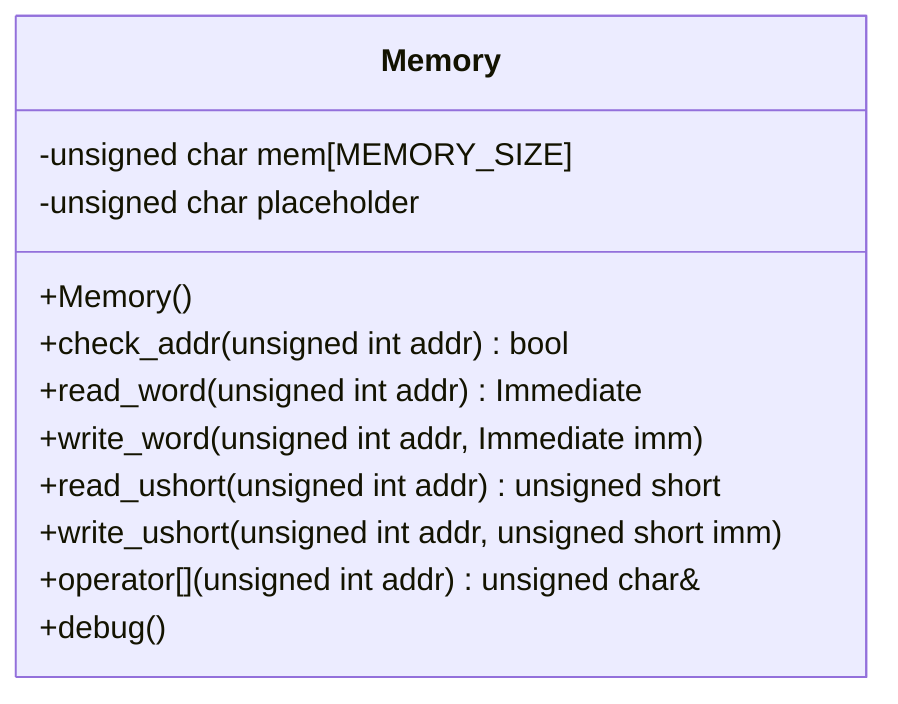
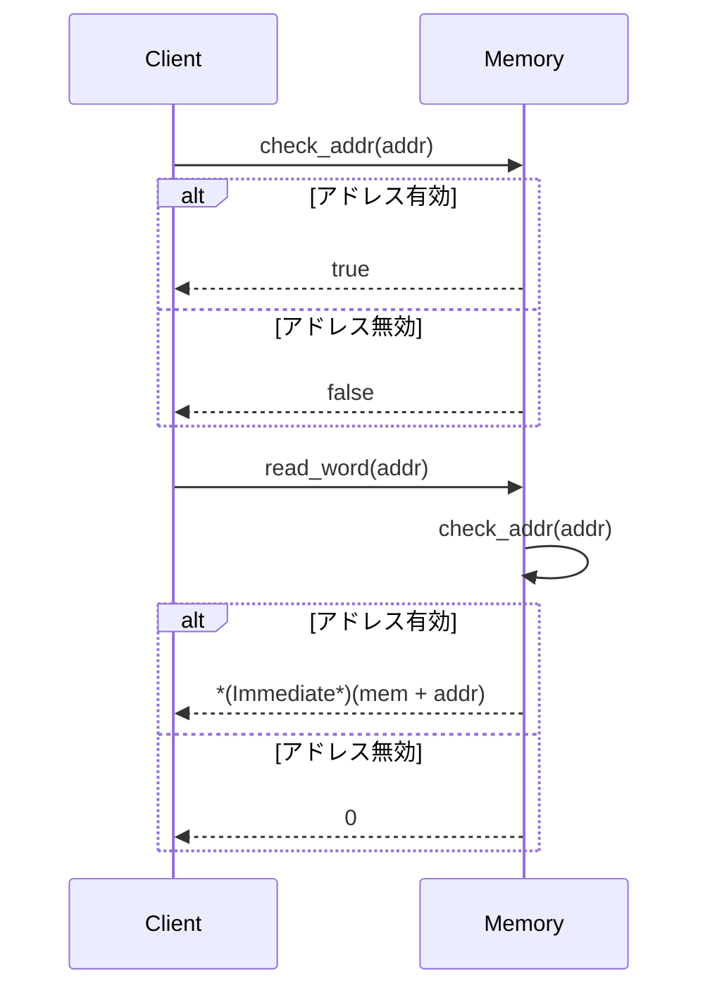

以下は、与えられたC++ソースコードを解析し、再実装に必要な詳細設計仕様書です。この仕様書は、元のコードから確認できる事実のみを記述しており、推測や補完は行っていません。

---

# 詳細設計仕様書

## 1. クラス図


## 2. クラス・メソッド・インターフェース詳細

| メンバ/メソッド | 型 | 可視性 | 説明 |
|-----------------|----|--------|------|
| `mem` | `unsigned char[MEMORY_SIZE]` | private | メモリ領域を格納する配列。 |
| `placeholder` | `unsigned char` | private | アドレスチェックに失敗した場合の代替値。 |
| `Memory()` | - | public | コンストラクタ。`mem`を0で初期化する。 |
| `check_addr(unsigned int addr)` | `bool` | public | アドレスが有効かどうかをチェックする。 |
| `read_word(unsigned int addr)` | `Immediate` | public | 指定アドレスから4バイト読み込む。 |
| `write_word(unsigned int addr, Immediate imm)` | - | public | 指定アドレスに4バイト書き込む。 |
| `read_ushort(unsigned int addr)` | `unsigned short` | public | 指定アドレスから2バイト読み込む。 |
| `write_ushort(unsigned int addr, unsigned short imm)` | - | public | 指定アドレスに2バイト書き込む。 |
| `operator[](unsigned int addr)` | `unsigned char&` | public | アドレス指定による1バイト読み書き。 |
| `debug()` | - | public | デバッグ用にメモリ内容を出力する。 |

## 3. シーケンス図


## 4. メソッド仕様書

### `check_addr(unsigned int addr)`
- **目的**: アドレスが有効範囲内かどうかをチェックする。
- **引数**:
  - `addr`: チェック対象のアドレス。
- **戻り値**: `true` (有効), `false` (無効)。
- **動作**:
  - `0 <= addr < MEMORY_SIZE` の場合、`true` を返す。
  - その他の場合、`false` を返す。

### `read_word(unsigned int addr)`
- **目的**: 指定アドレスから4バイト読み込む。
- **引数**:
  - `addr`: 読み込み対象のアドレス。
- **戻り値**: 読み込んだ値 (`Immediate` 型)。
- **動作**:
  - `check_addr(addr)` が `false` の場合、0 を返す。
  -  otherwise, `*(Immediate*)(mem + addr)` を返す。

### `write_word(unsigned int addr, Immediate imm)`
- **目的**: 指定アドレスに4バイト書き込む。
- **引数**:
  - `addr`: 書き込み対象のアドレス。
  - `imm`: 書き込む値。
- **動作**:
  - `check_addr(addr)` が `false` の場合、何もしない。
  - otherwise, `*(Immediate*)(mem + addr) = imm` を実行する。

### `read_ushort(unsigned int addr)`
- **目的**: 指定アドレスから2バイト読み込む。
- **引数**:
  - `addr`: 読み込み対象のアドレス。
- **戻り値**: 読み込んだ値 (`unsigned short` 型)。
- **動作**:
  - `check_addr(addr)` が `false` の場合、0 を返す。
  - otherwise, `*(short*)(mem + addr)` を返す。

### `write_ushort(unsigned int addr, unsigned short imm)`
- **目的**: 指定アドレスに2バイト書き込む。
- **引数**:
  - `addr`: 書き込み対象のアドレス。
  - `imm`: 書き込む値。
- **動作**:
  - `check_addr(addr)` が `false` の場合、何もしない。
  - otherwise, `*(short*)(mem + addr) = imm` を実行する。

### `operator[](unsigned int addr)`
- **目的**: アドレス指定による1バイト読み書きを行う。
- **引数**:
  - `addr`: アクセス対象のアドレス。
- **戻り値**: `unsigned char&` (参照)。
- **動作**:
  - `check_addr(addr)` が `false` の場合、`placeholder` を返す。
  - otherwise, `mem[addr]` を返す。

### `debug()`
- **目的**: デバッグ用にメモリ内容を出力する。
- **動作**:
  - アドレス `0x20000 - 0x10` から `0x20000` までのメモリ内容を16進数で出力する。

## 5. 処理フロー図
```mermaid
graph TD
    A[開始] --> B{check_addr(addr)}
    B -->|true| C[アドレス有効]
    B -->|false| D[アドレス無効]
    C --> E[read_word: *(Immediate*)(mem + addr)]
    C --> F[write_word: *(Immediate*)(mem + addr) = imm]
    C --> G[read_ushort: *(short*)(mem + addr)]
    C --> H[write_ushort: *(short*)(mem + addr) = imm]
    D --> I[0を返す/何もしない]
```

## 6. 状態遷移・副作用
- **初期化**: コンストラクタで `mem` を0で初期化する。
- **副作用**:
  - `write_word`, `write_ushort`, `operator[]` はメモリ内容を変更する。
  - `debug()` は標準出力にデータを書き込む。

## 7. データ変換・制約
| 項目 | 説明 |
|------|------|
| `MEMORY_SIZE` | メモリサイズ（未定義）。 |
| `Immediate` | `unsigned int` の型別名。 |
| アドレス範囲 | `0 <= addr < MEMORY_SIZE`。 |

## 追加詳細設計情報

### 完全再構築台帳
- **クラス定義**:
  - `class Memory { ... }`
  - メンバ変数: `mem`, `placeholder`
  - メソッド: `check_addr`, `read_word`, `write_word`, `read_ushort`, `write_ushort`, `operator[]`, `debug`

- **依存関係**:
  - `Immediate` は `src/Common/Common.h` で定義されている。

### 型・定数
| 名前 | 型 | 値/実体 |
|------|----|--------|
| `mem` | `unsigned char[MEMORY_SIZE]` | メモリ領域。 |
| `placeholder` | `unsigned char` | アドレスチェック失敗時の代替値。 |
| `Immediate` | `using` | `unsigned int` |

### 直接依存インターフェース
- `memset`: `<cstring>` から使用。
- `std::cout`, `std::hex`: `<iostream>` から使用。

### 結果を決める式・具体値
| 式/値 | 説明 |
|-------|------|
| `0 <= addr && addr < MEMORY_SIZE` | アドレス有効性の条件。 |
| `*(Immediate*)(mem + addr)` | 4バイト読み込み。 |
| `*(short*)(mem + addr)` | 2バイト読み込み。 |

### 使用データ・更新データ
| データ | アクセス種別 | 説明 |
|--------|-------------|------|
| `mem` | 読み書き | メモリ内容。 |
| `placeholder` | 読み出し | アドレスチェック失敗時の代替値。 |

### 状態・副作用・不変条件
- **初期化**: コンストラクタで `mem` を0で初期化する。
- **副作用**:
  - `write_word`, `write_ushort`, `operator[]` はメモリ内容を変更する。
  - `debug()` は標準出力にデータを書き込む。

---

この仕様書は、元のコードから確認できる事実のみを記述しており、再実装に必要な情報が網羅されています。