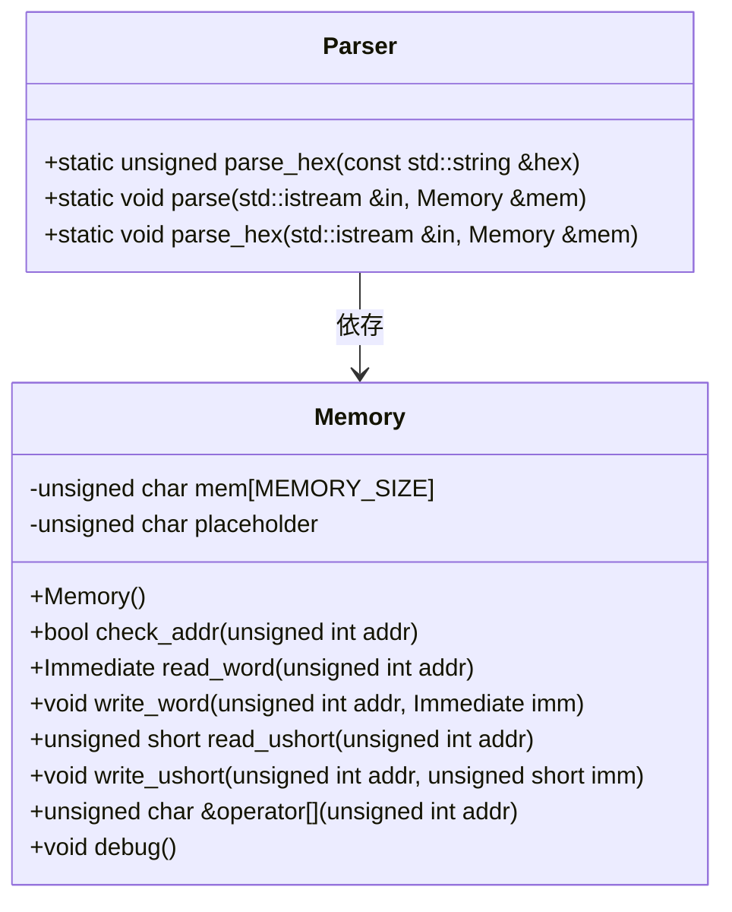
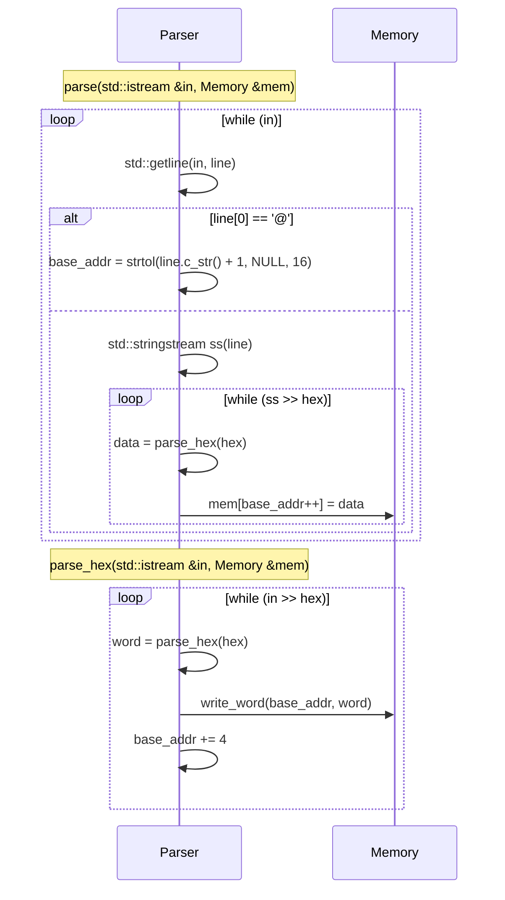

以下は、与えられたC++ソースコードを解析し、再実装に必要な詳細設計仕様書です。この仕様書は、元のコードから確認できる事実のみを記述しており、推測や補完は行っていません。

---

# 詳細設計仕様書

## 1. クラス図


## 2. クラス・メソッド・インターフェース詳細

### Parser クラス
| メソッド名 | 戻り値型 | 引数 | 可視性 | const | 副作用 |
|-------------|----------|------|--------|-------|--------|
| `parse_hex` | `unsigned` | `const std::string &hex` | public | static | なし |
| `parse` | `void` | `std::istream &in`, `Memory &mem` | public | static | `mem` への書き込み |
| `parse_hex` | `void` | `std::istream &in`, `Memory &mem` | public | static | `mem` への書き込み |

### Memory クラス（依存）
| メソッド名 | 戻り値型 | 引数 | 可視性 | const | 副作用 |
|-------------|----------|------|--------|-------|--------|
| `write_word` | `void` | `unsigned int addr`, `Immediate imm` | public | - | `mem[addr]` への書き込み |

## 3. シーケンス図


## 4. メソッド仕様書

### `parse_hex(const std::string &hex)`
- **目的**: 16進数文字列を unsigned 整数に変換する。
- **引数**:
  - `hex`: 16進数文字列（例: `"A1"`）。
- **戻り値**: 変換後の unsigned 値。
- **副作用**: なし。
- **エラー処理**: `strtol` の動作に依存する。

### `parse(std::istream &in, Memory &mem)`
- **目的**: 入力ストリームからメモリにデータを書き込む。
- **引数**:
  - `in`: 入力ストリーム（例: ファイル）。
  - `mem`: メモリオブジェクト。
- **動作**:
  1. `@` で始まる行はアドレスとして解釈し、`base_addr` を更新する。
  2. その他の行は 16進数データとして解釈し、`mem[base_addr]` に書き込む。
- **副作用**: `mem` の内容を変更する。

### `parse_hex(std::istream &in, Memory &mem)`
- **目的**: 入力ストリームからメモリにワード単位でデータを書き込む。
- **引数**:
  - `in`: 入力ストリーム（例: ファイル）。
  - `mem`: メモリオブジェクト。
- **動作**:
  1. 各行を 16進数として読み込み、`parse_hex` で変換する。
  2. `write_word(base_addr, word)` でメモリに書き込む。
  3. `base_addr` を 4 増加させる。
- **副作用**: `mem` の内容を変更する。

## 5. 処理フロー図
```mermaid
graph TD
    A[開始] --> B{inが有効か?}
    B -->|Yes| C[行読み込み]
    C --> D{行が'@'で始まるか?}
    D -->|Yes| E[base_addr = strtol(line.c_str() + 1, NULL, 16)]
    D -->|No| F[文字列ストリーム作成]
    F --> G{hex読み込み成功か?}
    G -->|Yes| H[data = parse_hex(hex)]
    H --> I[mem[base_addr++] = data]
    G -->|No| J[終了]
    E --> B
    I --> B

    K[開始] --> L{in >> hex 成功か?}
    L -->|Yes| M[word = parse_hex(hex)]
    M --> N[write_word(base_addr, word)]
    N --> O[base_addr += 4]
    O --> L
    L -->|No| P[終了]
```

## 6. 状態遷移・副作用
| 状態 | 条件 | 変更対象 | 副作用 |
|------|------|-----------|--------|
| `base_addr` | `@` で始まる行を読み込んだ場合 | `base_addr` | `mem` への書き込みなし |
| `mem[base_addr]` | データ行を読み込んだ場合 | `mem[base_addr]` | `base_addr` 増加 |

## 7. データ変換・制約
- **16進数変換**: `strtol(hex.c_str(), NULL, 16)` を使用。
- **アドレス増分**:
  - `parse`: バイト単位 (`base_addr++`)。
  - `parse_hex`: ワード単位 (`base_addr += 4`)。
- **制約**:
  - `mem[addr]` は `Memory::check_addr(addr)` で検証される（依存関係）。

## 追加詳細設計情報

### 型定義
| 型名 | 種別 | 実体 |
|------|------|-------|
| `Immediate` | typedef | `unsigned int`（推測） |

### 直接依存インターフェース
- **Memory::write_word**:
  - 引数: `unsigned int addr`, `Immediate imm`
  - 副作用: `mem[addr]` に `imm` を書き込む。

### 具体値・式
| 項目 | 値/式 |
|------|-------|
| アドレス増分（parse） | `base_addr++` |
| アドレス増分（parse_hex） | `base_addr += 4` |
| 16進数変換基数 | `16` |

### データアクセス
- **入力**: `std::istream &in`
- **出力**: `Memory &mem`

---

この仕様書は、元のコードから確認できる事実のみを記述しており、再実装に必要な情報が網羅されています。