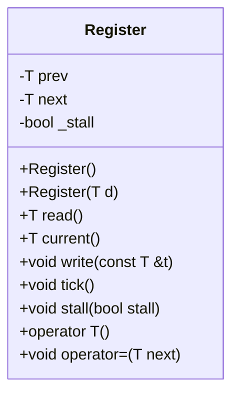
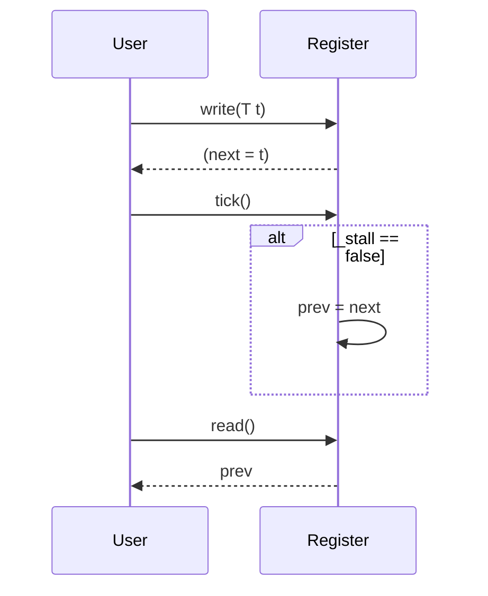

以下は、与えられたC++ソースコード（`Register.hpp`）を基にした詳細な設計仕様書です。この仕様書は、別のLLMが再実装できるように、必要な情報を網羅的に記述しています。

---

# Register クラスの詳細設計仕様書

## 1. 概要
`Register` クラスは、2つの値 (`prev` と `next`) を保持し、時計周期 (`tick()`) によって状態を更新する機能を提供します。スタル（`_stall`）状態により、状態更新を一時停止できます。

## 2. クラス図


## 3. クラス・メソッド・インターフェース詳細
| メンバ/メソッド | 型 | 可視性 | 説明 |
|-----------------|----|--------|-------|
| `prev`          | `T` | private | 前回の値を保持するフィールド。 |
| `next`          | `T` | private | 次の値を保持するフィールド。 |
| `_stall`        | `bool` | private | スタル状態を示すフラグ。 |
| `Register()`    | - | public | デフォルトコンストラクタ。`prev` と `next` を `0` に初期化し、`_stall` を `false` に設定する。 |
| `Register(T d)` | - | public | 引数付きコンストラクタ。`prev` と `next` を `d` で初期化し、`_stall` を `false` に設定する。 |
| `read()`        | `T` | public | `prev` の値を返す。 |
| `current()`     | `T` | public | `next` の値を返す。 |
| `write(T t)`    | `void` | public | `next` に `t` を代入する。 |
| `tick()`        | `void` | public | `_stall` が `false` なら、`prev` に `next` の値をコピーする。 |
| `stall(bool stall)` | `void` | public | `_stall` を `stall` で更新する。 |
| `operator T()` | `T` | public | `read()` と同じ動作をする型変換演算子。 |
| `operator=(T next)` | `void` | public | `write(next)` と同じ動作をする代入演算子。 |

## 4. シーケンス図


## 5. メソッド仕様書
### `read()`
- **目的**: 前回の値 (`prev`) を取得する。
- **戻り値**: `T` 型の `prev` の値。
- **副作用**: なし。

### `current()`
- **目的**: 次の値 (`next`) を取得する。
- **戻り値**: `T` 型の `next` の値。
- **副作用**: なし。

### `write(T t)`
- **目的**: 次の値 (`next`) を更新する。
- **引数**:
  - `t`: `const T&` 型。新しい値。
- **副作用**: `next` が `t` に更新される。

### `tick()`
- **目的**: `_stall` が `false` の場合、`prev` を `next` で更新する。
- **副作用**:
  - `_stall == false` なら `prev = next` が実行される。

### `stall(bool stall)`
- **目的**: スタル状態を設定/解除する。
- **引数**:
  - `stall`: `bool` 型。スタルフラグの新しい値。
- **副作用**: `_stall` が `stall` に更新される。

### `operator T()`
- **目的**: `read()` と同じ動作をする型変換演算子。
- **戻り値**: `T` 型の `prev` の値。
- **副作用**: なし。

### `operator=(T next)`
- **目的**: `write(next)` と同じ動作をする代入演算子。
- **引数**:
  - `next`: `T` 型。新しい値。
- **副作用**: `next` が更新される。

## 6. 処理フロー図
```mermaid
graph TD
    A[write(T t)] --> B[next = t]
    C[tick()] --> D{_stall == false?}
    D -->|Yes| E[prev = next]
    D -->|No| F[何もしない]
    G[read()] --> H[return prev]
```

## 7. 状態遷移・副作用
| 状態 | 条件 | 副作用 |
|------|-------|--------|
| `prev` | `_stall == false` 且つ `tick()` が呼び出された | `prev = next` |
| `next` | `write(T t)` が呼び出された | `next = t` |
| `_stall` | `stall(bool stall)` が呼び出された | `_stall = stall` |

## 8. データ変換・制約
- **型 `T`**: テンプレートパラメータとして指定される任意の型。
- **初期値**:
  - `prev`: `0` (型 `T` のデフォルト値)。
  - `next`: `0` (型 `T` のデフォルト値)。
  - `_stall`: `false`。
- **制約**: なし（`T` は任意の型）。

## 9. 完全再構築台帳
```cpp
template <typename T>
class Register {
public:
    T prev, next;
    bool _stall;

    Register() : prev((T)0), next((T)0), _stall(false) {}
    Register(T d) : prev(d), next(d), _stall(false) {}

    T read() { return prev; }
    T current() { return next; }

    void write(const T &t) { next = t; }
    void tick() { if (!_stall) prev = next; }
    void stall(bool stall) { _stall = stall; }

    operator T() { return read(); }
    void operator=(T next) { write(next); }
};
```

## 10. 注意事項
- `T` はテンプレートパラメータであり、再実装時には適切な型を指定する必要があります。
- `prev` と `next` の初期値は `(T)0` であり、`T` が整数型以外の場合でもこの式が有効であることを確認してください。

---

この仕様書は、与えられたソースコードから確認できる事実のみを記述しています。再実装時には、この仕様に従って `Register` クラスを忠実に再現してください。