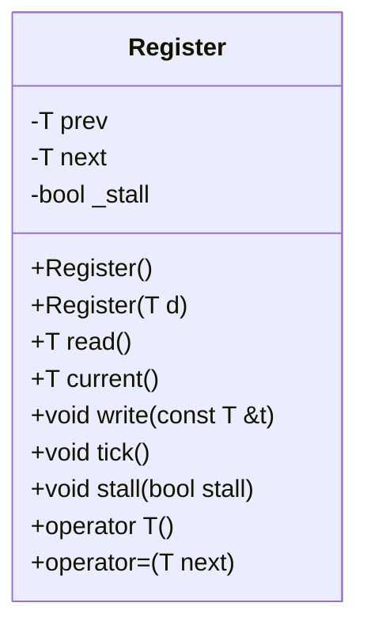

以下は、与えられたC++ソースコード（`Register.hpp`）を基にした詳細な設計仕様書です。この仕様書は、別のLLMが再実装できるように、必要な情報を網羅的に記述しています。

---

# Register クラスの詳細設計仕様書

## 1. 概要
`Register` クラスは、2つの値（`prev` と `next`）とスタル状態（`_stall`）を管理する。このクラスは、時計周期などで使用される可能性があり、`tick()` メソッドによって状態が更新されます。

## 2. 完全再構築台帳

### 2.1. クラス定義
```cpp
class Register { // : public Tickable {
public:
    T prev, next;
    bool _stall;

    Register() : prev((T) 0), next((T) 0), _stall(false) {}
    Register(T d) : prev(d), next(d), _stall(false) {}

    T read() { return prev; }
    T current() { return next; }
    void write(const T &t) { next = t; }
    void tick() { if (!_stall) prev = next; }
    void stall(bool stall) { _stall = stall; }

    operator T() { return read(); }
    void operator=(T next) { write(next); }
};
```

### 2.2. メンバ変数
| 名前 | 型 | 初期値 | 説明 |
|------|----|--------|-------|
| `prev` | `T` | `(T) 0` | 前回の値を保持する。 |
| `next` | `T` | `(T) 0` | 次の値を保持する。 |
| `_stall` | `bool` | `false` | スタル状態を示すフラグ。 |

### 2.3. メソッド
| 名前 | 戻り値型 | 引数 | 説明 |
|------|---------|-------|-------|
| `read()` | `T` | なし | `prev` の値を返す。 |
| `current()` | `T` | なし | `next` の値を返す。 |
| `write(const T &t)` | `void` | `const T &t` | `next` に `t` を代入する。 |
| `tick()` | `void` | なし | `_stall` が `false` なら `prev` に `next` をコピーする。 |
| `stall(bool stall)` | `void` | `bool stall` | `_stall` を `stall` に設定する。 |
| `operator T()` | `T` | なし | `read()` と同じ動作をする変換演算子。 |
| `operator=(T next)` | `void` | `T next` | `write(next)` と同じ動作をする代入演算子。 |

## 3. クラス図


## 4. メソッド仕様書

### 4.1. `read()`
- **目的**: `prev` の値を返す。
- **戻り値**: `prev` の値。
- **副作用**: なし。

### 4.2. `current()`
- **目的**: `next` の値を返す。
- **戻り値**: `next` の値。
- **副作用**: なし。

### 4.3. `write(const T &t)`
- **目的**: `next` に `t` を代入する。
- **引数**:
  - `t`: 代入する値。
- **副作用**: `next` が更新される。

### 4.4. `tick()`
- **目的**: `_stall` が `false` なら `prev` に `next` をコピーする。
- **副作用**:
  - `_stall` が `false` の場合、`prev` が更新される。

### 4.5. `stall(bool stall)`
- **目的**: `_stall` を設定する。
- **引数**:
  - `stall`: スタル状態を示すフラグ。
- **副作用**: `_stall` が更新される。

### 4.6. `operator T()`
- **目的**: `read()` と同じ動作をする変換演算子。
- **戻り値**: `prev` の値。
- **副作用**: なし。

### 4.7. `operator=(T next)`
- **目的**: `write(next)` と同じ動作をする代入演算子。
- **引数**:
  - `next`: 代入する値。
- **副作用**: `next` が更新される。

## 5. 処理フロー図
```mermaid
flowchart TD
    A[Start] --> B[read()]
    B --> C[Return prev]
    A --> D[current()]
    D --> E[Return next]
    A --> F[write(const T &t)]
    F --> G[Set next = t]
    A --> H[tick()]
    H --> I[If _stall is false]
    I --> J[Set prev = next]
    A --> K[stall(bool stall)]
    K --> L[Set _stall = stall]
```

## 6. 状態遷移・副作用
| 状態 | 条件 | 副作用 |
|------|-------|--------|
| `prev` | `_stall == false` | `prev = next` |
| `next` | `write()` が呼び出される | `next = t` |
| `_stall` | `stall()` が呼び出される | `_stall = stall` |

## 7. データ変換・制約
- `T` は任意の型であり、クラス内で具体的な型は指定されていない。
- `prev` と `next` は同じ型 `T` を持つ。
- `_stall` は `bool` 型である。

## 8. 注意事項
- コメントにある `// : public Tickable {` は実装されていないため、再実装時には考慮しない。
- `T` の具体的な型は外部で定義されるため、このクラスでは型制約はない。

---

この仕様書を基に、別のLLMが `Register` クラスを完全に再実装できるようになっています。