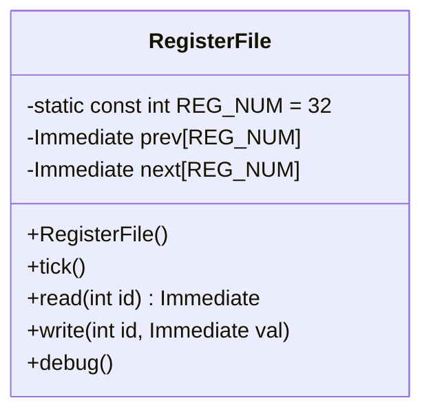
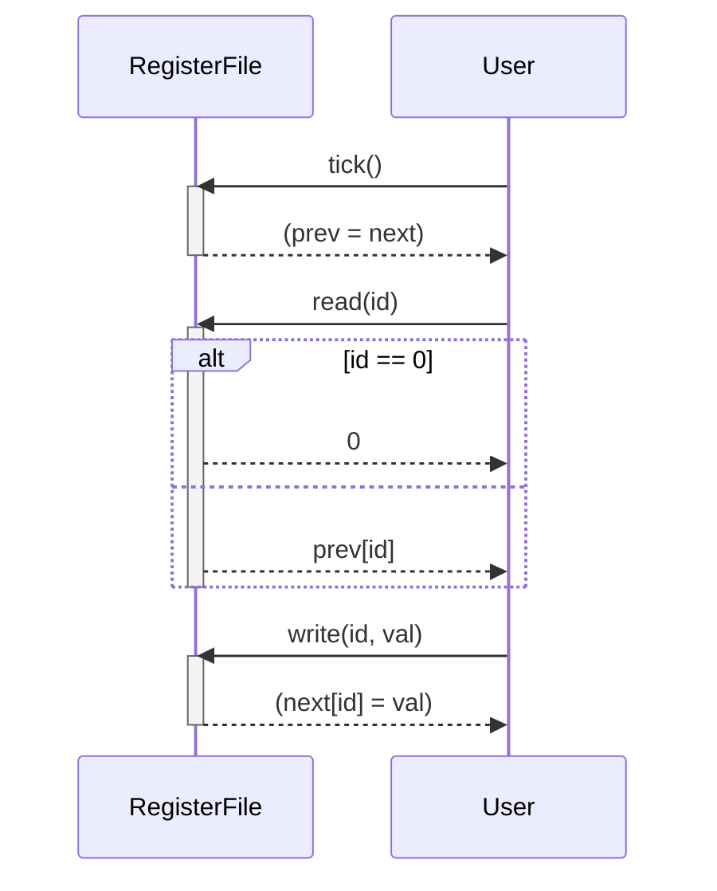

以下は、与えられたC++ソースコードを解析し、再実装に必要な詳細設計仕様書です。この仕様書は、元のコードから確認できる事実のみを記述しており、推測や補完は行っていません。

---

# RegisterFile クラスの詳細設計仕様書

## 1. 目的
`RegisterFile` クラスは、RISC-V アーキテクチャのレジスタファイルをモデル化します。このクラスは、32個のレジスタ（x0からx31）を管理し、時刻ごとに前回値 (`prev`) と次回値 (`next`) を更新することで、パイプライン処理をサポートします。

## 2. クラス図


## 3. クラス・メソッド・インターフェース詳細

| メンバ/メソッド | 型 | 可視性 | 説明 |
|-----------------|----|--------|-------|
| `REG_NUM` | `static const int` | private | レジスタ数（32）を定義します。 |
| `prev` | `Immediate[REG_NUM]` | public | 前回時刻のレジスタ値を格納します。 |
| `next` | `Immediate[REG_NUM]` | public | 次回時刻のレジスタ値を格納します。 |
| `RegisterFile()` | - | public | コンストラクタ。`prev` と `next` をゼロ初期化します。 |
| `tick()` | `void` | public | `prev` を `next` の内容で更新します。 |
| `read(int id)` | `Immediate` | public | レジスタ `id` の値を返します。`id == 0` の場合は `0` を返します。 |
| `write(int id, Immediate val)` | `void` | public | レジスタ `id` に `val` を書き込みます（`next` 配列に反映）。 |
| `debug()` | `void` | public | レジスタの内容をデバッグ出力します。 |

## 4. シーケンス図


## 5. メソッド仕様書

### `RegisterFile()`
- **目的**: `prev` と `next` 配列をゼロ初期化します。
- **副作用**: `prev` と `next` のすべての要素が `0` に設定されます。

### `tick()`
- **目的**: `prev` を `next` の内容で更新します。
- **動作**:
  - `memcpy(prev, next, sizeof(prev))` を実行します。
- **副作用**: `prev` 配列が `next` 配列の内容で置き換えられます。

### `read(int id)`
- **目的**: レジスタ `id` の値を返します。
- **引数**:
  - `id`: レジスタ番号（0から31）。
- **戻り値**: `id == 0` の場合は `0`、それ以外の場合は `prev[id]` の値。
- **副作用**: なし。

### `write(int id, Immediate val)`
- **目的**: レジスタ `id` に `val` を書き込みます。
- **引数**:
  - `id`: レジスタ番号（0から31）。
  - `val`: 書き込む値。
- **副作用**: `next[id]` が `val` に設定されます。

### `debug()`
- **目的**: レジスタの内容をデバッグ出力します。
- **動作**:
  - レジスタ名 (`rf_name`) を使用して、4行×8列のグリッド形式で出力します。
  - 各レジスタの値は `debug_immediate(next[j], 11)` で表示されます。
- **副作用**: 標準出力にデバッグ情報が書き込まれます。

## 6. 処理フロー図
```mermaid
graph TD
    A[Start] --> B[tick()]
    B --> C[memcpy(prev, next, sizeof(prev))]
    C --> D[End]

    E[read(id)] --> F[id == 0?]
    F -->|Yes| G[return 0]
    F -->|No| H[return prev[id]]
    G --> I[End]
    H --> I

    J[write(id, val)] --> K[next[id] = val]
    K --> L[End]

    M[debug()] --> N[Print header (rf_name)]
    N --> O[Loop: 4 rows × 8 columns]
    O --> P[Print next[j] with debug_immediate]
    P --> Q[End]
```

## 7. 状態遷移・副作用
| 状態 | 更新条件 | 変更対象 | 副作用 |
|------|-----------|-----------|--------|
| `prev` | `tick()` 呼び出し時 | `prev = next` | `prev` 配列が更新されます。 |
| `next` | `write(id, val)` 呼び出し時 | `next[id] = val` | `next` 配列の特定要素が更新されます。 |

## 8. データ変換・制約
- **レジスタ数**: `REG_NUM = 32`（固定）。
- **レジスタ0**: `read(0)` は常に `0` を返します。
- **型**: `Immediate` は `unsigned int` として定義されています（`Common.h` を参照）。

## 9. 直接依存インターフェース
| 依存先 | 使用方法 |
|--------|----------|
| `memcpy` | `tick()` 内で `prev` を `next` にコピーします。 |
| `debug_immediate` | `debug()` 内でレジスタ値を出力します。 |

## 10. 追加詳細設計情報

### 完全再構築台帳
- **ファイル**: `src/Common/RegisterFile.hpp`
- **include**: `#include <cstring>`（`memcpy`、`memset` のため）、`#include <iostream>`、`#include <iomanip>`、`#include <vector>`、`#include <string>`。
- **型定義**:
  - `Immediate`: `unsigned int`（`Common.h` より）。
- **クラス定義**:
  - `RegisterFile` は `REG_NUM = 32` のレジスタを管理します。
  - `prev` と `next` は両方とも `Immediate[REG_NUM]` です。
- **メソッド実装**:
  - コンストラクタ: `memset(prev, 0, sizeof(prev))` と `memset(next, 0, sizeof(next))` を呼び出します。
  - `tick()`: `memcpy(prev, next, sizeof(prev))` を呼び出します。
  - `read(id)`: `id == 0 ? 0 : prev[id]` を返します。
  - `write(id, val)`: `next[id] = val` を実行します。
  - `debug()`: `rf_name` 配列を使用して、4×8のグリッドでレジスタ名と値を出力します。

### 注意事項
- レジスタ0 (`x0`) は常にゼロです（ハードウェア仕様）。
- `prev` と `next` の更新は明示的に行われます（パイプライン処理用）。

---

この設計仕様書を基に、別のLLMが `RegisterFile` クラスを完全に再実装できるようになっています。