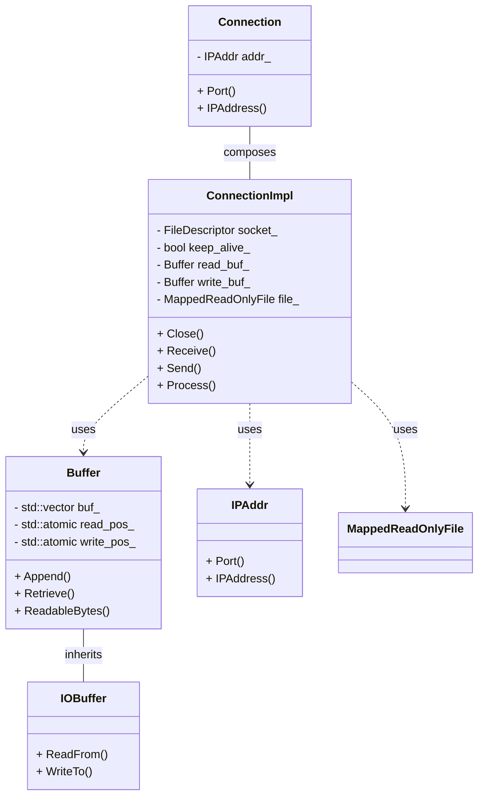
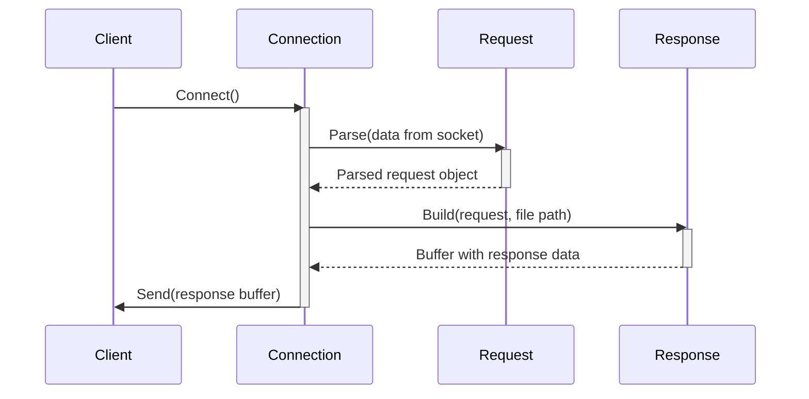

## ws::http Detailed Design Specification

This document details the design of the `ws::http` namespace, based on the provided source code. It aims to provide sufficient information for a separate LLM to reimplement this functionality without access to the original source.  The focus is on completeness and accuracy over brevity or abstraction.

### 1. Accurate Definitions

| Name | Type | Description |
|---|---|---|
| `version` | `constexpr std::string_view` | HTTP version string, initialized to "1.1". |
| `Parameters` | `std::unordered_map<std::string, std::string>` |  A map for storing key-value pairs as strings. Used for request and response parameters.|
| `StatusCode` | `enum class std::uint32_t` | An enumeration representing HTTP status codes (OK=200, BadRequest=400, Forbidden=403, NotFound=404). |
| `Method` | `enum class` |  An enumeration representing HTTP methods (Get, Post, Put, Patch, Delete). |
| `NewLine` | `enum class` | Enumeration for newline characters (LF, CRLF) used in HTTP headers and body. |

### 2. Direct Dependency Interfaces & Usage

**Dependencies:**

*   `include/containers/buffer.h`: Provides `Buffer` and `IOBuffer` classes for handling data streams.
*   `include/ip.h`: Defines `IPAddr`, `IPv4Addr`, and `IPv6Addr` for network address management.
*   `include/io.h`:  Provides interfaces for reading and writing data (`IReader`, `IWriter`, `IReadWriter`).
*   `include/util.h`: Provides utility functions like string manipulation, file descriptor handling, and YAML parsing.

**Key Interfaces & Usage:**

*   `Buffer::Append()`: Appends data to the buffer. Used extensively in request and response construction.
*   `IOBuffer::ReadFrom()` / `WriteTo()`:  Reads from/writes to an `IReadWriter`. Core of network communication.
*   `IPAddr::Port()`, `IPAddr::IPAddress()`: Retrieves port number and IP address as strings. Used for logging and potentially other processing.
*   `FileDescriptor`: Represents a file descriptor (integer).  Used for socket operations.

### 3. Results Determining Expressions & Concrete Values

*   Status code integer values: 200, 400, 403, 404.
*   HTTP version string: "1.1".
*   Default buffer size in `Buffer` constructor: 1000.
*   Loopback IP addresses: "127.0.0.1" (IPv4), "::1" (IPv6).
*   Any IP addresses: "0.0.0.0" (IPv4), "::" (IPv6).

### 4. Used & Updated Data

**`ConnectionImpl`:**

*   `socket_`: File descriptor representing the socket connection.  Updated during initialization and closed in destructor/`Close()` method.
*   `keep_alive_`: Boolean indicating whether to keep the connection alive. Updated based on request headers.
*   `read_buf_`, `write_buf_`: Buffers used for reading from and writing to the socket.  Data is read into `read_buf_` by `Receive()` and written from `write_buf_` by `Send()`.
*   `file_`: Mapped readonly file representing the requested resource. Updated during request processing.

**`Connection`:**

*   `addr_`: Stores the IP address information of the connection. Initialized in constructor, read-only after that.

### 5. State, Side Effects & Invariants

*   `ConnectionImpl::Close()`: Closes the socket file descriptor and sets `socket_` to `invalid_file_descriptor`.  Side effect: releases network resource.
*   `Buffer`: Manages internal buffer data. Appending beyond capacity will reallocate memory (side effect). Retrieving reduces readable size.
*   `MappedReadOnlyFile`: Maps a file into memory. Side effects: uses system resources, potential for errors if the file doesn't exist or is inaccessible.

### 6. Class Diagram

### 7. Class, Method & Interface Details

| **Class/Method** | **Signature** | **Description** |
|---|---|---|
| `Buffer` | `Buffer(std::size_t size)` | Constructor with initial size. |
| `Buffer::Append()` | `void Append(std::span<const std::byte> bytes)` | Appends data to the buffer. |
| `IOBuffer::ReadFrom()` | `std::size_t ReadFrom(io::IReadWriter& io)` | Reads data from an IReadWriter into the buffer. |
| `ConnectionImpl::Close()` | `void Close() noexcept` | Closes the socket connection. |
| `ConnectionImpl::Receive()` | `std::size_t Receive()` | Receives data from the socket. |
| `ConnectionImpl::Send()` | `std::size_t Send()` | Sends data to the socket. |
| `StatusCodeToMessage` | `std::string_view StatusCodeToMessage(StatusCode code) noexcept` | Returns a string representation of a status code. |

### 8. Sequence Diagram (Simplified Request Processing)

### 9. Method Specifications (Example - `DecodeURLEncodedString`)

**Method:** `DecodeURLEncodedString`

**Purpose:** Decodes a URL-encoded string.

**Arguments:**

*   `str`: The URL-encoded string to decode (`const std::string&`).

**Return Value:**  The decoded string (`std::string`).

**Behavior:**

1.  Iterate through the input string `str`.
2.  If a character is '%', check if the next two characters form a valid hexadecimal number.
3.  If valid, convert the hex value to its corresponding ASCII character and append it to the output string.
4.  If not valid, throw an exception.
5.  If a character is '+', replace it with a space.
6.  Otherwise, append the character directly to the output string.

**Exceptions:** `std::invalid_argument` if invalid URL encoding is encountered.

### Additional Detailed Design Information:

#### File Descriptor Management

The code uses `FileDescriptor`, which is an alias for `int`. This represents a socket file descriptor.  It's crucial that these descriptors are properly managed (created, closed) to avoid resource leaks. The `ConnectionImpl` class encapsulates this management.

#### Error Handling

Error handling primarily relies on exceptions (`std::invalid_argument`, `std::system_error`). It is important to catch and handle these exceptions appropriately to prevent crashes and provide meaningful error messages.  The `ThrowLastSystemError()` function provides a way to re-throw the last system error encountered.

#### Buffering Strategy

`Buffer` and `IOBuffer` are used for efficient data handling. The code reads data into an `IOBuffer`, then processes it, and writes the response back to another `IOBuffer` before sending it over the socket. This buffering helps reduce the number of system calls and improve performance.

#### Content Type Determination

The `ContentTypeByFileName()` function determines the content type based on the file extension.  It uses a static map for this purpose. If the extension is not found, it defaults to "application/octet-stream".
