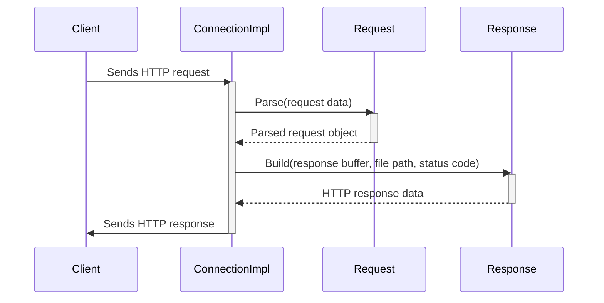

## Detailed Design Specification for HTTP Components

This document details the design of several components related to an HTTP server, based on the provided C++ source code. It aims to provide sufficient information for a separate LLM to reimplement these components accurately.  The focus is on preserving names, types, signatures, and relationships as defined in the original code.

### 1. Accurate Definitions

| Name | Type | Value/Structure | Notes |
|---|---|---|---|
| `ws::http::version` | `std::string_view` | `"1.1"` | HTTP version string. |
| `ws::http::StatusCode` | `enum class std::uint32_t` |  `OK = 200`, `BadRequest = 400`, `Forbidden = 403`, `NotFound = 404` | Represents HTTP status codes as unsigned 32-bit integers. |
| `ws::http::Parameters` | `std::unordered_map<std::string, std::string>` | Key-value pairs representing HTTP parameters.  Keys and values are strings.| Used for both headers and POST data. |
| `ws::http::Method` | `enum class` | `Get`, `Post`, `Put`, `Patch`, `Delete` | Represents HTTP methods. |
| `ws::http::new_line` | `std::string_view` | `"\r\n"` |  Line separator for HTTP messages. |
| `io::NewLine::LF` | `enum class` | Value not specified in source, likely represents "\n" | Line feed character. |
| `io::NewLine::CRLF` | `enum class` | Value not specified in source, likely represents "\r\n" | Carriage return and line feed characters. |

### 2. Direct Dependencies & Usage

This section details the functions, methods, and types directly used by the target code.  Dependencies are listed with their full qualified name, arguments, return type, and other relevant attributes.

**`http.h` dependencies:**

*   `containers/buffer.h`: `ws::Buffer`, `ws::IOBuffer` - Used for managing data streams.
*   `ip.h`: `ws::IPAddr`, `ws::IPv4Addr`, `ws::IPv6Addr` -  Used for network address handling.
*   `util.h`: `std::string`, `std::string_view`, `std::filesystem::path`, `ws::FileDescriptor`, `ws::MappedReadOnlyFile` – Used for string manipulation, file system operations and I/O.

**Key Methods & Usage:**

*   `StatusCodeToMessage(StatusCode code)`: Returns a `std::string_view` representing the message associated with the given status code.
*   `StatusCodeToInteger(StatusCode code)`: Returns a `std::uint32_t` representation of the status code.
*   `MethodToString(Method method)`: Returns a `std::string_view` representing the string form of an HTTP method.
*   `StringToMethod(std::string str)`: Converts a string to an `http::Method`. Throws `std::invalid_argument` if the string is not a valid method.
*   `ContentTypeByFileName(std::string_view name)`: Returns a `std::string_view` representing the content type based on the file extension. Defaults to "application/octet-stream".
*   `DecodeURLEncodedCharacter(const std::string& str)`: Decodes a URL-encoded character from a string. Throws `std::invalid_argument` if the input is invalid.
*   `DecodeURLEncodedString(const std::string& str)`: Decodes a URL-encoded string. Throws `std::invalid_argument` if the input contains invalid characters.
*   `HTMLPlaceholder(std::string_view key)`: Returns an HTML placeholder string for a given key (e.g., "<$key>").
*   `PutParamIntoHTML(std::string html, const Parameters& params)`: Replaces placeholders in an HTML string with values from the provided parameters.

### 3. Results Determining Expressions & Concrete Values

*   File content types are determined by file extensions using a `static const std::unordered_map`.
*   HTTP status code messages are mapped via another `static const std::unordered_map`.
*   URL decoding relies on hexadecimal character conversion.
*   Default buffer size in `Buffer` constructor: 1000 bytes.

### 4. Used & Updated Data

*   **`ConnectionImpl`**:  Manages the socket (`FileDescriptor`), keeps-alive status (`bool keep_alive_`), read/write buffers (`IOBuffer`).
*   **`Request`**: Stores parsed HTTP method, path, version, headers, and POST parameters.
*   **`Response`**: Manages file path, mapped file data, and the HTTP status code.

### 5. State, Side Effects & Invariants

*   `ConnectionImpl::socket_`:  File descriptor representing the socket connection. Closing the socket releases resources.
*   `Buffer`: Appending to a buffer may reallocate memory.
*   `Request::Parse()`: Modifies internal state based on input data. Invalid input can throw exceptions.
*   `Response::Build()`: Maps files into memory, potentially consuming system resources.

### 6. Class Diagram

```mermaid
classDiagram
    class ws::http::ConnectionImpl {
        -FileDescriptor socket_
        -bool keep_alive_
        -IOBuffer read_buf_
        -IOBuffer write_buf_
        -MappedReadOnlyFile file_
        +Close()
        +Valid()
        +Socket()
        +Receive()
        +Send()
        +KeepAlive()
        +Process()
    }
    class ws::http::Connection<IPAddr> {
        -IPAddr addr_
        +IPAddress()
        +Port()
    }

    ws::http::Connection --|> ws::http::ConnectionImpl : inherits
```

### 7. Class, Method & Interface Details

| **Class/Method** | **Signature** | **Visibility** | **Return Type** | **Parameters** | **Notes** |
|---|---|---|---|---|---|
| `ws::http::StatusCode` | `enum class std::uint32_t` | Public | N/A |  N/A | Represents HTTP status codes. |
| `ws::http::ConnectionImpl::Close()` | `void` | Protected | `void` | None | Closes the socket connection. |
| `ws::http::ConnectionImpl::Valid()` | `bool` | Protected | `bool` | None | Checks if the socket is valid. |
| `ws::http::Request::Parse(Buffer& buf)` | `void` | Public | `void` | `Buffer& buf` | Parses an HTTP request from a buffer. |
| `ws::http::Response::Build(Buffer& buf, std::filesystem::path file, StatusCode& code)` | `std::optional<MappedReadOnlyFile>` | Public | `std::optional<MappedReadOnlyFile>` | `Buffer& buf`, `std::filesystem::path file`, `StatusCode& code` | Builds an HTTP response from a file. Returns mapped file if successful.|

### 8. Sequence Diagram (Simplified Request Processing)



### 9. Method Specifications (Example: `Request::Parse`)

**Method:** `ws::http::Request::Parse(Buffer& buf)`

*   **Purpose:** Parses an HTTP request from the provided buffer.
*   **Arguments:**
    *   `buf`: A reference to a `Buffer` object containing the raw HTTP request data.
*   **Return Value:** `void`.  Throws exceptions on parsing errors.
*   **Behavior:**
    1.  Clears any existing parsed data.
    2.  Reads data from the buffer line by line.
    3.  Parses the status line to extract method, path, and version.
    4.  Parses headers until an empty line is encountered.
    5.  Parses the body based on the HTTP method (e.g., POST).
*   **Exceptions:** `std::invalid_argument` if the request is invalid.

### Additional Detailed Design Information

#### Data Transformation & Constraints:

*   URL decoding replaces `%XX` with corresponding ASCII characters, where XX is a hexadecimal representation of the character's value.  Invalid hex sequences result in an exception.
*   Content length headers must match the actual content size.
*   File paths are relative to the root directory specified by `ConnectionImpl::SetRootDirectory`.

#### State Transitions & Side Effects:

*   `Request` transitions through states (`NotStarted`, `Header`, `Body`, `Finished`) during parsing.
*   `Response` maps files into memory, potentially consuming significant resources.  Unmapping the file is crucial to release these resources.
*   Keep-alive connections maintain state between requests.

#### Class Details:

* **`IOBuffer`**: Inherits from `Buffer`, adding functionality for reading and writing data directly from/to an `IReadWriter`. This allows flexible I/O sources (e.g., files, network sockets).
* **`FileDescriptor`**: Wraps a raw file descriptor (`int`) providing a more type-safe interface.

This detailed design specification provides a comprehensive overview of the HTTP components, focusing on accuracy and completeness to facilitate successful reimplementation by another LLM.  It prioritizes preserving the original code's structure and semantics over simplification or abstraction.
