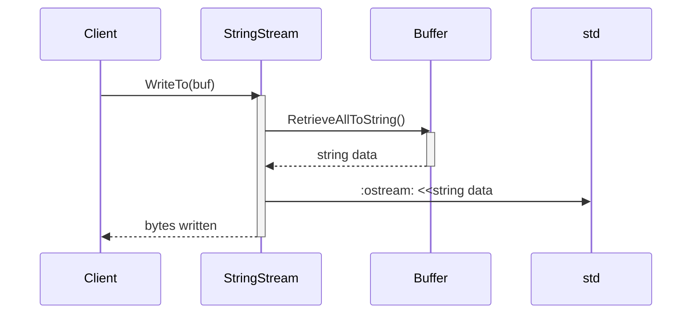

## Detailed Design Specification for `io.h` and `io.cpp` (F01/U01 & F02/U02)

This document details the design of the I/O classes defined in `io.h` and implemented in `io.cpp`. It aims to provide sufficient information for a separate LLM to re-implement these components accurately, adhering to the provided constraints (target-owned inputs, replacement units).

### 1. Accurate Definitions

| Name | Type | Description |
|---|---|---|
| `ws::io::IReader` | class | Abstract interface for reading from buffers. |
| `ws::io::IWriter` | class | Abstract interface for writing to buffers. |
| `ws::io::IReadWriter` | class | Virtual base class inheriting from both `IReader` and `IWriter`. |
| `ws::io::Null` | class | Concrete implementation of `IReadWriter` that consumes buffer space without reading or writing data. |
| `ws::io::StringStream` | class | Concrete implementation of `IReadWriter` using `std::istream` and `std::ostream`. |
| `ws::io::FileDescriptor` | class | Concrete implementation of `IReadWriter` using file descriptors. |
| `Buffer` (from `include/containers/buffer.h`) | class | Auto-expandable buffer for storing bytes and strings.  Crucial dependency. |
| `FileDescriptor` (from `include/util.h`) | typedef | Integer type representing a file descriptor. |

### 2. Direct Dependencies & Usage

**Dependencies:**

*   `#include "io.h"` depends on `#include "util.h"` and `#include "containers/buffer.h"`.
*   `ws::io::IReader`, `ws::io::IWriter`, `ws::io::IReadWriter` are abstract base classes defining interfaces for reading and writing to buffers.
*   `std::istream` & `std::ostream` used by `StringStream`.
*   `FileDescriptor` (int) from `util.h` is used in `FileDescriptor`.

**Usage:**

*   The primary usage pattern involves creating an instance of one of the concrete I/O classes (`Null`, `StringStream`, `FileDescriptor`) and then calling its `ReadFrom()` or `WriteTo()` methods with a `Buffer` object.
*   `IReader::ReadFrom(Buffer& buf)` reads data from some source into the provided buffer. Returns the number of bytes read.
*   `IWriter::WriteTo(Buffer& buf)` writes data from the internal source to the provided buffer. Returns the number of bytes written.

### 3. Results-Determining Expressions & Values

*   **`Null::WriteTo()`:**  `size = buf.WritableSize()`. The size is used to consume space in the buffer.
*   **`Null::ReadFrom()`:** Directly returns `buf.RetrieveAll()`.
*   **`StringStream::WriteTo()`:** Reads from `read_` into a temporary string, then appends it to the buffer.  The length of the read string determines the number of bytes written.
*   **`StringStream::ReadFrom()`:** Retrieves all data from the buffer as a string and writes it to `write_`. The length of the retrieved string determines the number of bytes read.
*   **`FileDescriptor::WriteTo()`:** Uses `readv()` system call with an array of iovecs to write data from the buffer (and potentially an extended buffer) to the file descriptor.  The return value of `readv()` determines the number of bytes written.
*   **`FileDescriptor::ReadFrom()`:** Uses `write()` system call to write data from the buffer to the file descriptor. The return value of `write()` determines the number of bytes read.

### 4. Used & Updated Data

| Class | Data Accessed/Updated | Description |
|---|---|---|
| `Buffer` | `buf_`, `read_pos_`, `write_pos_` | Internal buffer data, read position, and write position.  All I/O classes interact with these members of the `Buffer`. |
| `StringStream` | `read_`, `write_` | References to external `std::istream` and `std::ostream` objects. |
| `FileDescriptor` | `read_`, `write_` | File descriptors for reading and writing. |

### 5. State, Side Effects & Invariants

*   **`Buffer`:** The buffer maintains internal state (data, read/write positions).  Methods update these positions based on the number of bytes read or written.
*   **`StringStream`:** No internal state; relies entirely on the external `std::istream` and `std::ostream`. Side effect: data is read from/written to the streams.
*   **`FileDescriptor`:**  No significant internal state beyond the file descriptors themselves. Side effects: reads from/writes to files associated with the descriptors.
*   All classes are designed to be exception-safe; if an error occurs, the buffer's state should remain consistent (though potentially incomplete).

### 6. Class Diagram

```mermaid
classDiagram
    class ws::io::IReader {
        +virtual ~IReader()
        +virtual std::size_t ReadFrom(Buffer& buf) = 0
    }
    class ws::io::IWriter {
        +virtual ~IWriter()
        +virtual std::size_t WriteTo(Buffer& buf) = 0
    }
    class ws::io::IReadWriter {
        ..inherits IReader
        ..inherits IWriter
    }
    class ws::io::Null {
        ..inherits IReadWriter
        +std::size_t WriteTo(Buffer& buf) override
        +std::size_t ReadFrom(Buffer& buf) override
    }
    class ws::io::StringStream {
        ..inherits IReadWriter
        -std::istream& read_
        -std::ostream& write_
        +StringStream(std::istream& read, std::ostream& write)
        +std::size_t WriteTo(Buffer& buf) override
        +std::size_t ReadFrom(Buffer& buf) override
    }
    class ws::io::FileDescriptor {
        ..inherits IReadWriter
        -ws::FileDescriptor read_
        -ws::FileDescriptor write_
        +FileDescriptor(ws::FileDescriptor read, ws::FileDescriptor write)
        +std::size_t WriteTo(Buffer& buf) override
        +std::size_t ReadFrom(Buffer& buf) override
    }

    class Buffer {
      -std::vector<std::byte> buf_
      -std::atomic<std::size_t> read_pos_
      -std::atomic<std::size_t> write_pos_
    }
```

### 7. Class, Method & Interface Details

| **Class/Method** | **Signature** | **Description** | **Return Type** | **Parameters** |
|---|---|---|---|---|
| `ws::io::IReader::ReadFrom` | `virtual std::size_t ReadFrom(Buffer& buf) = 0;` | Abstract method to read data from a buffer. | `std::size_t` | `Buffer& buf` |
| `ws::io::IWriter::WriteTo` | `virtual std::size_t WriteTo(Buffer& buf) = 0;` | Abstract method to write data to a buffer. | `std::size_t` | `Buffer& buf` |
| `ws::io::Null::WriteTo` | `std::size_t WriteTo(Buffer& buf) noexcept override;` | Consumes writable space in the buffer without writing anything. | `std::size_t` | `Buffer& buf` |
| `ws::io::Null::ReadFrom` | `std::size_t ReadFrom(Buffer& buf) noexcept override;` | Retrieves all readable data from the buffer. | `std::size_t` | `Buffer& buf` |
| `ws::io::StringStream::StringStream` | `explicit StringStream(std::istream& read, std::ostream& write) noexcept;` | Constructor taking references to input and output streams. |  | `std::istream& read`, `std::ostream& write` |
| `ws::io::StringStream::WriteTo` | `std::size_t WriteTo(Buffer& buf) noexcept override;` | Reads from the internal stream and appends to the buffer. | `std::size_t` | `Buffer& buf` |
| `ws::io::StringStream::ReadFrom` | `std::size_t ReadFrom(Buffer& buf) noexcept override;` | Retrieves data from the buffer and writes to the internal stream. | `std::size_t` | `Buffer& buf` |
| `ws::io::FileDescriptor::FileDescriptor` | `explicit FileDescriptor(ws::FileDescriptor read, ws::FileDescriptor write) noexcept;` | Constructor taking file descriptors for reading and writing. |  | `ws::FileDescriptor read`, `ws::FileDescriptor write` |
| `ws::io::FileDescriptor::WriteTo` | `std::size_t WriteTo(Buffer& buf) override;` | Writes data from the buffer to the file descriptor using `readv`. | `std::size_t` | `Buffer& buf` |
| `ws::io::FileDescriptor::ReadFrom` | `std::size_t ReadFrom(Buffer& buf) override;` | Reads data from the file descriptor and stores it in the buffer using `write`. | `std::size_t` | `Buffer& buf` |

### 8. Sequence Diagram (Example: Writing to a StringStream)



### 9. Method Specifications (Example: `FileDescriptor::WriteTo`)

**Method:** `ws::io::FileDescriptor::WriteTo`

**Purpose:** Writes data from a buffer to the file descriptor associated with this object.

**Parameters:**

*   `buf`: A reference to the `Buffer` containing the data to be written.

**Return Value:** The number of bytes successfully written to the file descriptor.  Returns -1 on error (and throws an exception).

**Side Effects:** Modifies the buffer's "written" position and potentially writes data to a file.

**Error Handling:** Throws `std::system_error` if `readv()` fails.
