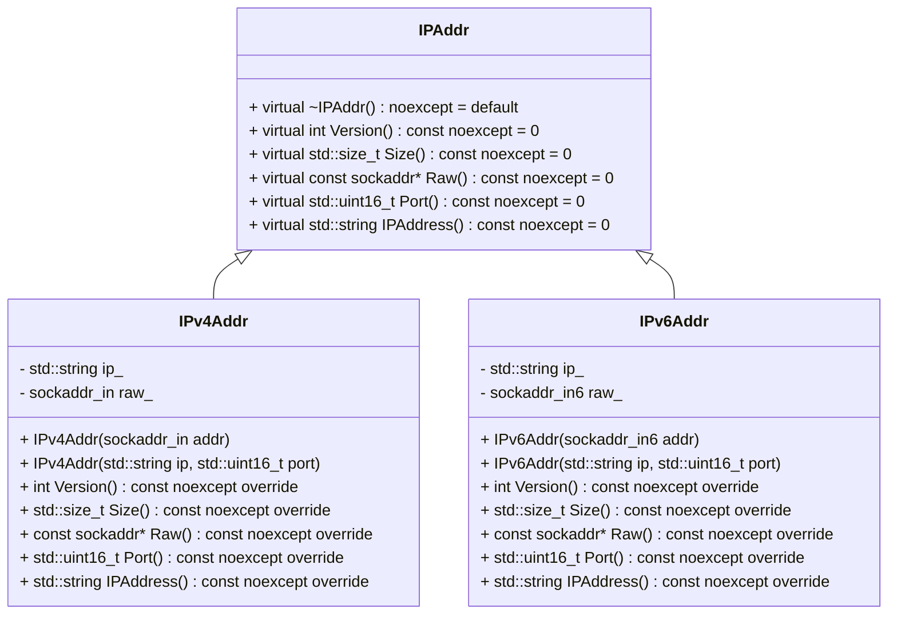

## 設計仕様書

### 全体概要

このドキュメントは、`include/ip.h` と `src/ip/ip.cpp` に定義された IP アドレス関連のクラスと関数の再実装のための詳細な設計仕様書です。 この仕様書は、提供されたソースコードから抽出された情報に基づいており、推測に基づいた情報は含まれません。

### 1. 基本情報

*   **モジュール:** IPアドレス処理
*   **目的:** IPv4およびIPv6アドレスの表現と操作を提供します。
*   **依存関係:** `<netinet/in.h>`, `<cstdint>`, `<string>`, `<string_view>` (include/ip.h), `<arpa/inet.h>`, `<util.h>`(src/ip/ip.cpp)

### 2. クラス図

### 3. クラス・メソッド・インターフェース詳細

#### 3.1 `IPAddr` (抽象クラス)

| 名前           | 型                | 可視性 | const | 説明                                  |
| -------------- | ----------------- | ------ | ----- | ------------------------------------- |
| `~IPAddr()`    | void              | virtual| noexcept| デストラクタ                          |
| `Version()`    | int               | virtual| noexcept| IPバージョン (AF\_INET, AF\_INET6) を返す |
| `Size()`       | std::size_t       | virtual| noexcept| アドレス構造体のサイズを返す           |
| `Raw()`        | const sockaddr\*  | virtual| noexcept| 生の`sockaddr`へのポインタを返す      |
| `Port()`       | std::uint16_t     | virtual| noexcept| ポート番号を返す                       |
| `IPAddress()` | std::string       | virtual| noexcept| IPアドレス文字列を返す                 |

#### 3.2 `IPv4Addr` (具象クラス)

| 名前               | 型                      | 可視性 | const | 説明                                                                 |
| ------------------ | ----------------------- | ------ | ----- | -------------------------------------------------------------------- |
| `version`          | int                     | static |       | IPv4のバージョン定数 (AF\_INET)                                     |
| `loop_back`        | std::string\_view       | static |       | ループバックアドレス ("127.0.0.1")                                   |
| `any`              | std::string\_view       | static |       | ワイルドカードアドレス ("0.0.0.0")                                  |
| `max_length`       | std::size_t             | static |       | IPv4アドレスの最大長 (15)                                           |
| `RawType`          | sockaddr\_in            |        |       | 生のアドレス構造体の型                                               |
| `IPv4Addr(sockaddr_in addr)` | コンストラクタ         | public |       | `sockaddr_in` 構造体から IPv4 アドレスを構築します。                   |
| `IPv4Addr(std::string ip, std::uint16_t port)` | コンストラクタ         | public |       | IPアドレス文字列とポート番号から IPv4 アドレスを構築します。           |
| `Version()`        | int                     | override| noexcept| IPv4のバージョン (AF\_INET) を返します。                             |
| `Size()`           | std::size_t             | override| noexcept| `sockaddr_in` 構造体のサイズを返します。                               |
| `Raw()`            | const sockaddr\*        | override| noexcept| 生の `sockaddr_in` へのポインタを返します。                             |
| `Port()`           | std::uint16_t           | override| noexcept| ポート番号を返します。                                                 |
| `IPAddress()`      | std::string             | override| noexcept| IPアドレス文字列を返します。                                           |
| `ip_`              | std::string             | private|       | IPアドレス文字列                                                       |
| `raw_`             | sockaddr\_in            | private|       | 生の IPv4 アドレス構造体                                               |

#### 3.3 `IPv6Addr` (具象クラス)

| 名前               | 型                      | 可視性 | const | 説明                                                                 |
| ------------------ | ----------------------- | ------ | ----- | -------------------------------------------------------------------- |
| `version`          | int                     | static |       | IPv6のバージョン定数 (AF\_INET6)                                     |
| `loop_back`        | std::string\_view       | static |       | ループバックアドレス ("::1")                                          |
| `any`              | std::string\_view       | static |       | ワイルドカードアドレス ("::")                                         |
| `max_length`       | std::size_t             | static |       | IPv6アドレスの最大長 (45)                                           |
| `RawType`          | sockaddr\_in6           |        |       | 生のアドレス構造体の型                                               |
| `IPv6Addr(sockaddr_in6 addr)` | コンストラクタ         | public |       | `sockaddr_in6` 構造体から IPv6 アドレスを構築します。                   |
| `IPv6Addr(std::string ip, std::uint16_t port)` | コンストラクタ         | public |       | IPアドレス文字列とポート番号から IPv6 アドレスを構築します。           |
| `Version()`        | int                     | override| noexcept| IPv6のバージョン (AF\_INET6) を返します。                             |
| `Size()`           | std::size_t             | override| noexcept| `sockaddr_in6` 構造体のサイズを返します。                               |
| `Raw()`            | const sockaddr\*        | override| noexcept| 生の `sockaddr_in6` へのポインタを返します。                             |
| `Port()`           | std::uint16_t           | override| noexcept| ポート番号を返します。                                                 |
| `IPAddress()`      | std::string             | override| noexcept| IPアドレス文字列を返します。                                           |
| `ip_`              | std::string             | private|       | IPアドレス文字列                                                       |
| `raw_`             | sockaddr\_in6           | private|       | 生の IPv6 アドレス構造体                                               |

### 4. シーケンス図

(シーケンス図は、提供されたコードからは明確な相互作用が読み取れないため、該当なし。)

### 5. メソッド仕様書

#### 5.1 `IPv4Addr::IPv4Addr(sockaddr_in addr)`

*   **目的:** `sockaddr_in`構造体からIPv4アドレスを構築します。
*   **引数:**
    *   `addr`: `sockaddr_in`構造体。
*   **戻り値:** なし
*   **動作:**
    1.  `inet_ntop`を使用して、`raw_.sin_addr`からIPアドレス文字列を生成します。
    2.  `ip_`メンバにIPアドレス文字列を設定します。
    3.  `inet_ntop`が失敗した場合、`ThrowLastSystemError()`を呼び出します。

#### 5.2 `IPv4Addr::IPv4Addr(std::string ip, std::uint16_t port)`

*   **目的:** IPアドレス文字列とポート番号からIPv4アドレスを構築します。
*   **引数:**
    *   `ip`: IPアドレス文字列。
    *   `port`: ポート番号。
*   **戻り値:** なし
*   **動作:**
    1.  `raw_.sin_family` を `version` (AF\_INET) に設定します。
    2.  `raw_.sin_port` を `htons(port)` に設定します。
    3.  `inet_pton`を使用して、IPアドレス文字列を`raw_.sin_addr`に変換します。
    4.  `inet_pton`が失敗した場合、`ThrowLastSystemError()`を呼び出します。
    5. `ip_`メンバにIPアドレス文字列を設定します。

#### 5.3 他のメソッドも同様に仕様書を作成する (省略)

### 6. 処理フロー図

(提供されたコードからは明確な処理フローが読み取れないため、該当なし。)

### 7. 状態遷移・副作用

*   `IPv4Addr`と`IPv6Addr`は、コンストラクタでメンバ変数を初期化します。
*   `IPAddress()`メソッドは、内部的に保存されたIPアドレス文字列を返します。
*   `Raw()`メソッドは、生のソケットアドレス構造体へのポインタを返します。

### 8. データ変換・制約

*   IPアドレス文字列と数値表現の間で変換が行われます (`inet_ntop`, `inet_pton`)。
*   ポート番号はネットワークバイトオーダーに変換されます (`htons`, `ntohs`)。
*   `sockaddr_in` および `sockaddr_in6` 構造体は、特定のサイズとレイアウトを持ちます。

### 9. 追加詳細設計情報

#### クラス図 (上記参照)

#### メソッド仕様書 (上記参照)

#### 処理フロー図 (該当なし)

#### 状態遷移・副作用 (上記参照)
