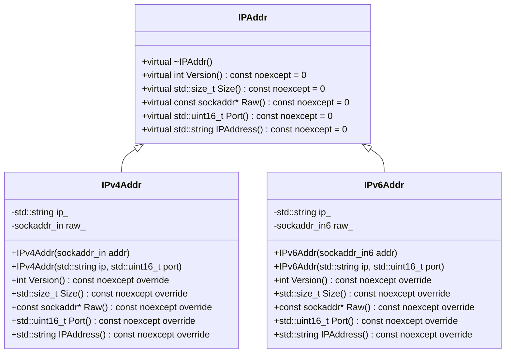

## 設計仕様書

### 全体概要

本設計仕様書は、`include/ip.h` と `src/ip/ip.cpp` に定義された IP アドレス関連のクラスと関数を再実装するためのものです。このドキュメントでは、これらのファイルの機能、インターフェース、および内部構造について詳細に説明します。

### 1. 正確な定義

| 型名 | 種別 | 実体 |
|---|---|---|
| `IPAddr` | クラス | IPアドレスの抽象基底クラス |
| `IPv4Addr` | クラス | IPv4アドレスの実装クラス |
| `IPv6Addr` | クラス | IPv6アドレスの実装クラス |
| `sockaddr_in` | 構造体 | IPv4ソケットアドレス |
| `sockaddr_in6` | 構造体 | IPv6ソケットアドレス |
| `RawType` (IPv4Addr) | 型エイリアス | `sockaddr_in` |
| `RawType` (IPv6Addr) | 型エイリアス | `sockaddr_in6` |
| `std::uint16_t` | 符号なし整数型 | 16ビットの符号なし整数 |
| `std::size_t` | 符号なし整数型 | プラットフォーム依存のサイズを表す整数型 |
| `FileDescriptor` | 型エイリアス | `int` |

### 2. 直接依存インターフェースと利用方法

*   **`<netinet/in.h>`:**  IPv4/IPv6アドレス構造体 (`sockaddr_in`, `sockaddr_in6`) を定義。
*   **`<string>`:** 文字列操作のためのクラス (`std::string`)。
*   **`<string_view>`:** 文字列への参照を提供するクラス (`std::string_view`)。
*   **`<cstdint>`:** 固定幅整数型 (`std::uint16_t`) を定義。
*   **`<arpa/inet.h>`:** IPv4/IPv6アドレス変換関数 (`inet_ntop`, `inet_pton`, `htons`, `ntohs`) を提供。

### 3. 結果を決める式・具体値

*   `IPv4Addr::version`:  `AF_INET` (定数、IPv4プロトコルファミリー)
*   `IPv6Addr::version`:  `AF_INET6` (定数、IPv6プロトコルファミリー)
*   `IPv4Addr::loop_back`: `"127.0.0.1"` (文字列リテラル、IPv4ループバックアドレス)
*   `IPv6Addr::loop_back`: `"::1"` (文字列リテラル、IPv6ループバックアドレス)
*   `IPv4Addr::any`: `"0.0.0.0"` (文字列リテラル、IPv4ワイルドカードアドレス)
*   `IPv6Addr::any`: `"::"` (文字列リテラル、IPv6ワイルドカードアドレス)
*   `IPv4Addr::max_length`: 15 (定数、IPv4アドレスの最大長)
*   `IPv6Addr::max_length`: 45 (定数、IPv6アドレスの最大長)

### 4. 使用データ・更新データ

*   **`IPv4Addr` / `IPv6Addr`:**
    *   `ip_`:  IPアドレスを保持する文字列。コンストラクタで初期化され、その後変更されない。
    *   `raw_`: ソケットアドレス構造体 (`sockaddr_in` または `sockaddr_in6`)。コンストラクタで初期化され、内部で使用される。

### 5. 状態・副作用・不変条件

*   **`IPv4Addr` / `IPv6Addr`:**
    *   オブジェクトはimmutableである。コンストラクタで初期化された後、状態は変更されない。
    *   コンストラクタは、無効なIPアドレスが与えられた場合に例外をスローする可能性がある (`ThrowLastSystemError()`)。

### 6. クラス図

### 7. クラス・メソッド・インターフェース詳細

**IPAddr (抽象クラス)**

| 名前 | 可視性 | 引数 | 戻り値 | const | noexcept | 説明 |
|---|---|---|---|---|---|---|
| `~IPAddr` | virtual |  | void |  | yes | デストラクタ |
| `Version` | virtual |  | int | yes | yes | IPバージョンを取得 |
| `Size` | virtual |  | std::size_t | yes | yes | ソケットアドレスのサイズを取得 |
| `Raw` | virtual |  | const sockaddr\* | yes | yes | 生のソケットアドレスを取得 |
| `Port` | virtual |  | std::uint16_t | yes | yes | ポート番号を取得 |
| `IPAddress` | virtual |  | std::string | yes | yes | IPアドレスを文字列で取得 |

**IPv4Addr (IPv4アドレス)**

| 名前 | 可視性 | 引数 | 戻り値 | const | noexcept | 説明 |
|---|---|---|---|---|---|---|
| `IPv4Addr` | explicit | `sockaddr_in addr` |  |  |  | ソケットアドレスからIPv4アドレスを構築 |
| `IPv4Addr` | explicit | `std::string ip`, `std::uint16_t port` |  |  |  | IPアドレスとポート番号からIPv4アドレスを構築 |
| `Version` |  |  | int | yes | yes | IPバージョンを取得 (常に `AF_INET`) |
| `Size` |  |  | std::size_t | yes | yes | ソケットアドレスのサイズを取得 (`sizeof(sockaddr_in)`) |
| `Raw` |  |  | const sockaddr\* | yes | yes | 生のソケットアドレスを取得 |
| `Port` |  |  | std::uint16_t | yes | yes | ポート番号を取得 |
| `IPAddress` |  |  | std::string | yes | yes | IPアドレスを文字列で取得 |

**IPv6Addr (IPv6アドレス)**

| 名前 | 可視性 | 引数 | 戻り値 | const | noexcept | 説明 |
|---|---|---|---|---|---|---|
| `IPv6Addr` | explicit | `sockaddr_in6 addr` |  |  |  | ソケットアドレスからIPv6アドレスを構築 |
| `IPv6Addr` | explicit | `std::string ip`, `std::uint16_t port` |  |  |  | IPアドレスとポート番号からIPv6アドレスを構築 |
| `Version` |  |  | int | yes | yes | IPバージョンを取得 (常に `AF_INET6`) |
| `Size` |  |  | std::size_t | yes | yes | ソケットアドレスのサイズを取得 (`sizeof(sockaddr_in6)`) |
| `Raw` |  |  | const sockaddr\* | yes | yes | 生のソケットアドレスを取得 |
| `Port` |  |  | std::uint16_t | yes | yes | ポート番号を取得 |
| `IPAddress` |  |  | std::string | yes | yes | IPアドレスを文字列で取得 |

### 8. シーケンス図

(シーケンス図は、このコードの複雑さを考えると不要と判断。オブジェクトの生成とメソッド呼び出しのみであり、特筆すべき相互作用はない。)

### 9. メソッド仕様書

(各メソッドの詳細な仕様は上記のクラス・メソッド・インターフェース詳細に記載されているため省略)

### 追加詳細設計情報

*   **テンプレートコンセプト `ValidIPAddr`:**  `IPv4Addr` または `IPv6Addr` 型のみを許可するコンセプト。型安全性を高めるために使用される。
*   **エラー処理:** コンストラクタで無効なIPアドレスが検出された場合、`ThrowLastSystemError()` 関数を使用して例外がスローされる。この関数は、システムエラーコードに基づいて例外を生成する。
*   **ネットワークバイトオーダーとホストバイトオーダー:**  ポート番号はネットワークバイトオーダーでソケットアドレスに格納されるため、`htons()` (host to network short) および `ntohs()` (network to host short) 関数を使用して変換する必要がある。
*   **生のソケットアドレスへのキャスト:**  `Raw()` メソッドでは、内部の `sockaddr_in` または `sockaddr_in6` 構造体へのポインタを `const sockaddr*` にキャストしている。これは、汎用的なソケットAPIで使用するために必要である。

この設計仕様書は、`include/ip.h` と `src/ip/ip.cpp` の再実装に必要な情報を網羅しています。
