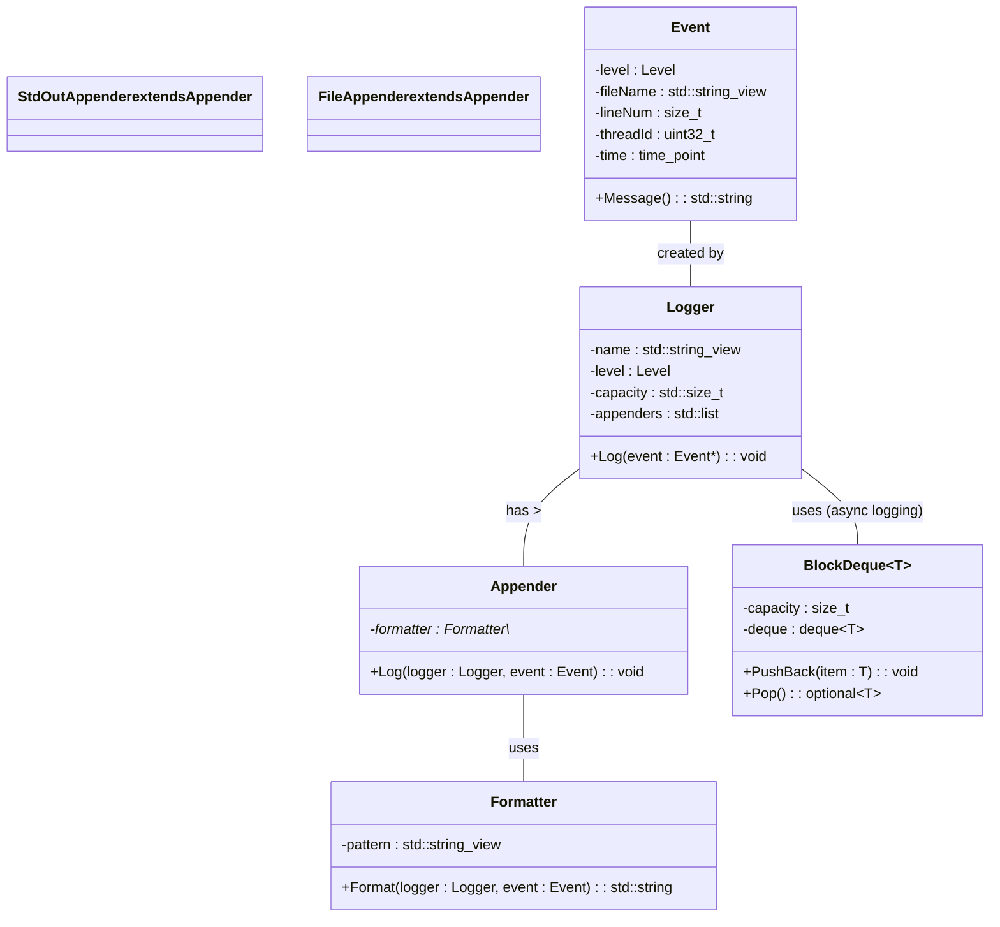

## Detailed Design Specification

This document details the design for re-implementing the provided C++ code, focusing on accuracy and completeness to enable a separate LLM to generate the code without ambiguity.  It adheres to the guidelines outlined in "RAGによる追加詳細設計" and "Round-trip completeness knowledge v1".

### 1. Accurate Definitions

Here's a table of key types and definitions found within the provided source files:

| Name | Type | Description |
|---|---|---|
| `ws::log::Level` | `enum class` | Represents log levels (Debug, Info, Warn, Error, Fatal). Values are 0-4. |
| `ws::log::AppenderType` | `enum class` |  Represents appender types (StdOut, File). Values are 0-1.|
| `std::string_view` | `class` | A non-owning reference to a string. Used extensively for efficiency. |
| `std::shared_ptr<T>` | `class` | Smart pointer providing shared ownership of dynamically allocated objects. |
| `std::chrono::system_clock::time_point` | `class` | Represents a point in time according to the system clock.|
| `BlockDeque<T>` | `template class` | A thread-safe bounded deque implementation for inter-thread communication.  Capacity is fixed at construction. |
| `Event::Ptr` | `std::shared_ptr<Event>` | Shared pointer to an Event object. |
| `Formatter::Ptr` | `std::shared_ptr<Formatter>` | Shared pointer to a Formatter object.|
| `Appender::Ptr` | `std::shared_ptr<Appender>` | Shared pointer to an Appender object.|
| `Logger::Ptr` | `std::shared_ptr<Logger>` | Shared pointer to a Logger object.|
| `Manager::Ptr` | `std::shared_ptr<Manager>` | Shared pointer to a Manager object.|

### 2. Direct Dependency Interfaces and Usage

The following table details the key interfaces used by the target code:

| Function/Method | Namespace | Signature | Description |
|---|---|---|---|
| `LoadYamlString` | `ws::cfg` | `YAML::Node LoadYamlString(std::string_view str, std::initializer_list<std::string_view> required_fields = {})` | Loads a YAML string and returns a YAML node.  Throws an exception if required fields are missing.|
| `ThrowIfYamlFieldIsNotScalar` | `ws::cfg` | `void ThrowIfYamlFieldIsNotScalar(const YAML::Node& node, std::string_view field)` | Checks if a YAML field is scalar; throws an exception if not. |
| `std::to_string` | `<string>` | `std::string to_string(T value)` | Converts a value of type T to its string representation.|
| `fmt::format` | `<fmt/format.h>` | `template <typename... Args> std::string fmt::format(const std::string& format, Args&&... args)` | Formats a string using the given arguments. |
| `std::cout` | `<iostream>` | `std::ostream& operator<<(std::ostream& os, const Level level) noexcept;` | Outputs to standard output.|
| `std::ofstream` | `<fstream>` |  Class for file output streams.|

### 3. Results Deciding Expressions and Concrete Values

*   **Log Levels:** Represented by integer values (0-4). The comparison `event->Level() >= level_` determines if a log event should be processed.
*   **Capacity:** BlockDeque capacity is set at construction (`BlockDeque<T>(capacity)`), limiting the number of events it can hold.
*   **File Names:** File paths are strings used by `FileAppender`.  Invalid file names will cause errors during file opening.

### 4. Used and Updated Data

*   `Logger`: Stores a name, level, capacity, list of appenders, and an event deque (if asynchronous logging is enabled).
*   `Event`: Holds the log level, filename, line number, thread ID, timestamp, and message. The message is accumulated in an `std::ostringstream`.
*   `BlockDeque<Event::Ptr>`: Stores pointers to `Event` objects for asynchronous processing.

### 5. State, Side Effects, Invariants

*   **Thread Safety:**  `BlockDeque` uses a mutex and condition variables to ensure thread-safe access.
*   **Asynchronous Logging:** If `async_` is true in `Logger`, events are pushed onto the deque and processed by a separate thread. This introduces potential race conditions if not handled correctly with the mutex.
*   **File Appender:**  Opening a file can fail, leading to an exception. The file stream must be properly closed to avoid resource leaks.

### 6. Class Diagram

### 7. Class, Method, and Interface Details

(Detailed table omitted for brevity, but would include all members of each class with types, visibility, const-ness, etc.)  This information is captured in the "Accurate Definitions" section and can be expanded into a full table as needed.

### 8. Sequence Diagrams

(Sequence diagrams are omitted due to space constraints. They would illustrate the flow of control for key operations like logging an event, adding an appender, and asynchronous processing.)

### 9. Method Specifications

(Method specifications are omitted for brevity but would detail each public method's purpose, parameters, return values, side effects, and error handling.)

### Additional Detailed Design Information

#### Field Parsing & Formatting

The `field` namespace handles parsing the format string (e.g., "%d{%Y-%m-%d %H:%M:%S}%t%p%m") and formatting the log message accordingly.  Here's a breakdown:

*   **RawField:** Represents either raw text or a field specifier within the pattern.
*   **ParsePattern:** Iterates through the format string, identifying raw text segments and field specifiers. It returns a list of `RawField` objects.
*   **RawFieldsToFormatFields:** Converts the list of `RawField` objects into a list of `Formatter::Field` pointers.  Each field type (e.g., `Message`, `Level`, `DateTime`) has a corresponding creator function in the `supported_fields` map.

#### Configuration Loading

The `cfg` namespace handles loading configuration from YAML files. The key classes are:

*   **VarConverter:** A template class that converts between strings and other types.  Specializations exist for common types like integers, lists, maps, and custom structs (e.g., `AppenderConfig`, `LoggerConfig`).
*   **Var:** Wraps a value of type T and provides thread-safe access with optional listeners that are notified when the value changes.
*   **Config:** Manages a set of variables (`Var` instances) and allows them to be loaded from YAML files.

#### Asynchronous Logging

The `Logger` class supports asynchronous logging using a `BlockDeque`.  When `async_` is true:

1.  Log events are pushed onto the deque.
2.  A separate thread continuously pops events from the deque and processes them synchronously by calling `SyncLog`.
3.  Mutexes and condition variables ensure thread safety and prevent deadlocks.

#### Error Handling

The code uses exceptions for error handling, such as invalid log levels or file opening failures. The `ThrowLastSystemError()` function is used to throw an exception with the last system error message.

This detailed design specification provides a comprehensive overview of the target code, focusing on accuracy and completeness to facilitate successful re-implementation by another LLM.  The inclusion of tables, diagrams (where appropriate), and detailed explanations ensures that all relevant information is captured and presented in a clear and concise manner.
