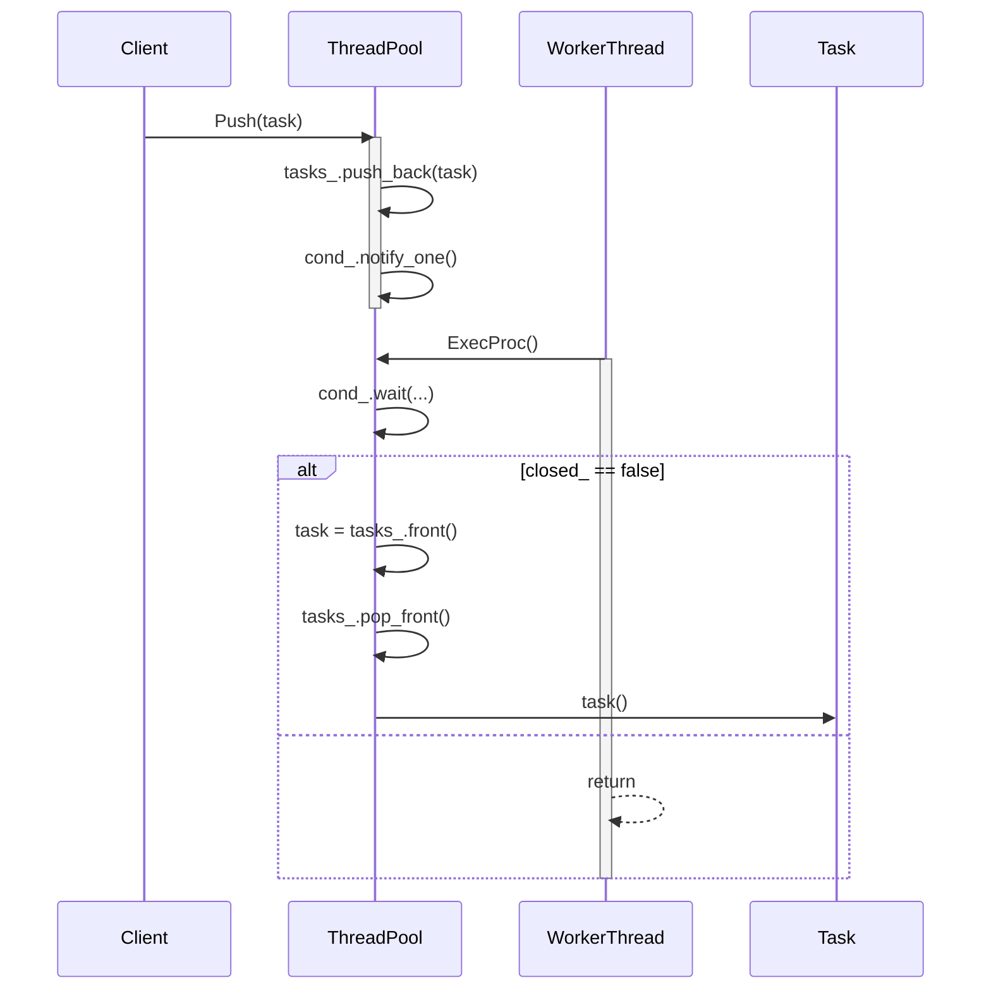

## ThreadPool 設計仕様書

### 1. 正確な定義

| 型名 / 種別 / 実体 | 説明 |
|---|---|
| `ws::ThreadPool::Task` | `std::function<void()>` / 関数型 / コール可能なオブジェクト |
| `log::Logger::Ptr` | `std::shared_ptr<log::Logger>` / スマートポインタ / ロガーへの共有所有権 |
| `log::Level` | 列挙型 / ログレベル (Debug, Info, Warn, Error, Fatal) |
| `std::optional<std::size_t>` | オプション型 / スレッド数の指定。未指定の場合はデフォルト値を使用 |
| `std::atomic_bool` | 原子型ブール値 / マルチスレッド環境での安全なフラグ |
| `std::mutex` | ミューテックス / 共有リソースへのアクセス制御 |
| `std::condition_variable` | 条件変数 / スレッド間のシグナル通知 |
| `std::list<Task>` | リスト / タスクキュー |
| `std::list<std::thread>` | リスト / スレッドのリスト |

### 2. 直接依存インターフェースと利用方法

#### log::Logger

*   `log::Logger::Ptr logger_`: ロガーへの共有ポインタ。ログ出力に使用。
*   `logger_->Log(Event::Ptr event)`: イベントをロガーに送信してログを出力。

#### std::thread

*   `std::list<std::thread> threads_`: スレッドのリスト。スレッドプール内のワーカー・スレッドを保持。
*   `threads_.emplace_back(&ThreadPool::ExecProc, this)`: 新しいスレッドを作成し、`ExecProc`メソッドを実行するように設定。
*   `thread.join()`: スレッドの終了を待機。

#### std::mutex

*   `std::mutex mtx_`: タスクキューへのアクセスを保護するためのミューテックス。
*   `std::lock_guard locker {mtx_}`: ミューテックスをロックし、スコープを抜けると自動的にアンロックする。
*   `std::unique_lock locker {mtx_}`: ミューテックスをロックし、条件変数との連携に使用。

#### std::condition\_variable

*   `std::condition_variable cond_`: タスクキューが空の場合にスレッドを待機させるための条件変数。
*   `cond_.wait(locker, not_empty_or_closed)`: ミューテックスをロックした状態で、指定された述語が真になるまで待機。
*   `cond_.notify_one()`: 1つの待機スレッドにシグナルを送信して再開させる。
*   `cond_.notify_all()`: すべての待機スレッドにシグナルを送信して再開させる。

### 3. 結果を決める式・具体値

*   `thread_count_ = thread_count.value_or(0)`: `thread_count`が指定されていない場合、デフォルト値を設定。
*   `if (thread_count_ == 0) { thread_count_ = std::thread::hardware_concurrency(); }`: デフォルト値が0の場合、ハードウェア・コンカレンシーを取得。
*   `closed_ = true`: 初期状態ではスレッドプールを閉鎖状態にする。
*   `closed_ = false`: `Start()`メソッドでスレッドプールを開始し、閉鎖フラグをfalseに設定。

### 4. 使用データ・更新データ

#### ThreadPool クラス

*   `logger_`: ロガーへのポインタ (読み取り専用)。
*   `mtx_`: ミューテックス (排他制御)。
*   `closed_`: スレッドプールの状態を示すフラグ (読み書き)。
*   `thread_count_`: スレッド数 (読み取り専用)。
*   `tasks_`: タスクキュー (追加・削除)。
*   `threads_`: スレッドのリスト (追加)。

#### ExecProc メソッド

*   `tasks_`: タスクキューからタスクを取得し、実行する。
*   `closed_`: 閉鎖フラグを確認し、ループを終了させる。

### 5. 状態・副作用・不変条件

*   **状態**: スレッドプールの状態は、`closed_`フラグによって制御される。
*   **副作用**: `Push()`メソッドはタスクキューにタスクを追加する。`ExecProc()`メソッドはタスクを実行し、その結果として外部の状態が変化する可能性がある。
*   **不変条件**: スレッドプールは、開始された後に閉じられるまで、指定された数のスレッドを維持する。

### 6. クラス図

```mermaid
classDiagram
    class ThreadPool {
        - logger_ : log::Logger::Ptr
        - mtx_ : std::mutex
        - closed_ : std::atomic_bool
        - thread_count_ : std::size_t
        - cond_ : std::condition_variable
        - tasks_ : std::list<Task>
        - threads_ : std::list<std::thread>
        + ThreadPool(thread_count, logger)
        + ~ThreadPool()
        + Start()
        + Push(task)
        + Close()
        - ExecProc()
    }

    class log::Logger {
        + Log(event)
    }

    ThreadPool -- log::Logger : uses
```

### 7. クラス・メソッド・インターフェース詳細

| メソッド名 | 引数 | 戻り値型 | 可視性 | const | noexcept | 説明 |
|---|---|---|---|---|---|---|
| `ThreadPool(std::optional<std::size_t> thread_count, log::Logger::Ptr logger)` | `thread_count`, `logger` | void | public |  | yes | コンストラクタ。スレッド数とロガーを設定する。 |
| `~ThreadPool()` | なし | void | public |  | yes | デストラクタ。スレッドをjoinしてリソースを解放する。 |
| `Start()` | なし | void | public |  | yes | スレッドプールを開始する。 |
| `Push(Task task)` | `task` | void | public |  | yes | タスクキューにタスクを追加する。 |
| `Close()` | なし | void | public |  | yes | スレッドプールを閉鎖する。 |
| `ExecProc()` | なし | void | private |  | yes | ワーカー・スレッドで実行される処理。 |

### 8. シーケンス図



### 9. メソッド仕様書

#### Push(Task task)

*   **目的**: タスクキューにタスクを追加する。
*   **引数**: `task`: 実行するタスク (std::function<void()>)。
*   **戻り値**: なし。
*   **動作**: ミューテックスをロックし、タスクをタスクキューに追加し、条件変数を通知して待機中のスレッドにシグナルを送る。
*   **副作用**: タスクキューの内容が変更される。

#### ExecProc()

*   **目的**: ワーカー・スレッドで実行される処理。
*   **引数**: なし。
*   **戻り値**: なし。
*   **動作**: 条件変数を使用してタスクキューを監視し、新しいタスクが利用可能になると、キューからタスクを取得して実行する。例外が発生した場合はログに出力する。スレッドプールが閉鎖された場合は終了する。
*   **副作用**: タスクを実行し、その結果として外部の状態が変化する可能性がある。

#### Close()

*   **目的**: スレッドプールを閉鎖する。
*   **引数**: なし。
*   **戻り値**: なし。
*   **動作**: 閉鎖フラグを設定し、条件変数にシグナルを送ってすべての待機中のスレッドを再開させる。
*   **副作用**: スレッドプールの状態が変更される。

### 追加詳細設計情報

#### 処理フロー図 (ExecProc)

```mermaid
graph TD
    A[開始] --> B{tasks_.empty() || closed_?};
    B -- Yes --> C[終了];
    B -- No --> D{mtx_ロック};
    D --> E[cond_.wait()];
    E --> F{closed_?};
    F -- Yes --> C;
    F -- No --> G[task = tasks_.front()];
    G --> H[tasks_.pop_front()];
    H --> I{mtx_アンロック};
    I --> J[try: task()];
    J --> K{catch (exception)};
    K --> L[logger_->Log(error)];
    L --> A;
```

#### 状態遷移・副作用

| メソッド | 初期状態 | 更新後の状態 | 副作用 |
|---|---|---|---|
| `ThreadPool()` | closed_ = true, tasks_ is empty | closed_ = true, tasks_ is empty | logger_初期化、thread_count_設定 |
| `Start()` | closed_ = true, threads_ is empty | closed_ = false, threads_ contains worker threads | スレッドの作成と開始 |
| `Push(task)` | closed_ = false, tasks_ contains existing tasks | closed_ = false, tasks_ contains new task | タスクキューへのタスク追加、条件変数の通知 |
| `Close()` | closed_ = false, threads_ are running | closed_ = true, threads_ will terminate | 閉鎖フラグの設定、条件変数の全スレッド通知 |

#### データ変換・制約

*   `thread_count_`: スレッド数は0以上の整数である。
*   `tasks_`: タスクキューは、実行可能なタスクのリストを保持する。
*   `closed_`: 閉鎖フラグは、スレッドプールの状態を示すブール値である。
