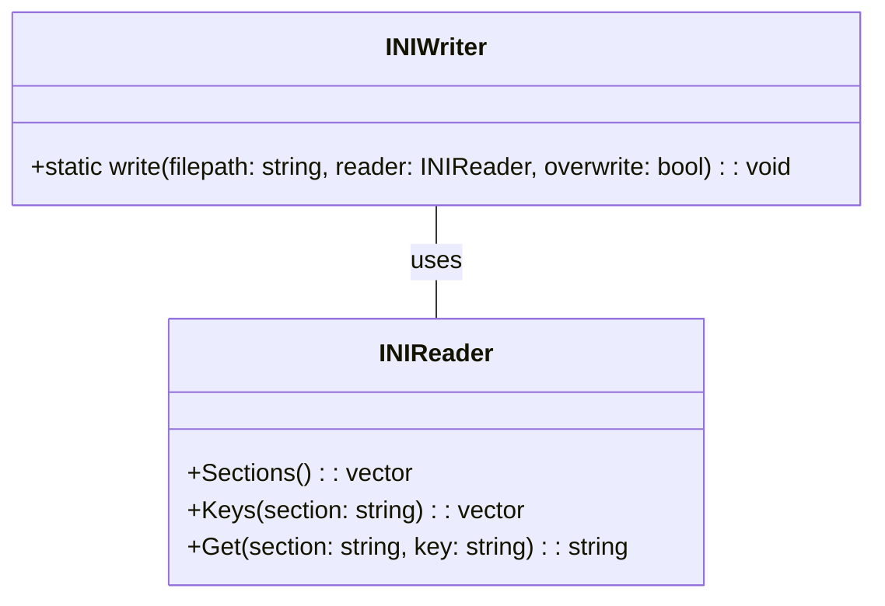

## INIWriter クラス詳細設計書 (F01/U01)

このドキュメントは、`INIWriter`クラスの再実装に必要な詳細な設計情報を提供します。

### 1. 正確な定義

| 型名 / 種別 / 実体 | 説明 |
|---|---|
| `std::string` | 文字列型 (標準ライブラリ) |
| `std::ifstream` | 入力ファイルストリーム型 (標準ライブラリ) |
| `std::ofstream` | 出力ファイルストリーム型 (標準ライブラリ) |
| `INIReader` | INIファイルを読み込むためのクラス。詳細は不明（reference-only）。 |

### 2. 直接依存インターフェースと利用方法

| 関数名 / Namespace | 説明 | 引数 | 戻り値 | 可視性 | const |
|---|---|---|---|---|---|
| `std::ifstream` (標準ライブラリ) | ファイルストリームコンストラクタ。ファイルパスを引数に取る。 | `const std::string& filepath` | なし | public |  |
| `std::ofstream` (標準ライブラリ) | ファイルストリームコンストラクタ。ファイルパスを引数に取る。 | `const std::string& filepath` | なし | public |  |
| `std::ifstream::operator bool()` (標準ライブラリ) | ストリームが有効かどうかをboolで返す。 | なし | `bool` | public |  |
| `std::ofstream::is_open()` (標準ライブラリ) | ストリームが開いているかどうかをboolで返す。 | なし | `bool` | public |  |
| `std::ofstream::operator<<` (標準ライブラリ) | 出力ストリームにデータを書き込む演算子。 | `const std::string&`, `char`, etc. | `std::ostream&` | public |  |
| `INIReader::Sections()` | INIReaderオブジェクトが読み込んだセクションのリストを返す。詳細は不明（reference-only）。 | なし | `const std::vector<std::string>&` (推測) | public | const |
| `INIReader::Keys(const std::string& section)` | 指定されたセクション内のキーのリストを返す。詳細は不明（reference-only）。 | `const std::string& section` | `const std::vector<std::string>&` (推測) | public | const |
| `INIReader::Get(const std::string& section, const std::string& key)` | 指定されたセクションとキーに対応する値を取得する。詳細は不明（reference-only）。 | `const std::string& section`, `const std::string& key` | `std::string` (推測) | public | const |

### 3. 結果を決める式・具体値

*   ファイルが存在する場合、`std::ifstream{filepath}` が true を返す。
*   ファイルが開けない場合、`std::ofstream out{filepath}` は失敗し、後続の処理で例外がスローされる。
*   書き込みはセクションごとに `[section]\n` で始まり、キーと値は `key=value\n` の形式で行われる。

### 4. 使用データ・更新データ

*   **入力:** `filepath`, `reader` (INIReaderオブジェクト), `overwrite` (bool)
*   **出力:** ファイルシステム上のファイル (`filepath`)
*   `reader` オブジェクトは読み込まれたINIデータを保持し、その内容がファイルに書き込まれる。
*   `filepath` は書き込み先のファイルパスを示す文字列。

### 5. 状態・副作用・不変条件

*   **副作用:** ファイルシステム上のファイルの作成または上書き。
*   **例外:**
    *   `overwrite` が `false` で、指定されたファイル (`filepath`) が既に存在する場合、`std::runtime_error` 例外がスローされる。
    *   出力ファイル (`filepath`) を開けない場合、`std::runtime_error` 例外がスローされる。
*   **不変条件:** ファイルの書き込みは、指定された `reader` オブジェクトの内容に基づいて行われる。

## クラス図



## クラス・メソッド・インターフェース詳細

| メソッド名 | 可視性 | static | 引数 | 戻り値型 | 説明 |
|---|---|---|---|---|---|
| `write` | public | true | `const std::string& filepath`, `const INIReader& reader`, `const bool overwrite = false` | `void` | 指定されたファイルにINIデータを書き込む。 |

## シーケンス図

該当なし (単一のstaticメソッドのみのため、複雑なシーケンスは存在しない)

## メソッド仕様書

### `write(const std::string& filepath, const INIReader& reader, const bool overwrite = false)`

**目的:** 指定されたファイルにINIデータを書き込む。

**引数:**

*   `filepath`: 書き込み先のファイルのパス。
*   `reader`: 読み込まれたINIデータを持つ `INIReader` オブジェクト。
*   `overwrite`: ファイルが既に存在する場合に上書きするかどうかを示すフラグ (デフォルト: `false`)。

**戻り値:** なし

**動作:**

1.  `overwrite` が `false` で、指定されたファイルが存在する場合は、`std::runtime_error` 例外をスローする。
2.  出力ファイルストリーム (`std::ofstream`) を作成し、指定されたファイルを開く。開けない場合は、`std::runtime_error` 例外をスローする。
3.  `reader` オブジェクトからセクションを取得し、各セクションについて以下の処理を行う:
    *   セクション名を `[ ]` で囲んで出力ストリームに書き込む。
    *   セクション内のキーを取得し、各キーについて以下の処理を行う:
        *   キーと値を `=` で区切って出力ストリームに書き込む。

**副作用:** ファイルシステム上のファイルの作成または上書き。

## 処理フロー図

該当なし (単純な直線的な処理のため、複雑なフローチャートは不要)

## 状態遷移・副作用

| 状態 | 条件 | 更新対象 | 更新後状態 | 副作用 |
|---|---|---|---|---|
| ファイルシステム | `overwrite` が false でファイルが存在 | なし | 例外スロー | なし |
| ファイルストリーム | ファイルオープン成功 | ストリームの状態 | 開いている | ファイル作成/上書き |
| 出力ストリーム | 各セクション、キー、値の書き込み | ストリームの内容 | データが追加される | ファイルへの書き込み |

## データ変換・制約

*   INIReaderオブジェクトから取得した文字列データは、そのままファイルに書き込まれる。エンコーディングや文字コードに関する特別な変換は行われない。
*   セクション名とキーは `[ ]` と `=` で囲まれて出力される。
*   値の型は不明（reference-only）だが、文字列として扱われる。

## 完全再構築台帳 (F01/U01)

```cpp
path: ini/ini.h
#include <string>
#include <fstream>
#include <vector>
#include <stdexcept>

class INIWriter {
   public:
    INIWriter() = default;

    inline static void write(const std::string& filepath,
                             const INIReader& reader,
                             const bool overwrite = false) {
        if (!overwrite && std::ifstream{filepath}) {
            throw std::runtime_error("file: " + filepath + " already exists.");
        }
        std::ofstream out{filepath};
        if (!out.is_open()) {
            throw std::runtime_error("cannot open output file: " + filepath);
        }
        for (const auto& section : reader.Sections()) {
            out << "[" << section << "]\n";
            for (const auto& key : reader.Keys(section)) {
                out << key << "=" << reader.Get(section, key) << "\n";
            }
        }
    }
};
```

この台帳は、`ini/ini.h` ファイルの内容を正確に再現できるように記述されています。すべてのインクルード、クラス定義、メソッドシグネチャ、およびメソッド本体が含まれています。
