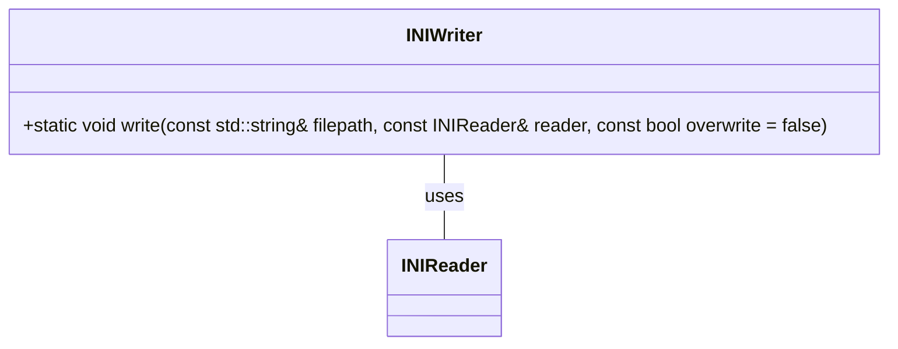

## INIWriter クラス詳細設計書 (F01/U01)

このドキュメントは、`INIWriter`クラスの再実装に必要な詳細な設計情報を提供します。

### 1. 正確な定義

| 型名 / 種別 / 実体 | 説明 |
|---|---|
| `std::string` | 文字列型 (標準ライブラリ) |
| `std::ifstream` | 入力ファイルストリーム型 (標準ライブラリ) |
| `std::ofstream` | 出力ファイルストリーム型 (標準ライブラリ) |
| `std::runtime_error` | 例外クラス (標準ライブラリ) |

### 2. 直接依存インターフェースと利用方法

| 関数/メソッド名 | Namespace | 引数 | 戻り値型 | 可視性 | const | 備考 |
|---|---|---|---|---|---|---|
| `std::ifstream` コンストラクタ | `std` | `const std::string& filepath` |  `void` | public |  | ファイルパスを受け取り、ファイルを開く。 |
| `std::ofstream` コンストラクタ | `std` | `const std::string& filepath` |  `void` | public |  | ファイルパスを受け取り、ファイルを作成または開く。 |
| `std::ifstream::operator bool()` | `std` | なし | `bool` | public |  | ストリームが有効な状態かどうかを返す。 |
| `std::ofstream::is_open()` | `std` | なし | `bool` | public |  | ストリームが開かれているかどうかを返す。 |
| `std::ofstream::operator<<` | `std` | `const std::string& str` | `std::ostream&` | public |  | 文字列を出力ストリームに書き込む。 |
| `std::runtime_error` コンストラクタ | `std` | `const std::string& message` | `void` | public |  | メッセージを受け取り、例外をスローする。 |
| `INIReader::Sections()` | (不明) | なし | `const std::vector<std::string>&` | public |  | INIファイル内のセクションのベクターを返す。 |
| `INIReader::Keys(const std::string& section)` | (不明) | `const std::string& section` | `const std::vector<std::string>&` | public |  | 指定されたセクション内のキーのベクターを返す。 |
| `INIReader::Get(const std::string& section, const std::string& key)` | (不明) | `const std::string& section`, `const std::string& key` | `std::string` | public |  | 指定されたセクションとキーに対応する値を取得する。 |

### 3. 結果を決める式・具体値

*   ファイルが存在する場合、`std::ifstream{filepath}` が true を返す。
*   ファイルが開けない場合、`out.is_open()` が false を返す。
*   セクションとキーのループ処理は、`reader.Sections()` と `reader.Keys(section)` から得られるベクターの要素数によって決定される。

### 4. 使用データ・更新データ

*   **入力:** `filepath`, `reader`, `overwrite`
*   **出力:** ファイルシステム上のINIファイル (`filepath`)
*   **内部状態:** なし (静的メソッドのため)

### 5. 状態・副作用・不変条件

*   このクラスは静的メソッドのみを提供するため、オブジェクトの状態は存在しない。
*   副作用: 指定された `filepath` にINIファイルを書き込む。既存のファイルが存在し、`overwrite` が false の場合、例外をスローする。
*   不変条件: ファイルパスが有効な形式であること (確認不能)。

### クラス図

### クラス・メソッド・インターフェース詳細

| 名前 | 可視性 | static | 引数 | 戻り値型 | 説明 |
|---|---|---|---|---|---|
| `write` | public | true | `const std::string& filepath`, `const INIReader& reader`, `const bool overwrite = false` | `void` | INIファイルを書き込む。 |

### シーケンス図

該当なし (静的メソッドのため、オブジェクト間のシーケンスは存在しない)。

### メソッド仕様書

**メソッド名:** `INIWriter::write`

**目的:** INIファイルの内容を新しいファイルに書き込む。

**引数:**

*   `filepath`: 出力ファイルのパス (`std::string`)
*   `reader`: 書き込み元の `INIReader` オブジェクト (`const INIReader&`)
*   `overwrite`: 既存のファイルを上書きするかどうか (bool, デフォルトは false)

**戻り値:** なし (void)

**動作:**

1.  `overwrite` が false で、指定されたファイルパスにファイルが存在する場合、`std::runtime_error` 例外をスローする。
2.  出力ファイルストリーム `out` を作成し、指定されたファイルパスに関連付ける。
3.  ファイルを開けなかった場合、`std::runtime_error` 例外をスローする。
4.  `reader` オブジェクトからセクションを取得し、各セクションについて以下の処理を行う:
    *   セクション名を `out` に書き込む (`[section]\n`)。
    *   セクション内のキーを取得し、各キーについて以下の処理を行う:
        *   キーと値を `out` に書き込む (`key=value\n`)。

**副作用:** 指定されたファイルパスにINIファイルを書き込む。既存のファイルが存在し、`overwrite` が false の場合、例外をスローする。

**エラー処理:** ファイルの存在確認およびファイルオープン時に例外をスローする。

### 処理フロー図

### 状態遷移・副作用

該当なし (静的メソッドのため、状態遷移は存在しない)。 副作用については上記「5. 状態・副作用・不変条件」を参照。

### データ変換・制約

*   `INIReader` から取得したセクション名とキーは文字列として `std::ofstream` に書き込まれる。
*   `INIReader::Get()` から取得した値も文字列として `std::ofstream` に書き込まれる。
*   ファイルパスの形式に関する制約は確認不能。
