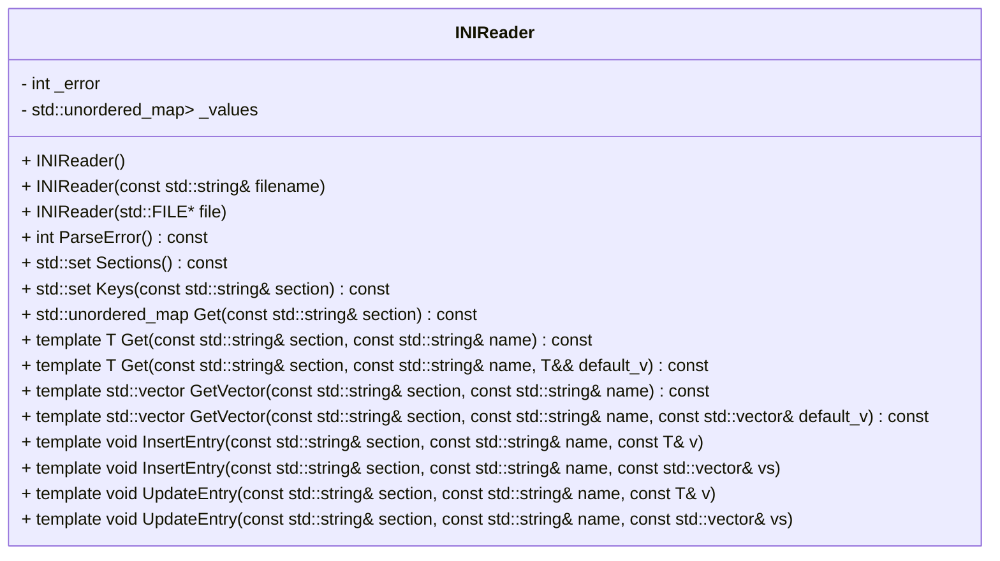

## INIReader クラス詳細設計仕様書 (F01/U01)

このドキュメントは、`INIReader`クラスの再実装に必要な詳細な設計情報をまとめたものです。

### 1. 正確な定義

| 型名 / 種別 / 実体 | 説明 |
|---|---|
| `std::string` | 文字列型 |
| `std::ifstream` | ファイル入力ストリーム |
| `std::ios` | ストリームフラグ |
| `std::size_t` | サイズを表す符号なし整数型 |
| `std::unordered_map<std::string, std::unordered_map<std::string, std::string>>` | セクションとキーのネストされたマップ。値は文字列。 |
| `std::set<std::string>` | 文字列のセット |

### 2. 直接依存インターフェースと利用方法

| 関数/メソッド名 | Namespace | 引数 | 戻り値型 | 可視性 | const | 説明 |
|---|---|---|---|---|---|---|
| `std::ifstream` コンストラクタ | `std` | `const std::string& filename`, `std::ios_base::openmode mode` | `void` | public |  | ファイルを開く。モードは `std::ios::in | std::ios::binary` を使用。 |
| `std::ifstream::seekg` | `std` | `std::streampos pos`, `std::ios_base::seekdir way` | `void` | public |  | ストリームの読み込み位置を設定。 |
| `std::ifstream::tellg` | `std` | なし | `std::streampos` | public | const | 現在の読み込み位置を取得。 |
| `std::ifstream::read` | `std` | `char* s`, `streamsize n` | `void` | public |  | ストリームからデータを読み込む。 |
| `std::string::resize` | `std` | `size_t n` | `void` | public |  | 文字列のサイズを変更。 |
| `std::to_string` | `std` | `int val` | `std::string` | public |  | 整数を文字列に変換。 |
| `std::runtime_error` コンストラクタ | `std` | `const std::string& what_str` | `void` | public |  | 例外を作成。 |
| `std::unordered_map<K, T>::emplace` | `std` | `K&& key`, `T&& val` | `std::pair<iterator, bool>` | public |  | 新しい要素をマップに挿入。 |
| `std::unordered_map<K, T>::find` | `std` | `const K& key` | `iterator` | public | const | キーに対応するイテレータを取得。 |
| `std::vector<T>::emplace_back` | `std` | 引数... | `void` | public |  | ベクトルに新しい要素を追加。 |

### 3. 結果を決める式・具体値

*   ファイルが存在しない場合、`_error = -1`
*   メモリ割り当てエラーの場合、`_error = -2`
*   パースエラーが発生した場合、`_error` は行番号を設定。
*   セクションとキーのマップは `_values` メンバ変数に格納される。

### 4. 使用データ・更新データ

*   入力: INIファイルの内容 (文字列またはファイルストリーム)
*   出力: セクションとキーのネストされたマップ (`_values`)
*   内部状態: エラーコード (`_error`)

### 5. 状態・副作用・不変条件

*   `INIReader`オブジェクトは、パースエラーが発生した場合に例外をスローする。
*   重複したキーがセクション内に存在する場合、例外をスローする。
*   ファイルストリームはコンストラクタ内で開かれ、破棄時に閉じられる。
*   `_error` は、パース処理中にエラーが発生した場合に更新される。

## クラス図

## クラス・メソッド・インターフェース詳細

| メソッド名 | 引数 | 戻り値型 | 可視性 | const | 説明 |
|---|---|---|---|---|---|
| `INIReader()` | なし | `void` | public |  | デフォルトコンストラクタ。 |
| `INIReader(const std::string& filename)` | `filename` (std::string) | `void` | public |  | ファイル名を受け取り、INIファイルをパースするコンストラクタ。 |
| `INIReader(std::FILE* file)` | `file` (std::FILE*) | `void` | public |  | ファイルポインタを受け取り、INIファイルをパースするコンストラクタ。 |
| `ParseError()` | なし | `int` | public | const | エラーコードに基づいて例外をスローするメソッド。 |
| `Sections()` | なし | `std::set<std::string>` | public | const | すべてのセクション名のセットを返すメソッド。 |
| `Keys(const std::string& section)` | `section` (std::string) | `std::set<std::string>` | public | const | 指定されたセクション内のすべてのキー名のセットを返すメソッド。 |
| `Get(const std::string& section)` | `section` (std::string) | `std::unordered_map<std::string, std::string>` | public | const | 指定されたセクションのキーと値のマップを返すメソッド。 |
| `Get<T>(const std::string& section, const std::string& name)` | `section` (std::string), `name` (std::string) | `T` | public | const | 指定されたセクションとキーに対応する値を返し、型変換を行うテンプレートメソッド。 |
| `Get<T>(const std::string& section, const std::string& name, T&& default_v)` | `section` (std::string), `name` (std::string), `default_v` (T) | `T` | public | const | 指定されたセクションとキーに対応する値を返し、見つからない場合はデフォルト値を返すテンプレートメソッド。 |
| `GetVector<T>(const std::string& section, const std::string& name)` | `section` (std::string), `name` (std::string) | `std::vector<T>` | public | const | 指定されたセクションとキーに対応する値のベクトルを返すテンプレートメソッド。 |
| `GetVector<T>(const std::string& section, const std::string& name, const std::vector<T>& default_v)` | `section` (std::string), `name` (std::string), `default_v` (std::vector<T>) | `std::vector<T>` | public | const | 指定されたセクションとキーに対応する値のベクトルを返し、見つからない場合はデフォルト値を返すテンプレートメソッド。 |
| `InsertEntry<T>(const std::string& section, const std::string& name, const T& v)` | `section` (std::string), `name` (std::string), `v` (T) | `void` | public |  | 指定されたセクションとキーに値を挿入するテンプレートメソッド。 |
| `InsertEntry<T>(const std::string& section, const std::string& name, const std::vector<T>& vs)` | `section` (std::string), `name` (std::string), `vs` (std::vector<T>) | `void` | public |  | 指定されたセクションとキーにベクトルの値を挿入するテンプレートメソッド。 |
| `UpdateEntry<T>(const std::string& section, const std::string& name, const T& v)` | `section` (std::string), `name` (std::string), `v` (T) | `void` | public |  | 指定されたセクションとキーの値を更新するテンプレートメソッド。 |
| `UpdateEntry<T>(const std::string& section, const std::string& name, const std::vector<T>& vs)` | `section` (std::string), `name` (std::string), `vs` (std::vector<T>) | `void` | public |  | 指定されたセクションとキーのベクトルの値を更新するテンプレートメソッド。 |

## シーケンス図

(シーケンス図は、複雑な処理フローがないため省略します。)

## メソッド仕様書

**Get<T>(const std::string& section, const std::string& name) const:**

*   目的: 指定されたセクションとキーに対応する値を取得し、型変換を行う。
*   引数:
    *   `section`: セクション名 (std::string)。
    *   `name`: キー名 (std::string)。
*   戻り値: 型変換後の値 (T)。
*   動作: 指定されたセクションとキーに対応する値を取得し、型 `T` に変換して返す。
*   副作用: なし。
*   エラー処理: セクションまたはキーが存在しない場合は、std::runtime_error をスローする。

## 処理フロー図

(処理フロー図は、比較的単純なパース処理であるため省略します。)

## 状態遷移・副作用

| 状態 | イベント | 更新後の状態 | 副作用 |
|---|---|---|---|
| 初期状態 | ファイル読み込み成功 | `_values` が初期化される。 | なし |
| パース中 | セクション開始行を検出 | 現在のセクションが設定される。 | なし |
| パース中 | キー=値 行を検出 | `_values` にキーと値が追加される。 | なし |
| エラー発生 | ファイルが見つからない | `_error = -1` | std::runtime_error をスローする。 |
| エラー発生 | メモリ割り当てエラー | `_error = -2` | std::runtime_error をスローする。 |

## データ変換・制約

*   文字列から整数への変換: `Converter<T>` テンプレートメソッドを使用。
*   文字列からブール値への変換: `BoolConverter` メソッドを使用。大文字小文字を区別しない。
*   文字列からベクトルの変換: 空白で分割し、各要素を型 `T` に変換する。
*   セクション名とキー名は文字列である。
*   値は文字列として格納される。

この設計仕様書は、`INIReader`クラスの再実装に必要な情報を網羅的に提供することを目的としています。