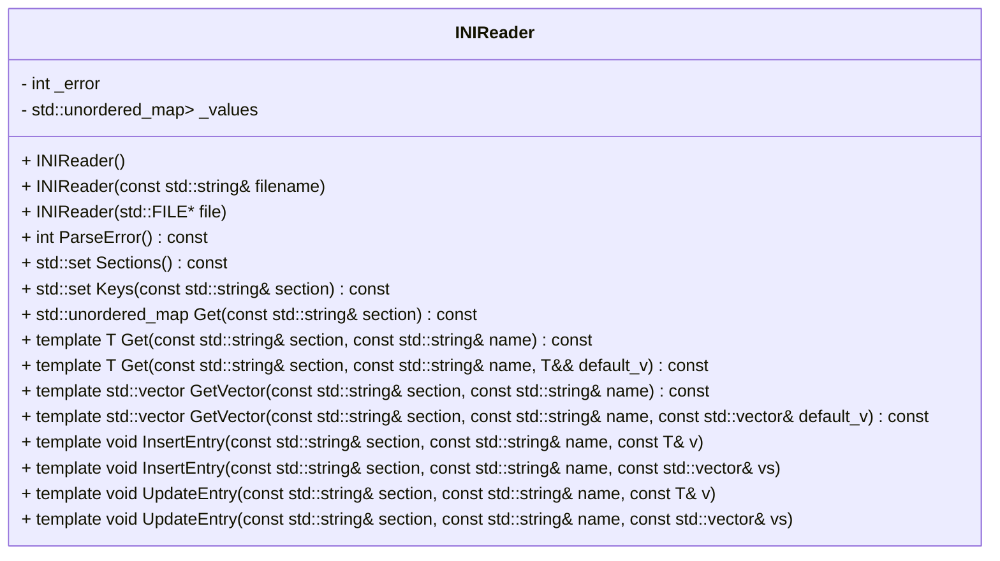

## INIReader クラス詳細設計仕様書 (F01/U01)

このドキュメントは、`INIReader`クラスの再実装に必要な詳細な設計情報をまとめたものです。

### 1. 正確な定義

| 型名 / 種別 / 実体 | 説明 |
|---|---|
| `std::string` | 文字列型 |
| `std::ifstream` | ファイル入力ストリーム |
| `std::ios` | ストリームフラグ |
| `std::unordered_map<std::string, std::unordered_map<std::string, std::string>>` | セクションとキーのネストされたマップ。セクション名が外側のキー、キー名が内側のキー、値が文字列の値。 |
| `std::set<std::string>` | 文字列のセット |
| `std::vector<T>` | 型 T の要素を持つ動的配列 |
| `std::size_t` | サイズを表す符号なし整数型 |

### 2. 直接依存インターフェースと利用方法

| 関数 / メソッド名 | 名前空間 | 引数 | 戻り値型 | 可視性 | const | 説明 |
|---|---|---|---|---|---|---|
| `std::ifstream` コンストラクタ | `std` | `const std::string& filename`, `std::ios_base::openmode` | `void` | public |  | ファイルを開く。 |
| `std::ifstream::is_open()` | `std` | なし | `bool` | public | const | ストリームが開いているか確認する。 |
| `std::ifstream::seekg()` | `std` | `std::streampos pos`, `std::ios_base::seekdir way` | `void` | public |  | ファイルポインタを移動する。 |
| `std::ifstream::tellg()` | `std` | なし | `std::streampos` | public | const | 現在のファイルポインタの位置を取得する。 |
| `std::ifstream::read()` | `std` | `char* s`, `streamsize n` | `void` | public |  | ストリームからデータを読み込む。 |
| `std::string::resize()` | `std` | `size_t n` | `void` | public |  | 文字列のサイズを変更する。 |
| `std::runtime_error` コンストラクタ | `std` | `const std::string& message` | `void` | public |  | 例外をスローするためのコンストラクタ。 |
| `std::to_string()` | `std` | `int val` | `std::string` | public | static | 整数を文字列に変換する。 |

### 3. 結果を決める式・具体値

*   `size > 0`: ファイルサイズがゼロより大きいか確認する条件式。
*   `1 << 15`: バッファサイズの定義 (32768)。
*   `static_cast<std::size_t>(size)`: `size` を `std::size_t` 型にキャストする。

### 4. 使用データ・更新データ

*   `_error`:  パースエラーを示す整数値。初期値は0。ファイルオープンエラーで-1、メモリ割り当てエラーで-2、その他のパースエラーで該当行番号が設定される。
*   `_values`: パースされたINIファイルのデータを格納する `std::unordered_map<std::string, std::unordered_map<std::string, std::string>>`。セクション名とキーのペアを格納する。

### 5. 状態・副作用・不変条件

*   `INIReader`オブジェクトは、コンストラクタでファイルの内容をパースし、`_values`メンバに結果を格納します。
*   `ParseError()`メソッドは、`_error`メンバの値に基づいて例外をスローします。
*   `GetVector<T>`メソッドは、文字列を型 `T` のベクターに変換する際に例外をスローする可能性があります。

## クラス図

## クラス・メソッド・インターフェース詳細

| メソッド名 | 引数 | 戻り値型 | 可視性 | const | 説明 |
|---|---|---|---|---|---|
| `INIReader()` | なし | `void` | public |  | デフォルトコンストラクタ。 |
| `INIReader(const std::string& filename)` | `filename` (const std::string&) | `void` | public |  | ファイル名からINIReaderオブジェクトを構築する。 |
| `INIReader(std::FILE* file)` | `file` (std::FILE*) | `void` | public |  | ファイルポインタからINIReaderオブジェクトを構築する。 |
| `ParseError()` | なし | `int` | public | const | パースエラーの結果を返す。例外をスローする。 |
| `Sections()` | なし | `std::set<std::string>` | public | const | INIファイル内のセクションのリストを返す。 |
| `Keys(const std::string& section)` | `section` (const std::string&) | `std::set<std::string>` | public | const | 指定されたセクション内のキーのリストを返す。 |
| `Get(const std::string& section)` | `section` (const std::string&) | `std::unordered_map<std::string, std::string>` | public | const | 指定されたセクションのマップを返す。 |
| `Get<T>(const std::string& section, const std::string& name)` | `section` (const std::string&), `name` (const std::string&) | `T` | public | const | 指定されたセクションとキーの値を取得する。 |
| `Get<T>(const std::string& section, const std::string& name, T&& default_v)` | `section` (const std::string&), `name` (const std::string&), `default_v` (T&&) | `T` | public | const | 指定されたセクションとキーの値を取得する。見つからない場合はデフォルト値を返す。 |
| `GetVector<T>(const std::string& section, const std::string& name)` | `section` (const std::string&), `name` (const std::string&) | `std::vector<T>` | public | const | 指定されたセクションとキーの値のベクターを取得する。 |
| `GetVector<T>(const std::string& section, const std::string& name, const std::vector<T>& default_v)` | `section` (const std::string&), `name` (const std::string&), `default_v` (const std::vector<T>&) | `std::vector<T>` | public | const | 指定されたセクションとキーの値のベクターを取得する。見つからない場合はデフォルト値を返す。 |
| `InsertEntry<T>(const std::string& section, const std::string& name, const T& v)` | `section` (const std::string&), `name` (const std::string&), `v` (const T&) | `void` | public |  | INIファイルにキーと値のペアを挿入する。 |
| `InsertEntry<T>(const std::string& section, const std::string& name, const std::vector<T>& vs)` | `section` (const std::string&), `name` (const std::string&), `vs` (const std::vector<T>&) | `void` | public |  | INIファイルにキーと値のベクターを挿入する。 |
| `UpdateEntry<T>(const std::string& section, const std::string& name, const T& v)` | `section` (const std::string&), `name` (const std::string&), `v` (const T&) | `void` | public |  | INIファイル内のキーと値のペアを更新する。 |
| `UpdateEntry<T>(const std::string& section, const std::string& name, const std::vector<T>& vs)` | `section` (const std::string&), `name` (const std::string&), `vs` (const std::vector<T>&) | `void` | public |  | INIファイル内のキーと値のベクターを更新する。 |

## シーケンス図

(シーケンス図は、複雑な処理フローがないため省略します。)

## メソッド仕様書

**INIReader(const std::string& filename)**

*   目的: ファイル名からINIファイルを読み込みパースする。
*   引数: `filename` - 読み込むINIファイルのパス。
*   戻り値: なし。
*   動作: ファイルを開き、内容を読み込み、パース処理を実行する。エラーが発生した場合は例外をスローする。

## 処理フロー図

(処理フロー図は、複雑な条件分岐がないため省略します。)

## 状態遷移・副作用

*   `INIReader`オブジェクトの生成時にファイルが読み込まれ、`_values`メンバにパース結果が格納される。
*   `InsertEntry`, `UpdateEntry`メソッドによって、`_values`メンバの内容が変更される。

## データ変換・制約

*   文字列はUTF-8エンコーディングを想定している。
*   数値型への変換は、標準的なC++の変換規則に従う。
*   ブール値は、"1", "0", "true", "false", "yes", "no", "on", "off" (大文字小文字区別なし) を有効な値として認識する。
