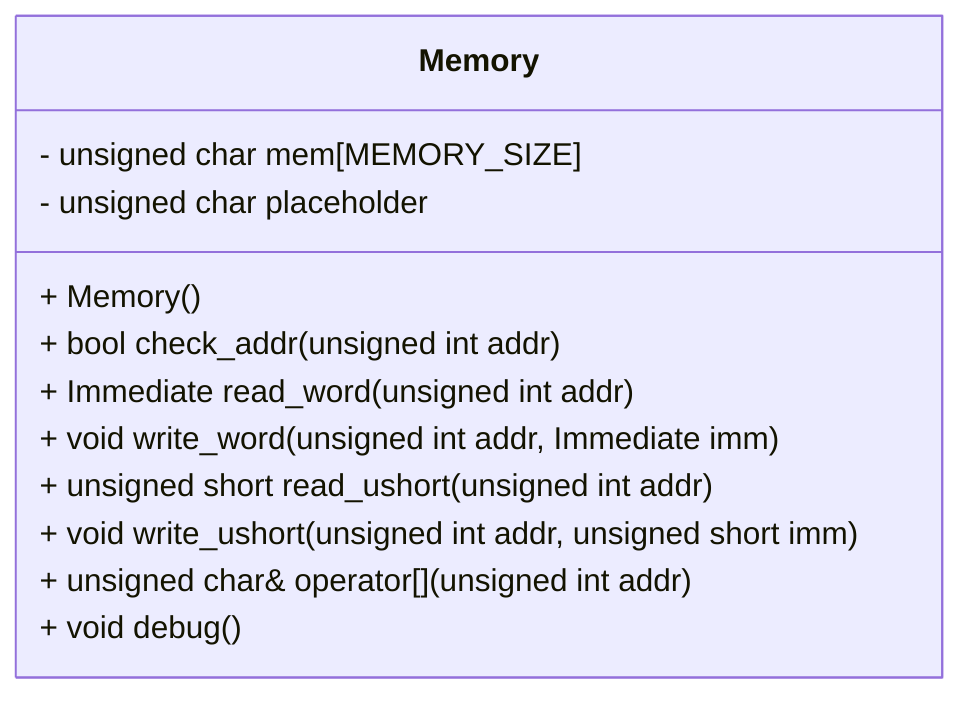

## Memory クラス詳細設計仕様書 (F01/U01)

このドキュメントは、`src/Common/Memory.hpp` に定義された `Memory` クラスの再実装に必要な詳細な設計情報を記述します。

### 1. 正確な定義

*   **型別名:**
    *   `Immediate`: `unsigned int` / 型別名 / 実体
    *   `SImmediate`: `int` / 型別名 / 実体
*   **定数:**
    *   `MEMORY_SIZE`: 定義なし (ソースコードから確認不能) - 再実装時に適切な値を設定する必要あり。

### 2. 直接依存インターフェースと利用方法

*   `<iostream>`: `std::cout` を使用してデバッグ情報を出力。
*   `<cstring>`: `memset` を使用してメモリを初期化。

### 3. 結果を決める式・具体値

*   **アドレスチェック:** `0 <= addr && addr < MEMORY_SIZE` - アドレスが有効範囲内にあるか確認する条件式。
*   **デバッグ出力ループ境界:**  `i = 0x20000 - 0x10; i <= 0x20000;` - デバッグ出力の開始アドレスと終了アドレスを決定するループ境界。

### 4. 使用データ・更新データ

*   **メンバ変数:**
    *   `mem`: `unsigned char[MEMORY_SIZE]` - メモリ領域。読み書きされる主要なデータ。
    *   `placeholder`: `unsigned char` - アドレスチェック失敗時の戻り値として使用されるプレースホルダー。
*   **アクセス対象:**  `mem + addr` - 特定のアドレスへのポインタ演算によるアクセス。

### 5. 状態・副作用・不変条件

*   **初期化:** コンストラクタで `memset(mem, 0, sizeof(mem))` を呼び出し、メモリ領域をゼロで初期化する。
*   **アドレスチェック失敗時の挙動:**  `check_addr`, `read_word`, `write_word`, `read_ushort`, `write_ushort`, `operator[]` でアドレスチェックに失敗した場合、それぞれ適切なデフォルト値を返すか、プレースホルダーを返す。副作用はなし。
*   **メモリ領域の所有権:**  `Memory` クラスが `mem` 配列の所有権を持つ。

### 6. クラス図

### 7. クラス・メソッド・インターフェース詳細

| 名前           | 可視性 | 型          | 引数                                  | 戻り値型     | const | 説明                                     |
| -------------- | ------ | ----------- | ------------------------------------- | ------------ | ----- | ---------------------------------------- |
| Memory         | public | class       | なし                                  | void         |       | メモリクラスのコンストラクタ              |
| check_addr     | public | bool        | `unsigned int addr`                    | bool         |       | アドレスが有効範囲内にあるか確認する      |
| read_word      | public | Immediate   | `unsigned int addr`                    | Immediate    |       | 指定されたアドレスからワードを読み込む    |
| write_word     | public | void        | `unsigned int addr`, `Immediate imm`  | void         |       | 指定されたアドレスにワードを書き込む      |
| read_ushort    | public | unsigned short | `unsigned int addr`                    | unsigned short |       | 指定されたアドレスからUSHORTを読み込む   |
| write_ushort   | public | void        | `unsigned int addr`, `unsigned short imm` | void         |       | 指定されたアドレスにUSHORTを書き込む     |
| operator[]     | public | unsigned char& | `unsigned int addr`                    | unsigned char& |       | 指定されたアドレスのバイトへのアクセスを提供する |
| debug          | public | void        | なし                                  | void         |       | メモリの内容をデバッグ出力する              |

### 8. シーケンス図

該当なし。このクラスは単独で動作し、他のクラスとの直接的な相互作用がないため、シーケンス図は不要です。

### 9. メソッド仕様書

**Memory()**

*   **目的:** `Memory` クラスのインスタンスを初期化する。
*   **引数:** なし
*   **戻り値:** なし
*   **動作:**  `mem` 配列全体をゼロで初期化する。
*   **副作用:** `mem` 配列の内容が変更される。

**check_addr(unsigned int addr)**

*   **目的:** 指定されたアドレスが有効範囲内にあるか確認する。
*   **引数:** `addr`: 確認するアドレス。
*   **戻り値:** アドレスが有効な場合は `true`、そうでない場合は `false`。
*   **動作:**  `0 <= addr && addr < MEMORY_SIZE` を評価し、結果を返す。
*   **副作用:** なし

**read_word(unsigned int addr)**

*   **目的:** 指定されたアドレスからワード (4バイト) を読み込む。
*   **引数:** `addr`: 読み込むアドレス。
*   **戻り値:** アドレスが有効な場合は、そのアドレスにあるワードの値。無効な場合は `0`。
*   **動作:**  `check_addr(addr)` でアドレスの有効性を確認し、有効な場合は `mem + addr` を `Immediate*` 型にキャストして間接参照し、値を返す。
*   **副作用:** なし

**write_word(unsigned int addr, Immediate imm)**

*   **目的:** 指定されたアドレスにワード (4バイト) を書き込む。
*   **引数:** `addr`: 書き込むアドレス。`imm`: 書き込む値。
*   **戻り値:** なし
*   **動作:**  `check_addr(addr)` でアドレスの有効性を確認し、有効な場合は `mem + addr` を `Immediate*` 型にキャストして間接参照し、`imm` の値を書き込む。
*   **副作用:** `mem` 配列の内容が変更される。

**read_ushort(unsigned int addr)**

*   **目的:** 指定されたアドレスからUSHORT (2バイト) を読み込む。
*   **引数:** `addr`: 読み込むアドレス。
*   **戻り値:** アドレスが有効な場合は、そのアドレスにあるUSHORTの値。無効な場合は `0`。
*   **動作:**  `check_addr(addr)` でアドレスの有効性を確認し、有効な場合は `mem + addr` を `short*` 型にキャストして間接参照し、値を返す。
*   **副作用:** なし

**write_ushort(unsigned int addr, unsigned short imm)**

*   **目的:** 指定されたアドレスにUSHORT (2バイト) を書き込む。
*   **引数:** `addr`: 書き込むアドレス。`imm`: 書き込む値。
*   **戻り値:** なし
*   **動作:**  `check_addr(addr)` でアドレスの有効性を確認し、有効な場合は `mem + addr` を `short*` 型にキャストして間接参照し、`imm` の値を書き込む。
*   **副作用:** `mem` 配列の内容が変更される。

**operator**

*   **目的:** 指定されたアドレスのバイトへのアクセスを提供する。
*   **引数:** `addr`: アクセスするアドレス。
*   **戻り値:** アドレスが有効な場合は、そのアドレスにあるバイトへの参照。無効な場合は `placeholder` への参照。
*   **動作:**  `check_addr(addr)` でアドレスの有効性を確認し、有効な場合は `mem[addr]` への参照を返し、そうでない場合は `placeholder` への参照を返す。
*   **副作用:** なし

**debug()**

*   **目的:** メモリの内容をデバッグ出力する。
*   **引数:** なし
*   **戻り値:** なし
*   **動作:**  アドレス `0x20000 - 0x10` から `0x20000` まで、各バイトの値を16進数で標準出力に出力する。
*   **副作用:** 標準出力に書き込みを行う。

### 10. 処理フロー図

該当なし。各メソッドは比較的単純な処理であり、複雑な制御フローを持たないため、処理フロー図は不要です。

### 11. 状態遷移・副作用

上記「5. 状態・副作用・不変条件」を参照。

### 12. データ変換・制約

*   **アドレス:** `unsigned int` 型で表現されるメモリ内のアドレス。
*   **データ型:**  `unsigned char`, `short`, `int` が使用され、それぞれバイト単位でのアクセス、USHORT (2バイト) の読み書き、ワード (4バイト) の読み書きに使用されます。
*   **キャスト:** ポインタの型変換 (`Immediate *`, `short *`) は、メモリ内のデータを適切な型として解釈するために行われます。

この設計仕様書は、`Memory` クラスを再実装するための十分な情報を提供することを目的としています。
