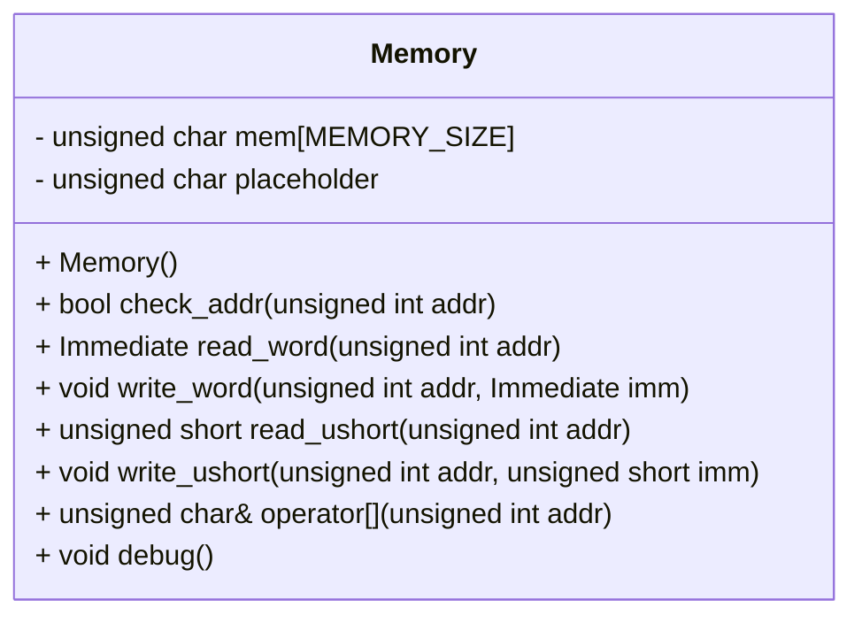

## Memory Class Design Specification - F01/U01

This document details the design specification for the `Memory` class, based on the provided source code (F01/U01).  It is intended to enable a separate LLM to re-implement this class without loss of functionality or implementation detail. This specification adheres to the guidelines outlined in the "TREATMENT DESIGN KNOWLEDGE" section, prioritizing completeness and accuracy for reconstruction.

### 1. Accurate Definitions

*   **Type Alias:** `Immediate` / `typedef` / `unsigned int`
*   **Type Alias:** `SImmediate` / `typedef` / `int` (defined in `src/Common/Common.h`)
*   **Constant:** `MEMORY_SIZE` - Value is not explicitly defined in the provided code snippet, but assumed to be a compile-time constant representing the size of the memory array.  Its value must be preserved during re-implementation.

### 2. Direct Dependencies & Usage

The class depends on:

*   `<cstddef>` (via `memset`) - Provides `size_t` for use in `memset`.
*   `<iostream>` (via `debug()`) - Used for outputting memory contents to the console.
*   `src/Common/Common.h` - Defines `Immediate` and `SImmediate`.

### 3. Decisive Expressions & Concrete Values

*   **Address Check:** The condition `0 <= addr && addr < MEMORY_SIZE` is used in all access methods (`check_addr`, `read_word`, `write_word`, `read_ushort`, `write_ushort`, `operator[]`).
*   **Memory Initialization:**  The memory array `mem` is initialized to zero using `memset(mem, 0, sizeof(mem))`.

### 4. Used & Updated Data

*   **`mem`**: An array of `unsigned char` representing the memory space. Accessed and modified by all public methods except `debug()`.
*   **`placeholder`**:  An `unsigned char` used as a return value for invalid address accesses in `operator[]`. Its initial value is set to 0 during construction.

### 5. State, Side Effects & Invariants

*   The class maintains the state of the memory array `mem`.
*   All access methods (`read_word`, `write_word`, `read_ushort`, `write_ushort`, `operator[]`) check address validity before accessing memory.  If invalid, they return a default value (0 for read operations) or the placeholder value for `operator[]`.
*   The `debug()` method outputs the contents of a specific range of the `mem` array to standard output. This is a side effect and does not modify class state.

### 6. Class Diagram

### 7. Class/Method/Interface Details

| Name | Type | Visibility | Const | Return Type | Parameters | Notes |
|---|---|---|---|---|---|---|
| `Memory` | class | public |  |  |  |  |
| `mem` | `unsigned char[MEMORY_SIZE]` | private |  |  |  | Memory array. |
| `placeholder` | `unsigned char` | private |  |  |  | Used for invalid address access in `operator[]`. |
| `Memory()` | constructor | public |  | void |  | Initializes `mem` to zero. |
| `check_addr(unsigned int addr)` | method | public |  | bool | `unsigned int addr` | Checks if the given address is within bounds. |
| `read_word(unsigned int addr)` | method | public |  | `Immediate` | `unsigned int addr` | Reads a word (4 bytes) from memory at the given address. Returns 0 if invalid address. |
| `write_word(unsigned int addr, Immediate imm)` | method | public |  | void | `unsigned int addr`, `Immediate imm` | Writes a word to memory at the given address. Does nothing if invalid address. |
| `read_ushort(unsigned int addr)` | method | public |  | `unsigned short` | `unsigned int addr` | Reads an unsigned short (2 bytes) from memory at the given address. Returns 0 if invalid address. |
| `write_ushort(unsigned int addr, unsigned short imm)` | method | public |  | void | `unsigned int addr`, `unsigned short imm` | Writes an unsigned short to memory at the given address. Does nothing if invalid address. |
| `operator` | operator | public |  | `unsigned char&` | `unsigned int addr` | Provides array-like access to memory. Returns a reference to `placeholder` if invalid address. |
| `debug()` | method | public |  | void |  | Prints the contents of memory from 0x20000 - 0x10 to 0x20000 (inclusive) in hexadecimal format to standard output. |

### 8. Sequence Diagram

Not applicable, as there are no interactions between multiple objects within this code snippet.  The class operates on its internal data only.

### 9. Method Specifications

**`Memory()`:**

*   **Purpose:** Constructor for the `Memory` class.
*   **Arguments:** None.
*   **Return Value:** None.
*   **Behavior:** Initializes all bytes of the `mem` array to zero using `memset`.
*   **Side Effects:** Modifies the internal state of the `mem` array.

**`check_addr(unsigned int addr)`:**

*   **Purpose:** Checks if a given address is within the valid memory bounds.
*   **Arguments:** `addr` - The address to check (unsigned integer).
*   **Return Value:** `true` if the address is valid, `false` otherwise.
*   **Behavior:** Returns `true` if `0 <= addr < MEMORY_SIZE`, and `false` otherwise.

**`read_word(unsigned int addr)`:**

*   **Purpose:** Reads a word (4 bytes) from memory at the given address.
*   **Arguments:** `addr` - The address to read from (unsigned integer).
*   **Return Value:** An `Immediate` representing the value read from memory, or 0 if the address is invalid.
*   **Behavior:** Checks if the address is valid using `check_addr`. If valid, casts the memory location (`mem + addr`) to an `Immediate*` and returns the dereferenced value.

**`write_word(unsigned int addr, Immediate imm)`:**

*   **Purpose:** Writes a word (4 bytes) to memory at the given address.
*   **Arguments:** `addr` - The address to write to (unsigned integer).  `imm` - The immediate value to write.
*   **Return Value:** None.
*   **Behavior:** Checks if the address is valid using `check_addr`. If valid, casts the memory location (`mem + addr`) to an `Immediate*` and assigns the value of `imm` to it.

**`read_ushort(unsigned int addr)`:**

*   **Purpose:** Reads an unsigned short (2 bytes) from memory at the given address.
*   **Arguments:** `addr` - The address to read from (unsigned integer).
*   **Return Value:** An `unsigned short` representing the value read from memory, or 0 if the address is invalid.
*   **Behavior:** Checks if the address is valid using `check_addr`. If valid, casts the memory location (`mem + addr`) to a `short*` and returns the dereferenced value.

**`write_ushort(unsigned int addr, unsigned short imm)`:**

*   **Purpose:** Writes an unsigned short (2 bytes) to memory at the given address.
*   **Arguments:** `addr` - The address to write to (unsigned integer).  `imm` - The immediate value to write.
*   **Return Value:** None.
*   **Behavior:** Checks if the address is valid using `check_addr`. If valid, casts the memory location (`mem + addr`) to a `short*` and assigns the value of `imm` to it.

**`operator`:**

*   **Purpose:** Provides array-like access to the memory array.
*   **Arguments:** `addr` - The index (address) to access.
*   **Return Value:** A reference (`unsigned char&`) to the byte at the given address in `mem`, or a reference to `placeholder` if the address is invalid.
*   **Behavior:** Checks if the address is valid using `check_addr`. If valid, returns a reference to `mem[addr]`.

**`debug()`:**

*   **Purpose:** Prints the contents of memory to standard output for debugging purposes.
*   **Arguments:** None.
*   **Return Value:** None.
*   **Behavior:** Iterates through the memory array from address 0x20000 - 0x10 to 0x20000 (inclusive) and prints each byte in hexadecimal format to standard output, followed by a space.  Prints a newline character at the end of the output.
*   **Side Effects:** Writes to standard output.

### 10. Processing Flow Diagram

Not applicable - methods are relatively simple and do not require complex flow diagrams. The core logic is address validation followed by memory access/modification or output.

### 11. State Transition & Side Effects

See section 5 (State, Side Effects & Invariants) for a description of state transitions and side effects.  The primary state transition involves modifying the contents of the `mem` array through write operations.

### 12. Data Transformation & Constraints

*   **Address Validation:** All access methods validate addresses to ensure they are within the bounds of `MEMORY_SIZE`.
*   **Type Casting:** The code uses type casting (`(Immediate *) (mem + addr)`, `(short *) (mem + addr)`) to interpret the raw bytes in memory as specific data types. This relies on the correct alignment and endianness of the target architecture.
*   **Array Access:**  `operator[]` provides array-like access, allowing direct manipulation of individual bytes within the `mem` array.

This specification aims to provide a complete and accurate description of the `Memory` class for re-implementation purposes, adhering to the provided guidelines and prioritizing completeness over brevity.
