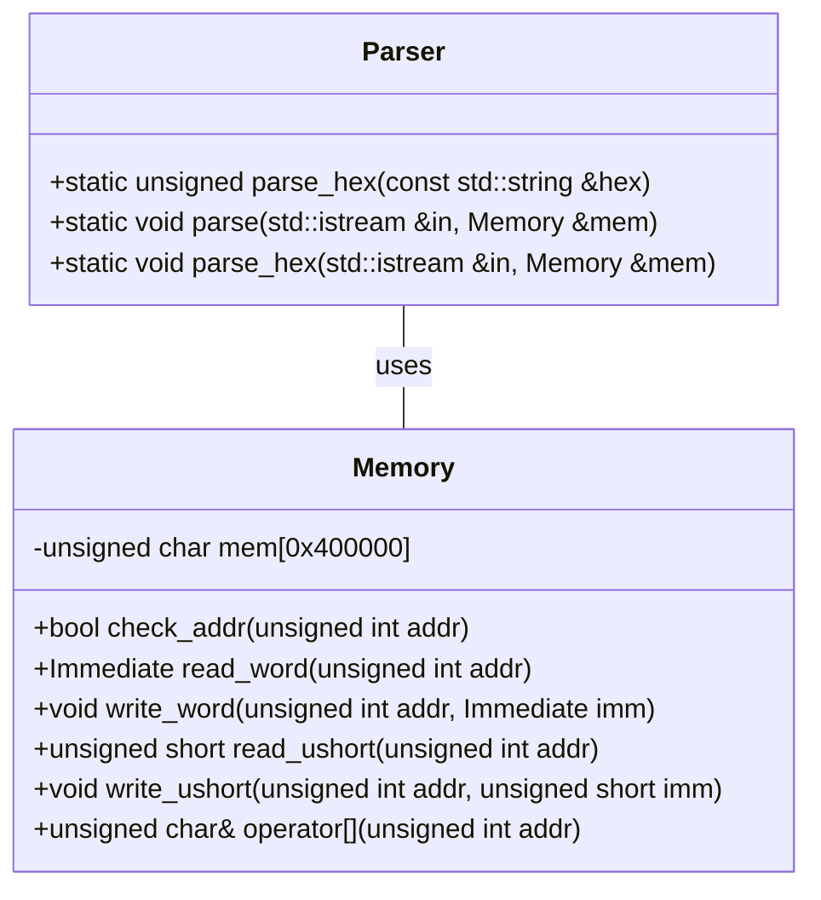
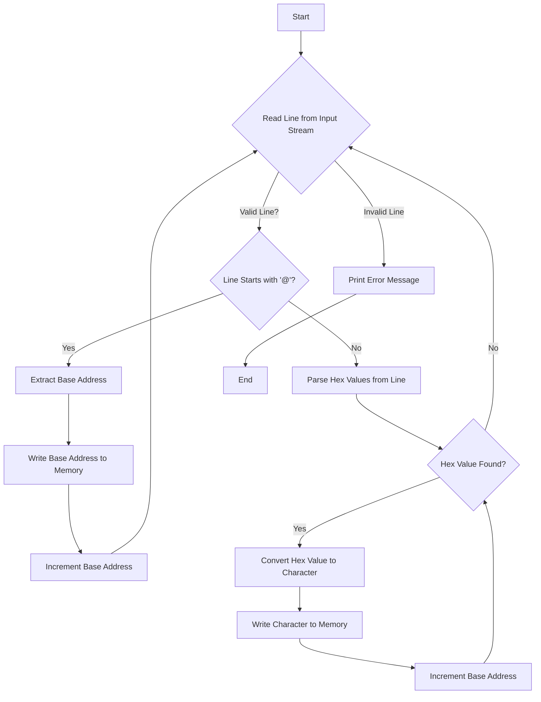

## Parser Class Design Specification - F01/U01

This document details the design specification for the `Parser` class, based on the provided source code. It aims to provide sufficient information for another LLM to reimplement this class accurately.

### 1. Accurate Definitions

*   **Type Aliases:** None
*   **Constants:** None
*   **Nested/Base Classes:** None
*   **Structures/Fields:** None

### 2. Direct Dependency Interfaces and Usage

*   `std::string`: Used for input strings (hexadecimal representation).  Includes methods like `c_str()` to obtain a C-style string, and length access via `.length()`. Namespace: `std`.
*   `std::istream`: Input stream object used for parsing. Includes methods like `getline`, `operator>>`. Namespace: `std`.
*   `Memory`:  A class (defined in `src/Common/Memory.hpp`) representing memory storage. Used to store parsed data. Methods utilized include `write_word()` and array access via the `[]` operator. Namespace is not explicitly defined, but implied by `#include "Common.h"`.
*   `strtol`: C standard library function for converting strings to long integers.  Namespace: global (C standard).

### 3. Results Deciding Expressions/Concrete Values

*   **Base Address Initialization:** The base address is initialized to `0`.
*   **Hexadecimal Conversion Base:** `16` is used as the base for hexadecimal string conversion with `strtol`.
*   **Loop Condition (parse):**  The loop continues as long as the input stream (`in`) is valid.
*   **Line Prefix Check (parse):** The code checks if the first character of a line is `'@'`.
*   **Base Address Update:** In `parse`, `base_addr` is incremented by 1 after parsing an `@` prefixed line, and by 1 in the main loop for each byte parsed.
*   **Word Size (parse_hex):** The size of a "word" appears to be 4 bytes based on how `base_addr` is incremented in `parse_hex`.
*   **Error Handling:** If input stream fails, an error message is printed to `std::cerr`.

### 4. Used Data / Updated Data

*   **Input Stream (`in`)**:  Read from sequentially, line by line or hex string by hex string.
*   **`hex` String (parse):** A string extracted from the input stream representing a hexadecimal value.
*   **`line` String (parse):** A single line read from the input stream.
*   **`base_addr` Variable:**  An unsigned integer that represents the current memory address to write to. Updated in both `parse` and `parse_hex`.
*   **`mem` Object (Memory class):** The underlying memory storage where parsed data is written. Accessed via array indexing (`[]`) or `write_word()`.

### 5. State / Side Effects / Invariants

*   The primary side effect is writing to the `Memory` object.
*   No explicit state is maintained within the `Parser` class itself beyond local variables in each function.
*   The `check_addr()` method of the `Memory` class enforces memory bounds checking, preventing out-of-bounds writes.

## Class Diagram



### 6. Class/Method/Interface Details

| Name | Type | Visibility | Parameters | Return Type | Const | Notes |
|---|---|---|---|---|---|---|
| `parse_hex` | static method | public | `const std::string &hex` | `unsigned` |  | Converts a hexadecimal string to an unsigned integer. |
| `parse` | static method | public | `std::istream &in`, `Memory &mem` | `void` | | Parses input stream, writing data to memory. Handles `@` prefixed lines for base address setting and regular hex values for data storage.|
| `parse_hex` | static method | public | `std::istream &in`, `Memory &mem` | `void` | | Parses hexadecimal strings from the input stream and writes them as words (4 bytes) to memory. |

### 7. Sequence Diagram (Parse Function)

```mermaid
sequenceDiagram
    participant Parser
    participant InputStream
    participant Memory

    InputStream ->> Parser: parse(in, mem)
    activate Parser

    loop while (in is valid)
        Parser ->> InputStream: getline(line)
        activate InputStream
        InputStream -->> Parser: line
        deactivate InputStream

        alt line[0] == '@'
            Parser ->> Memory: write_word(base_addr, base_addr_value)
            activate Memory
            Memory -->> Parser: 
            deactivate Memory
            Parser ++ base_addr
        else
            Parser ->> InputStream: stringstream ss(line)
            activate InputStream
            InputStream -->> Parser: ss

            loop while (ss >> hex)
                Parser ->> Parser: parse_hex(hex)
                Parser ->> Memory: write_word(base_addr, data)
                activate Memory
                Memory -->> Parser: 
                deactivate Memory
                Parser ++ base_addr
            end
        end
    end

    deactivate Parser
```

### 8. Method Specifications

**`static unsigned parse_hex(const std::string &hex)`:**

*   **Purpose:** Converts a hexadecimal string to an unsigned integer using `strtol`.
*   **Parameters:**
    *   `hex`: The hexadecimal string to convert.
*   **Return Value:** The unsigned integer representation of the hexadecimal string.
*   **Side Effects:** None.
*   **Error Handling:** Relies on `strtol` for error handling (returns 0 if conversion fails).

**`static void parse(std::istream &in, Memory &mem)`:**

*   **Purpose:** Parses an input stream and writes the parsed data to a `Memory` object.
*   **Parameters:**
    *   `in`: The input stream to read from.
    *   `mem`: The `Memory` object to write data to.
*   **Return Value:** None (void).
*   **Side Effects:** Modifies the contents of the `Memory` object. Prints error message to `std::cerr` if the input stream is invalid.
*   **Logic:** Reads lines from the input stream. If a line starts with `@`, it's treated as a base address and written to memory using `write_word`. Otherwise, the line is parsed for hexadecimal values, which are converted to characters and written to memory sequentially.

**`static void parse_hex(std::istream &in, Memory &mem)`:**

*   **Purpose:** Parses hexadecimal strings from an input stream and writes them as words (4 bytes) to a `Memory` object.
*   **Parameters:**
    *   `in`: The input stream to read from.
    *   `mem`: The `Memory` object to write data to.
*   **Return Value:** None (void).
*   **Side Effects:** Modifies the contents of the `Memory` object. Prints error message to `std::cerr` if the input stream is invalid.

### 9. Processing Flow Diagram (Parse Function)



### 10. State Transitions / Side Effects

| Function | Initial State | Transition/Side Effect | Final State |
|---|---|---|---|
| `parse_hex` (string) |  None | Converts hex string to unsigned integer | Returns the unsigned integer value |
| `parse` | Input stream open, Memory initialized | Reads lines from input stream, writes data to memory based on line prefix. Increments base address. | Modified Memory content, potentially closed input stream |
| `parse_hex` | Input stream open, Memory initialized | Reads hex strings from the input stream and writes them as words (4 bytes) to memory.  Increments base address by 4 for each word written.| Modified Memory content, potentially closed input stream |

### 11. Data Transformation / Constraints

*   **Hex String to Integer:** The `parse_hex` function transforms a hexadecimal string into an unsigned integer using the `strtol` function with base 16.
*   **Character to Byte:** In the `parse` function, each parsed hex value is converted to a character (unsigned char) before being written to memory.
*   **Base Address Update:** The base address is updated after writing either a new base address or a byte of data to memory.
*   **Memory Bounds Checking:**  The `Memory` class's `check_addr()` method ensures that all writes stay within the valid memory range (0 - 0x3FFFFF).

This specification provides a detailed overview of the `Parser` class, suitable for reimplementation by another LLM. It prioritizes accuracy and completeness based on the provided source code.
