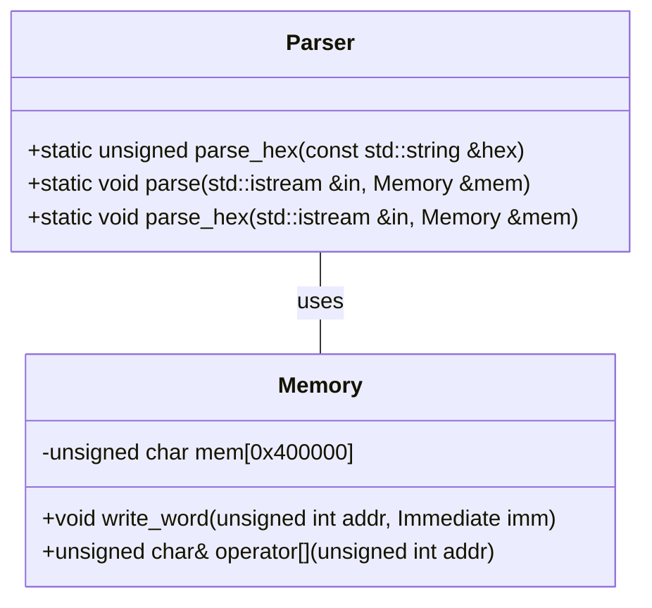
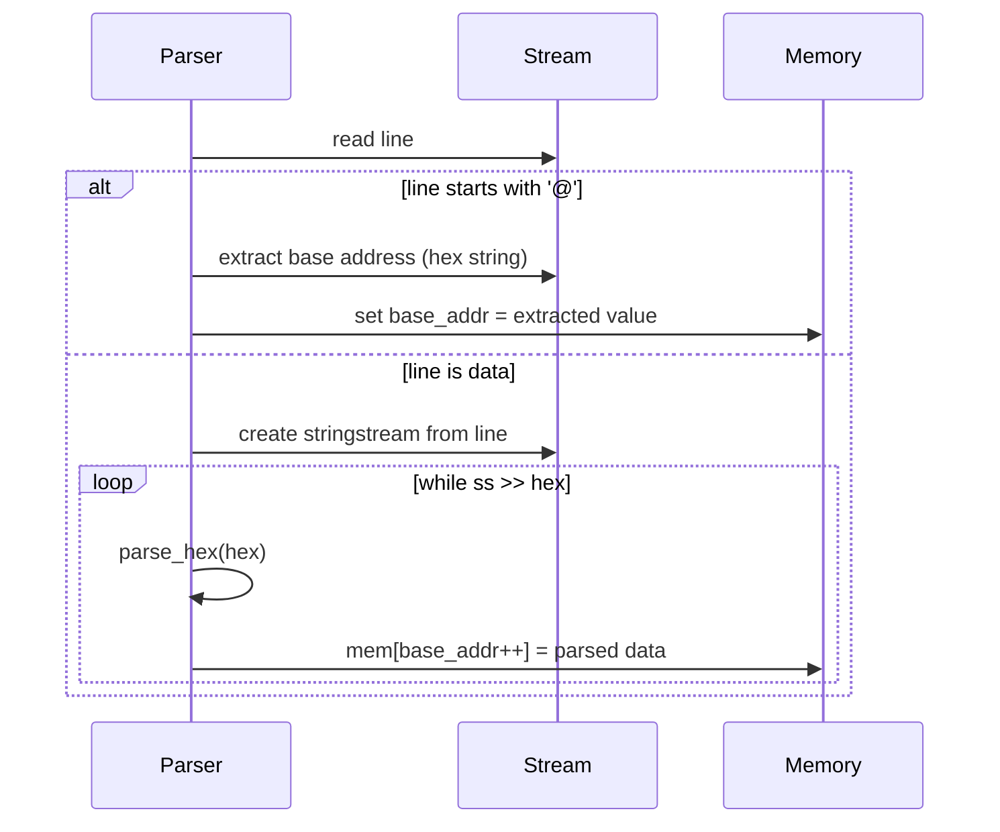
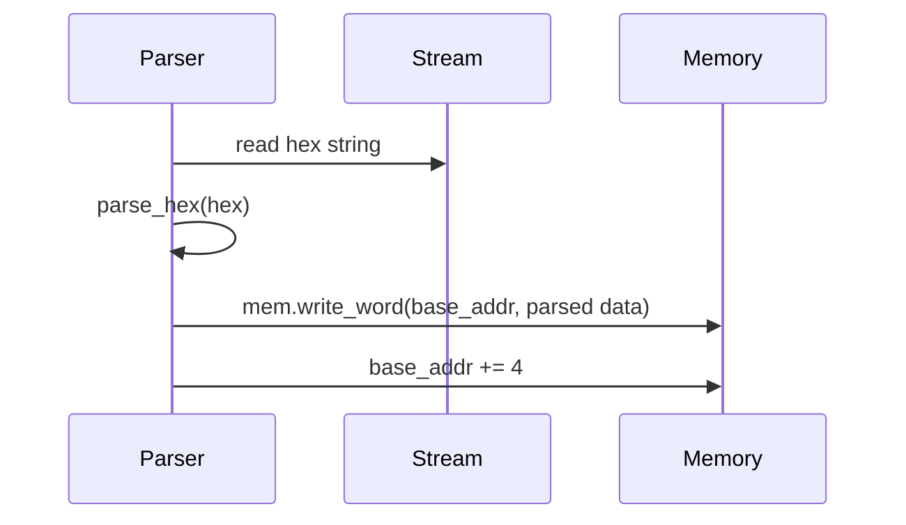

## Parser クラス詳細設計仕様書 (F01/U01)

### 1. 正確な定義

*   **クラス:** `Parser`
*   **型別名:** なし
*   **定数:** なし
*   **構造体:** なし
*   **列挙型:** なし

### 2. 直接依存インターフェースと利用方法

*   `<iostream>`:  標準入出力ストリームを使用。`std::istream`, `std::cerr`, `std::string`, `std::getline`, `std::stringstream` を使用。
*   `<string>`: 文字列操作に使用。`std::string` を使用。
*   `<cstdlib>`: 文字列を数値に変換するために使用。`strtol`を使用。
*   `Memory`:  メモリへのアクセスに使用。`mem[base_addr++] = data;`, `mem.write_word(base_addr, parse_hex(hex));` を通して利用。

### 3. 結果を決める式・具体値

*   **16進数文字列の解析:** `strtol(hex.c_str(), NULL, 16)` は、`hex` 文字列を基数16で解釈し、`long` 型に変換する。
*   **ベースアドレスの更新:**  `base_addr++` は、各データの書き込み後にベースアドレスをインクリメントする。 `parse` 関数では 1 ずつ増加、`parse_hex` 関数では 4 ずつ増加。
*   **ストリームの状態確認:** `!in` は入力ストリームがエラー状態かどうかを確認する。

### 4. 使用データ・更新データ

*   **入力:**  `std::istream &in`: 入力ストリームからデータを読み込む。
*   **出力:** `Memory &mem`: 解析されたデータを書き込むメモリオブジェクト。
*   **内部状態:** `base_addr`: 現在のベースアドレスを保持するunsigned int変数。

### 5. 状態・副作用・不変条件

*   `parse` 関数と `parse_hex` 関数は、入力ストリームの状態を変更する（読み込み位置を進める）。
*   `Memory` オブジェクトの内容が更新される。
*   無効なアドレスへのアクセスは、`Memory::check_addr` によってチェックされる (ただし、エラー発生時の処理は現状では `return` のみ)。

### 6. クラス図



### 7. クラス・メソッド・インターフェース詳細

| 名前           | 可視性 | 引数                                  | 戻り値型 | 説明                                     |
| -------------- | ------ | ------------------------------------- | -------- | ---------------------------------------- |
| `parse_hex`    | static | `const std::string &hex`              | unsigned | 16進数の文字列を符号なし整数に変換する。 |
| `parse`        | static | `std::istream &in`, `Memory &mem`     | void     | 入力ストリームからデータを読み取り、メモリに書き込む。 |
| `parse_hex`    | static | `std::istream &in`, `Memory &mem`     | void     | 入力ストリームから16進数の文字列を読み取り、メモリに書き込む。 |

### 8. シーケンス図

**parse 関数:**



**parse_hex 関数:**



### 9. メソッド仕様書

**parse_hex (static)**

*   **目的:** 16進数の文字列を符号なし整数に変換する。
*   **引数:** `const std::string &hex`: 変換する16進数の文字列。
*   **戻り値:** unsigned: 変換された符号なし整数。
*   **動作:**  `strtol` 関数を使用して、入力文字列を基数16で解釈し、符号なし整数に変換する。
*   **副作用:** なし

**parse (static)**

*   **目的:** 入力ストリームからデータを読み取り、メモリに書き込む。
*   **引数:** `std::istream &in`: 入力ストリーム。`Memory &mem`: データを書き込むメモリオブジェクト。
*   **戻り値:** void
*   **動作:**
    1.  入力ストリームから一行ずつ読み込む。
    2.  行が '@' で始まる場合、その後の文字列を基数16で解釈し、ベースアドレスとして設定する。
    3.  そうでない場合、行をスペースで区切られた16進数の文字列のシーケンスとして解析し、各値を `parse_hex` を使用して符号なし整数に変換し、メモリに書き込む。
*   **副作用:** 入力ストリームの状態が変更される。`Memory` オブジェクトの内容が更新される。

**parse_hex (static)**

*   **目的:** 入力ストリームから16進数の文字列を読み取り、メモリに書き込む。
*   **引数:** `std::istream &in`: 入力ストリーム。`Memory &mem`: データを書き込むメモリオブジェクト。
*   **戻り値:** void
*   **動作:**
    1.  入力ストリームから16進数の文字列を読み取る。
    2.  `parse_hex` を使用して、文字列を符号なし整数に変換する。
    3.  `Memory::write_word` を使用して、変換された値をメモリに書き込む。
    4.  ベースアドレスを 4 増やす。
*   **副作用:** 入力ストリームの状態が変更される。`Memory` オブジェクトの内容が更新される。

### 追加詳細設計情報

#### クラス図 (上記参照)

#### クラス・メソッド・インターフェース詳細 (上記参照)

#### シーケンス図 (上記参照)

#### メソッド仕様書 (上記参照)

#### 処理フロー図

**parse 関数:**

```mermaid
graph TD
    A[Start] --> B{Read line from stream};
    B -- Line starts with '@' --> C[Extract base address];
    C --> D[Set base_addr = extracted value];
    D --> B;
    B -- Line is data --> E[Create stringstream from line];
    E --> F{While ss >> hex};
    F -- True --> G[parse_hex(hex)];
    G --> H[mem[base_addr++] = parsed data];
    H --> F;
    F -- False --> B;
```

**parse_hex 関数:**

```mermaid
graph TD
    A[Start] --> B[Read hex string from stream];
    B --> C[parse_hex(hex)];
    C --> D[mem.write_word(base_addr, parsed data)];
    D --> E[base_addr += 4];
    E --> A;
```

#### 状態遷移・副作用

*   `Parser::parse`: 入力ストリームの読み込み位置が更新される。 `Memory` オブジェクトの内容が更新される。
*   `Parser::parse_hex`: 入力ストリームの読み込み位置が更新される。 `Memory` オブジェクトの内容が更新される。

#### データ変換・制約

*   **16進数文字列 -> 符号なし整数:**  `strtol(..., NULL, 16)` を使用して変換。
*   **ベースアドレス:** unsigned int 型で、メモリ内の書き込み位置を示す。
*   **データ型:** `char` (parse), `Immediate` (parse_hex)

この設計仕様書は、F01/U01 の再実装に必要な情報を網羅的に提供することを目的としています。