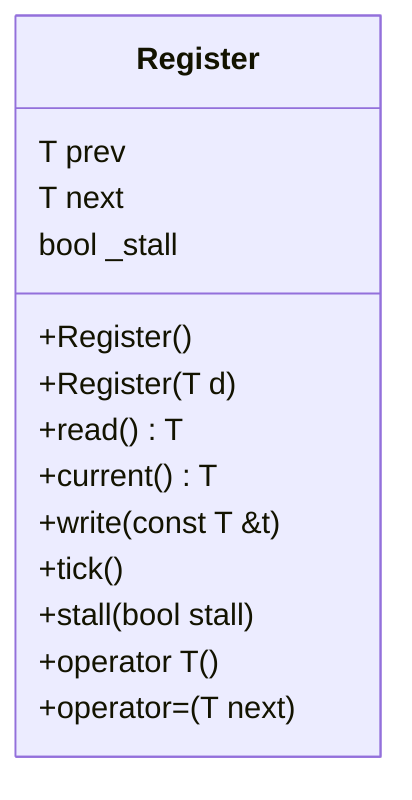

## Register クラス詳細設計仕様書

### 1. 正確な定義

| 型名 | 種別 | 実体 |
|---|---|---|
| `T` | 型パラメータ | 不明 (opaque) |

### 2. 直接依存インターフェースと利用方法

該当なし。このクラスは外部の型や関数に直接依存していません。

### 3. 結果を決める式・具体値

*   初期化: `prev = (T) 0`, `next = (T) 0`, `_stall = false`
*   コンストラクタ(引数あり): `prev = d`, `next = d`, `_stall = false`
*   `tick()` メソッドの条件: `if (!_stall)`

### 4. 使用データ・更新データ

| データ | アクセス | 更新 |
|---|---|---|
| `prev` | read, write (via `tick()`) |  `tick()`で`next`からコピー、初期化時に`(T)0`に設定 |
| `next` | read, write (`write()`, `= operator`) | `write()`または`= operator`で更新、初期化時に`(T)0`または引数`d`に設定 |
| `_stall` | read, write (`stall()`) | `stall()`で更新、初期化時に`false`に設定 |

### 5. 状態・副作用・不変条件

*   `_stall` フラグは、`tick()` メソッドの動作を制御します。
*   `prev` は常に `next` の以前の値です (ただし、`_stall` が true の場合)。
*   このクラスに動的なメモリ割り当てや外部リソースへのアクセスはありません。

### クラス図

### クラス・メソッド・インターフェース詳細

| 名前 | 可視性 | 型 | 引数 | 戻り値型 | const | static | virtual | noexcept |
|---|---|---|---|---|---|---|---|---|
| `Register` | public | コンストラクタ | なし | void |  |  |  |  |
| `Register` | public | コンストラクタ | `T d` | void |  |  |  |  |
| `read` | public | メソッド | なし | `T` | true |  |  |  |
| `current` | public | メソッド | なし | `T` | true |  |  |  |
| `write` | public | メソッド | `const T &t` | void | false |  |  |  |
| `tick` | public | メソッド | なし | void | false |  |  |  |
| `stall` | public | メソッド | `bool stall` | void | false |  |  |  |
| `operator T` | public | 変換演算子 | なし | `T` | true |  |  |  |
| `operator=` | public | 代入演算子 | `T next` | void | false |  |  |  |

### シーケンス図

該当なし。このクラスは単独で動作し、他のオブジェクトとの相互作用はありません。

### メソッド仕様書

**read()**

*   目的: `prev` の値を返します。
*   引数: なし
*   戻り値: `T` 型の値 (現在の `prev`)
*   副作用: なし

**current()**

*   目的: `next` の値を返します。
*   引数: なし
*   戻り値: `T` 型の値 (現在の `next`)
*   副作用: なし

**write(const T &t)**

*   目的: `next` に新しい値を書き込みます。
*   引数: `t`: 書き込む値
*   戻り値: void
*   副作用: `next` の値が更新されます。

**tick()**

*   目的: `_stall` が false の場合、`prev` を `next` の現在の値で更新します。
*   引数: なし
*   戻り値: void
*   副作用: `_stall` が false の場合にのみ、`prev` の値が更新されます。

**stall(bool stall)**

*   目的: `_stall` フラグを設定します。
*   引数: `stall`: 設定するフラグの値 (true または false)
*   戻り値: void
*   副作用: `_stall` の値が更新されます。

**operator T()**

*   目的:  `read()` メソッドの値を返します。
*   引数: なし
*   戻り値: `T` 型の値 (現在の `prev`)
*   副作用: なし

**operator=(T next)**

*   目的: `write(next)` を呼び出して、`next` に新しい値を書き込みます。
*   引数: `next`: 書き込む値
*   戻り値: void
*   副作用: `next` の値が更新されます。

### 処理フロー図

該当なし。各メソッドは単純な操作を実行するため、複雑なフローチャートは必要ありません。

### 状態遷移・副作用

| メソッド | 更新前状態 | 条件 | 更新後状態 | 副作用 |
|---|---|---|---|---|
| `write()` | `next` = X | なし | `next` = t |  |
| `tick()` | `_stall` = false, `prev` = Y, `next` = Z | なし | `prev` = Z, `next` = Z |  |
| `stall()` | `_stall` = X | なし | `_stall` = stall |  |

### データ変換・制約

該当なし。このクラスは単純なデータ型を保持しており、複雑なデータ変換は行いません。
