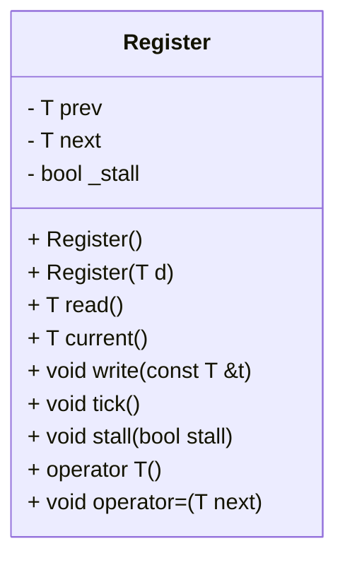

## Register クラス詳細設計仕様書

### 1. 正確な定義

| 型名 | 種別 | 実体 |
|---|---|---|
| `T` | テンプレート型パラメータ | 確認不能。任意の型であると推測される。 |

### 2. 直接依存インターフェースと利用方法

該当なし。このクラスは独立しており、他のクラスや関数への直接的な依存関係はない。

### 3. 結果を決める式・具体値

*   初期化:
    *   `prev = (T) 0;`
    *   `next = (T) 0;`
    *   `_stall = false;`
*   コンストラクタ(引数あり):
    *   `prev = d;`
    *   `next = d;`
    *   `_stall = false;`
*   `tick()` メソッド: `if (!_stall) prev = next;`
*   `operator=` : `write(next);`

### 4. 使用データ・更新データ

| データ | アクセス方法 | 更新条件 |
|---|---|---|
| `prev` |  直接アクセス (read, write) | `tick()` メソッドで、`_stall` が false の場合に `next` から更新される。コンストラクタおよび初期化時に設定される。 |
| `next` | 直接アクセス (write, current) | `write()` メソッドで更新される。コンストラクタおよび初期化時に設定される。 |
| `_stall` | 直接アクセス (stall) | `stall()` メソッドで更新される。 |

### 5. 状態・副作用・不変条件

*   `_stall` フラグは、`tick()` メソッドの動作を制御する。
*   `prev` は、`next` の値を遅延させて保持する。
*   このクラスに外部資源への副作用はない。
*   データの所有権や寿命に関する制約は確認不能。

## クラス図

## クラス・メソッド・インターフェース詳細

| 名前 | 可視性 | 型 | 引数 | 戻り値型 | const | static | virtual | noexcept |
|---|---|---|---|---|---|---|---|---|
| `Register` | public | コンストラクタ | なし | void |  |  |  |  |
| `Register` | public | コンストラクタ | `T d` | void |  |  |  |  |
| `read` | public | メソッド | なし | `T` | true |  |  |  |
| `current` | public | メソッド | なし | `T` | true |  |  |  |
| `write` | public | メソッド | `const T &t` | void | false |  |  |  |
| `tick` | public | メソッド | なし | void | false |  |  |  |
| `stall` | public | メソッド | `bool stall` | void | false |  |  |  |
| `operator T` | public | 変換演算子 | なし | `T` | true |  |  |  |
| `operator=` | public | 代入演算子 | `T next` | void | false |  |  |  |

## シーケンス図

該当なし。このクラスは単独で動作し、他のオブジェクトとの相互作用はない。

## メソッド仕様書

**read()**

*   目的: `prev` の値を返す。
*   引数: なし
*   戻り値: `T` 型の `prev` の値
*   副作用: なし

**current()**

*   目的: `next` の値を返す。
*   引数: なし
*   戻り値: `T` 型の `next` の値
*   副作用: なし

**write(const T &t)**

*   目的: `next` に新しい値を設定する。
*   引数: `const T &t`: 設定する値
*   戻り値: void
*   副作用: なし

**tick()**

*   目的: `_stall` が false の場合、`prev` を `next` の値で更新する。
*   引数: なし
*   戻り値: void
*   副作用: なし

**stall(bool stall)**

*   目的: `_stall` フラグを設定する。
*   引数: `bool stall`: 設定するフラグの値
*   戻り値: void
*   副作用: なし

**operator T()**

*   目的: `read()` メソッドの値を返す。
*   引数: なし
*   戻り値: `T` 型の `prev` の値
*   副作用: なし

**operator=(T next)**

*   目的: `write(next)` を呼び出す。
*   引数: `T next`: 設定する値
*   戻り値: void
*   副作用: なし

## 処理フロー図

該当なし。各メソッドは単純な処理のみを実行するため、複雑なフローチャートは不要である。

## 状態遷移・副作用

| 初期状態 | イベント | 更新後状態 | 副作用 |
|---|---|---|---|
| `_stall = false` | `tick()` が呼び出される | `prev` が `next` の値で更新される | なし |
| `_stall = true` | `tick()` が呼び出される | `prev` は変更されない | なし |
| 初期状態 | `stall(true)` が呼び出される | `_stall = true` | なし |
| 初期状態 | `stall(false)` が呼び出される | `_stall = false` | なし |

## データ変換・制約

*   `T` 型のデータは、直接 `prev` および `next` に格納される。
*   型変換に関する制約は確認不能。
*   値域や境界値に関する制約は確認不能。
