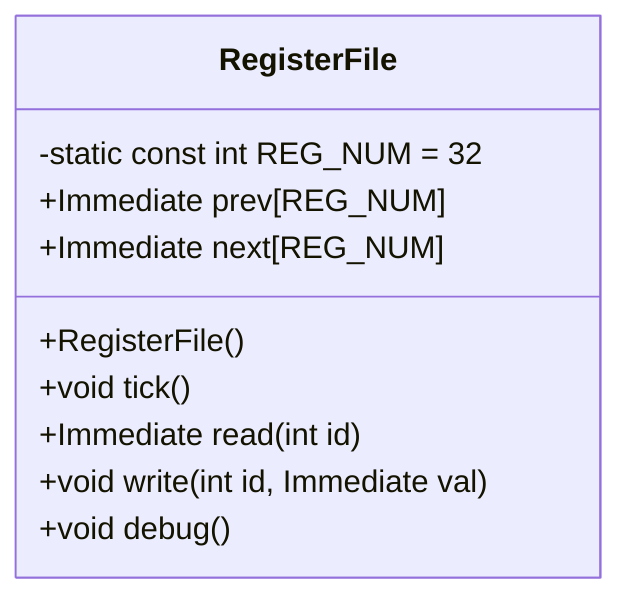

## RegisterFile 設計仕様書 (F01/U01)

### 1. 正確な定義

*   **型定義:**
    *   `Immediate`: `unsigned int` (src/Common/Common.h)
    *   `Register`: template class, 型パラメータ `T` を持ち、`prev`, `next` (type: `T`), `_stall` (type: `bool`) のメンバ変数を持つ。 (src/Common/Register.hpp)

*   **定数:**
    *   `REG_NUM`: `32` (int型, RegisterFileクラスのstatic const member)

### 2. 直接依存インターフェースと利用方法

*   **ヘッダーファイル:**
    *   `Common.h`:  `Immediate`, `SImmediate` 型定義を利用。
    *   `Register.hpp`: `Register<Immediate>` クラスを利用。
    *   `utils.h`: `debug_immediate` 関数を利用。

*   **クラス Register (src/Common/Register.hpp):**
    *   `read()`:  戻り値型 `T`, 引数なし, `prev` を返す。
    *   `current()`: 戻り値型 `T`, 引数なし, `next` を返す。
    *   `write(const T &t)`: 戻り値型 void, 引数 `t` (type: `const T&`), `next` に `t` の値を代入する。
    *   `tick()`: 戻り値型 void, 引数なし, `_stall` が false の場合、`prev` に `next` の値を代入する。
    *   `stall(bool stall)`: 戻り値型 void, 引数 `stall` (type: `bool`), `_stall` に `stall` の値を代入する。

*   **関数 debug\_immediate (src/Common/utils.h):**
    *   戻り値型 `void`, 引数 `v` (type: `Immediate`), `width` (type: `unsigned int`, デフォルト値は 0)。

### 3. 結果を決める式・具体値

*   `REG_NUM` は 32 で固定。
*   `debug()` メソッド内のループ条件: 外側のループは `i < 4`, 内側のループは `j < i * 8 + 8`.
*   `sprintf(buffer, "#%d", j)` で `#` に続けて `j` の値を文字列としてバッファに格納。

### 4. 使用データ・更新データ

*   **RegisterFile::prev**:  `Immediate` 型の配列 (サイズ: `REG_NUM`), 前回のレジスタの状態を保持する。
*   **RegisterFile::next**: `Immediate` 型の配列 (サイズ: `REG_NUM`), 次のレジスタの状態を保持する。
*   `tick()` メソッドは、`prev` 配列の内容を `next` 配列からコピーして更新する。
*   `read(int id)` メソッドは、`id` が 0 でない場合、`prev[id]` の値を返す。
*   `write(int id, Immediate val)` メソッドは、`next[id]` に `val` を書き込む。

### 5. 状態・副作用・不変条件

*   **状態:**  `prev` と `next` 配列がレジスタの状態を保持する。
*   **副作用:** `tick()` メソッドは `prev` 配列の内容を更新する。 `write()` メソッドは `next` 配列の内容を更新する。
*   **不変条件:**  `id` は 0 から `REG_NUM - 1` の範囲であること。

### 6. クラス図

### 7. クラス・メソッド・インターフェース詳細

| 名前           | 可視性 | 型       | 引数                                  | 戻り値型 | 説明                                    |
| -------------- | ------ | -------- | ------------------------------------- | -------- | --------------------------------------- |
| RegisterFile   | public | class    | なし                                  | void     | レジスタファイルオブジェクトを生成する。 |
| tick           | public | void     | なし                                  | void     | prev配列をnext配列で更新する。          |
| read           | public | Immediate | int id                                | Immediate | 指定されたIDのレジスタ値を読み出す。    |
| write          | public | void     | int id, Immediate val                 | void     | 指定されたIDのレジスタに値を書き込む。  |
| debug          | public | void     | なし                                  | void     | レジスタファイルの内容をデバッグ出力する。 |

### 8. シーケンス図

該当なし (このクラスは単独で動作し、他のクラスとの直接的な相互作用がないため)。

### 9. メソッド仕様書

**RegisterFile()**:

*   目的: レジスタファイルの初期化
*   引数: なし
*   戻り値: なし
*   動作: `prev` と `next` 配列を0で初期化する。
*   副作用: `prev` と `next` 配列の内容が変更される。

**tick()**:

*   目的: レジスタの状態を更新する。
*   引数: なし
*   戻り値: なし
*   動作: `prev` 配列の内容を `next` 配列からコピーする。
*   副作用: `prev` 配列の内容が変更される。

**read(int id)**:

*   目的: 指定されたIDのレジスタ値を読み出す。
*   引数: `id` (int): レジスタのID。
*   戻り値: `Immediate`: レジスタの値。
*   動作: `id` が 0 の場合、0 を返す。それ以外の場合、`prev[id]` の値を返す。
*   副作用: なし

**write(int id, Immediate val)**:

*   目的: 指定されたIDのレジスタに値を書き込む。
*   引数: `id` (int): レジスタのID, `val` (Immediate): 書き込む値。
*   戻り値: なし
*   動作: `next[id]` に `val` を書き込む。
*   副作用: `next` 配列の内容が変更される。

**debug()**:

*   目的: レジスタファイルの内容をデバッグ出力する。
*   引数: なし
*   戻り値: なし
*   動作:  レジスタの値をフォーマットして標準出力に出力する。
*   副作用: 標準出力に書き込みを行う。

### 10. 処理フロー図

該当なし (各メソッドは単純な処理であり、複雑なフローチャートを作成する必要がないため)。

### 11. 状態遷移・副作用

上記「5. 状態・副作用・不変条件」を参照。

### 12. データ変換・制約

*   `Immediate` 型は `unsigned int` であり、符号なし整数として扱われる。
*   レジスタのID (`id`) は 0 から `REG_NUM - 1` の範囲である必要がある。
*   `debug()` メソッドでは、`sprintf` 関数を使用して数値を文字列に変換する。
