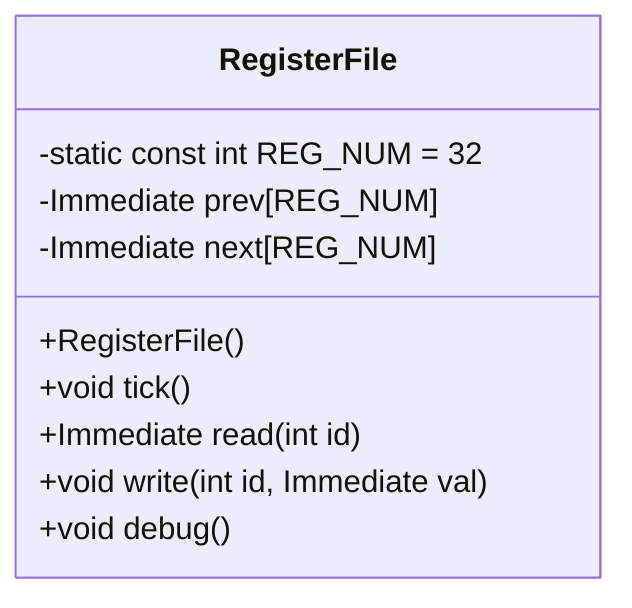

## RegisterFile 設計仕様書 (F01/U01)

### 1. 目的

`RegisterFile`クラスは、32個のレジスタを保持し、それらの値を読み書きするための機能を提供する。これはシミュレータにおけるCPUの状態を表現する重要なコンポーネントである。

### 2. クラス図

### 3. クラス・メソッド・インターフェース詳細

| 名前 | 型 | 可視性 | 説明 |
|---|---|---|---|
| `REG_NUM` | `int` | `static const` | レジスタの数 (32) |
| `prev` | `Immediate[32]` |  | 前回のレジスタ値を格納する配列 |
| `next` | `Immediate[32]` |  | 次のレジスタ値を格納する配列 |
| `RegisterFile()` | コンストラクタ | `public` | `prev`と`next`を0で初期化する。 |
| `tick()` | `void` | `public` | `prev`配列に`next`配列の内容をコピーする。これにより、レジスタの状態が更新される。 |
| `read(int id)` | `Immediate` | `public` | 指定されたIDのレジスタの現在の値を返す。 IDが0の場合は0を返す。 |
| `write(int id, Immediate val)` | `void` | `public` | 指定されたIDのレジスタに新しい値を書き込む。 |
| `debug()` | `void` | `public` | レジスタの内容をデバッグ用に標準出力に出力する。 |

### 4. シーケンス図

該当なし (このクラスは単独で動作し、他のクラスとの直接的な相互作用はないため)

### 5. メソッド仕様書

#### `RegisterFile()`

*   **目的:** レジスタファイルを初期化する。
*   **引数:** なし
*   **戻り値:** なし
*   **動作:** `prev`と`next`配列の各要素を0で初期化する。
*   **副作用:** なし

#### `tick()`

*   **目的:** レジスタファイルを次のサイクルへ進める。
*   **引数:** なし
*   **戻り値:** なし
*   **動作:** `next`配列の内容を`prev`配列にコピーする。
*   **副作用:** `prev`配列が更新される。

#### `read(int id)`

*   **目的:** 指定されたIDのレジスタの値を読み出す。
*   **引数:**
    *   `id`: 読み出すレジスタのID (0-31)。
*   **戻り値:** レジスタの値 (`Immediate`)。 `id`が0の場合は0を返す。
*   **動作:**  `prev[id]` の値を返す。
*   **副作用:** なし

#### `write(int id, Immediate val)`

*   **目的:** 指定されたIDのレジスタに値を書き込む。
*   **引数:**
    *   `id`: 書き込むレジスタのID (0-31)。
    *   `val`: 書き込む値 (`Immediate`)。
*   **戻り値:** なし
*   **動作:** `next[id]` に `val` を書き込む。
*   **副作用:** `next`配列が更新される。

#### `debug()`

*   **目的:** レジスタの内容をデバッグ用に標準出力に出力する。
*   **引数:** なし
*   **戻り値:** なし
*   **動作:**  レジスタの値をフォーマットして標準出力に出力する。4つのグループに分けて表示し、各グループは8個のレジスタを含む。 各レジスタには、"#<ID>" と "rf_name[ID]" というラベルが付く。
*   **副作用:** 標準出力への書き込み。

### 6. 処理フロー図

該当なし (メソッドのロジックは単純であり、フロー図で表現するメリットはない)

### 7. 状態遷移・副作用

*   `RegisterFile`クラス自体に内部状態は存在しない。
*   `tick()` メソッドは `prev` 配列の状態を更新する。
*   `write()` メソッドは `next` 配列の状態を更新する。
*   `debug()` メソッドは標準出力に情報を書き出す副作用を持つ。

### 8. データ変換・制約

*   レジスタIDは0から31の範囲である。
*   `Immediate`型は、`unsigned int` 型として定義されている。
*   `debug()`メソッドでは、レジスタの値が `debug_immediate()` 関数によってフォーマットされる。

### 追加詳細設計情報

#### クラス図 (再掲)

#### 型定義

| 名前 | 型 | 説明 |
|---|---|---|
| `Immediate` | `unsigned int` | レジスタに格納される即値型。Common.hで定義されている。 |

#### 定数

| 名前 | 値 | 説明 |
|---|---|---|
| `REG_NUM` | 32 | レジスタの総数。 |

#### インクルード依存関係

*   `src/Common/Common.h`:  `Immediate` と `SImmediate` の型定義を取得する。
*   `src/Common/Register.hpp`: 使用されていない。
*   `src/Common/utils.h`: `debug_immediate()` 関数を使用する。

#### 状態と副作用の補足

*   `prev`配列は、前のサイクルにおけるレジスタの状態を保持する。
*   `next`配列は、現在のサイクルに書き込まれた新しいレジスタの状態を保持する。
*   `tick()`メソッドが呼び出されると、`next`配列の内容が`prev`配列にコピーされ、レジスタの状態が更新される。

#### データアクセス制約

*   `read()` および `write()` メソッドの引数 `id` は 0 から `REG_NUM - 1` の範囲内である必要がある。範囲外の値が渡された場合、未定義動作となる可能性がある。
