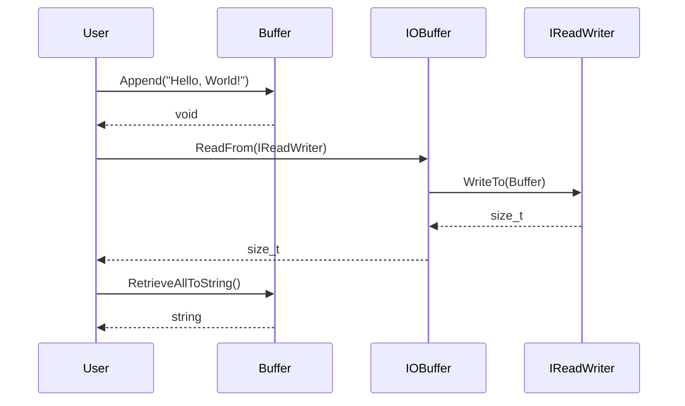

# 詳細設計仕様書

## 概要

このドキュメントは、`buffer.h`と`buffer.cpp`の再実装に必要な詳細な設計情報を提供します。元コードから確認できる事実のみを記述し、推測や創作を行いません。

## クラス図
```mermaid
classDiagram
    class Buffer {
        +Buffer(std::size_t size = 1000) noexcept
        +Buffer(std::span<const std::byte> bytes) noexcept
        +Buffer(std::initializer_list<std::byte> bytes) noexcept
        +Buffer(std::string_view str) noexcept
        +Buffer(const Buffer&) noexcept
        +Buffer(Buffer&&) noexcept
        +Buffer& operator=(const Buffer&) noexcept
        +Buffer& operator=(Buffer&&) noexcept
        +std::size_t WritableSize() const noexcept
        +std::size_t ReadableSize() const noexcept
        +std::optional<std::byte> Peek() const noexcept
        +std::span<const std::byte> ReadableBytes() const noexcept
        +std::string ReadableString() const noexcept
        +std::span<std::byte> WritableBytes() const noexcept
        +void Append(std::span<const std::byte> bytes) noexcept
        +void Append(std::initializer_list<std::byte> bytes) noexcept
        +void Append(std::string_view str, std::optional<NewLine> new_line = std::nullopt) noexcept
        +void Append(const void* data, std::size_t size) noexcept
        +void Append(const Buffer& buf) noexcept
        +void EnsureWriteableSize(std::size_t size) noexcept
        +void HasWritten(std::size_t size) noexcept
        +void Retrieve(std::size_t size) noexcept
        +std::size_t RetrieveUntil(const void* addr) noexcept
        +std::size_t RetrieveAll() noexcept
        +std::string RetrieveAllToString() noexcept
        +void Clear() noexcept
        +bool Empty() const noexcept
        -std::size_t PrependableSize() const noexcept
        -void MakeSpace(std::size_t size) noexcept
        -std::vector<std::byte>::iterator ReadIter() const noexcept
        -std::vector<std::byte>::iterator WriteIter() const noexcept
        -std::vector<std::byte> buf_
        -std::atomic<std::size_t> read_pos_ {0}
        -std::atomic<std::size_t> write_pos_ {0}
    }
    
    class IOBuffer {
        +IOBuffer(const std::size_t size = 1000) noexcept
        +IOBuffer(std::span<const std::byte> bytes) noexcept
        +IOBuffer(std::initializer_list<std::byte> bytes) noexcept
        +IOBuffer(std::string_view str) noexcept
        +std::size_t ReadFrom(io::IReadWriter& io)
        +std::size_t WriteTo(io::IReadWriter& io)
    }
    
    class NewLine {
        LF
        CRLF
    }

    IOBuffer --|> Buffer
```

## クラス・メソッド・インターフェース詳細

### `class Buffer`
- **Constructor**
  - `Buffer(std::size_t size = 1000) noexcept`
  - `Buffer(std::span<const std::byte> bytes) noexcept`
  - `Buffer(std::initializer_list<std::byte> bytes) noexcept`
  - `Buffer(std::string_view str) noexcept`
  - `Buffer(const Buffer&) noexcept`
  - `Buffer(Buffer&&) noexcept`

- **Operator**
  - `Buffer& operator=(const Buffer&) noexcept`
  - `Buffer& operator=(Buffer&&) noexcept`

- **Method**
  - `std::size_t WritableSize() const noexcept`
  - `std::size_t ReadableSize() const noexcept`
  - `std::optional<std::byte> Peek() const noexcept`
  - `std::span<const std::byte> ReadableBytes() const noexcept`
  - `std::string ReadableString() const noexcept`
  - `std::span<std::byte> WritableBytes() const noexcept`
  - `void Append(std::span<const std::byte> bytes) noexcept`
  - `void Append(std::initializer_list<std::byte> bytes) noexcept`
  - `void Append(std::string_view str, std::optional<NewLine> new_line = std::nullopt) noexcept`
  - `void Append(const void* data, std::size_t size) noexcept`
  - `void Append(const Buffer& buf) noexcept`
  - `void EnsureWriteableSize(std::size_t size) noexcept`
  - `void HasWritten(std::size_t size) noexcept`
  - `void Retrieve(std::size_t size) noexcept`
  - `std::size_t RetrieveUntil(const void* addr) noexcept`
  - `std::size_t RetrieveAll() noexcept`
  - `std::string RetrieveAllToString() noexcept`
  - `void Clear() noexcept`
  - `bool Empty() const noexcept`

- **Protected Method**
  - `std::size_t PrependableSize() const noexcept`
  - `void MakeSpace(std::size_t size) noexcept`
  - `std::vector<std::byte>::iterator ReadIter() const noexcept`
  - `std::vector<std::byte>::iterator WriteIter() const noexcept`

- **Member Variable**
  - `std::vector<std::byte> buf_`
  - `std::atomic<std::size_t> read_pos_ {0}`
  - `std::atomic<std::size_t> write_pos_ {0}`

### `class IOBuffer`
- **Constructor**
  - `IOBuffer(const std::size_t size = 1000) noexcept`
  - `IOBuffer(std::span<const std::byte> bytes) noexcept`
  - `IOBuffer(std::initializer_list<std::byte> bytes) noexcept`
  - `IOBuffer(std::string_view str) noexcept`

- **Method**
  - `std::size_t ReadFrom(io::IReadWriter& io)`
  - `std::size_t WriteTo(io::IReadWriter& io)`

### `enum class NewLine`
- **Enumerator**
  - `LF`
  - `CRLF`

## シーケンス図


## メソッド仕様書

### `void Buffer::Append(std::string_view str, std::optional<NewLine> new_line = std::nullopt) noexcept`
- **目的**: 文字列とオプションの改行文字をバッファに追加します。
- **引数**:
  - `str`: 追加する文字列
  - `new_line`: 追加する改行文字（`LF`または`CRLF`）
- **戻り値**: 無し
- **動作**:
  1. 文字列をコピーします。
  2. オプションの改行文字が指定されている場合は、それに応じて文字列に追加します。
  3. バッファに文字列を追加します。
- **副作用**: バッファの書き込み位置が更新されます。

### `std::size_t Buffer::RetrieveUntil(const void* addr) noexcept`
- **目的**: 指定されたアドレスまで読み取り位置を進める。
- **引数**:
  - `addr`: 読み取り位置を進める終端アドレス
- **戻り値**: 進めたバイト数
- **動作**:
  1. 現在の読み取り位置から指定されたアドレスまでの距離を計算します。
  2. 読み取り位置を指定されたアドレスまで進めます。
- **副作用**: バッファの読み取り位置が更新されます。

## 処理フロー図
```mermaid
graph TD
    A[Start] --> B{WritableSize() < size?}
    B -- Yes --> C[MakeSpace(size)]
    B -- No --> D[Copy data to WriteIter()]
    C --> E[Resize buf_]
    E --> F[Copy readable bytes to beginning of buf_]
    F --> G[Reset read_pos_ and write_pos_]
    G --> H[Copy data to WriteIter()]
    H --> I[Increment write_pos_ by size]
    I --> J[End]
```

## 状態遷移・副作用

| 更新前状態 | 遷移条件 | 変更対象 | 更新後状態 | 更新順序 | 副作用 |
|------------|----------|----------|------------|----------|--------|
| 任意       | Append() | write_pos_ | write_pos_ + size | 1 | バッファのサイズが拡張される場合がある |
| 任意       | Retrieve(size) | read_pos_ | read_pos_ + size | 1 | 読み取り位置が進む |
| 任意       | Clear() | read_pos_, write_pos_ | 0, 0 | 1 | バッファの読み取り位置と書き込み位置がリセットされる |

## データ変換・制約

| 入力データ | 変換規則 | 出力データ |
|------------|----------|------------|
| std::string_view | 文字列をバイト配列に変換 | std::span<std::byte> |
| std::optional<NewLine> | LFまたはCRLFを文字列に変換 | 追加される文字列の末尾 |

## 完全再構築台帳

### `buffer.h`
```cpp
#pragma once

#include <atomic>
#include <optional>
#include <span>
#include <string>
#include <string_view>
#include <vector>

namespace ws {

namespace io {
class IReadWriter;
}

enum class NewLine {
    LF,
    CRLF
};

class Buffer {
public:
    explicit Buffer(std::size_t size = 1000) noexcept;
    explicit Buffer(std::span<const std::byte> bytes) noexcept;
    explicit Buffer(std::initializer_list<std::byte> bytes) noexcept;
    explicit Buffer(std::string_view str) noexcept;
    Buffer(const Buffer&) noexcept;
    Buffer(Buffer&&) noexcept;
    Buffer& operator=(const Buffer&) noexcept;
    Buffer& operator=(Buffer&&) noexcept;

    std::size_t WritableSize() const noexcept;
    std::size_t ReadableSize() const noexcept;
    std::optional<std::byte> Peek() const noexcept;
    std::span<const std::byte> ReadableBytes() const noexcept;
    std::string ReadableString() const noexcept;
    std::span<std::byte> WritableBytes() const noexcept;

    void Append(std::span<const std::byte> bytes) noexcept;
    void Append(std::initializer_list<std::byte> bytes) noexcept;
    void Append(std::string_view str, std::optional<NewLine> new_line = std::nullopt) noexcept;
    void Append(const void* data, std::size_t size) noexcept;
    void Append(const Buffer& buf) noexcept;

    void EnsureWriteableSize(std::size_t size) noexcept;
    void HasWritten(std::size_t size) noexcept;
    void Retrieve(std::size_t size) noexcept;
    std::size_t RetrieveUntil(const void* addr) noexcept;
    std::size_t RetrieveAll() noexcept;
    std::string RetrieveAllToString() noexcept;

    void Clear() noexcept;
    bool Empty() const noexcept;

protected:
    std::size_t PrependableSize() const noexcept;
    void MakeSpace(std::size_t size) noexcept;
    std::vector<std::byte>::iterator ReadIter() const noexcept;
    std::vector<std::byte>::iterator WriteIter() const noexcept;

private:
    std::vector<std::byte> buf_;
    std::atomic<std::size_t> read_pos_ {0};
    std::atomic<std::size_t> write_pos_ {0};
};

class IOBuffer : public Buffer {
public:
    using Buffer::Buffer;
    std::size_t ReadFrom(io::IReadWriter& io);
    std::size_t WriteTo(io::IReadWriter& io);
};

Buffer& operator<<(Buffer& buf, std::string_view str) noexcept;
Buffer& operator<<(Buffer& to, const Buffer& from) noexcept;
Buffer& operator<<(Buffer& buf, std::span<const std::byte> bytes) noexcept;
Buffer& operator<<(Buffer& buf, std::initializer_list<std::byte> bytes) noexcept;

}  // namespace ws
```

### `buffer.cpp`
```cpp
#include "buffer.h"
#include "io.h"

#include <algorithm>
#include <cassert>

namespace ws {

Buffer::Buffer(const std::size_t size) noexcept : buf_(size) {}

Buffer::Buffer(const std::span<const std::byte> bytes) noexcept {
    Append(bytes);
}

Buffer::Buffer(const std::initializer_list<std::byte> bytes) noexcept {
    Append(bytes.begin(), bytes.size());
}

Buffer::Buffer(const std::string_view str) noexcept {
    Append(str);
}

Buffer::Buffer(const Buffer& o) noexcept :
    buf_ {o.buf_},
    read_pos_ {o.read_pos_.load()},
    write_pos_ {o.write_pos_.load()} {}

Buffer::Buffer(Buffer&& o) noexcept :
    buf_ {std::move(o.buf_)},
    read_pos_ {o.read_pos_.load()},
    write_pos_ {o.write_pos_.load()} {}

Buffer& Buffer::operator=(const Buffer& o) noexcept {
    if (this != &o) {
        buf_ = o.buf_;
        read_pos_ = o.read_pos_.load();
        write_pos_ = o.write_pos_.load();
    }

    return *this;
}

Buffer& Buffer::operator=(Buffer&& o) noexcept {
    if (this != &o) {
        buf_ = std::move(o.buf_);
        read_pos_ = o.read_pos_.load();
        write_pos_ = o.write_pos_.load();
    }

    return *this;
}

std::size_t Buffer::WritableSize() const noexcept {
    return buf_.size() - write_pos_;
}

std::size_t Buffer::ReadableSize() const noexcept {
    return write_pos_ - read_pos_;
}

std::size_t Buffer::PrependableSize() const noexcept {
    return read_pos_;
}

std::optional<std::byte> Buffer::Peek() const noexcept {
    return Empty() ? std::nullopt : std::optional {*ReadIter()};
}

void Buffer::Append(const std::initializer_list<std::byte> bytes) noexcept {
    Append(bytes.begin(), bytes.size());
}

void Buffer::Append(const std::span<const std::byte> bytes) noexcept {
    Append(bytes.data(), bytes.size_bytes());
}

void Buffer::Append(const std::string_view str, const std::optional<NewLine> new_line) noexcept {
    std::string full_str {str};
    if (new_line.has_value()) {
        if (new_line == NewLine::LF) {
            full_str += "\n";
        } else if (new_line == NewLine::CRLF) {
            full_str += "\r\n";
        } else {
            assert(false);
        }
    }

    Append(full_str.data(), full_str.length());
}

void Buffer::Append(const void* const data, const std::size_t size) noexcept {
    if (size == 0) {
        return;
    }

    assert(data);

    EnsureWriteableSize(size);
    const auto base {reinterpret_cast<const std::byte*>(data)};
    std::copy(base, base + size, WriteIter());
    HasWritten(size);

    assert(ReadableSize() >= size);
}

void Buffer::Append(const Buffer& buf) noexcept {
    Append(buf.ReadableBytes());
}

void Buffer::EnsureWriteableSize(const std::size_t size) noexcept {
    if (WritableSize() < size) {
        MakeSpace(size);
    }

    assert(WritableSize() >= size);
}

void Buffer::MakeSpace(const std::size_t size) noexcept {
    if (WritableSize() + PrependableSize() < size) {
        buf_.resize(write_pos_ + size);
    } else {
        const auto readable_size {ReadableSize()};
        std::copy(ReadIter(), WriteIter(), buf_.begin());
        read_pos_ = 0;
        write_pos_ = read_pos_ + readable_size;

        assert(readable_size == ReadableSize());
    }
}

std::span<const std::byte> Buffer::ReadableBytes() const noexcept {
    return {ReadIter().base(), ReadableSize()};
}

std::string Buffer::ReadableString() const noexcept {
    return {reinterpret_cast<char*>(ReadIter().base()), ReadableSize()};
}

std::span<std::byte> Buffer::WritableBytes() const noexcept {
    return {WriteIter().base(), WritableSize()};
}

void Buffer::HasWritten(const std::size_t size) noexcept {
    assert(WritableSize() >= size);
    write_pos_ += size;
}

void Buffer::Retrieve(const std::size_t size) noexcept {
    assert(ReadableSize() >= size);
    read_pos_ += size;
}

std::size_t Buffer::RetrieveAll() noexcept {
    const auto read_size {ReadableSize()};
    Clear();
    return read_size;
}

std::string Buffer::RetrieveAllToString() noexcept {
    const auto str {ReadableString()};
    Clear();
    return str;
}

std::size_t Buffer::RetrieveUntil(const void* const addr) noexcept {
    const auto end {static_cast<const std::byte*>(addr)};
    const auto begin {ReadIter().base()};

    assert(begin <= end);

    const auto read_size {end - begin};
    Retrieve(read_size);
    return read_size;
}

void Buffer::Clear() noexcept {
    read_pos_ = 0;
    write_pos_ = 0;
    assert(Empty());
}

bool Buffer::Empty() const noexcept {
    return ReadableSize() == 0;
}

std::vector<std::byte>::iterator Buffer::ReadIter() const noexcept {
    return const_cast<Buffer*>(this)->buf_.begin() + read_pos_;
}

std::vector<std::byte>::iterator Buffer::WriteIter() const noexcept {
    return const_cast<Buffer*>(this)->buf_.begin() + write_pos_;
}

std::size_t IOBuffer::ReadFrom(io::IReadWriter& io) {
    return io.WriteTo(*this);
}

std::size_t IOBuffer::WriteTo(io::IReadWriter& io) {
    return io.ReadFrom(*this);
}

Buffer& operator<<(Buffer& buf, const std::string_view str) noexcept {
    buf.Append(str);
    return buf;
}

Buffer& operator<<(Buffer& to, const Buffer& from) noexcept {
    to.Append(from);
    return to;
}

Buffer& operator<<(Buffer& buf, const std::span<const std::byte> bytes) noexcept {
    buf.Append(bytes);
    return buf;
}

Buffer& operator<<(Buffer& buf, const std::initializer_list<std::byte> bytes) noexcept {
    buf.Append(bytes);
    return buf;
}

}  // namespace ws
```

## 依存関係

- `buffer.h`は以下のヘッダをincludeします:
  - `<atomic>`
  - `<optional>`
  - `<span>`
  - `<string>`
  - `<string_view>`
  - `<vector>`

- `buffer.cpp`は以下のヘッダをincludeします:
  - `"buffer.h"`
  - `"io.h"`
  - `<algorithm>`
  - `<cassert>`